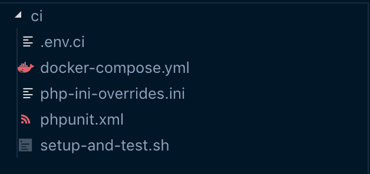

# PHP、MySQL 和 Elasticsearch 的 Bitbucket 管道

> 原文：<https://dev.to/camillehdl/bitbucket-pipeline-for-php-mysql-elasticsearch-6n1>

如果您的应用程序有 Bitbucket 管道[内置服务](https://confluence.atlassian.com/bitbucket/use-services-and-databases-in-bitbucket-pipelines-874786688.html)没有覆盖的依赖关系，或者这些依赖关系更加复杂，以至于不能简单地检查容器是否正在运行， [docker-compose](https://docs.docker.com/compose/) 可能是一个有用的工具。

在我的例子中，我想在 Symfony + MySQL + Elasticsearch(不能作为管道服务提供)应用程序上设置 CI。我只想运行 phpunit 测试，所以我不需要 HTTP 服务器。依赖关系如下:

*   MySQL 没有依赖关系，
*   Elasticsearch 没有依赖性，
*   PHP 依赖 MySQL 和 Elasticsearch 进行引导和运行测试。

这些看起来非常简单，可以用 docker-compose 来表达。然而，与往常一样，魔鬼在细节中:不仅 Elasticsearch 容器应该启动，服务也应该准备好**以正确运行测试。**

管道使用 docker 容器来运行我们的应用程序，并让我们使用我们需要的任何图像。我们将利用这一点，并使用带有 docker-compose 的图像。

## 文件夹结构

我们将创建一个`ci/`文件夹，其中包含我们将在 CI 环境中使用的文件。

[](https://res.cloudinary.com/practicaldev/image/fetch/s--hxuyx1vY--/c_limit%2Cf_auto%2Cfl_progressive%2Cq_auto%2Cw_880/https://thepracticaldev.s3.amazonaws.com/i/eft9lwhfqqrlx87i3qlp.png)

*   如果使用 DotEnv， *.env.ci* 包含环境变量
*   *phpunit.xml* 包含 phpunit 的配置
*   php-ini-overrides.ini 不言自明
*   描述我们需要的容器
*   setup-and-test.sh 将引导我们的应用程序并运行测试。

### 码头工-化合物. yml

```
version: "3.1"
services:

    mysql:
      image: mysql:5.7
      container_name: my-db-server
      working_dir: /application
      volumes:
        - ../:/application
      environment:
        - MYSQL_ROOT_PASSWORD=root
        - MYSQL_DATABASE=my-db
      ports:
        - "8002:3306"

    elasticsearch:
      image: docker.elastic.co/elasticsearch/elasticsearch:6.8.1
      container_name: elasticsearch
      working_dir: /application
      environment:
          - xpack.security.enabled=false
          - "transport.host=localhost"
          - "bootstrap.system_call_filter=false"
      volumes:
          - ../:/application
      ports:
          - "9200:9200"
      tty: true

    php-fpm:
      image: chodoul1egal2/php72-mysql
      working_dir: /application
      volumes:
        - ../:/application
        - ./php-ini-overrides.ini:/etc/php/7.2/fpm/conf.d/99-overrides.ini
      depends_on:
        - elasticsearch
        - mysql 
```

<svg width="20px" height="20px" viewBox="0 0 24 24" class="highlight-action crayons-icon highlight-action--fullscreen-on"><title>Enter fullscreen mode</title></svg> <svg width="20px" height="20px" viewBox="0 0 24 24" class="highlight-action crayons-icon highlight-action--fullscreen-off"><title>Exit fullscreen mode</title></svg>

需要注意一些事情:

*   我为 php-fpm 使用的 [docker 映像是一个定制映像，它包含了我的应用程序所需的模块(特别是 php-mysql)。](https://hub.docker.com/r/chodoul1egal2/php72-mysql)[你可能需要一个不同的](https://phpdocker.io/)。
*   不需要卷，因为在 CI 上下文中不需要保存任何内容

### 设置和测试. sh

```
#!/bin/bash

# Make sure CI stops as soon as something wrong happens
set -eu

# Inspiration for this script:
# https://github.com/elastic/elasticsearch-py/issues/778#issuecomment-384389668

host="http://elasticsearch:9200"

until $(curl --output /dev/null --silent --head --fail "$host"); do printf '.'
    sleep 1
done

# Wait for ES to be available
response=$(curl $host)

until [ "$response" = "200" ]; do response=$(curl --write-out %{http_code} --silent --output /dev/null "$host")
    echo "Elasticsearch is unavailable - sleeping"
    sleep 1
done

# Wait for ES to be ready
health="$(curl -fsSL "$host/_cat/health?h=status")"
health="$(echo "$health" | sed -r 's/^[[:space:]]+|[[:space:]]+$//g')"

until [ "$health" = 'green' ]; do health="$(curl -fsSL "$host/_cat/health?h=status")"
    health="$(echo "$health" | sed -r 's/^[[:space:]]+|[[:space:]]+$//g')"
    echo "Elasticsearch is unavailable - sleeping"
    sleep 1
done echo "ES is up"

# Install dependencies
composer install --no-interaction

echo "bootstrapping"
#
# YOUR BOOTSTRAPPING LOGIC HERE
#

# php bin/console ...
# php bin/console fos:elastica:populate
echo "done"
echo "tests"
vendor/bin/simple-phpunit --stop-on-failure 
echo "over" 
```

<svg width="20px" height="20px" viewBox="0 0 24 24" class="highlight-action crayons-icon highlight-action--fullscreen-on"><title>Enter fullscreen mode</title></svg> <svg width="20px" height="20px" viewBox="0 0 24 24" class="highlight-action crayons-icon highlight-action--fullscreen-off"><title>Exit fullscreen mode</title></svg>

## 管道配置

最后，bitbucket-pipelines.yml 文件:

```
image: tiangolo/docker-with-compose

definitions:
  services: 
    docker:
      memory: 2048

pipelines:
  default:
    - step:
        size: 2x
        caches:
          - composer
          - docker
        script:
          - cp ci/.env.ci ./.env
          - cp ci/phpunit.ci ./phpunit.xml
          - docker-compose -f ci/docker-compose.yml up -d && sleep 5
          - docker-compose -f ci/docker-compose.yml exec -T php-fpm ci/setup-and-test.sh 
        services: 
          - docker 
```

<svg width="20px" height="20px" viewBox="0 0 24 24" class="highlight-action crayons-icon highlight-action--fullscreen-on"><title>Enter fullscreen mode</title></svg> <svg width="20px" height="20px" viewBox="0 0 24 24" class="highlight-action crayons-icon highlight-action--fullscreen-off"><title>Exit fullscreen mode</title></svg>

*   为了避免与`docker-compose`上的`- d`标志相关的计时问题，`sleep 5`是一个丑陋的黑客。删除`-d`意味着您的管道日志中有很多噪声。如果你有更好的解决方法，请分享！
*   Elasticsearch 会使用很多内存，所以我们使用`size: 2x`并给`docker`服务足够的内存。

如果你有改进这方面的想法，我很乐意听听！

* * *

这最初是在我的博客上发布的。