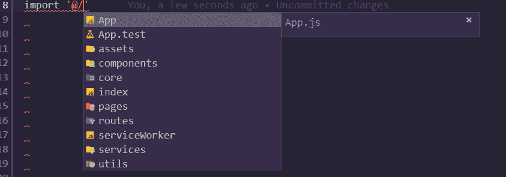

# 在 React 中为 Web 设置绝对路径而不弹出[pt-BR]

> [https://dev . to/bybruno/设定绝对路径-无反应-无弹出-pt-br-3ko0](https://dev.to/bybruno/configurando-caminhos-absolutos-no-react-para-web-sem-ejetar-pt-br-3ko0)

📢英文版:
[https://dev . to/heybrunoandrade/configuring-absolute-paths-in-react-for-web-without-ejecting-en-us-52h 6](https://dev.to/heybrunoandrade/configuring-absolute-paths-in-react-for-web-without-ejecting-en-us-52h6)

我在做了一篇文章，介绍如何在原生反应器中执行‘t0’绝对路径设置后，现在我来演示如何在 Web 反应器中执行此设置。

只要反动组织的人不在 CRA 上实施这一点，我们就自己动手设置，不用弹射。继续读下去，你会看到神奇的事情发生。

## 一小段介绍

### 为什么不推出项目呢？

嗯，原因是你会打破 CRA 的“保证”。但别紧张，我一直在收集设计，这些设计至今在生产中运行良好，唯一的问题是，这些设置将是我的，我必须支持它们。

“东西能破”- [丹阿布拉莫夫](https://twitter.com/dan_abramov/status/1045809734069170176)

但幸运的是，利用 [craco](https://github.com/sharegate/craco) 等工具，万一出了差错，我们可以很容易地恢复到 CRA 的默认设置。太棒了！

因为我们只会在别名上移动，所以您没什么好担心的，CRAC 将把我们在*CRAC . config . js*文件中所做的新设置注入 CRA 的标准设置中。

如果不知道，在使用 reactjs 创建的项目中设置绝对路径的目的是为了便于输入文件。为此，我们可以使用符号来表示代码的根目录。请看下面的一个例子:

```
 Use isto 😍
import Form from '@/components/Form'

E Evite isto 😤
import Form from '../../../../../components/Form' 
```

Enter fullscreen mode Exit fullscreen mode

## 据说是练习学习

∞那我们走吧，打开你的终端，安装必要的依存关系:

```
# yarn
yarn add @craco/craco

# npm
npm i @craco/craco 
```

Enter fullscreen mode Exit fullscreen mode

∞安装 *craco* 后，我们需要将一些命令行重命名为 *package.json* 。

“反应脚本”替代“craco”。

```
{  "scripts":  {  "start":  "craco start",  "build":  "craco build",  "test":  "craco test",  } 
```

Enter fullscreen mode Exit fullscreen mode

这将使 CRA 脚本由 *craco* 运行，后者将对位于 *craco.config.js* 文件中的设置进行注入。

∞在名为: *craco.config.js* 的项目根目录中创建文件，并包括以下设置:

```
const path = require('path');

module.exports = {
  webpack: {
    alias: {
      '@': path.resolve(__dirname, 'src/')
    }
  },
  jest: {
    configure: {
      moduleNameMapper: {
        '^@(.*)$': '<rootDir>/src$1'
      }
    }
  }
}; 
```

Enter fullscreen mode Exit fullscreen mode

## 请给我一个惊喜！🍲

我用别名模仿 vuejs。可以使用您认为有趣的“T2”别名，例如“~或“#”。

## 我的 VSCode 什么也不懂

在这样做的时候，我们会遇到第一个问题，自动完成。使用相对路径导入文件时，我们已经习惯于自动完成。

发生此错误的原因是 VSCode 不了解“@ src”是我们项目的“src”文件夹。要启用自动完成功能，我们需要配置 VSCode 以使其能够理解。为此，我们需要在项目根目录中创建一个名为“*”jsconfig . JSON“*”的文件。

塞巴岛 mais sobre o [jsconfig.json](https://code.visualstudio.com/docs/languages/jsconfig) 。

在文件中包括以下属性:

```
{  "compilerOptions":  {  "baseUrl":  "src",  "paths":  {  "@/*":  ["./*"]  }  },  "exclude":  ["node_modules",  "**/node_modules/*"]  } 
```

Enter fullscreen mode Exit fullscreen mode

太棒了！

[](https://res.cloudinary.com/practicaldev/image/fetch/s--0kRe_1US--/c_limit%2Cf_auto%2Cfl_progressive%2Cq_auto%2Cw_880/https://thepracticaldev.s3.amazonaws.com/i/d8dnvamm9u4v3xhp0hl3.png)

现在可以正常运行，请使用命令:npm start 来运行您的设计。

## 喜欢抱怨的工具一直存在！😡

如果使用的是*line*，则在使用「@」进行的所有进口中，您会发现它都会投诉。

感谢上帝，有一种方法可以通过使用‘T2’ESL-import-alias 来安抚‘t0’ESL。

∞首先把下面的图书馆添加为发展的依存关系，看在上帝的份上！

```
# yarn
yarn add eslint-plugin-import eslint-import-resolver-alias -D

# npm
npm i eslint-plugin-import eslint-import-resolver-alias -D 
```

Enter fullscreen mode Exit fullscreen mode

∞在您的. eslintrc . json 文件中包括以下属性:

```
 "settings": {
    "import/resolver": {
      "alias": {
        "map": [["@", "./src"]]
      }
    }
  } 
```

Enter fullscreen mode Exit fullscreen mode

## 看起来很傻但不是的问题

#### 我可以在即将投入生产的项目中使用这种技术吗？

接:是的，您可以毫无问题地使用！

#### Posso usar no React Native？

答:不，原生反应堆中的设置不同，我在本文中演示如何做:[在原生反应堆](https://dev.to/heybrunoandrade/configurando-caminhos-absolutos-no-react-native-pt-br-471o)中设置绝对路径。

#### 我的测试文件可能出错吗？

接:如果您按部就班地做得很好，大概不会。如果更改了用作“别名”的符号，请确保也将该符号放置在 craco.config.js 文件中的 jest 设置中，该文件位于属性“*modulename mapper”中。*

#### 为什么不使用 Babel 插件根导入？

答:与 Babel plugin root import 不同，我们只导入一个库来解决问题，并且易于使用。另一件困扰我的事是它不支持 CRA 3.0，所以使用 CRA。

## 想象一下生活中的一切是否都能顺利运转

与任何 lib 一样，您可能会在@craco 中发现 bug，如果您发现，请在官方项目中打开一个“T0”问题，以便社区改进该库，使其对所有人都起作用。

但是冷静点，用它来完成本教程。

## 时间😩

我真的很喜欢和你在一起如果你想知道我在做什么，请跟我来 Twitter [@heybrunoandrade](https://twitter.com/heybrunoandrade) 。

通过共享本文，帮助您的开发者之友网络停止遭受相对导入的痛苦！

帮我做一些更正或将这篇文章翻译成其他语言。
[访问存储库](https://github.com/heybrunoandrade/my-articles/tree/master/Front-end/ReactJS/Absolute%20Imports)。

一个大大的拥抱，下次再见！