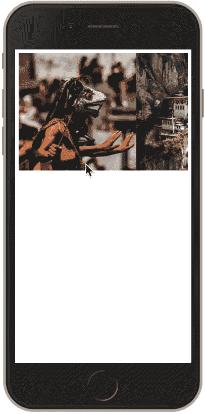
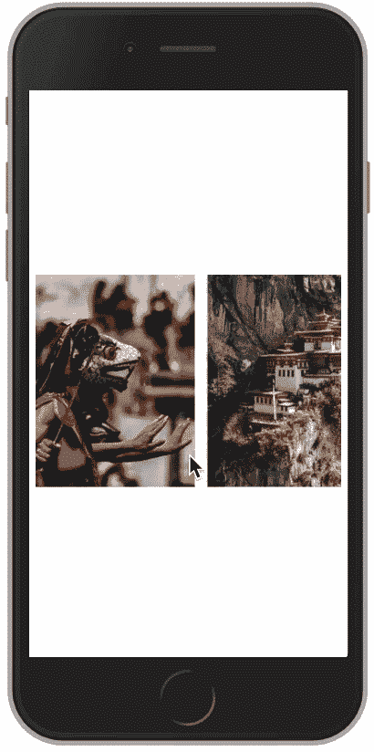

# 如何使用 Flexbox 实现水平滚动

> 原文：<https://dev.to/ratracegrad/how-to-implement-horizontal-scrolling-using-flexbox-3575>

[](https://res.cloudinary.com/practicaldev/image/fetch/s--q4qTa-Iw--/c_limit%2Cf_auto%2Cfl_progressive%2Cq_auto%2Cw_880/https://www.jenniferbland.com/wp-content/uploads/horizontalScrollingWithFlexbox.png)

如果你创建网站，你可能会被要求创建一个水平滚动组件。只用几行 Flexbox 就可以非常容易地实现这一点。让我告诉你怎么做。

## 项目布局

我们需要创建一个容器来包含我们想要滚动的所有图像。下面是代码:

```
<div class="container">


</div> 
```

## 造型项目

下一步是添加样式，使容器水平滚动。为此，我将容器显示为 flexbox。此外，我将 overflow-x 值设置为 auto。下面是样式:

```
 .container {
    display: flex;
    overflow-x: auto;
} 
```

这是水平卷轴的样子:

[](https://res.cloudinary.com/practicaldev/image/fetch/s--JbYS7830--/c_limit%2Cf_auto%2Cfl_progressive%2Cq_66%2Cw_880/https://www.jenniferbland.com/wp-content/uploads/scrolling1.gif)

这确实提供了我们对水平滚动区域的要求。我对它的外观不满意。我想改变三件事:

*   在图像之间添加空白
*   去掉水平滚动条
*   将滚动条放在屏幕中间

这些图像很感人。让我们在它们之间添加一些空白。下面是这个的 CSS:

```
.container img {
    margin-right: 15px;
} 
```

接下来，我想去掉水平滚动条，我可以用下面的代码来实现:

```
.container::-webkit-scrollbar {
    display: none;
} 
```

我想做的最后一个改变是将滚动区域放在屏幕的中央。默认情况下，html 的高度是元素的高度。我需要使高度为 100%的视口。Flexbox 提供了一种通过对齐项目设置来居中项目的方法。要使用此功能，我将把几何体转换为 flexbox 显示。下面是我要为主体添加的代码:

```
body {
    display: flex;
    align-items: center;
    height: 100vh;
} 
```

有了这些改变，这就是我们最终的水平滚动区的样子。

[](https://res.cloudinary.com/practicaldev/image/fetch/s--ZMmFBXD1--/c_limit%2Cf_auto%2Cfl_progressive%2Cq_66%2Cw_880/https://www.jenniferbland.com/wp-content/uploads/finalScrolling.gif)

## 结论

使用 flexbox 创建一个水平滚动区非常容易。感谢阅读。

## 培训课程

我在我的网站 CodePrep 上创建培训课程。我有关于 Vue、Webpack、Flexbox、函数式编程等等的培训课程。点击这里查看。