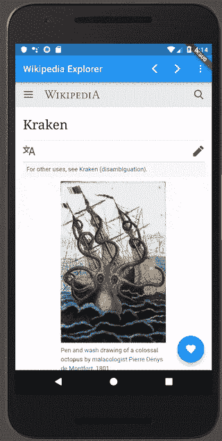
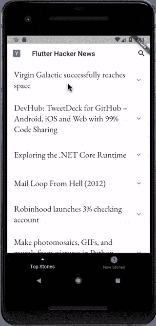
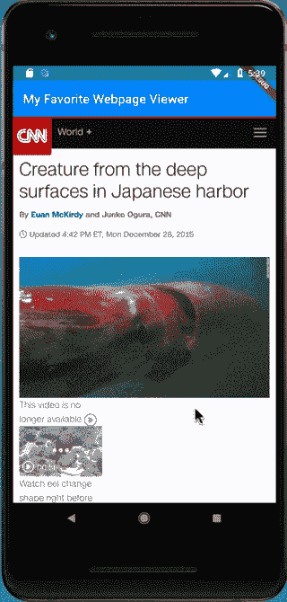
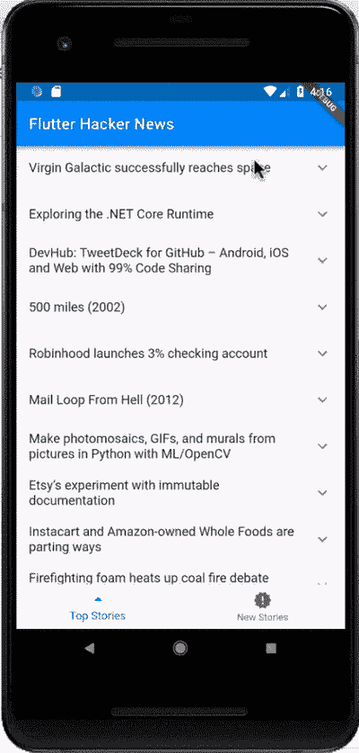
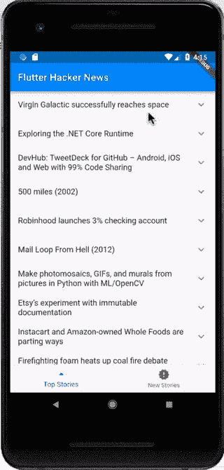

# 网络视图漂浮的力量

> [https://dev . to/pedromagango/o-power-do-webviews-in-float-5b 6b](https://dev.to/pedromassango/o-poder-do-webviews-em-flutter-5b6b)

系列中的第一篇文章，我将把原本用其他语言撰写的有关颤栗的文章翻译成其他语言，以提高葡萄牙语社区的可访问性和支持。 [Emily Fortuna](https://medium.com/u/45d6b1e163cc) 最初发表的文章，讲述了网络视图以及使用密钥(Key)的重要性。

* * *

您是否要编写无需打开移动设备浏览器即可显示网页的应用程序？或者，您的站点可能已经实施了安全的支付流，并且您不想在移动应用程序中重新实施支付功能—金钱可能是一项复杂的业务，而且您不想不小心将一半的支付额发送到基金来拯救挪威海怪。就我一个人？嗯，无论如何，float 团队创建了一个非常酷的插件，使您可以将 WebViews 嵌入到您的应用程序中，从而实现此功能。

我指的是在浮动应用程序中显示网页的功能而不是恢复克拉肯。

### webviews float 就像其他小部件一样

将 WebView 插件嵌入您的应用程序非常简单。它只是一个小部件，就像其他小部件一样:`WebView(initialUrl: ‘[https://flutter.io&amp;#39](https://flutter.io&#39);)`。您也可以使用参数“`javascriptMode`”在 WebView 中启用或禁用 JavaScript。默认情况下，JavaScript 处于禁用状态，要启用它，您将构建如下 WebView:

```
WebView(
  initialUrl: 'https://flutter.io&amp;#39;,
  javascriptMode: JavascriptMode.unrestricted,
)
```

几乎所有关于 WebView 的信息以及控制 WebView 的能力都是通过…等待… WebViewController 提供的。WebView 完全构建时，此驱动程序将在回调中返回:

```
WebViewController _controller;
WebView(
  initialUrl: 'https://flutter.io&amp;#39;,
  onWebViewCreated: (WebViewController webViewController) {
    _controller = webViewController;
  },
);
```

```
//...later on, probably in response to some event:
_controller.loadUrl('http://dartlang.org/&amp;#39;
);
```

WebViewController 是您的票证，用于通过浮动或访问属性(如当前显示的 URL)以编程方式修改 WebView。为了看这一切在实践中是如何运作的，我在维基百科上写了一个简单的导航应用程序，让你以后可以标记页面，这样理论家下次自己掉进兔子洞的维基时就永远不会忘记维基百科上最新的精彩文章

<figure>

<figcaption>A Wikipedia-exploring app written in Flutter using WebViews. You can favorite pages and save them for later viewing</figcaption>

</figure>

此兔子洞 Wiki 浏览器的完整代码可在此[github 存储库](https://github.com/efortuna/wiki_browser)中找到。

WebView 就像其它浮动的小部件一样，可以与其上方的其它分层小部件一起组成。注意，最喜欢的按钮只是在 WebView 顶部闪烁的‘t0’，用按钮完成预期的阴影效果。此外，当任务栏下拉菜单打开时，它会像菜单下面的任何其他小部件一样，部分复盖 WebView。

如果你看一下代码，你会注意到我在这个例子中经常使用‘t0’和‘t1’。将实例变量“`_controller`”声明为补片与为 WebViewController 添加占位符相同。我们可以通过调用 **_controller.isCompleted** (表示当我们有有效的 WebViewController 时它已完成)或[(使用带有 **_controller.future】的**未来图像)来验证是否正在运行 WebViewController
使用未来的影像，我们可以建构新的使用者介面元件，例如 floatingactionbutton，以便在 WebViewController 运作后加入我的最爱(否则，储存我的最爱页面时，程式将无法取得****](https://github.com/efortuna/wiki_browser/blob/master/lib/main.dart#L40)****`[currentUrl](https://pub.dartlang.org/documentation/webview_flutter/latest/webview_flutter/WebViewController/currentUrl.html)`。****

 **WebViews 的另外两个功能可能有点复杂，因此我们将在接下来的两个会话中仔细查看它们。

* * *

### WebViews 还可以捕获特定的手势

WebViews 既然是小部件，就可以参加浮动手势消除协议( [aka 手势竞技场](https://flutter.io/gestures/#gesture-disambiguation)。默认情况下，WebView 仅在没有其它小部件要求时响应手势。但您可以通过指定“`gestureRecognizers`”使 WebView 主动声明一个手势。

如果您的 WebView 位于响应手势的另一个小部件(例如 ListView)中，您可能希望指定应用程序响应手势的方式。如果用户在屏幕上拖动手指，您是否需要滚动 ListView 或 WebView？如果您希望这两个小部件可滚动，WebView 小部件可以通过拖动手势使其在用户拖动 WebView 时滚动，但会以其他方式滚动 ListView。您可以指定传递给 WebView 构件的手势，该构件具有参数`gestureRecognizers`。该参数将包含一组要捕获的所有手势识别器。不要害怕这个 Factory 对象-基本上，它只是一种光荣的构造方法。要捕获垂直滚动事件，我可以编写以下内容:

```
WebView(
  initialUrl: someUrl,
  gestureRecognizers: Set()
    ..add(Factory<VerticalDragGestureRecognizer>(
      () => VerticalDragGestureRecognizer())),
)
```

或者，用另一种方式写:

```
var verticalGestures = Factory<VerticalDragGestureRecognizer>(
  () => VerticalDragGestureRecognizer());
var gestureSet = Set.from([verticalGestures]);
return WebView(
  initialUrl: someUrl,
  gestureRecognizers: gestureSet,
);
```

如果你看完了[【模糊漂浮开发展】](https://www.youtube.com/playlist?list=PLOU2XLYxmsIK0r_D-zWcmJ1plIcDNnRkK)，你一定看过我们开发克拉肯新闻，我是说黑客新闻阅读器应用程序。

<figure>

<figcaption>versão mais recente do aplicativo Hacker News que estamos desenvolvendo em nosso YouTube.</figcaption>

</figure>

为了在应用程序上下文中显示手势捕获，我修改了 Hacker News 应用程序，将部分网页显示为这使用户可以浏览垂直链接的页面，以确定是否要在单独的页面中打开该页面进行进一步阅读。

<figure>

<figcaption>Hacker News Reader app com visualizações WebView dos links. Os WebViews capturam o gesto de arrastar vertical para permitir a rolagem das visualizações.</figcaption>

</figure>

应用程式代码**【黑客新闻阅读器应用程式】**可在 GitHub 的这个储存库中找到。(也许这里显示的是`_buildItem`的代码。)。

```
PageView(children: [
  WebView(initialUrl: urlOne),
  WebView(initialUrl: urlTwo),
  WebView(initialUrl: urlThree),
]));
```

<figure>

<figcaption>WebViews em um PageView. O PageView controla o deslizamento horizontal e os WebViews podem rolar verticalmente sem nenhum trabalho extra de sua parte.</figcaption>

</figure>

### WebViews 可能需要 key 参数

您可能已经看到这些可选参数`key`分布在代码库中的几乎所有 Widget 构造函数中。如果在应用程序中删除、添加或重新排序了多个具有相同类型的小部件，则需要使用密钥。如您所见，WebView 是一个具有状态的小部件(包括当前页面和浏览器历史记录的状态)。因此，如果您的应用程序中有多个 web 视图，则可能需要添加参数“`key`”。

Hacker News 应用程序就是一个例子！看看当我们切换选项卡而我们的 web 视图没有密钥时会发生什么:

<figure>

<figcaption>Isso é o que acontece se você não usar as chaves em um aplicativo com estado. Quando mudamos para a tab “New Stories”, a pré-visualização errada errada é exibida.</figcaption>

</figure>

你可以看到，当我们切换 tab 键时，带有 Alan 的方块扩大了，但 webview 仍然显示 BBC 关于 Virgin Galactic 的网页！更正方法是在顶层收藏小部件(在本例中为“`ExpansionTile`”小部件)中放置一个键:

<figure>

<figcaption>Ufa! O uso de chaves resolve o problema mostrando um WebView diferente (e o site correto) para cada item no aplicativo do leitor</figcaption>

</figure>

密钥解决这一问题的超级简略的解释是，当浮点切换要显示的故事列表时，它看到每个故事集都是由带有“`ExpansionTile`”的 ListView 项目组成的。float 有一种快速比较算法，可避免不必要地重新设计验证构件类型和键的屏幕。如果没有关键字(例如每个列表中的小部件类型相同)，则将更新没有状态的项目(例如链接标题)，但不会重新设计具有状态的组件(例如展开状态和站点 URL)。添加密钥可解决此问题。如需更详细的说明，请查看以下键视频:

同样地，如果您在[hero](https://flutter.io/docs/development/ui/animations/hero-animations)widget 的前后关联中使用 WebViews，您可能会想要使用全域金钥，如此浮动您就会知道目前这两个 web 视图是相同的，而不需要重新呈现第二个。

### 还有几件事要记住:

WebView 插件当前在 Preview 版本中，而我们正在添加增强功能。这意味着，如果要在 iOS 中运行 webview 插件，则需要在您的“`ios/Runner/Info.plist`:T2]”中添加以下行，如本 GitHub 问题中所述。

目前 Android 的键盘也存在已知问题，浮点团队正在研究解决方案。

还有另一个基于社区的 WebView 插件，尽管它没有上述插件的全部功能，但由 float 团队提供。它只是在本机视图中显示网页，并未与浮动构件树的其馀部分集成。因此，此版本不允许使用其他任意小部件合成 WebViews。使用本文所述的[webview _ float 插件](https://pub.dartlang.org/packages/webview_flutter)可避免此问题。

就这样，伙计们！继续，将 WebViews 添加到 float 应用程序。也给这些挪威海怪爱。**