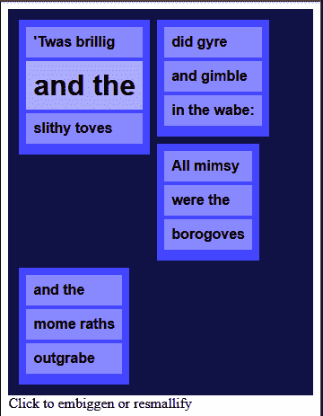
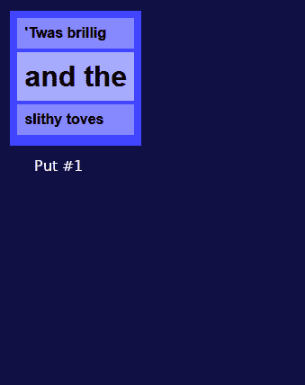
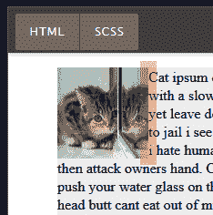

# 下面是浮动在 CSS 中的工作方式

> 原文：<https://dev.to/tchaflich/here-s-how-floats-work-in-css-13eg>

J A N U P R A S A D 通过 Unsplash 拍摄的封面照片。

还有人记得以前用浮动布局的日子吗？我们过去常常不得不在雪地里光着脚上山。那些自以为是的年轻人带着他们的 flexbox 和网格...

无论如何，浮动对于不是大规模布局的东西仍然是有用的。即使你不想在你最新的应用程序中使用它们，你也可能会维护一个旧的遗留应用程序，它对浮动使用了一种强硬的方法。对它们如何工作有一个基本的了解在各种情况下都会派上用场。

另外，浮动是 CSS 最大的恐惧之一。应用一个浮动，让页面上的所有内容突然移动(不知道为什么)，这是我们很多人都做过的事情。让我们今天克服那个绊脚石。

所以，让我们直接进入并研究这个浮动的奥秘。

## 基础知识

[https://codepen.io/tchaflich/embed/orEodZ?height=600&default-tab=result&embed-version=2](https://codepen.io/tchaflich/embed/orEodZ?height=600&default-tab=result&embed-version=2)

这是浮动最擅长的:**围绕其他事物流动的文本。在这种情况下，浮动是模仿打印布局的最佳方式。**

很简单，事情是这样的:

1.  浮动元素被放置在它应该在的地方
2.  它被从正常的文档流中移除，并被推到最左侧或最右侧
3.  它后面的元素将围绕浮动元素排列它们自己

 *#### 我可以浮动中心吗？

没有。我知道这很酷，但它不起作用。

我猜想象一下你会如何实现这个文本和猫图片版本。你会怎样把这篇文章整齐地分开呢？没有很好的方法去做。这可能就是为什么它从来没有实施。

#### 正常单据流程中没有浮动？所以就像“位置:绝对”？

不完全是。具有`position: absolute`(或类似属性)的元素被从文档流中完全删除*。一个绝对定位的元素经常会出现在附近其他元素的上面或下面，因为它们只是相互忽略。*

 *当一个元素被浮动时，它并不完全是普通文档流中的*，但是它确实与其他元素交互；他们受制于特殊的定位规则，主要是他们会围绕* it 安排自己*。*

## 花车不想大

一个没有明确大小设置的浮动元素将会[【缩小以适应】](https://www.w3.org/TR/CSS2/visudet.html#float-width)它的内容，也就是说，它只占据它需要的宽度。如果里面没有太多内容，它就不会很大；如果有很多，它会变得更大。您可能以前在`position: absolute`和`position: fixed`元素中见过类似的行为。

[https://codepen.io/tchaflich/embed/EqjXjY?height=600&default-tab=result&embed-version=2](https://codepen.io/tchaflich/embed/EqjXjY?height=600&default-tab=result&embed-version=2)

## 预测彩车的去向

当您在研究贾巴沃克的例子时，您是否碰巧发现了类似这样的东西？

[](https://res.cloudinary.com/practicaldev/image/fetch/s--Rq2ly4Sf--/c_limit%2Cf_auto%2Cfl_progressive%2Cq_auto%2Cw_880/https://thepracticaldev.s3.amazonaws.com/i/ks6sfk9hbpeyfh5bdgfg.png)

人们倾向于避免浮动的原因之一是它们看起来不可预测。如果一系列不同高度的浮动溢出它的线会发生什么？

让我们来看看[浮动元素如何定位的规范](https://developer.mozilla.org/en-US/docs/Web/CSS/float#How_floated_elements_are_positioned):

> [...]当一个元素被浮动时，它被从文档的正常流程中取出(尽管仍然是它的一部分)。它向左或向右移动，直到接触到其包含框的边缘，*或另一个浮动元素*。

所以当我们有适合我们宽度的东西时，一切都很好。如果没有，它会继续向下浮动，直到到达它想要停留的边缘——它的父容器或另一个浮动的边缘。

[](https://res.cloudinary.com/practicaldev/image/fetch/s--odZ7JojA--/c_limit%2Cf_auto%2Cfl_progressive%2Cq_66%2Cw_880/https://thepracticaldev.s3.amazonaws.com/i/w2faalo13deu3s8j5toa.gif)

#### 最后一个为什么不向上移动填充那个可怕的空格？

在 HTML 顺序中，浮动永远不会把自己放在它前面。

然而，它会尽可能地“浮动”得更高，同时牢记这一限制。

## 页边距、框模型和 HTML 顺序

在基本示例中，您对此感到困扰吗？

[](https://res.cloudinary.com/practicaldev/image/fetch/s--j3fW53oB--/c_limit%2Cf_auto%2Cfl_progressive%2Cq_auto%2Cw_880/https://thepracticaldev.s3.amazonaws.com/i/ig4wfeugarbm8wu37v2r.png)

我们这里需要的是一个*余量*。如果你随机选择，你有大约 1/3 的机会猜出哪个元素应用边距。尽管*感觉*像是随机猜测是 CSS 的精髓，但是，让我们试着理解一下浮动在这里做什么。

[](https://res.cloudinary.com/practicaldev/image/fetch/s--gUTwcntR--/c_limit%2Cf_auto%2Cfl_progressive%2Cq_auto%2Cw_880/https://thepracticaldev.s3.amazonaws.com/i/lrut8ihyqubiq9ez45k0.png)

**#1** -如果你给外部容器`#container`添加左边距，就会发生这种情况——它只会把*所有的*都推到右边。这并没有真正解决浮动框中文本边缘变得很硬的问题。可能没有人尝试过用这种方式修复浮动，除了在凌晨 3 点绝望地哭泣。(谁*没去过*？)

**# 2**——这可能是你实际尝试过的——对文本本身应用`margin-left`。然而，文本的边距是基于文本的“框”的——如果浮动不在那里，文本*就会在那里*。(你可以把它想象成在浮动元素“下面”有一个边距。)

文本*本身*仍然像以前一样围绕着浮动流动，但是它相对于它的父元素有一个空白。margin 属性不能给文本添加“锯齿形”边距，它必须与边距所代表的父元素分隔开，所以与浮动分隔开是不行的。

**#3** -边距被添加到实际的浮动元素中，扩展其框。文本将环绕整个*浮动框，包括边距。因此，将`margin-right`添加到我们的左浮动猫中，将`margin-left`添加到我们的右浮动猫中，会给文本一点空间。*

总之——将边距**放在浮动元素**上会导致其他内容围绕组合浮动框流动，包括任何边距。

我们在这里得到的想法是——页面上的其他内容围绕着浮动移动，而不是浮动围绕着页面上的其他内容移动。

[https://codepen.io/tchaflich/embed/mZXKWy?height=600&default-tab=result&embed-version=2](https://codepen.io/tchaflich/embed/mZXKWy?height=600&default-tab=result&embed-version=2)

我们还可以将浮子堆叠在一起！浮动将很好地放置在其他浮动旁边，文本将在它们周围流动。

请注意，浮动在 HTML 顺序中的位置很重要。当有疑问时，浮动优先。假设你是一个浏览器，你正在“按顺序”阅读 HTML——你会想先知道你的浮动内容在哪里，这样你就不必在之后重新绘制所有围绕它流动的内容。

## 结算浮动

具有 [`clear`](https://developer.mozilla.org/en-US/docs/Web/CSS/clear) 属性的元素描述了该元素将如何与附近的浮动元素交互。你可以在浮动物*和非浮动物*上设置明确的属性。

[https://codepen.io/tchaflich/embed/RzQJgN?height=600&default-tab=result&embed-version=2](https://codepen.io/tchaflich/embed/RzQJgN?height=600&default-tab=result&embed-version=2)

### clear 属性的意思是:我不希望任何漂浮物靠近我，在这个方向！

因为在页面上推动其他东西是不礼貌的，如果附近有一个冲突的浮动，有 clear 属性的元素会向下移动。想象一个清晰的元素是社交尴尬和冲突回避。

## 浮动并没有像你想象的那样占用空间

如果您以前使用过浮动，您可能会发现自己处于这样的位置:

[https://codepen.io/tchaflich/embed/WqMyMO?height=600&default-tab=result&embed-version=2](https://codepen.io/tchaflich/embed/WqMyMO?height=600&default-tab=result&embed-version=2)

持有所有浮动的`#container`(并且*只有*浮动)已经崩溃。这是因为浮动一个元素会将其从[普通文档流](https://developer.mozilla.org/en-US/docs/Web/CSS/CSS_Flow_Layout/In_Flow_and_Out_of_Flow)中移除，并且周围的容器不会创建新的[块格式化上下文](https://developer.mozilla.org/en-US/docs/Web/Guide/CSS/Block_formatting_context)。

记得我上面说过:

> 它被从正常的文档流中移除，并被推到最左侧或最右侧

“从文档流中删除”在这里有一个含义和技术后果！

由于我们的 CSS 统治者指定的规则，容器的高度由“在正常文档流内”的所有内容决定。然而，我们也可以让容器成为一个“块格式上下文”——有点像页面中的一个微型布局——告诉容器它需要像对待一个微型文档一样对待自己，因为它可以扩展以适应所有的内容，甚至是流出的内容。

我们需要做一些令人信服的事情来让容器伸展以适应我们的浮动，但是要知道我们有选择。

[https://codepen.io/tchaflich/embed/wLyXjJ?height=600&default-tab=result&embed-version=2](https://codepen.io/tchaflich/embed/wLyXjJ?height=600&default-tab=result&embed-version=2)

几个可能的解决方案:

### 1。创建一个流入的元素，但是在浮动之后

这就是上面那支笔里的`clearfix-type-one`解。也是“老派”的 clearfix。

我们现在知道，容器将扩展以适合其流中的所有元素，并且浮动不在流中。所以我们需要一个非浮动元素，放在浮动元素之后的*。我们可以使用`clear`属性:
来做到这一点*

```
<div id="container">
  
  
  
  
  <div style="clear: both;"> </div>
</div> 
```

Enter fullscreen mode Exit fullscreen mode

这将导致容器向下延伸到我们清除的 div。

然而，该元素将有自己的高度(因为它应该有一些文本在里面)，所以我们可以添加类似`height: 0`的东西，以确保它不会影响容器的高度，同时继续应用 clearfix。这些年来，我见过其他的方法，比如使用`max-height`甚至`font-size: 0`。\_(ツ)_/

由于这只是为了显示而不是语义，我们也可以将它移动到一个应用于容器的`::after` [伪元素](https://developer.mozilla.org/en-US/docs/Web/CSS/::after)。

这就是我们如何得到如下结果的原因:

```
 // the "basic" clearfix with after
  &.clearfix-type-one {
    background-color: #644;
    &::after {
      content: " ";
      display: block;
      height: 0;
      clear: both;
      visibility: hidden;
    }
  } 
```

Enter fullscreen mode Exit fullscreen mode

这可以进一步细化；网上有很多类似的解决方案。例如，[尼古拉斯·加拉格尔 2011 年的 micro clearfix](http://nicolasgallagher.com/micro-clearfix-hack/) 。这种类型的 Clearfix 解决方案有着惊人的跨浏览器支持，因为它们已经存在了近十年。

### 2。使用`overflow: hidden`创建新的块格式化上下文

(从技术上来说，你可以使用任何不可见的溢出值，但是隐藏是最有效的。给我一点时间解释...)

这就是上面那支笔里的`clearfix-type-two`解。来自 [MDN 文档](https://developer.mozilla.org/en-US/docs/Web/Guide/CSS/Block_formatting_context):

> 块格式上下文包含创建它的元素内部的所有内容。

因此，迫使父容器形成新的块格式化上下文将迫使它扩展，因为它*必须*完全包含它的所有子容器。而且只用一个属性就完成了，那么**为什么这不是唯一的最佳解决方案呢？**为什么它只排在三个名单的第二位？

良好的...你在用`overflow: hidden`。这不是没有后果的；你必须处理拥有一个除了自身之外什么都不显示的容器。如果我们还想在一些被裁剪的元素上有一些彩虹阴影，或者在我们的包装之外放置一些闪光的东西，那该怎么办呢？如果只是为了清理我们的彩车而抛弃这些，那将是疯狂的。

[https://codepen.io/tchaflich/embed/YmzEXE?height=600&default-tab=result&embed-version=2](https://codepen.io/tchaflich/embed/YmzEXE?height=600&default-tab=result&embed-version=2)

你可以看到这将是多么的滑稽。

还记得我之前说过你可以使用任何不可见的溢出值吗？嗯，想象一下在边上创建滚动条会有多糟糕。大呀。

### 3。使用`display: flow-root`创建新的块格式化上下文

这就是上面那支笔里的`clearfix-type-three`解。

与上面的解决方案不同，这是指在一个固有的层次上工作，而不是一个“黑客”。来自[的规格](https://drafts.csswg.org/css-display/#valdef-display-flow-root):

> 该元素生成一个块容器框，并使用流布局对其内容进行布局。它总是为其内容建立新的块格式上下文。

所以这基本上做了和`overflow: hidden`一样的事情，但是没有副作用。✨

那听起来正是我们想要的！不使用它的原因是[跨浏览器支持](https://caniuse.com/#feat=flow-root)——目前几乎 30%的设备不支持它，Safari 和 IE/Edge 一如既往地是问题儿童。

# 关于花车你还想了解什么？

[](https://res.cloudinary.com/practicaldev/image/fetch/s--4HyjxEqp--/c_limit%2Cf_auto%2Cfl_progressive%2Cq_auto%2Cw_880/https://thepracticaldev.s3.amazonaws.com/i/00d71a4wiitq0vihc33d.jpg) 
*页脚照片由克里斯蒂娜·戈塔迪在 Unsplash 上拍摄。****