# 如何使用 Vue.js、Vuex、Vuetify 和 Firebase 构建单页面应用程序(第 1 部分，共 4 部分)

> 原文：<https://dev.to/ratracegrad/how-to-build-a-single-page-application-using-vue-js-vuex-vuetify-and-firebase-part-1-of-4-3a63>

了解如何使用 Vue.js、Vuex、Vue Router 和 Firebase 创建送餐网站。

你想学习如何使用 Vue.js 吗？想用 Vue.js 创建一个逼真的网站？在本教程中，我将教你如何使用 Vue、Vuex、Vue Router、Vuetify 和 Firebase 创建一个送餐网站。

本教程以一系列文章的形式呈现，将带您从首次安装 Vue 到创建一个功能齐全的送餐网站。上面的标题图像显示了我们将创建的网站。

本教程分为四个部分。以下是该系列各部分的链接:

[第 1 部分:安装 Vue 并使用 Vue 化和 Vue 路由器构建 SPA](https://dev.to/ratracegrad/how-to-build-a-single-page-application-using-vue-js-vuex-vuetify-and-firebase-part-1-of-4-3a63)

[第二部分:使用 Vue 路由器](https://dev.to/ratracegrad/how-to-build-a-single-page-application-using-vue-js-vuex-vuetify-and-firebase-part-2-of-4-3pj6)

[第三部分:使用 Vuex 和访问 API](https://dev.to/ratracegrad/how-to-build-a-single-page-application-using-vue-js-vuex-vuetify-and-firebase-part-3-of-4-3k3p)

[第 4 部分:使用 Firebase 进行认证](https://dev.to/ratracegrad/how-to-build-a-single-page-application-using-vue-js-vuex-vuetify-and-firebase-part-4-of-4-51hh)

本教程适合所有人，无论你的技能水平如何。我只是假设你对 ES6 有所了解。

让我们开始吧。

## 安装 Vue

使用 Vue.js 创建新的应用程序是通过他们的命令行界面(CLI)完成的。您需要首先安装命令行界面，命令如下:

`npm install -g @vue/cli`

-g 标志告诉 npm 全局安装 CLI。安装完成后，可以在终端中使用命令 **vue** 访问 CLI。运行该命令将显示可用的命令:

[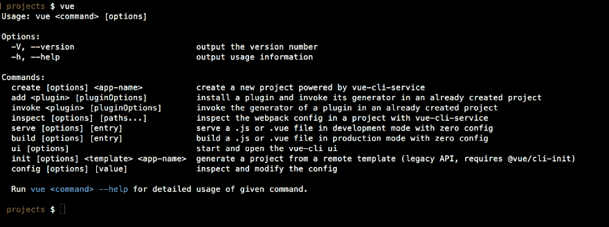](https://res.cloudinary.com/practicaldev/image/fetch/s--rQC9XHgh--/c_limit%2Cf_auto%2Cfl_progressive%2Cq_auto%2Cw_880/https://i2.wp.com/www.jenniferbland.com/wp-content/uploads/vuecommand.png%3Fresize%3D880%252C329%26ssl%3D1)

**注意:** *如果你读过其他关于 Vue 的文章，你可能会看到他们谈论用这个命令安装 CLI:*

`npm install -g vue-cli`

安装了旧版本的 Vue CLI。在撰写本教程时，Vue CLI 的当前版本是版本 3。要安装最新版本，请使用我给出的第一个命令。

## 创建我们的膳食准备应用程序

现在我们已经安装了 CLI，下一步是为我们的 Vue 应用程序创建脚手架。从您的终端输入以下命令:

`vue create meal-prep`

Vue CLI 将询问一系列问题，以确定如何构建您的应用程序。在第一次提示时，您希望选择“手动选择功能”。

[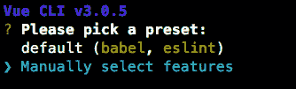](https://res.cloudinary.com/practicaldev/image/fetch/s--SGaw7ylW--/c_limit%2Cf_auto%2Cfl_progressive%2Cq_auto%2Cw_880/https://i2.wp.com/www.jenniferbland.com/wp-content/uploads/vueOptions.png%3Fresize%3D334%252C101%26ssl%3D1)

接下来，我们将被要求选择我们希望为我们的应用程序安装的特性。本教程选择 Babel，路由器，Vuex 和 Linter/Formatter。

[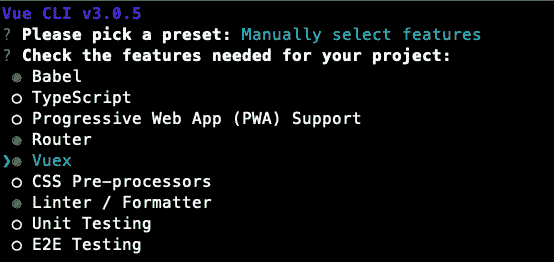](https://res.cloudinary.com/practicaldev/image/fetch/s--inF-35zu--/c_limit%2Cf_auto%2Cfl_progressive%2Cq_auto%2Cw_880/https://i2.wp.com/www.jenniferbland.com/wp-content/uploads/vueLinter.png%3Fresize%3D554%252C262%26ssl%3D1)

接下来，你会被问一系列问题。

对于棉绒，我选择了更漂亮的棉绒和 T2 棉绒。我选择将配置文件放在我的 package.json 文件中，而不是单独的配置文件中。

以下是我选择的选项:

[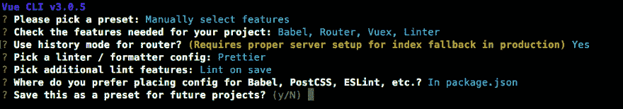](https://res.cloudinary.com/practicaldev/image/fetch/s--fwhrNvxn--/c_limit%2Cf_auto%2Cfl_progressive%2Cq_auto%2Cw_880/https://i2.wp.com/www.jenniferbland.com/wp-content/uploads/vueselectted.png%3Fresize%3D880%252C154%26ssl%3D1)

Vue CLI 将使用您选择的功能构建我们的应用程序。因为我告诉它创建一个名为“meal-prep”的应用程序，所以它会用这个名称创建一个新文件夹。

一旦 CLI 成功创建了应用程序，它将为您提供切换到新创建的目录的命令，以及启动应用程序所需运行的命令:

[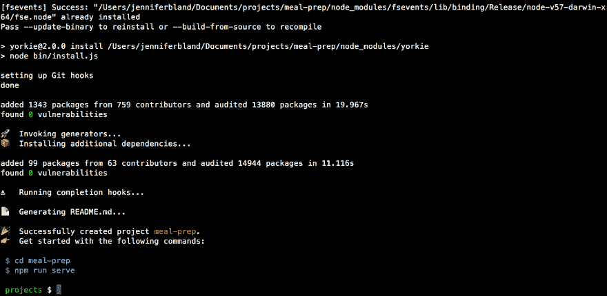](https://res.cloudinary.com/practicaldev/image/fetch/s--eMI0eB5v--/c_limit%2Cf_auto%2Cfl_progressive%2Cq_auto%2Cw_880/https://i0.wp.com/www.jenniferbland.com/wp-content/uploads/vueSuccess.png%3Fresize%3D880%252C430%26ssl%3D1)

## 开始我们的应用

要启动我们的应用程序，我们需要 cd 进入 meal-prep 目录并运行命令 **npm run serve** 。下面是我们的应用程序的样子:

[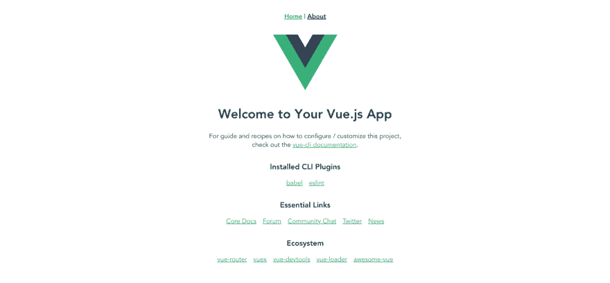](https://res.cloudinary.com/practicaldev/image/fetch/s--Q6wyRQHx--/c_limit%2Cf_auto%2Cfl_progressive%2Cq_auto%2Cw_880/https://i1.wp.com/www.jenniferbland.com/wp-content/uploads/vueDefaultApp.png%3Fresize%3D880%252C408%26ssl%3D1)

Vue 为我们搭建了一个 SPA 应用程序，并安装了 Vue 路由器和 Vuex。我们可以通过点击页面顶部菜单中的 About 来查看 Vue 路由器的运行情况。这将加载关于的**页面。**

[](https://res.cloudinary.com/practicaldev/image/fetch/s--9chkFmm3--/c_limit%2Cf_auto%2Cfl_progressive%2Cq_auto%2Cw_880/https://i1.wp.com/www.jenniferbland.com/wp-content/uploads/vueAbout.png%3Fresize%3D880%252C200%26ssl%3D1)

## 添加 Vuetify

Vuetify 是一个材料设计组件框架。它类似于自举。Vuetify 提供了 80 多种材料设计组件，我们可以用它们来设计 Vue 中的水疗中心。要将 Vuetify 添加到我们的应用程序中，首先，转到您的终端并停止服务器。然后用这个命令将 Vuetify 添加到我们的应用程序中:

`vue add vuetify`

你会被问一系列问题。我将选择不使用预制的模板，因为我想保留默认 Vue 应用程序创建的结构。其余问题，我采用默认。以下是我对这些问题的回答:

[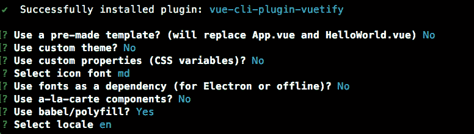](https://res.cloudinary.com/practicaldev/image/fetch/s--aE2mQTBQ--/c_limit%2Cf_auto%2Cfl_progressive%2Cq_auto%2Cw_880/https://i1.wp.com/www.jenniferbland.com/wp-content/uploads/vuetifyOptions.png%3Fresize%3D776%252C220%26ssl%3D1)

## 配置更漂亮

在创建我们的 Vue 应用程序时，我选择为林挺使用更漂亮的。我还选择将配置设置安装在 package.json 文件中。我现在想花点时间来配置更漂亮，以使用我的首选设置。

在代码编辑器中，打开 package.json 文件。在这个文件中，您将看到为 eslint 创建的默认设置。就在 eslintConfig 对象之后和 postcss 对象之前，我将添加一些设置来进行更漂亮的配置。我将缩进设置为 4 个空格，并使用单引号。*(注意:如果你喜欢缩进两个空格和/或使用双引号，那么你不需要添加这个变化。)*

下面是我添加到 package.json 文件中的更漂亮的设置:

[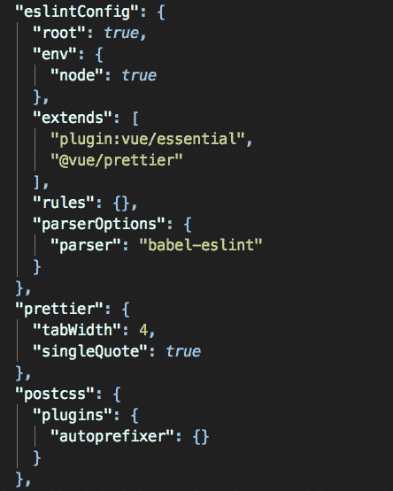](https://res.cloudinary.com/practicaldev/image/fetch/s--87i-NQTN--/c_limit%2Cf_auto%2Cfl_progressive%2Cq_auto%2Cw_880/https://i1.wp.com/www.jenniferbland.com/wp-content/uploads/prettier.png%3Fresize%3D444%252C555%26ssl%3D1)

接下来，我想重新配置所有的文件，以使用我的新的更漂亮的设置。这意味着将所有缩进从 2 个空格改为 4 个空格，并将双引号改为单引号。幸运的是，Vue 提供了一个 lint 脚本，可以自动修复所有这些问题。

从终端运行以下命令:

`npm run lint`

这将 lint 所有的文件，并改变他们到我的新的更漂亮的设置。这个命令会给你一个已经自动修复的所有文件的列表。

[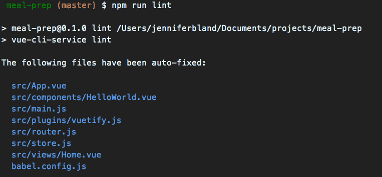](https://res.cloudinary.com/practicaldev/image/fetch/s--phyB3Xed--/c_limit%2Cf_auto%2Cfl_progressive%2Cq_auto%2Cw_880/https://i1.wp.com/www.jenniferbland.com/wp-content/uploads/lint.png%3Fresize%3D763%252C354%26ssl%3D1)

## 设计我们应用程序的主页

我们将使用 Vuetify 来设计我们的应用程序。你可以在这里找到更多关于 Vuetify 提供的所有 UI 组件的细节。所有使用 Vuetify 的应用程序都必须用`<v-app>`包装。打开 App.vue 文件，删除模板中的所有代码和所有样式。你的 App.vue 应该是这样的:

```
<template>
    <v-app>
        <v-content transition="slide-x-transition">
            <router-view></router-view>
        </v-content>
    </v-app>
</template>

<script>
export default {
    name: 'App'
};
</script>

<style>
</style> 
```

这段代码将我们的应用程序包装在 Vuetify 需要的`<v-app>`标签中。在那个标签里面是`<v-content>`标签。里面是`<router-view>`标签。路由器视图标记将显示您当前所在的页面。当我们在主页上时，它将显示主页视图。当我们导航到“关于”页面时，它将显示“关于”视图。

## 创建主页

接下来打开位于 views 文件夹中的 Home.vue 文件。我们将删除那里的代码。删除模板中的所有内容。移除 HelloWorld 的导入命令和注释。删除组件对象。以下是我们将为主页创建的内容:

[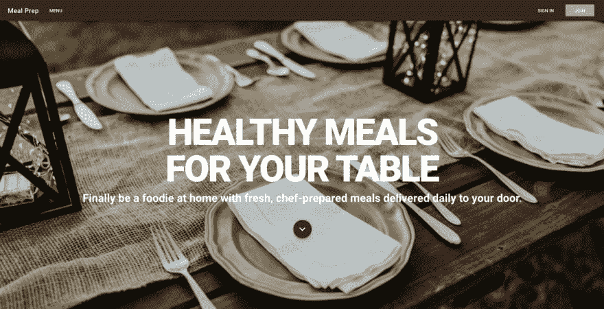](https://res.cloudinary.com/practicaldev/image/fetch/s---Lc5wOz_--/c_limit%2Cf_auto%2Cfl_progressive%2Cq_auto%2Cw_880/https://i1.wp.com/www.jenniferbland.com/wp-content/uploads/homepage.png%3Fresize%3D880%252C450%26ssl%3D1)

## App 导航

我们首先要做的是导航。我将为导航创建一个新的 Vue 组件。在 components 文件夹中创建一个名为 **AppNavigation.vue** 的新文件。

我们的导航将不得不在许多不同的屏幕尺寸上工作。在更大的屏幕上，比如笔记本电脑或台式机，我们会在屏幕上方显示一个菜单。在手机等较小的设备上，我们将显示传统的汉堡菜单图标。当用户点击图标时，一个抽屉会从左边滑进来，里面有我们的菜单。这个抽屉将保持在网站的顶部，直到用户关闭它。

Vuetify 提供了两个工具来显示不同屏幕尺寸的菜单。对于中大屏幕，我们将使用 Vuetify `<v-toolbar>`组件。在较小的屏幕上，我们将显示`<v-navigation-drawer>`组件。

让我们从搭建新 Vue 组件的默认配置开始。AppNavigation.vue 文件应该包含以下代码:

```
<template>

</template>

<script>
export default {
    name: 'AppNavigation'
};
</script>

<style scoped>
</style> 
```

我们将从创建将在中等和大尺寸屏幕上显示的菜单开始。为此，我们将使用`<v-toolbar>`组件。下面是您将为导航输入的代码:

```
<template>
        <v-toolbar app color="brown darken-4" dark>
            <v-toolbar-side-icon></v-toolbar-side-icon>
            <v-toolbar-title>{{appTitle}}</v-toolbar-title>
            <v-btn flat>Menu</v-btn>
            <v-spacer></v-spacer>
            <v-btn flat>SIGN IN</v-btn>
            <v-btn color="brown lighten-3">JOIN</v-btn>
        </v-toolbar>
</template>

<script>
export default {
    name: 'AppNavigation'
};
</script>

<style scoped>
</style> 
```

该代码将生成以下菜单:

[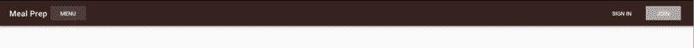](https://res.cloudinary.com/practicaldev/image/fetch/s--SqatNjfv--/c_limit%2Cf_auto%2Cfl_progressive%2Cq_auto%2Cw_880/https://i0.wp.com/www.jenniferbland.com/wp-content/uploads/menu.png%3Fresize%3D880%252C61%26ssl%3D1)

让我解释一下我在菜单中使用的项目。对于`<v-toolbar>`我已经添加了道具 **app** 。该属性将组件指定为应用程序布局的一部分。它用于动态调整内容大小。当侧面抽屉滑出时，屏幕上的内容会相应调整。

接下来，我给导航添加了一种颜色。Vuetify 提供对材料设计规范中所有颜色的访问。这些值可以通过**颜色类**系统在你的样式表、组件文件和实际组件中使用。我选择了棕色的导航与变暗-4 的变种。[这里是 Vuetify](https://vuetifyjs.com/en/framework/colors) 所有可用的颜色。

有许多助手组件可用于工具栏。一个助手组件是工具栏侧图标。这是汉堡菜单。我把它放在工具栏的第一个位置。

另一个助手组件是工具栏标题。我把它加在了工具栏侧边图标的后面。我正在显示数据中定义的 appTitle。

接下来，我有一系列的按钮。验证按钮使用`<v-btn>`组件。对于前三个按钮，我指定了一个**平**的道具。平面按钮没有方框阴影，也没有背景。只有在悬停时，才会显示按钮的容器。这允许我创建模仿传统菜单外观和感觉的按钮。

对于*加入*按钮，我没有使用平支柱。我正在给按钮添加颜色。

我在`<v-toolbar>`上做的最后一件事是添加道具**黑暗**。这个道具将黑色主题变体应用到工具栏上。这将反转所有的文本，因此它们现在不是黑色的，而是白色的。

## 改进导航中的造型

导航的第一个实现提供了我希望它拥有的所有特性。但是我想做些改变。首先，我不想显示汉堡菜单，除非我在一个小设备上。同样，当我在小设备上时，我不希望菜单中的任何按钮显示出来。

Vuetify 提供了一个显示助手。显示助手允许您控制内容的显示。这包括根据当前视口或实际元素显示类型有条件地可见。

对于工具栏侧图标，我希望它只在 XS 和 SM 设备上可见。对于 MD 和 LG 屏幕，我希望工具栏侧图标不可见。同样，我希望所有的按钮都显示在 MD 和 LG 屏幕上，隐藏在较小的屏幕上。

我将在工具栏侧边图标上添加类 **hidden-md-and-up** 。我将添加类 **hidden-sm-and-down** 到所有的按钮和间隔。

现在，我将成为一个坚持不懈的人，因为我想再增加一个布局变化。在小型设备上显示应用程序时，我只会看到汉堡菜单和应用程序标题。目前它们都在屏幕的左侧。我想改变这一点，使应用程序标题出现在屏幕的右侧。这将在显示的两个项目之间提供平衡。

为此，我将在工具栏侧边图标和工具栏标题之间添加一个新的`<v-spacer>`。间隔会将它后面的所有内容移动到屏幕的右侧。但我只希望这个间隔出现在小屏幕上。所以我给它添加了类 **hidden-md-and-up** 。

下面是最后的代码:

```
<v-toolbar app color="brown darken-4" dark>
    <v-toolbar-side-icon class="hidden-md-and-up" @click="drawer = !drawer"></v-toolbar-side-icon>
    <v-spacer class="hidden-md-and-up"></v-spacer>
    <v-toolbar-title>{{appTitle}}</v-toolbar-title>
    <v-btn flat class="hidden-sm-and-down">Menu</v-btn>
    <v-spacer class="hidden-sm-and-down"></v-spacer>
    <v-btn flat class="hidden-sm-and-down">SIGN IN</v-btn>
    <v-btn color="brown lighten-3" class="hidden-sm-and-down">JOIN</v-btn>
</v-toolbar> 
```

如果你想看看当你调整屏幕大小时是什么样子，这是我创建的第一个 giphy。🙂

[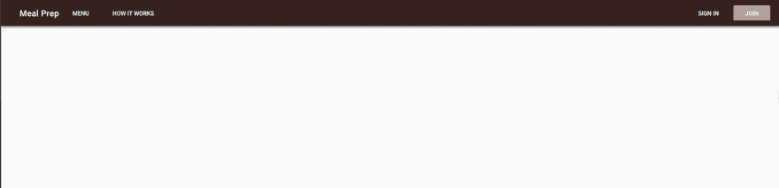T4】](https://res.cloudinary.com/practicaldev/image/fetch/s--xBzXdoo6--/c_limit%2Cf_auto%2Cfl_progressive%2Cq_66%2Cw_880/https://i0.wp.com/www.jenniferbland.com/wp-content/uploads/resizescreen.gif)

## 创建小屏幕导航

对于小屏幕，我们将使用 Vuetify 的`<v-navigation-drawer>`组件。如果我们将它添加到模板中，我们将立即得到一个错误。这是因为每个 Vue 组件在模板中应该只有一个根。通过在我们的模板中有一个`<v-navigation-drawer>`和`<v-toolbar>`，我们有两个根。为了避免这种情况，创建一个`<span>`来包围两者。

下面是导航抽屉的代码:

```
<template>
    <span>
        <v-navigation-drawer app v-model="drawer" class="brown lighten-2" dark disable-resize-watcher>
            <v-list>
                <template v-for="(item, index) in items">
                    <v-list-tile :key="index">
                        <v-list-tile-content>
                            {{item.title}}
                        </v-list-tile-content>
                    </v-list-tile>
                    <v-divider :key="`divider-${index}`"></v-divider>
                </template>
            </v-list>
        </v-navigation-drawer>
        <v-toolbar app color="brown darken-4" dark>
            <v-toolbar-side-icon class="hidden-md-and-up" @click="drawer = !drawer"></v-toolbar-side-icon>
            <v-spacer class="hidden-md-and-up"></v-spacer>
            <v-toolbar-title>{{appTitle}}</v-toolbar-title>
            <v-btn flat class="hidden-sm-and-down">Menu</v-btn>
            <v-spacer class="hidden-sm-and-down"></v-spacer>
            <v-btn flat class="hidden-sm-and-down">SIGN IN</v-btn>
            <v-btn color="brown lighten-3" class="hidden-sm-and-down">JOIN</v-btn>
        </v-toolbar>
    </span>
</template>

<script>
export default {
    name: 'AppNavigation',
    data() {
        return {
            appTitle: 'Meal Prep',
            drawer: false,
            items: \[
                { title: 'Menu' },
                { title: 'Sign In' },
                { title: 'Join' }
            \]
        };
    }
};
</script>

<style scoped>
</style> 
```

让我解释一下我在抽屉导航中放了什么。我已经添加了道具 **app** 。这是我们为工具栏添加的相同道具。接下来，我添加了一个 v-model 来查找名为 drawer 的数据项。在数据中，抽屉将被初始设置为**假**。这意味着抽屉是关闭的。抽屉为真时会打开，为假时会关闭。我在工具栏侧边图标上添加了一个点击方法。当你点击汉堡包菜单时，它会将抽屉的值从真变为假，反之亦然。

我添加的最后一项是给它一个颜色为 **brown lighten-2** 的类。我决定给我的抽屉添加一种颜色，因为默认颜色是白色。

接下来我使用 Vuetify 的`<v-list>`组件。在 data 中，我创建了一个名为 items 的数组。这是一个对象数组。每个对象都有一个文本键，其值就是菜单中显示的内容。我使用一个数据项，而不是对列表中的菜单项进行硬编码，因为我们将在后面的系列文章中添加身份验证时使用它。

在数据中，我已经添加了抽屉和项目:

```
export default {
    name: 'AppNavigation',
    data() {
        return {
            appTitle: 'Meal Prep',
            drawer: false,
            items: \[
                { title: 'Menu' },
                { title: 'Sign In' },
                { title: 'Join' }
            \]
        };
    }
}; 
```

当我们点击汉堡菜单时，抽屉看起来是这样的:

[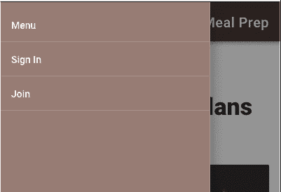](https://res.cloudinary.com/practicaldev/image/fetch/s--kaX7nlHV--/c_limit%2Cf_auto%2Cfl_progressive%2Cq_auto%2Cw_880/https://i2.wp.com/www.jenniferbland.com/wp-content/uploads/drawer.png%3Fresize%3D401%252C274%26ssl%3D1)

## 给应用程序添加导航

现在我们已经创建了 AppNavigation 组件，我们需要将它添加到我们的应用程序中。打开 App.vue 文件。在该文件中，我们需要导入我们的 AppNavigation 组件。然后我们可以把它放在我们的应用程序中。

这是您在 App.vue 文件中应该有的代码:

```
 <template>
    <v-app>
        <app-navigation></app-navigation>

        <v-content transition="slide-x-transition">
            <router-view></router-view>
        </v-content>
    </v-app>
</template>

<script>
import AppNavigation from '@/components/AppNavigation';

export default {
    name: 'App',
    components: {
        AppNavigation
    }
};
</script>

<style>
</style> 
```

首先您需要导入 AppNavigation。当我导入它时，我给它命名为 AppNavigation。在脚本中，我添加了一个包含 AppNavigation 的组件对象。名称的格式很重要。当组件被添加时，它会用连字符连接名称。当我把组件放到 html 模板中时，我使用了。

***注意:**如果你仔细观察代码，你会注意到我移除了，并把它直接放在了`<v-content>`上。只是想让你知道我做了那个改变，因为我真的不想回去更新所有的照片！*

## 为我们的主页创建内容

我们将为我们的主页添加一个全屏图像。然后我们将在图片上添加文字。我将创建一个新的 vue 组件，而不是将我们的代码直接放在 views 文件夹中的 Home.vue 文件中。在 components 文件夹中创建一个名为 HomeHero.vue 的新文件。

Vuetify 有一个 12 点网格系统。网格是使用 flex-box 构建的，用于布局应用程序的内容。 **v-container** 可用于中心聚焦页面，或给予**流体**道具以扩展其全部宽度。垂直布局用于分隔各部分。你的布局结构将如下， **v 型集装箱 v 型布局 v 型柔性**。

我们将在 HomeHero 组件的设计中使用这个网格系统。我们将使用`<v-container fluid>`作为模板中的根元素。我们将为它添加道具**填充高度**。这个道具会自动调整容器，使其高度达到屏幕的 100%。我做的最后一件事是添加名为**的职业——家庭英雄**。

在我的风格中，我将添加一个背景图片到容器中。这是用户在加载网站时会看到的全屏图像。我用的是 unsplash.com 的图片。

在容器里面我会有一个`<v-layout>`。布局会将显示在图像顶部的所有文本换行。Vuetify 提供了我将用来设计文本样式的排版设置。对于正文，我给它一个

`class="display-4 font-weight-black white--text"`

display-4 将生成字体大小为 112sp、字体粗细为 light 的文本。我将通过指定字体粗细-黑色来覆盖该字体粗细。我希望文本是白色的，这样我可以添加**白色-文本**我添加的最后一件事是指定文本居中。

我将对第二行文本使用相同的样式。唯一的添加是我添加了一个 **mb-3** 的对齐。Vuetify 提供了 5 个级别的间距。mb 的意思是应用 3 的保证金下限。这将在标题和副标题文本之间提供一些间距。

我添加的最后一个东西是屏幕底部的一个按钮。我添加这个是因为有时人们可能不会想到向下滚动来查看更多的内容，因为图像是全屏的。该图像向用户提供了一个视觉指示器，表明下面还有更多内容。

我正在使用 Vuetify 中的`<v-btn>`组件。这是我们在导航中使用的相同组件。这次我将道具 fab 应用到按钮上。浮动按钮是圆形的，通常包含一个图标。我将添加一个向下箭头的图标。`<v-icon>`组件要求您输入要显示的图标的名称。[这里列出了你可以使用的所有材质图标。](https://material.io/tools/icons/?style=baseline)

对于按钮，我将添加一个类，它将把 margin-top 设置为 5，并将颜色设置为我用于菜单的棕色。对于图标，我将它的颜色设置为白色。我还将图标设置得很大。

下面是 HomeHero 文件的代码:

```
<template>
    <v-container fluid fill-height class="home-hero">
        <v-layout justify-center align-center column pa-5>
            <div class="display-4 font-weight-black white--text text-xs-center">HEALTHY MEALS</div>
            <div class="display-4 font-weight-black white--text text-xs-center mb-3">FOR YOUR TABLE</div>
            <div class="display-1 font-weight-bold white--text text-xs-center">Finally be a foodie at home with fresh, chef-prepared meals delivered daily to your door.</div>
            <v-btn fab class="mt-5 brown darken-4">
            <v-icon large color="white">expand\_more</v-icon>
            </v-btn>
        </v-layout>
    </v-container>
</template>

<script>
export default {
    name: 'HomeHero'
};
</script>

<style scoped>
.home-hero {
    background: url('https://source.unsplash.com/0BhSKStVtdM');
    background-size: cover;
    width: 100%;
    height: 100%;
}
</style> 
```

## 向应用添加 HomeHero 组件

现在我们已经创建了组件，我们需要将它添加到应用程序中。打开 views 文件夹中的 Home.vue 文件。就像我们对 AppNavigation 所做的一样，您需要导入组件并将其放入模板中。Home.vue 文件应该是这样的:

```
<template>
    <span>
        <home-hero></home-hero>
    </span>
</template>

<script>
import HomeHero from '@/components/HomeHero';

export default {
    name: 'home',
    components: {
        HomeHero
    }
};
</script> 
```

## 向主页添加更多内容

现在我们有一个非常漂亮的主页。但是我们需要添加更多的内容来解释我们的餐前准备服务为潜在客户提供了什么。所以现在我们来补充一下。

对于内容，我们将创建一个名为 HomeDetails.vue 的新组件。在 components 文件夹中，创建一个名为 HomeDetails.vue 的新文件。对于内容，我将对文本使用 Lorem Ipsum。

我将通过用`<v-container>`组件创建根元素来使用 Vuetify 布局方案。在里面，我将使用`<v-layout>`组件。为了布局，我将添加**柱**的道具。因为布局是基于 Flexbox 的，所以它会垂直对齐所有内容。每个文本项都将在一个`<v-flex>`组件中。

页眉将使用 **display-2** 的 Vuetify 排版类。我希望这段文字居中。为了使它成为中心，我将 **text-xs-center** 添加到这个类中。最后要补充的是 **my-5** 。这将沿 y 轴添加一个边距，这意味着它将添加一个上边距和一个下边距。

接下来，我将创建另一个`<v-flex>`条目。这个条目将有一个标题和一个副标题。我想在文本周围添加一些空白，所以我添加了一个 **mt-3** 类。这将为所有文本项添加边距上限 3。

下面是我的 HomeDetails.vue 文件:

```
<template>
    <v-container>
        <v-layout column>
            <v-flex  class="display-2 text-xs-center my-5">Big Title Goes Here</v-flex>
            <v-flex>
                <div class="headline mt-3">Lorem ipsum</div>
                <p class="subheading mt-3">Lorem ipsum dolor sit amet, consectetur adipiscing elit. Cras pulvinar risus quis mauris interdum, in euismod nibh pretium. Etiam pulvinar tincidunt dapibus. Quisque sollicitudin, mauris a consequat consectetur, turpis nisl sollicitudin enim, id consectetur neque neque nec metus. Pellentesque dolor nisi, vulputate quis lobortis ac, tincidunt et quam. Mauris pulvinar blandit nisi nec mattis. Aliquam accumsan ut sem eget efficitur. Vivamus in tortor gravida eros laoreet condimentum nec vel dui. Nullam quam massa, ultrices eget tincidunt a, pulvinar ac libero.</p>
            </v-flex>
            <v-flex>
                <div class="headline mt-3">Lorem ipsum</div>
                <p class="subheading mt-3">Lorem ipsum dolor sit amet, consectetur adipiscing elit. Cras pulvinar risus quis mauris interdum, in euismod nibh pretium. Etiam pulvinar tincidunt dapibus. Quisque sollicitudin, mauris a consequat consectetur, turpis nisl sollicitudin enim, id consectetur neque neque nec metus. Pellentesque dolor nisi, vulputate quis lobortis ac, tincidunt et quam. Mauris pulvinar blandit nisi nec mattis. Aliquam accumsan ut sem eget efficitur. Vivamus in tortor gravida eros laoreet condimentum nec vel dui. Nullam quam massa, ultrices eget tincidunt a, pulvinar ac libero.</p>

                <p class="subheading mt-3">Nullam nec massa eu est fringilla lobortis. Praesent in enim in justo blandit varius. Cras placerat arcu in sapien rhoncus aliquet. Sed interdum tortor et tincidunt condimentum. Etiam consequat mi leo, in suscipit odio scelerisque molestie. Nam et purus consequat, iaculis augue vel, sagittis ligula. Vestibulum aliquet vulputate erat. Phasellus id mauris mauris. Nunc a maximus dolor. Curabitur ut vestibulum arcu. Curabitur non lacus justo. Cras varius a magna in semper. Nulla eros ante, consectetur faucibus sapien eu, rhoncus imperdiet dui. Sed viverra iaculis nunc, id pulvinar massa egestas vitae.</p>

                <p class="subheading mt-3">Aenean erat metus, imperdiet eget nisl laoreet, venenatis ultricies ante. In interdum ante vel dictum ullamcorper. Pellentesque habitant morbi tristique senectus et netus et malesuada fames ac turpis egestas. Integer sit amet gravida diam. Aliquam in tempor metus. Fusce pellentesque pharetra sem, et luctus justo tempor dictum. Ut feugiat est sed tristique egestas. Nullam posuere a nunc in blandit. Vestibulum ante ipsum primis in faucibus orci luctus et ultrices posuere cubilia Curae; Suspendisse laoreet ultrices eros, nec malesuada enim semper sit amet. Maecenas efficitur consectetur accumsan. Etiam in aliquam turpis, ut pharetra nulla. Vestibulum malesuada, nulla id elementum cursus, nibh dui rhoncus felis, suscipit mattis felis enim sed ex. Pellentesque scelerisque aliquam lorem, vel mattis nibh tincidunt ac. Suspendisse ac nibh sit amet lacus ullamcorper maximus.</p>
            </v-flex>
            <v-flex>
                <div class="headline mt-3">Lorem ipsum</div>
                <p class="subheading mt-3">Nullam nec massa eu est fringilla lobortis. Praesent in enim in justo blandit varius. Cras placerat arcu in sapien rhoncus aliquet. Sed interdum tortor et tincidunt condimentum. Etiam consequat mi leo, in suscipit odio scelerisque molestie. Nam et purus consequat, iaculis augue vel, sagittis ligula. Vestibulum aliquet vulputate erat. Phasellus id mauris mauris. Nunc a maximus dolor. Curabitur ut vestibulum arcu. Curabitur non lacus justo. Cras varius a magna in semper. Nulla eros ante, consectetur faucibus sapien eu, rhoncus imperdiet dui. Sed viverra iaculis nunc, id pulvinar massa egestas vitae.</p>
            </v-flex>
        </v-layout>
    </v-container>
</template>

<script>
export default {
    name: 'HomeDetails'
};
</script>

<style scoped>
</style> 
```

## 向应用程序添加 HomeDetails

我们将向应用程序添加 HomeDetails，就像我们为 HomeHero 所做的那样。打开 views 文件夹中的 Home.vue 文件。您将需要导入 HomeDetails 组件。然后添加到 HomeHero 下面的模板中。

下面是 Home.vue 文件的样子:

```
<template>
    <span>
        <home-hero></home-hero>
        <home-details></home-details>
    </span>
</template>

<script>
import HomeHero from '@/components/HomeHero';
import HomeDetails from '@/components/HomeDetails';

export default {
    name: 'home',
    components: {
        HomeHero,
        HomeDetails
    }
};
</script> 
```

当我们添加这个新组件时，它会给我们的布局带来问题。现在，文本根据图像的总高度以及新的文本内容居中。它看起来是这样的:

[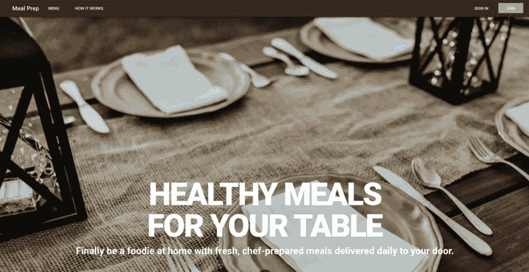](https://res.cloudinary.com/practicaldev/image/fetch/s--krWWh6qF--/c_limit%2Cf_auto%2Cfl_progressive%2Cq_auto%2Cw_880/https://i0.wp.com/www.jenniferbland.com/wp-content/uploads/homepageproblems.png%3Fresize%3D880%252C453%26ssl%3D1)

我们可以通过为包含我们图像的容器指定一个最大高度来很容易地纠正这个问题。我们希望这个容器是我们的视口高度的 100%。

打开 HomeHero.vue 文件。在`<v-container>`组件上添加一个设置最大高度的样式。下面是这一行:

`<v-container fluid fill-height class="home-hero" style="max-height: 100vh;">`

现在我们又回到了全屏图像，文本位于图像中央。然后我们可以向下滚动查看详细信息。

## 创建用餐计划组件

在详细信息之后，我想添加我们在膳食准备网站上提供的膳食计划的图像。对于我的膳食准备网站，我将提供酮，古和素食餐计划。请随意定制您的应用程序，以提供您希望向客户提供的膳食计划。

让我们创建一个新组件。在 components 文件夹中，创建一个名为 HomePlans.vue 的新文件。我们的根元素将是一个`<v-container>`。我们将增加一个新道具**格子-列表-lg** 。我们将有三个并排的用餐计划。这个道具会在它们之间留出空间。

接下来我们有一个标题文本`<v-layout>`,宣布我们可用的膳食计划。我们将使用一个名为`<v-card>`的新 Vuetify 组件。我们的卡片将会有一个图像，用餐计划的名称和一些详细的文字。我将使用 unsplash 的图片制作每一份膳食计划。

下面是 HousePlans.vue 文件的代码:

```
<template>
    <v-container grid-list-lg>
        <v-layout row>
            <v-flex xs12 class="text-xs-center display-1 font-weight-black my-5">Available Meal Plans</v-flex>
        </v-layout>
        <v-layout row wrap>
            <v-flex xs12 sm12 md4>
                <v-card>
                    <v-img src="https://source.unsplash.com/hjCA3ecCXAQ" height="500px">
                        <v-container fill-height fluid>
                            <v-layout fill-height>
                                <v-flex xs12 align-end flexbox>
                                    <span class="headline white--text">KETO</span>
                                </v-flex>
                            </v-layout>
                        </v-container>
                    </v-img>

                    <v-card-title primary-title>
                        <div>
                            <h3 class="headline mb-0">Keto</h3>
                            <div>Lorem ipsum dolor sit amet, consectetur adipiscing elit. Nullam mauris felis, varius rutrum massa a, dignissim ornare dui. Cras eget velit eu dui tristique lobortis sit amet vel tellus.
                            </div>
                        </div>
                    </v-card-title>
                </v-card>
            </v-flex>

            <v-flex xs12 sm12 md4>
                <v-card>
                    <v-img src="https://source.unsplash.com/6S27S6pZ6o0" height="500px">
                        <v-container fill-height fluid>
                            <v-layout fill-height>
                                <v-flex xs12 align-end flexbox>
                                    <span class="headline white--text">PALEO</span>
                                </v-flex>
                            </v-layout>
                        </v-container>
                    </v-img>
                    <v-card-title primary-title>
                        <div>
                            <h3 class="headline mb-0">Paleo</h3>
                            <div>Lorem ipsum dolor sit amet, consectetur adipiscing elit. Nullam mauris felis, varius rutrum massa a, dignissim ornare dui. Cras eget velit eu dui tristique lobortis sit amet vel tellus.
                            </div>
                        </div>
                    </v-card-title>
                </v-card>
            </v-flex>

            <v-flex xs12 sm12 md4>
                <v-card>
                    <v-img src="https://source.unsplash.com/1SPu0KT-Ejg" height="500px">
                        <v-container fill-height fluid>
                            <v-layout fill-height>
                                <v-flex xs12 align-end flexbox>
                                    <span class="headline white--text">VEGAN</span>
                                </v-flex>
                            </v-layout>
                        </v-container>
                    </v-img>
                    <v-card-title primary-title>
                        <div>
                            <h3 class="headline mb-0">Vegan</h3>
                            <div>Lorem ipsum dolor sit amet, consectetur adipiscing elit. Nullam mauris felis, varius rutrum massa a, dignissim ornare dui. Cras eget velit eu dui tristique lobortis sit amet vel tellus.
                            </div>
                        </div>
                    </v-card-title>
                </v-card>
            </v-flex>
        </v-layout>
    </v-container>
</template>

<script>
export default {
    name: 'HomePlans'
};
</script>

<style scoped>
</style> 
```

## 向应用程序添加 HomePlans

我们以前已经这样做过几次了。打开 views 文件夹中的 Home.vue 文件。导入 HomePlans.vue 组件并将其放在 HomeDetails 下的模板中。

这是 Home.vue 的代码:

```
<template>
    <span>
        <home-hero></home-hero>
        <home-details></home-details>
        <home-plans></home-plans>
    </span>
</template>

<script>
import HomeHero from '@/components/HomeHero';
import HomeDetails from '@/components/HomeDetails';
import HomePlans from '@/components/HomePlans';

export default {
    name: 'home',
    components: {
        HomeHero,
        HomeDetails,
        HomePlans
    }
};
</script> 
```

这是用餐计划部分的外观:

[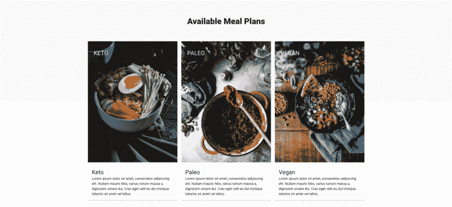](https://res.cloudinary.com/practicaldev/image/fetch/s--b3VW4uGq--/c_limit%2Cf_auto%2Cfl_progressive%2Cq_auto%2Cw_880/https://i1.wp.com/www.jenniferbland.com/wp-content/uploads/mealplans.png%3Fresize%3D880%252C404%26ssl%3D1)

## 获取代码

尽管这是一个 4 部分的系列，你可以在我的 GitHub 账户中获得[完成的代码。请帮助我，当你得到代码的时候**开始回购**。](https://github.com/ratracegrad/meal-prep)

## 总结

在本系列的第一部分中，您已经学习了:

*   如何安装 Vue
*   如何向应用程序添加 Vuetify
*   如何创建多个组件
*   如何使用 Vuetify 设计组件的样式

## 接下来是什么

在本系列的下一部分，我们将讨论 Vue 路由器。Vue Router 允许您在应用程序的不同页面之间导航。例如，我们显示了可用菜单的列表。当用户点击一个，他们应该显示该菜单的细节。我们将使用 Vue 路由器从配方列表页面过渡到详细信息页面。下节课再见。

## 培训课程

我在我的网站 CodePrep 上创建培训课程。我有关于 Vue、Webpack、Flexbox、函数式编程等等的培训课程。点击这里查看。