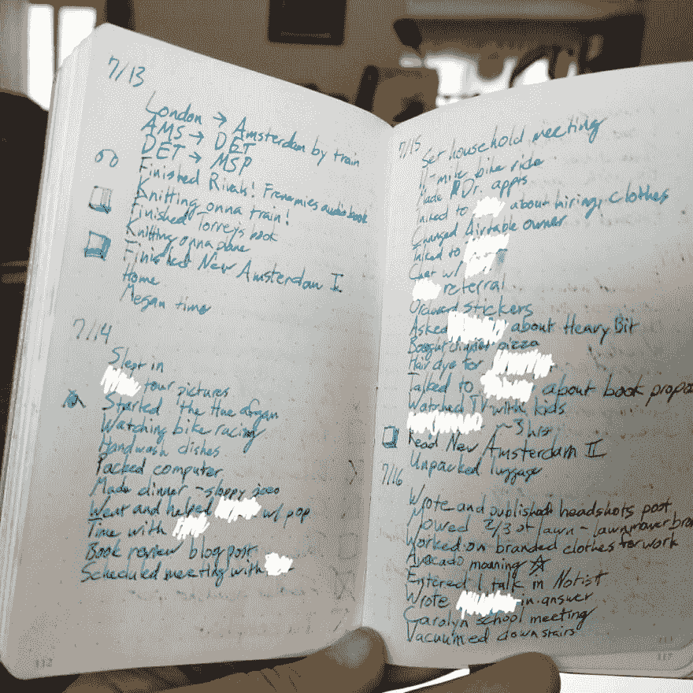
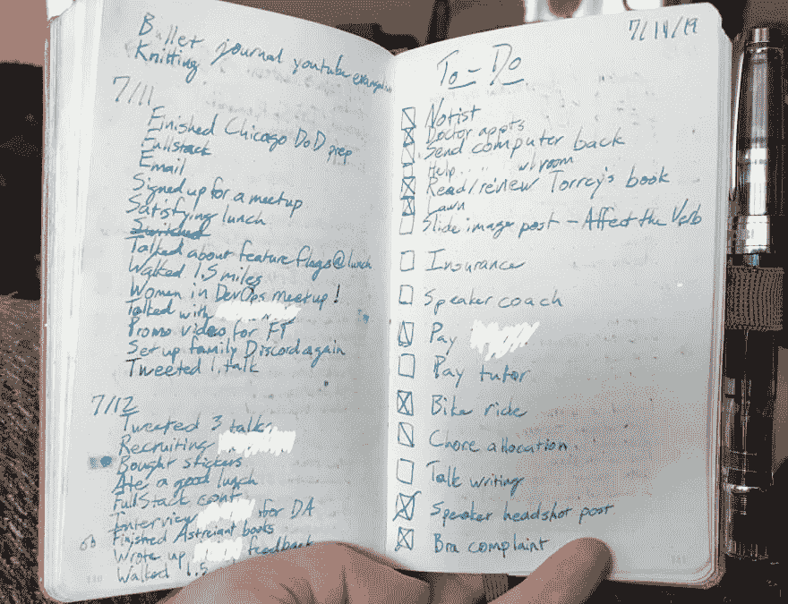
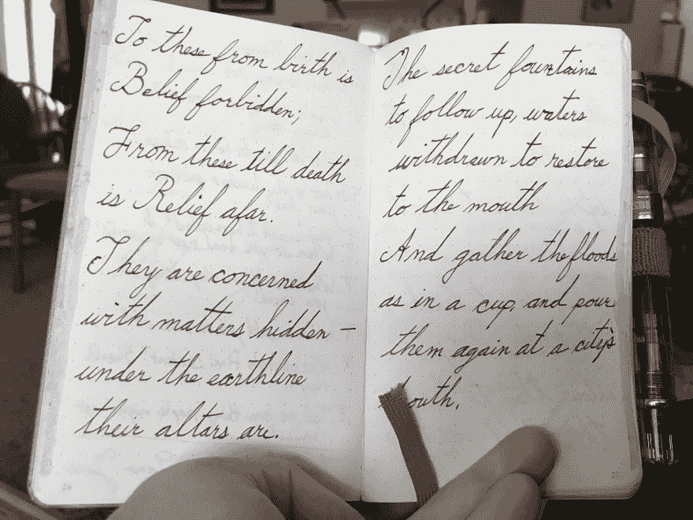

# 猪仔，猪仔，猪仔，猪仔，猪仔，猪仔，猪仔，猪仔，猪仔，猪仔，猪仔，猪仔，猪仔，猪仔，猪仔，猪仔，猪仔，猪仔

> 原文：<https://dev.to/wiredferret/bujo-pig-248p>

这是一个关于资产阶级的笑话，以及它与子弹日记的交集…

没关系。

项目符号日志是:

a)一个生产力系统，使用日志来捕获待办事项列表、杂念和计划，具有不同层次的细化

b)表面上是关于规划期刊的一种艺术形式，但其本身也值得时间和投入，就像中世纪的[小时之书](https://en.m.wikipedia.org/wiki/Book_of_hours)。

发明者和所有支持者会告诉你，这是关于个人需求和个性，我相信这是真的。整个 Pinterest/YouTube 世界的人都在谈论他们如何使用子弹日记，以及子弹日记帮助他们完成了什么。

## 我和加

我的 ADD 的一个有趣的效果和我的体验是我可以有一个待办事项清单，我可以在一天内完成很多事情，这些事情可能完全是相互关联的，所以第二天早上我醒来时会感到不知所措，因为我只完成了清单上的两个项目，花了一整天，这到底是怎么回事。

所以现在我用我的子弹日记来记录*实际发生的事情*，因为我的生活不太可预测也不太稳定。当我在采访别人时，他们问我关于 DevRel 的一天生活，我没有办法回答他们，因为可能是旅行或演讲或拜访客户或写作或或…

现在，当我看我的日记时，我可以看到我“什么都没完成”的原因是因为我花了 3 个小时带我的孩子去看电影，或者因为我在路上。我可以看到我写完的书，以及我写的东西。记录我的实际活动对了解我一天的去向非常有用。我甚至可以看到一段时间内的趋势。就像我长途旅行回家后的第二天，我做的事情很少，我在家的时间越长，我完成的任务就越多。

我也不限制什么算“任务”。如果某件事让我觉得我要么已经完成了，要么花了时间去做，它就会被列入清单。我喜欢完成事情，这对我很重要。

## 我的“系统”

第一张图片是一组每日页面。我把我的旅行，我做过的事情，那些太小或太新的事情放入待办事项列表。我已经把人们的名字删掉了，但是你可以看到我部分地用这个来追踪情绪和家务劳动，自我照顾，媒体消费，以及工作项目。这都是我，都是让魔术继续下去不可或缺的一部分。在这篇文章中，我尝试添加一些图标来显示我做了什么。小小的贴纸可能也能很好地解决这个问题。

在下图的右边，有一个待办事项列表。空白方框表示我还没开始，一行表示我开始了还没完成，一个 X 表示我完成了。这不是 BuJo 的风格，但对我来说效果很好。你可以看到，当任务出现时，我会在这一页上插入任务，当我没有足够的空间时，我会从顶部开始，在每一行添加内容。

如果你看看这个，你会发现这不是大多数人喜欢的子弹日志的“正常”A5 Leuchtterm，而是 A6，它足够小，可以放在帽衫或牛仔裤的口袋里，因此对我来说更有用。

因为这也是一本[老生常谈的书](https://en.m.wikipedia.org/wiki/Commonplace_book)，我用它来进行手写练习，记录新的钢笔和墨水，以及我想保留在身边的名言或想法。

我发现拥有这本无所不知的书非常有用(尽管如果我丢了它会很危险)。我在网上做日历，但是网上的待办事项清单还没有对我起作用。

## 视频

你应该从头到尾看这个子弹日志 youtube 视频。