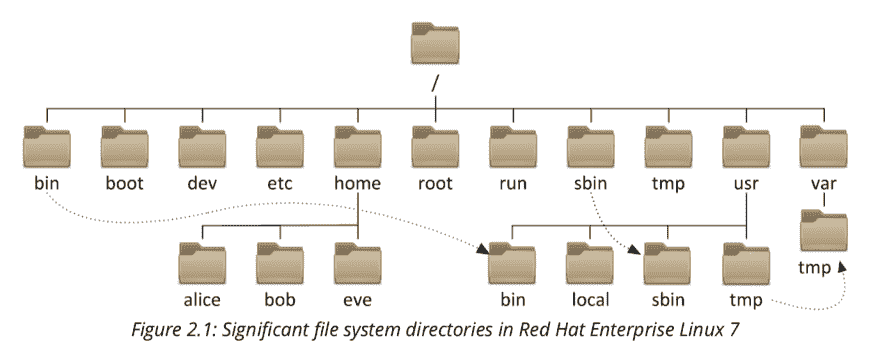

# 了解你的 Linux 01:目录结构

> 原文：<https://dev.to/bassemibrahim/know-your-linux-01-directory-structure-ad6>

您好，欢迎来到“了解您的 Linux”系列的第一篇文章。我最近完成了一个 Redhat 课程，我想和你分享我学到的东西。我们将讨论几个话题。现在，我不知道这个系列会有多少帖子。让我们开始吧，看看会怎么样。🏄‍♂️

首先，让我们谈谈 Linux 的目录结构。一开始确实会让人迷惑😵，尤其是像我这样出身 windows 背景的人。不要慌！一旦你了解它。感觉一点也不差。😷

此图显示了 Redhat Enterprise Linux 的目录结构。这是 Red Hat 为商业市场开发的 Linux 发行版。不同发行版之间的目录结构可能略有不同。此外，不同的发行版可能以不同的方式使用某个目录。但是我们将讨论最常见的目录及其最常见的用例。🧐

### bin:

二进制的缩写，是应用程序的另一种说法。在 Linux 中有一条规则“一切都是文件”，即使是 shell 命令。该文件夹包含最基本的二进制文件，不需要超级用户权限就可以像 cat 或 ls 一样运行。

### sbin :

系统二进制文件的缩写，该文件夹包含需要 root 权限才能运行的二进制文件，如 ifconfig 或 fdisk。

### 开机:

该文件夹包含系统启动所需的所有内容。引导装载程序。通常，你不需要在那里玩。

### 开发:

你还记得“一切都是文件”这条规则吗？这也适用于你的硬盘、闪存或🖨️.打印机等设备 Linux 为每个设备创建一个文件，并在以后使用它与该设备进行交互。该文件夹包含所有设备。通常，所有应用程序都需要访问此处。

### [有个 T1:](#var-)

特定于此系统的变量数据，应该在两次引导之间保持。动态变化的文件，例如:数据库，缓存目录，日志文件和网站内容。

### 等:

有人说它是“等等”的缩写，有人说它是“编辑到配置”的缩写。这是您所有系统级配置所在的位置。例如，如果您正在启动一个 apache web 服务器，您需要到这里来配置它。可以在每个用户的目录中找到另一个 etc 文件夹，用于用户范围的配置。作为一名开发者，我可以说你将会在这个目录中度过一段美好的时光。

### tmp:

临时文件的全局可写空间。X 天内未被访问、更改或修改的文件将从该目录中自动删除。

### 首页:🏠

每个用户👱🏼在这个主目录下有他自己的个人文件夹。这个文件夹包含他的个人文件和用户范围的配置。每个用户只能访问自己的文件夹。🔐

### 词根:

这充当管理超级用户 root 的主目录。👴🏼

### lib:

在这里，你可以找到图书馆。这些是应用程序用来完成特定功能的文件。

### 运行:

这个目录不是永久的，这意味着它会在重启时被清除。它包含服务和流程的运行时数据。

这完全取决于你用 Linux 做什么。如果它是一个 web 服务器，你通常需要在 var 和 etc 目录中运行。如果是你的个人电脑，你会花很多时间在主目录上。

明白我的意思吗？希望不要再觉得太混乱了。让我知道，你会吗？

你最常用哪些目录？

如果你喜欢这篇文章，请告诉我！您也可以检查系列中的下一个条目。

## 文章不再可用

以 always 为例，t0±t1±happe code & & & & & & &