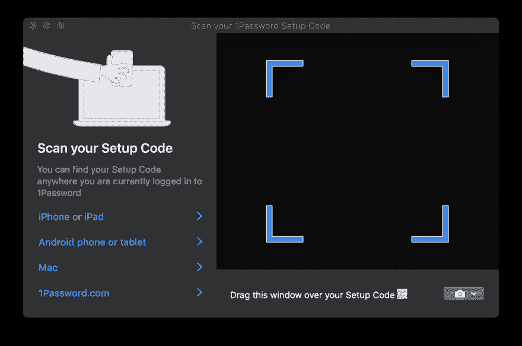

# 屏幕截图 API 简介-在浏览器中扫描二维码

> 原文：<https://dev.to/al_khovansky/intro-to-screen-capture-api-scanning-qr-codes-bgi>

###### 封面图片由[连浩渠](https://unsplash.com/@lianhao)

## 前言

在这篇我们将要讨论的小文章中，你猜对了，截屏 API。很难称之为“新”API，因为它的规范可以追溯到 2014 年的**。但是，即使仍然缺乏浏览器支持，在不需要支持各种浏览器的个人项目中试验或使用它看起来也是一件有趣的事情。**

 **以下是一些 tldr 链接，帮助我们开始学习:

*   [完整规格](https://www.w3.org/TR/screen-capture/)
*   [MDN 使用指南](https://developer.mozilla.org/en-US/docs/Web/API/Screen_Capture_API/Using_Screen_Capture)
*   [演示我们即将实施的内容](https://khovansky.me/demos/live-qr/)

如果链接停止工作，最终产品应该如何工作:

[](https://res.cloudinary.com/practicaldev/image/fetch/s--vGNoXW3G--/c_limit%2Cf_auto%2Cfl_progressive%2Cq_66%2Cw_880/https://thepracticaldev.s3.amazonaws.com/i/8uzbfjocz9lfqocbdivi.gif)

让我们开始建造吧。

## 为什么

最近，我想到了一个使用二维码的特定网络应用。虽然它们适用于在现实世界中传输复杂的数据，你可以将移动设备指向它们，但当你将它们显示在桌面设备的屏幕上，并且需要在该设备上将信息编码到其中时，它们就不那么容易使用了。你必须保存图像或制作截图，找到识别服务，上传你的截图。咩。

一些供应商，例如， **1Password** 已经找到了一种在桌面上使用二维码的方法，既有趣又简单，还有点神奇。如果你不熟悉它——它们有一个透明的模态窗口出现在屏幕上。你把它拖到你的二维码上，嘣！您已经添加了一个帐户！或者别的什么。这是它的样子。

[](https://res.cloudinary.com/practicaldev/image/fetch/s--UaOFd3YE--/c_limit%2Cf_auto%2Cfl_progressive%2Cq_auto%2Cw_880/https://thepracticaldev.s3.amazonaws.com/i/ki4shg42yoqsswsn2cur.png)

相当整洁。但是我们不能让浏览器窗口捕捉它下面的任何东西。或者我们可以吗？

## Enter getDisplayMedia

嗯，算是吧。这就是屏幕捕捉 API 及其唯一成员`getDisplayMedia`发挥作用的地方。这有点像`getUserMedia`,但用于用户的屏幕而不是相机。不幸的是，浏览器对这种 API 的支持要少得多，但是，根据 MDN 的说法，Firefox，Chrome，Edge(方法的非标准位置)+ Edge Mobile 和… Opera for Android 都支持屏幕捕捉 API。

在这家通常由大演员组成的公司中，有一组特殊的移动用户代理。

现在，API 本身非常简单。它的工作方式与`getUserMedia`相同，但允许你从屏幕上捕捉视频，或者更具体地说，从一个定义的**显示表面**:

*   一个**监视器**(整个屏幕)
*   特定应用程序的一个**窗口**或所有窗口
*   文档形式的**浏览器**。在 Chrome 中，这意味着每个单独的打开标签。在 FF 中，这个选项似乎是缺乏的

这意味着我们可以从其中任何一个获取视频，并按照我们想要的方式解析它。做类似于谷歌翻译相机正在做的活文本识别和修改或许多其他很酷的事情。我将把发明部分留给读者。最棒的是——与许多其他浏览器 API 不同，我们并没有完全被禁锢在浏览器中(我并不是主张赋予浏览器这样的权力，不)。

## 布线完毕

因此，我们掌握了实时截屏的能力。我们如何利用它？

我们会用`<video>`和`<canvas>`搭配一些 JS 胶。从较高的层面来看，该流程如下所示:

*   将流送入`<video>`
*   用设定的刷新率将帧从`<video>`画成`<canvas>`
*   使用`getImageData`从`<canvas>`中抓取`ImageData`

这听起来可能有点奇怪，但据我所知，这是一种非常流行的方法，也常用于与我们的另一个朋友`getUserMedia`从相机中抓取素材。

省略所有启动流和抓取帧的设置代码——有意义的部分如下:

```
async function run() {
  const video = document.createElement('video');
  const canvas = document.createElement('canvas');
  const context = canvas.getContext('2d');

  const displayMediaOptions = {
    video: {
      cursor: "never"
    },
    audio: false
  }

  video.srcObject = await navigator.mediaDevices.getDisplayMedia(displayMediaOptions);

  const videoTrack = video.srcObject.getVideoTracks()[0];
  const { height, width } = videoTrack.getSettings();

  context.drawImage(video, 0, 0, width, height);
  return context.getImageData(0, 0, width, height);
}

await run(); 
```

Enter fullscreen mode Exit fullscreen mode

如前所述——这里我们创建了我们的`<video>`和`<canvas>`,并获得了一个`CanvasRenderingContext2D`。

然后，我们为我们的捕获请求定义[约束](https://developer.mozilla.org/en-US/docs/Web/API/MediaStreamConstraints)。不是很多。我们不需要光标，也不需要音频。虽然在写这篇文章的时候，没有人支持屏幕捕捉中的音频捕捉。

之后，我们将结果`MediaStream`与我们的`<video>`挂钩。注意`getDisplayMedia`返回一个承诺，因此在示例代码中等待。

最后，我们从视频轨道获得实际的视频馈送尺寸，将帧绘制到画布上，并将其提取为 ImageData。

现在，在现实世界中，您可能希望循环处理帧，而不是一次处理，等待特定数据出现在帧中，或者连续处理一些数据。这有一些注意事项。

当有人提到“在后台连续循环处理某些东西”时，首先想到的可能是`requestAnimationFrame`。不幸的是，在这种情况下，这不是正确的选择。你看，当标签进入背景时，浏览器倾向于暂停你的 rAF 循环，这是所有工作发生的地方。

因此，我们将使用老式的`setInterval`而不是英国皇家空军。虽然仍然有一个陷阱。一个`setInterval`循环在后台的运行频率不能超过每 1000 毫秒运行一次*。但是，我想这对于大多数目的来说已经足够了。*

您现在可能已经猜到了——此时，帧可以被发送到任何处理管道。在我们的例子中，是指 [jsQR](https://github.com/cozmo/jsQR) 。它使用起来非常简单:你只需提供`ImageData`、宽度和高度，如果图像中有二维码，你就会得到一个带有识别数据的 JS 对象。所以您可以用一个简单的
来扩充前面的例子

```
const imageData = await run();
const code = jsQR(imageData.data, streamWidth, streamHeight); 
```

Enter fullscreen mode Exit fullscreen mode

完成了！

## 包起来

我认为将它封装到一个 npm 模块中可能很好，这样可以省去自己设置一切的麻烦。现在它非常简单——它在一个循环中将数据发送到您提供的回调中，并且只接受一个额外的选项——捕获之间的间隔。我会看看扩展功能是否有意义。

这个包叫做`stream-display` : [NPM](https://www.npmjs.com/package/stream-display) | [Github](https://github.com/khovansky-al/stream-display) 。

核心模块没有包含任何解析器，所以请自带。使用这个库，你必须写的所有代码都可以归结为:

```
const callback = imageData => {...} // do whatever with those images
const capture = new StreamDisplay(callback); // specify where the ImageData will go
await capture.startCapture(); // when ready
capture.stopCapture(); // when done 
```

Enter fullscreen mode Exit fullscreen mode

为了展示这篇文章背后的想法，我制作了这个小演示。也有[码笔](https://codepen.io/alx-khovansky/pen/OeYmRG)格式供快速实验使用。它使用前面提到的模块。

## 测试笔记

用这些代码创建一个库迫使我思考如何测试依赖于这个 API 的代码。

我想避免下载 50 MB 的无头 Chrome 来运行一些小测试，结果我使用了`tape`并手动嘲笑一切。起初这可能看起来很乏味，但最终你真的只需要模仿以下内容:

*   `document`和 DOM 元素。我使用了 [jsdom](https://github.com/jsdom/jsdom)
*   jsdom 中没有实现的一些方法— `HTMLMediaElement#play`、`HTMLCanvasElement#getContext`和`navigator.mediaDevices#getDisplayMedia`
*   时空连续体。我用的是[兴农](https://github.com/sinonjs/sinon)的`useFakeTimers`，引擎盖下调用`lolex`。它配备了`setInterval`、`requestAnimationFrame`和所有其他基于时间的东西的替代品，可以用一个神奇的时间遥控器精确控制。跳过毫秒，跳到下一个计时器，跳到下一个滴答，你说吧。但是有一个警告:如果你在 jsdom 之前启用了自定义定时器——由于 jsdom 试图基于时间初始化一些东西，宇宙将会冻结。

对于所有需要跟踪的伪方法，我也使用了 sinon。其他方法使用普通的 JS 函数。当然，您可以使用任何您已经最熟悉的工具。最终结果可以在库的 git repo 中看到。这可能并不漂亮，但它似乎是有效的，应该给你一个想法。

## 结论

它不像本文开头描述的桌面解决方案那样优雅，但我确信 web 最终会实现。让我们只希望当时间到来时，浏览器可以真正看穿他们的窗口——它将得到适当的保护，你将完全控制这样的功能。但是现在请记住，当你通过屏幕共享 API 共享你的屏幕时，有人可以解析上面的任何内容，所以不要分享超过你感到舒适的内容，并远离你的密码管理器。

不管怎样，我希望你今天学会了一个新把戏。如果你有其他的应用方法，请分享。下次见！**