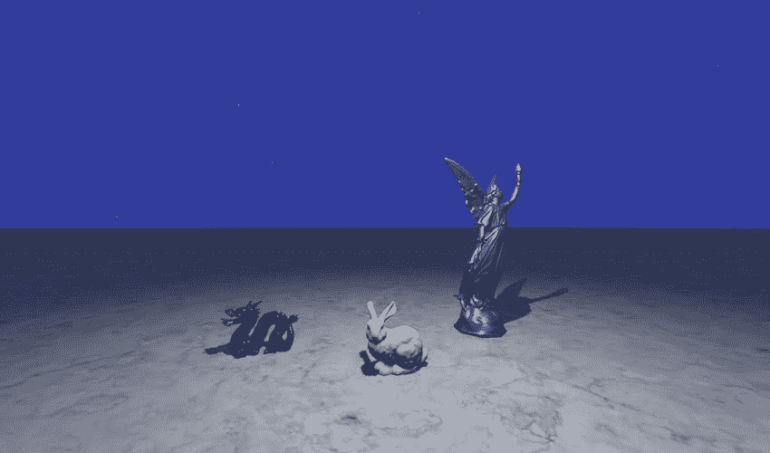
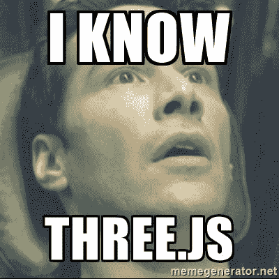

# 带有三个. js 的基于物理的场景

> 原文：<https://dev.to/chicio/a-physically-based-scene-with-three-js-9gf>

在这篇文章中，我将向你展示如何使用 three.js 创建一个支持物理渲染的场景。

我喜欢 three.js，我认为它是最漂亮的 javascript 和计算机图形库之一。你不知道什么是 three.js 吗？让我们看看来自[官方 github 回购](https://github.com/mrdoob/three.js/)的描述:

> JavaScript 3D 库。该项目的目的是创建一个易于使用的，轻量级的，三维图书馆。库
> 提供 canvas、svg、CSS3D 和 WebGL 渲染器。

简单明了(我喜欢这种定义😌).Three.js 是一个构建在 WebGL 之上的库，旨在
简化 web 的计算机图形开发。它有很多不同的特性，包括支持
[基于物理的渲染](https://en.wikipedia.org/wiki/Physically_based_rendering)。
让我们看看这个图书馆的潜力。在这篇文章中，我将向你展示如何创建一个简单物理场景。在这篇文章的最后，你将会创建一个如下图所示的场景:

[](https://res.cloudinary.com/practicaldev/image/fetch/s--Hw7SQn7L--/c_limit%2Cf_auto%2Cfl_progressive%2Cq_auto%2Cw_880/https://www.fabrizioduroni.it/asseimg/posts/threejs-scene.jpg)

我们将使用的网格是从斯坦福扫描库获得的 PLY 格式网格的简化版本。

让我们从设置开始。我们可以使用一个简单的 html 页面，类似于 three.js 文档中描述的页面(如下所示)。我们将把我们的资产(网格，纹理等。)在文件夹`/assets/models`里。

```
<!DOCTYPE html>
<html>
    <head>
        <meta charset=utf-8>
        <title>My first three.js app</title>
        <style>
            body { margin: 0; }
            canvas { width: 100%; height: 100% }
        </style>
    </head>
    <body>
        <script src="js/three.js"></script>
        <script>
            // Our Javascript will go here.
        </script>
    </body>
</html> 
```

<svg width="20px" height="20px" viewBox="0 0 24 24" class="highlight-action crayons-icon highlight-action--fullscreen-on"><title>Enter fullscreen mode</title></svg> <svg width="20px" height="20px" viewBox="0 0 24 24" class="highlight-action crayons-icon highlight-action--fullscreen-off"><title>Exit fullscreen mode</title></svg>

我们首先需要创建一个`Scene`。我们还需要创建一个`Camera`、一个用于纹理加载的`TextureLoader`、一个用于加载层网格的
和一个`WebGLRenderer`。最后，我们需要一个`OrbitControls`的实例，一个 three.js 扩展，我们用它来环绕场景。

```
var scene = new THREE.Scene();
var camera = createCamera();
var textureLoader = new THREE.TextureLoader();
var plyLoader = new THREE.PLYLoader();
var renderer = createRenderer();
var controls = createOrbitsControls(camera, renderer); 
```

<svg width="20px" height="20px" viewBox="0 0 24 24" class="highlight-action crayons-icon highlight-action--fullscreen-on"><title>Enter fullscreen mode</title></svg> <svg width="20px" height="20px" viewBox="0 0 24 24" class="highlight-action crayons-icon highlight-action--fullscreen-off"><title>Exit fullscreen mode</title></svg>

对于摄像机，我们创建一个`PerspectiveCamera`。顾名思义，它使用[透视投影](https://en.wikipedia.org/wiki/3D_projection#Perspective_projection)来模拟人眼视图(这是计算机图形学中使用的两种主要相机类型之一
和[正交投影](https://en.wikipedia.org/wiki/3D_projection#Orthographic_projection))。
我们将摄像机放在场景前面，我们将视见体的垂直[视野 FOV](https://en.wikipedia.org/wiki/Field_of_view_in_video_games) 设置为 75 度，使用当前
窗口的宽度和高度的纵横比，视见体的[近平面和远平面](https://en.wikipedia.org/wiki/Viewing_frustum)分别设置为 0.1 和 1000(以避免丢弃添加到场景中的网格)。

```
function createCamera() {
    var camera = new THREE.PerspectiveCamera(75, window.innerWidth/window.innerHeight, 0.1, 1000);
    camera.position.z = 8;
    camera.position.y = 0;
    camera.position.x = 0;

    return camera;
} 
```

<svg width="20px" height="20px" viewBox="0 0 24 24" class="highlight-action crayons-icon highlight-action--fullscreen-on"><title>Enter fullscreen mode</title></svg> <svg width="20px" height="20px" viewBox="0 0 24 24" class="highlight-action crayons-icon highlight-action--fullscreen-off"><title>Exit fullscreen mode</title></svg>

我们创建一个 alpha 属性设置为 true 的渲染器，以防我们想要集成到另一个 HTML 页面中，并且我们想要
在场景加载之前背景是可见的。我们通过将属性`gammaInput`和`gammaOutput`设置为真来设置输入和输出颜色的[伽马校正](https://en.wikipedia.org/wiki/Gamma_correction)。我们
也通过设置`shadowMap.enabled`为真来启用阴影贴图，设置它使用[百分比接近过滤](https://fabiensanglard.net/shadowmappingPCF/)和[双线性过滤](https://en.wikipedia.org/wiki/Bilinear_filtering)。最后，我们将渲染器的大小设置为与显示场景的窗口大小相同。

```
function createRenderer() {
    var renderer = new THREE.WebGLRenderer({alpha: true});
    renderer.physicallyCorrectLights = true;
    renderer.gammaInput = true;
    renderer.gammaOutput = true;
    renderer.shadowMap.enabled = true;
    renderer.shadowMap.bias = 0.0001;
    renderer.shadowMap.type = THREE.PCFSoftShadowMap;
    renderer.setSize($(window).width(), $(window).height());

    return renderer;
} 
```

<svg width="20px" height="20px" viewBox="0 0 24 24" class="highlight-action crayons-icon highlight-action--fullscreen-on"><title>Enter fullscreen mode</title></svg> <svg width="20px" height="20px" viewBox="0 0 24 24" class="highlight-action crayons-icon highlight-action--fullscreen-off"><title>Exit fullscreen mode</title></svg>

接下来，我们设置`OrbitControls`实例来管理围绕场景的自动旋转。您可以自定义此功能
让用户通过键盘或触摸控制(在手机上)来管理移动📱).

```
function createOrbitsControls(camera, renderer) {
    var controls = new THREE.OrbitControls(camera, renderer.domElement);
    controls.enableZoom = false;
    controls.autoRotate = true;
    controls.enablePan = false;
    controls.keyPanSpeed = 7.0;
    controls.enableKeys = false;
    controls.target = new THREE.Vector3(0, 0, 0);
    controls.mouseButtons = {};
    controls.dispose();

    return controls;
} 
```

<svg width="20px" height="20px" viewBox="0 0 24 24" class="highlight-action crayons-icon highlight-action--fullscreen-on"><title>Enter fullscreen mode</title></svg> <svg width="20px" height="20px" viewBox="0 0 24 24" class="highlight-action crayons-icon highlight-action--fullscreen-off"><title>Exit fullscreen mode</title></svg>

现在，我们可以将渲染器添加到页面的 DOM 中(我们将它附加到正文中)。我们现在可以通过将背景颜色设置为 indaco (0x303F9F)来开始定制场景
(记住:在 three.js 中设置颜色的推荐方式是通过十六进制
值)。然后我们可以添加主光源和半球光源。

```
//Add rendering dom element to page.
document.body.appendChild(renderer.domElement);

//Setup scene.
scene.background = new THREE.Color(0x303F9F);
scene.add(createLight());
scene.add(createHemisphereLight()); 
```

<svg width="20px" height="20px" viewBox="0 0 24 24" class="highlight-action crayons-icon highlight-action--fullscreen-on"><title>Enter fullscreen mode</title></svg> <svg width="20px" height="20px" viewBox="0 0 24 24" class="highlight-action crayons-icon highlight-action--fullscreen-off"><title>Exit fullscreen mode</title></svg>

我们使用`PointLight`类创建主光源作为点光源。在构造函数中，我们将其颜色设置为白色，
将其强度设置为 1(默认)，20 为距离灯光的距离，其中强度为 0，最后衰减为 2 (
这是灯光沿灯光距离变暗的量，对于物理基础灯光，必须将[设置为 2)。

然后，我们将它的功率设置为与 100 瓦灯泡相同(](https://threejs.org/docs/index.html#api/lights/PointLight) [1700 流明](http://www.power-sure.com/lumens.htm) )
的光，并将它放置在场景上方，以创建某种街灯效果(来自上方的光束)。我们还通过将`castShadow`设置为 true 来激活
投射生成阴影的能力，我们强制阴影贴图大小为 512x512 像素(为了
提高性能，因为默认值是 1024 ),我们通过将`radius`属性设置为 1.5 来给阴影一点模糊。
我们还为灯光创建了一个几何体和一个材质:

*   几何体是半径为 0 的球体
*   该材料是完全基于物理的发射材料

事实上，`MeshStandardMaterial`是基于物理的材质的 three.js 实现(所以它是真实的:three.js rocks 与
基于物理的渲染😮).

```
function createLight() {
    var lightGeometry = new THREE.SphereGeometry(0);

    var lightMaterial = new THREE.MeshStandardMaterial({
        emissive: 0xffffee,
        emissiveIntensity: 1,
        color: 0x000000
    });

    var light = new THREE.PointLight(0xffffff, 1, 20, 2);
    light.power = 1700;
    light.castShadow = true;
    light.shadow.mapSize.width = 512;
    light.shadow.mapSize.heigth = 512;
    light.shadow.radius = 1.5;

    light.add(new THREE.Mesh(lightGeometry, lightMaterial));
    light.position.set(0, 5, 3);

    return light;
} 
```

<svg width="20px" height="20px" viewBox="0 0 24 24" class="highlight-action crayons-icon highlight-action--fullscreen-on"><title>Enter fullscreen mode</title></svg> <svg width="20px" height="20px" viewBox="0 0 24 24" class="highlight-action crayons-icon highlight-action--fullscreen-off"><title>Exit fullscreen mode</title></svg>

对于半球光源，我们使用`HemisphereLight`类来创建它。
我们设置天空颜色为深蓝色(0x303F9F)，地面颜色为黑色(0x000000)，强度为 1。

```
function createHemisphereLight() {
    return new THREE.HemisphereLight(0x303F9F, 0x000000, 1);
} 
```

<svg width="20px" height="20px" viewBox="0 0 24 24" class="highlight-action crayons-icon highlight-action--fullscreen-on"><title>Enter fullscreen mode</title></svg> <svg width="20px" height="20px" viewBox="0 0 24 24" class="highlight-action crayons-icon highlight-action--fullscreen-off"><title>Exit fullscreen mode</title></svg>

现在我们可以开始添加星星，层网模型和地板网模型。每个网格模型在其加载方法结束时被添加到场景
中。

```
//Load models.
loadStars(textureLoader, function (stars) {
    scene.add(stars);
});

loadPlyModelUsingPhysicalMaterial(
    plyLoader,
    'assets/models/lucy.ply',
    {
        color: 0x3F51B5,
        roughness: 0.5,
        metalness: 0.7,
        clearCoat: 0.5,
        clearCoatRoughness: 0.5,
        reflectivity: 0.7
    },
    new THREE.Vector3(3, -3, 0),
    new THREE.Vector3(0, -Math.PI / 3.0, 0),
    function (mesh) {

        scene.add(mesh);
    }
);

loadPlyModelUsingPhysicalMaterial(
    plyLoader,
    'assets/models/dragon.ply',
    {
        color: 0x448AFF,
        roughness: 0.1,
        metalness: 0.9,
        clearCoat: 0.0,
        clearCoatRoughness: 0.2,
        reflectivity: 1
    },
    new THREE.Vector3(-3, -3, 0),
    new THREE.Vector3(0, -Math.PI, 0),
    function (mesh) {

        scene.add(mesh);
    }
);

loadPlyModelUsingPhysicalMaterial(
    plyLoader,
    'assets/models/bunny.ply',
    {
        color: 0xCCFFFF,
        roughness: 0.9,
        metalness: 0.1,
        clearCoat: 0.0,
        clearCoatRoughness: 0.5,
        reflectivity: 0.1
    },
    new THREE.Vector3(0, -3, 1.5),
    new THREE.Vector3(0, -Math.PI, 0),
    function (mesh) {

        scene.add(mesh);
    }
);

loadFloor(textureLoader, function (mesh) {
    scene.add(mesh);
}); 
```

<svg width="20px" height="20px" viewBox="0 0 24 24" class="highlight-action crayons-icon highlight-action--fullscreen-on"><title>Enter fullscreen mode</title></svg> <svg width="20px" height="20px" viewBox="0 0 24 24" class="highlight-action crayons-icon highlight-action--fullscreen-off"><title>Exit fullscreen mode</title></svg>

对于星星，我们使用`textureLoader`来加载一个圆形 png 纹理。当纹理加载完成后，我们创建了
许多位置随机的`Geometry`对象。我们也使用从加载器获得的纹理创建材质(并且
我们在它上面设置了一个透明背景)。现在我们可以使用特定的 three.js 类创建一些`Points`对象。

```
function loadStars(textureLoader, completeLoad) {
    textureLoader.load("assets/models/textures/circle.png", function (texture) {
        var starsGeometry = new THREE.Geometry();

        for (var i = 0; i < 10000; i++) {

            var star = new THREE.Vector3();
            star.x = 2000 * Math.random() - 1000;
            star.y = 2000 * Math.random();
            star.z = 2000 * Math.random() - 1000;

            starsGeometry.vertices.push(star)
        }

        var starsMaterial = new THREE.PointsMaterial({
            color: 0x888888,
            map: texture,
            transparent: true,
        });

        var stars = new THREE.Points(starsGeometry, starsMaterial);

        completeLoad(stars);
    });
} 
```

<svg width="20px" height="20px" viewBox="0 0 24 24" class="highlight-action crayons-icon highlight-action--fullscreen-on"><title>Enter fullscreen mode</title></svg> <svg width="20px" height="20px" viewBox="0 0 24 24" class="highlight-action crayons-icon highlight-action--fullscreen-off"><title>Exit fullscreen mode</title></svg>

对于板层模型，我们使用板层加载器来获得相应的几何图形。然后我们使用收到的参数
创建一个`MeshPhysicalMaterial`。我们还设置网格的位置和旋转，并使用`updateMatrix()`方法强制更新局部变换
。我们设置`castShadow`为真，因为我们需要在阴影贴图中考虑这个网格。
我们最后还将`matrixAutoUpdate`设置为 false，因为我们不需要重新计算网格
在每一帧上的位置(我们的网格是静态的)。

```
function loadPlyModelUsingPhysicalMaterial(plyLoader, path, parameters, position, rotation, completeLoad) {
    plyLoader.load(path, function (geometry) {
        var material = new THREE.MeshPhysicalMaterial(parameters);
        var mesh = new THREE.Mesh(geometry, material);
        mesh.position.set(position.x, position.y, position.z);
        mesh.rotation.set(rotation.x, rotation.y, rotation.z);
        mesh.castShadow = true;
        mesh.matrixAutoUpdate = false;
        mesh.updateMatrix();

        completeLoad(mesh);
    });
} 
```

<svg width="20px" height="20px" viewBox="0 0 24 24" class="highlight-action crayons-icon highlight-action--fullscreen-on"><title>Enter fullscreen mode</title></svg> <svg width="20px" height="20px" viewBox="0 0 24 24" class="highlight-action crayons-icon highlight-action--fullscreen-off"><title>Exit fullscreen mode</title></svg>

对于地板，我们再次使用`textureLoader`来加载大理石表面的纹理。然后我们将`wrapS`和`wrapT`
属性设置为`RepeatWrapping`，让纹理在整个表面上重复。然后我们创建一个`MeshStandardMaterial`，
，它是`MeshPhysicalMaterial`的基础材质，所以它也是一个基于物理的材质。我们最后也在这里设置
位置，旋转和`matrixAutoUpdate`为假。

```
function loadFloor(textureLoader, completionFunction) {
    textureLoader.load("assets/models/textures/marble.jpg", function (texture) {
        texture.wrapS = THREE.RepeatWrapping;
        texture.wrapT = THREE.RepeatWrapping;
        texture.repeat.set(100, 100);

        var floorMat = new THREE.MeshStandardMaterial({
            roughness: 0.7,
            metalness: 0.1,
            map: texture
        });

        var floorGeometry = new THREE.PlaneGeometry(1000, 1000);
        var floorMesh = new THREE.Mesh(floorGeometry, floorMat);
        floorMesh.receiveShadow = true;
        floorMesh.rotation.x = -Math.PI / 2.0;
        floorMesh.position.y = -3;
        floorMesh.matrixAutoUpdate = false;
        floorMesh.updateMatrix();

        completionFunction(floorMesh);
    });
} 
```

<svg width="20px" height="20px" viewBox="0 0 24 24" class="highlight-action crayons-icon highlight-action--fullscreen-on"><title>Enter fullscreen mode</title></svg> <svg width="20px" height="20px" viewBox="0 0 24 24" class="highlight-action crayons-icon highlight-action--fullscreen-off"><title>Exit fullscreen mode</title></svg>

我们准备渲染我们的场景。我们只需要用下面的代码创建[渲染循环](https://users.iit.uni-miskolc.hu/~mileff/graphics/GraphicsChapter5.pdf):

```
var render = function () {
    requestAnimationFrame(render);
    controls.update();
    renderer.render(scene, camera);
}; 
```

<svg width="20px" height="20px" viewBox="0 0 24 24" class="highlight-action crayons-icon highlight-action--fullscreen-on"><title>Enter fullscreen mode</title></svg> <svg width="20px" height="20px" viewBox="0 0 24 24" class="highlight-action crayons-icon highlight-action--fullscreen-off"><title>Exit fullscreen mode</title></svg>

整个场景代码在[这个 url](https://gist.github.com/chicio/af13397f22c21a05b6ac007c83f84403.js)

耶！！！你成功了！！您可以使用 three.js 创建一个 3D 计算机图形 web 应用程序😊！！这也是一个支持高级功能的场景，特别是基于物理的渲染😮！！

[](https://res.cloudinary.com/practicaldev/image/fetch/s--O_KM-_UN--/c_limit%2Cf_auto%2Cfl_progressive%2Cq_auto%2Cw_880/https://www.fabrizioduroni.it/asseimg/posts/i-know-threejs.jpg)

你现在知道 three.js 了。你已经准备好征服网络 3D 世界了😏。啊！！我忘记了:你可以在我的网站的[主页上找到我们创建的场景的现场演示。](https://www.fabrizioduroni.it/)

*原载于[https://www . fabrizioduroni . it](https://www.fabrizioduroni.it/2017/05/13/first-threejs-scene.html)2017 年 5 月 13 日。*