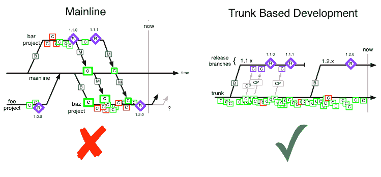

# 反对拉请求的理由(以及如何解决它们)

> 原文：<https://dev.to/shubhamjain/the-case-against-pull-requests-and-how-to-fix-it-533g>

拉取请求是一种行业标准，但是如果替代方案更好呢？

你曾经如此强烈地坚持一种观点，以至于忽略了任何证明它是错误的东西吗？

我犯这种错误的次数比我愿意承认的要多得多。在我尝试之前，我不相信[实用 CSS](https://dev.to/mzanggl/utility-first-css-you-have-to-try-it-first-3m85) 是一个荒谬的想法。很快，我意识到我一直在浪费时间一次又一次地编写不必要的 CSS。

如果我们质疑这些假设——我经常称之为陷阱——我们就会意识到在做平凡的、重复的工作时会损失多少生产力。

这给了我一个很好的例子:**拉请求**。Github 的兴起使它们几乎成为了如何进行开发的行业标准。开发人员为他们的变更和文件请求创建分支，以便将它们合并。

很简单，不是吗？对于一个接受贡献的稳定开源项目，答案是肯定的。这是这类项目的理想工作流程。但是拉请求失败的地方，开发人员是需要敏捷性的项目。在一个快节奏的环境中，他们对开发者的效率征收重税。

考虑一个例子:你是一个小团队的一部分，你必须修复你的应用程序中的一个链接，拉请求工作流看起来像什么？

1.  从主目录创建新的分支。
2.  签出新创建的分支。
3.  创建并推送您的修复提交。
4.  如果一切正常，提交一个拉取请求。
5.  检查并合并它。
6.  切换回主模式。

与此同时，您的分支可能会落后于 master，需要您确保仍然保持同步。对于微小的修复，开发人员必须经历多个重复的步骤。想象一下，做几个这样的修复——纠正拼写，修复 CSS 错误——并且创建、检出、同步分支本身就是你的一大块工作。

你可以批量修改，但是总是很难预测它们(难怪你有像`bug-fixes`这样的分支)。另外一个问题是，创建发布分支并将它们合并回主版本会增加额外的开销。

当然，你应该有人审查你的代码，但是为小的变更创建分支的整个开销是可怕的——正如我们将看到的，是可以避免的。

* * *

谷歌 Chromium 团队的工作流程完全不同。他们的开发者根本不创建分支；每个人都在同一个分支上提交，即主分支。在的一篇文章中，Chrome 团队的开发人员 Aaron Boodman 写道:

> 在许多项目中，将源代码分支来处理主要的新特性是很常见的。
> 
> …
> 
> 这在 Chrome 中是行不通的，因为我们每天都在发布。我们不能容忍大量的新代码突然出现在主干中，因为它很有可能长时间关闭金丝雀或开发通道。此外，Chrome 的主干移动如此之快，以至于开发人员长时间孤立在一个分支上是不现实的。当它们合并时，trunk 看起来会有很大的不同，以至于集成会很困难并且容易出错。

(顺便说一句，这也叫[基于主干的开发](https://trunkbaseddevelopment.com/))。

这个想法听起来可能令人震惊，但很有道理。谷歌 Chrome 发展速度很快，孤立的分支很难让多个开发者保持同步。保持一切都在掌控之中可以确保“所有的开发人员总是使用最新的和最好的资源。”发布是从 master 中的提交中挑选出来的。下面是它可能的样子:

— [来源](https://paulhammant.com/2014/01/08/googles-vs-facebooks-trunk-based-development/)

但是未完成的特性呢？它们受到标志/开关的保护。代码已经发布，但是最终用户看不到它，直到打开标志。这种做法不仅仅是 Chrome 团队特有的，在脸书和谷歌公司都有大规模的实践。

> 脸书有一个他们称之为“看门人”的工具，允许他们控制谁可以在任何给定的时间看到服务上的代码。正如 Rossi 指出的，现在 Facebook.com 已经有了脸书在未来六个月甚至更长时间内将要推出的每一个重大项目的代码！是看门人阻止我们看到它。
> 
> — [未来 6 个月的功能现在就在脸书的代码中(但我们看不到)](https://techcrunch.com/2011/05/30/facebook-source-code/)

还有另一个方面:代码审查。它们不是基于分支，而是基于提交。当一个开发人员提交一个提交时，他们需要让具有相同关注领域的其他人来审查它。当它被批准后，它可以被合并。

总之:每个人都在 master 上提交，未完成的特性被标志隐藏，代码审查是基于提交的。

* * *

与拉请求相比，这种模型在许多方面都更优越。

1.  它避免了创建分支和合并分支的开销(和认知负荷)。
2.  它极大地减少了混乱冲突的机会。
3.  发布工作流要简单得多，因为您可以从 master 中选择一个提交，并将其标记为发布。
4.  使代码评审基于提交确保评审者更容易评审变更(与大量的拉请求相反)。

主要的区别在于，您将提交视为变更的单元，而不是分支，这就造成了所有的差异。

* * *

下一个问题是，如果你使用 Github/Gitlab，你能采用和 Chromium 团队一样的工作流程吗？

不幸的是，我看不出你怎么能有和谷歌一样风格的代码审查。Gerrit 是一个开源工具，但几乎不可能与 Gitlab/Github 结合使用。它必须安装在服务器上，而且用户界面也不好用。

但是建立一个替代方案是可能的。可以有一个工具，开发人员可以首先将他们更改推送到其他团队成员可以查看的地方。在批准您的更改之前，您不能将您的提交推送到主服务器。

如果有任何建议，开发人员将需要修改提交(使用 amend 或交互式 rebasing)并再次推送。这提供了一个清晰的视图，查看者知道他们的建议是否被采纳。当审阅者批准提交时，可以将其推送到主服务器。

您可以在不牺牲整个设置的情况下获得代码审查的好处。听起来很有趣？我正在做类似的原型。准备好之后，如果你想试用的话，你可以填写这张表格