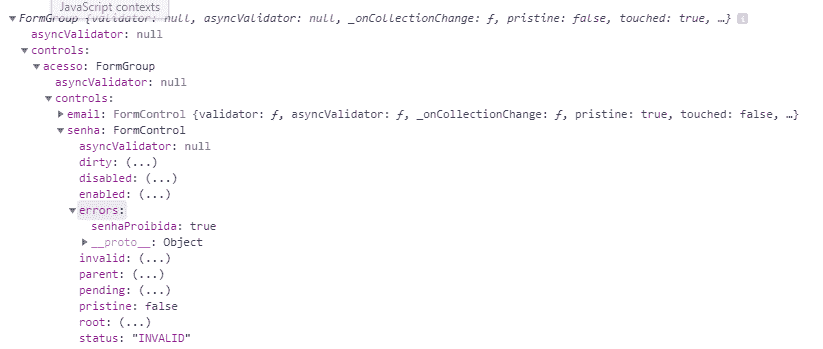
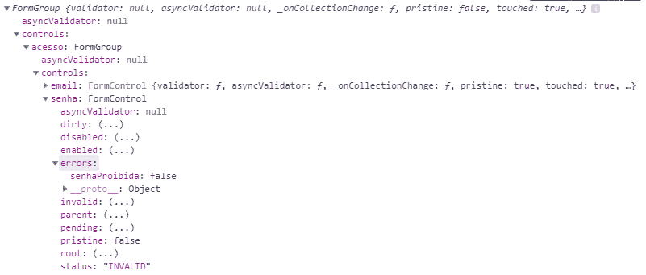
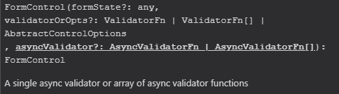

# 自定义验证器和表单试剂-同步和异步！

> 原文：<https://dev.to/felipedsc/custom-validators-com-reactiveforms-sincronos-e-assincronos-573i>

## 导言

**ReactiveForms** 允许我们创建自定义验证，这些验证将像常规验证一样更改表单状态，无论它们是同步还是异步。
我将展示如何根据我在前一篇文章中创建的例子来创建它们:[试剂表单简介！](https://dev.to/felipedsc/introducao-aos-reactive-forms-3ehl)

* * *

## 同步验证

创建了一个名为的验证函数，该函数接收 **FormControl** ，这将是我们将在其中应用该函数的控件。
她基本上是在验证密码是否为**【12345】**，并返回表单将识别为错误的结构。下面我将逐一解释。

```
senhasProibidas(control: FormControl): { [s: string]: boolean } {
  if (control.value === "12345") {
    return { 'senhaProibida': true };
  } else {
    return null;
  }
} 
```

<svg width="20px" height="20px" viewBox="0 0 24 24" class="highlight-action crayons-icon highlight-action--fullscreen-on"><title>Enter fullscreen mode</title></svg> <svg width="20px" height="20px" viewBox="0 0 24 24" class="highlight-action crayons-icon highlight-action--fullscreen-off"><title>Exit fullscreen mode</title></svg>

创建验证方法后，可以将其应用于实例化表单时创建的控件。**请注意，我们在与常见验证**相同的阵列中传递了密码删除功能。

```
this.usuarioForm = new FormGroup({
  "nome": new FormControl("João", [Validators.required]),
  "endereco": new FormControl(),
  "acesso": new FormGroup({
    "email": new FormControl(null, [Validators.required, Validators.email]),
    "senha": new FormControl(null, [Validators.required, Validators.minLength(3), this.senhasProibidas])
  }),
  "genero": new FormControl("M", [Validators.required]),
  "estadoCivil": new FormControl(null, [Validators.required]),
  "telefones": new FormArray([])
}); 
```

<svg width="20px" height="20px" viewBox="0 0 24 24" class="highlight-action crayons-icon highlight-action--fullscreen-on"><title>Enter fullscreen mode</title></svg> <svg width="20px" height="20px" viewBox="0 0 24 24" class="highlight-action crayons-icon highlight-action--fullscreen-off"><title>Exit fullscreen mode</title></svg>

#### 但这是什么回报 **{ [s: string]: boolean }** ？！

在[方括号]之间定义属性时，我们创建了为该对象输入任何键的功能，也可以将其用作一种“技巧”，以便类可以接收任何属性，而不会导致 typescript 出错。与其在返回时创建对象结构，还可以创建一个类，没有任何问题:

```
export class ChaveValor {
  [s: string]: boolean;
} 
```

<svg width="20px" height="20px" viewBox="0 0 24 24" class="highlight-action crayons-icon highlight-action--fullscreen-on"><title>Enter fullscreen mode</title></svg> <svg width="20px" height="20px" viewBox="0 0 24 24" class="highlight-action crayons-icon highlight-action--fullscreen-off"><title>Exit fullscreen mode</title></svg>

#### 为什么值有效时我们返回 null？

检测到错误时，我们返回一个值键**【适当的密码】:true** ，如函数声明中所述。
但是，当值正常时，函数传回 null 而不是**【适当的密码】:false** 。必须返回 null，因为角度将解释该验证中没有错误。

```
 if (control.value === "12345") {
    return { 'senhaProibida': true };
  } else {
    return null;
  } 
```

<svg width="20px" height="20px" viewBox="0 0 24 24" class="highlight-action crayons-icon highlight-action--fullscreen-on"><title>Enter fullscreen mode</title></svg> <svg width="20px" height="20px" viewBox="0 0 24 24" class="highlight-action crayons-icon highlight-action--fullscreen-off"><title>Exit fullscreen mode</title></svg>

我显示了使用 console.log 创建的框架，以查看验证过程。
当我们传回 null 时，我们有下列状态:

[](https://res.cloudinary.com/practicaldev/image/fetch/s--uX1CfsWc--/c_limit%2Cf_auto%2Cfl_progressive%2Cq_auto%2Cw_880/https://thepracticaldev.s3.amazonaws.com/i/psvblt12w37e19k17xjp.PNG)

如果我们有**键:true** ，角度已经确定控件无效:

[](https://res.cloudinary.com/practicaldev/image/fetch/s--k73z9SKp--/c_limit%2Cf_auto%2Cfl_progressive%2Cq_auto%2Cw_880/https://thepracticaldev.s3.amazonaws.com/i/7n6plmubf92nldlpjeqc.PNG)

现在，如果我们有 **key: false** ，控件将检测到 **errors** 中的某个东西，尽管我们希望表明控件是有效的，但当传递某个东西给属性时，角度将认为控件是无效的:

[](https://res.cloudinary.com/practicaldev/image/fetch/s--x-AjjAoY--/c_limit%2Cf_auto%2Cfl_progressive%2Cq_auto%2Cw_880/https://thepracticaldev.s3.amazonaws.com/i/7gh2aacxu2xnbcqln5ka.PNG)

* * *

## 异步验证

创建了一个函数，在检测到错误时将返回键和布尔值，而在没有错误时将返回 nulo，但是，此返回必须采取如下形式:**observable**(也可以是**promise**)。
在功能上，用 **setTimeout** 模拟了对服务器的请求，以验证输入的电子邮件是否为**[【email @ prohibit . com】](mailto:email@proibido.com)** 

```
emailsProibidos(control): Observable<{ [s: string]: boolean }> {
  return new Observable<{ [s: string]: boolean }>(observer => {
    setTimeout(() => {
      if (control.value == "email@proibido.com") {
        observer.next({ "emailProibido": true });
      } else {
        observer.next(null);
      }
      observer.complete();
    }, 2000);
  });
} 
```

<svg width="20px" height="20px" viewBox="0 0 24 24" class="highlight-action crayons-icon highlight-action--fullscreen-on"><title>Enter fullscreen mode</title></svg> <svg width="20px" height="20px" viewBox="0 0 24 24" class="highlight-action crayons-icon highlight-action--fullscreen-off"><title>Exit fullscreen mode</title></svg>

创建验证方法后，可以将其应用于实例化表单时创建的控件。

```
this.usuarioForm = new FormGroup({
  "nome": new FormControl("João", [Validators.required]),
  "endereco": new FormControl(),
  "acesso": new FormGroup({
    "email": new FormControl(null, [Validators.required, Validators.email], this.emailsProibidos),
    "senha": new FormControl(null, [Validators.required, Validators.minLength(3), this.senhasProibidas])
  }),
  "genero": new FormControl("M", [Validators.required]),
  "estadoCivil": new FormControl(null, [Validators.required]),
  "telefones": new FormArray([])
}); 
```

<svg width="20px" height="20px" viewBox="0 0 24 24" class="highlight-action crayons-icon highlight-action--fullscreen-on"><title>Enter fullscreen mode</title></svg> <svg width="20px" height="20px" viewBox="0 0 24 24" class="highlight-action crayons-icon highlight-action--fullscreen-off"><title>Exit fullscreen mode</title></svg>

在控件**电子邮件**中，在“普通”验证器之后添加了新的验证器。 **FormControl** 的第三个参数接收异步验证器:

[](https://res.cloudinary.com/practicaldev/image/fetch/s--tHSBHb_p--/c_limit%2Cf_auto%2Cfl_progressive%2Cq_auto%2Cw_880/https://thepracticaldev.s3.amazonaws.com/i/3zkd7karc1fc5ygsgt4v.png)

现在，请务必注意，表单在等待验证完成时，会假定状态为**【pending】**。与此行为相关，在前面的帖子(在本开头提到)中，我强调了使用**的重要性！当禁用“提交”按钮时，用户 oform . valid**。

* * *

## Vamos ver functionando？

输入密码**和电子邮件**[【email @ prohibit . com】](mailto:email@proibido.com)**，并查看验证是否正在进行。
我推荐在新标签中打开，您可以点击[这里](https://stackblitz.com/edit/fdsc-angular-reactive-forms-validators)。**

 **[https://stackblitz.com/edit/fdsc-angular-reactive-forms-validators?embed=1&&](https://stackblitz.com/edit/fdsc-angular-reactive-forms-validators?embed=1&&)**