# Iris 版本 11.2 发布

> 原文：<https://dev.to/kataras/iris-version-11-2-released-22bc>

我很高兴也很荣幸来传播关于新的虹膜版本的消息。

[](https://iris-go.com)

作为开源项目的作者和/或经理，我们非常感谢我们的用户——我们的最终开发者，他们学习并与我们的项目一起工作，无论项目有多大或多小，将它的潜力传播给他们的同事，并通过我们的指导学习整个编程语言的深刻和美好的部分。

当我们的一个特性请求被应用到一个流行的项目时，我们都很兴奋，对吗？对于 Iris 来说，这几乎每周都会发生，每周都会讨论、接受并最终实现一个新的用户功能请求。Iris 不仅仅是另一个用 Go 编写的开源 web 框架。这是一个社区。

这个版本也不例外。Iris 版本 11.2 是通过对主存储库的 [130 次新提交](https://github.com/kataras/iris/compare/v11.1.1...v11.2.3)和对其新的 websocket 实现的 [151 次提交](https://github.com/kataras/neffos/commits/v0.0.8),[nef fos](https://github.com/kataras/neffos)存储库:

*   17 个错误修复和小的改进
    *   17 个错误修复和改进中有 13 个是由最终用户自己报告和请求的！
*   5 项新功能和主要改进
*   go 1.12 更新并测试了所有示例和中间件

* * *

让我们从 Iris 日常开发中最容易使用的特性开始。

## 带 TLS 的自动公共地址

在更“真实的环境”中测试您的 web 应用程序服务器不是很好吗，比如公共的远程地址，而不是本地主机？

有很多第三方工具提供这样的功能，但在我看来，ngrok 是其中最好的。它很受欢迎，经过多年的测试，就像 Iris 一样，事实上，它比 Iris 本身多了~600 颗星。干得好[@难以启齿](https://github.com/inconshreveable/)！

Iris v11.2 提供了 ngrok 集成。这个特性简单却非常强大。当您想在远程会议上向同事或项目负责人快速展示您的开发进度时，这真的很有帮助。

按照以下步骤，暂时将您的本地 Iris web 服务器转换为公共服务器。

1.  转到 head 并[下载 ngrok](https://ngrok.io) ，将其添加到您的$PATH 环境变量中，
2.  只需通过您的`app.Run`中的`WithTunneling`配置器，
3.  你已经准备好[出发](https://www.facebook.com/iris.framework/photos/a.2420499271295384/3261189020559734/?type=3&theater)了！

[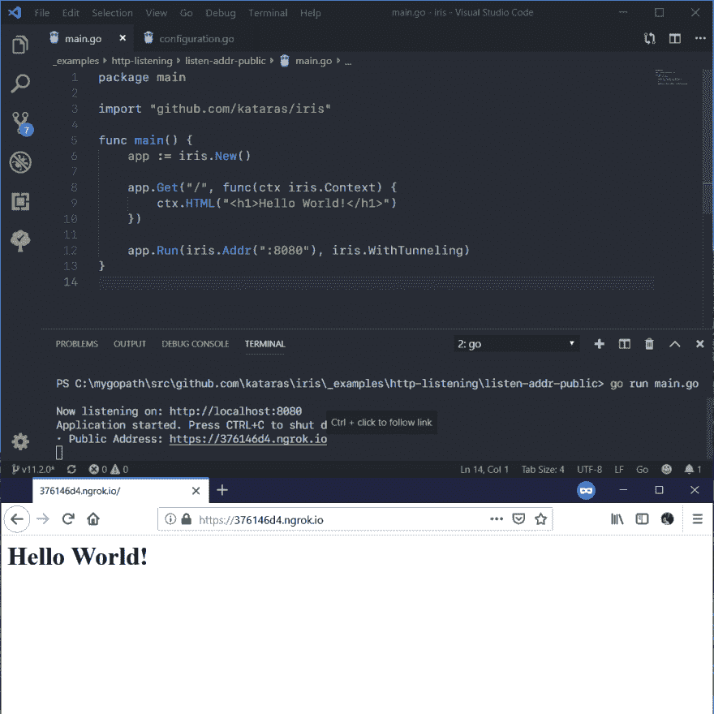](https://www.facebook.com/iris.framework/photos/a.2420499271295384/3261189020559734/?type=3&theater)

*   `ctx.Application().ConfigurationReadOnly().GetVHost()`返回公共域值。很少有用，但它就在你身边。大多数时候你使用相对 url 路径而不是绝对路径(或者你应该这样做)。
*   ngrok 是否已经在运行并不重要，Iris framework 足够聪明，可以使用 ngrok 的 [web API](https://ngrok.com/docs) 来创建隧道。

完整`Tunneling`配置:

```
app.Run(iris.Addr(":8080"), iris.WithConfiguration(
    iris.Configuration{
        Tunneling: iris.TunnelingConfiguration{
            AuthToken:    "my-ngrok-auth-client-token",
            Bin:          "/bin/path/for/ngrok",
            Region:       "eu",
            WebInterface: "127.0.0.1:4040",
            Tunnels: []iris.Tunnel{
                {
                    Name: "MyApp",
                    Addr: ":8080",
                },
            },
        },
})) 
```

Enter fullscreen mode Exit fullscreen mode

## 路由:在同一路径上处理不同的参数类型

类似这样的工作现在没有任何问题(订单:顶部作为后备)

```
app.Get("/u/{username:string}", func(ctx iris.Context) {
    ctx.Writef("before username (string), current route name: %s\n", ctx.RouteName())
    ctx.Next()
}, func(ctx iris.Context) {
    ctx.Writef("username (string): %s", ctx.Params().Get("username"))
})

app.Get("/u/{id:int}", func(ctx iris.Context) {
    ctx.Writef("before id (int), current route name: %s\n", ctx.RouteName())
    ctx.Next()
}, func(ctx iris.Context) {
    ctx.Writef("id (int): %d", ctx.Params().GetIntDefault("id", 0))
})

app.Get("/u/{uid:uint}", func(ctx iris.Context) {
    ctx.Writef("before uid (uint), current route name: %s\n", ctx.RouteName())
    ctx.Next()
}, func(ctx iris.Context) {
    ctx.Writef("uid (uint): %d", ctx.Params().GetUintDefault("uid", 0))
})

app.Get("/u/{firstname:alphabetical}", func(ctx iris.Context) {
    ctx.Writef("before firstname (alphabetical), current route name: %s\n", ctx.RouteName())
    ctx.Next()
}, func(ctx iris.Context) {
    ctx.Writef("firstname (alphabetical): %s", ctx.Params().Get("firstname"))
})

/*
    /u/abcd maps to :alphabetical (if :alphabetical registered otherwise :string)
    /u/42 maps to :uint (if :uint registered otherwise :int)
    /u/-1 maps to :int (if :int registered otherwise :string)
    /u/abcd123 maps to :string
*/ 
```

Enter fullscreen mode Exit fullscreen mode

## 内容协商

**有时，一个服务器应用程序需要在同一个 URI** 上提供不同的资源表示。当然，这可以手动完成，手动检查`Accept`请求头并推送所请求的内容形式。然而，随着你的应用程序管理更多的资源和不同种类的表示，这可能会非常痛苦，因为你可能需要检查`Accept-Charset`、`Accept-Encoding`，设置一些服务器端优先级，正确处理错误等等

Go 中的一些 web 框架已经在努力实现这样的功能，但它们做得并不正确:

*   他们根本不处理接受字符集
*   他们根本不处理接受编码
*   它们不像 RFC 建议的那样发送错误状态代码(406 不可接受)等等...

但是，幸运的是，Iris 总是遵循最佳实践和网络标准。

基于:

*   [https://developer . Mozilla . org/en-US/docs/Web/HTTP/Content _ negotiation](https://developer.mozilla.org/en-US/docs/Web/HTTP/Content_negotiation)
*   [https://developer . Mozilla . org/en-US/docs/Web/HTTP/Headers/Accept](https://developer.mozilla.org/en-US/docs/Web/HTTP/Headers/Accept)
*   [https://developer . Mozilla . org/en-US/docs/Web/HTTP/Headers/Accept-Charset](https://developer.mozilla.org/en-US/docs/Web/HTTP/Headers/Accept-Charset)
*   [https://developer . Mozilla . org/en-US/docs/Web/HTTP/Headers/Accept-Encoding](https://developer.mozilla.org/en-US/docs/Web/HTTP/Headers/Accept-Encoding)

```
type testdata struct {
    Name string `json:"name" xml:"Name"`
    Age  int    `json:"age" xml:"Age"`
} 
```

Enter fullscreen mode Exit fullscreen mode

使用“gzip”编码算法
将资源呈现为 application/json 或 text/xml 或 application/xml

*   当客户端的 accept 报头包含其中之一时
*   或者 JSON(第一个声明的),如果 accept 为空，
*   当客户端的 accept-encoding 头包含“gzip”或为空时。

```
app.Get("/resource", func(ctx iris.Context) {
    data := testdata{
        Name: "test name",
        Age:  26,
    }

        ctx.Negotiation().JSON().XML().EncodingGzip()

    _, err := ctx.Negotiate(data)
    if err != nil {
        ctx.Writef("%v", err)
    }
}) 
```

Enter fullscreen mode Exit fullscreen mode

**或**在一个中间件中定义它们，并在最终的处理程序中调用 Negotiate with nil。

```
ctx.Negotiation().JSON(data).XML(data).Any("content for */*")
ctx.Negotiate(nil) 
```

Enter fullscreen mode Exit fullscreen mode

```
app.Get("/resource2", func(ctx iris.Context) {
    jsonAndXML := testdata{
        Name: "test name",
        Age:  26,
    }

    ctx.Negotiation().
        JSON(jsonAndXML).
        XML(jsonAndXML).
        HTML("<h1>Test Name</h1><h2>Age 26</h2>")

    ctx.Negotiate(nil)
}) 
```

Enter fullscreen mode Exit fullscreen mode

[阅读完整示例](https://github.com/kataras/iris/blob/8ee0de51c593fe0483fbea38117c3c88e065f2ef/_examples/http_responsewriter/content-negotiation/main.go#L22)。

[上下文。协商](https://github.com/kataras/iris/blob/8ee0de51c593fe0483fbea38117c3c88e065f2ef/context/context.go#L3342)方法创建一次并返回协商构建器
，为特定的内容类型、字符集和编码算法构建服务器端可用的优先内容。

```
Context.Negotiation() *context.NegotiationBuilder 
```

Enter fullscreen mode Exit fullscreen mode

[上下文。协商](https://github.com/kataras/iris/blob/8ee0de51c593fe0483fbea38117c3c88e065f2ef/context/context.go#L3402)方法，用于在同一个 URI 上提供资源的不同表示。当不匹配 mime 类型时，它返回`context.ErrContentNotSupported`。

*   “v”可以是单个[虹膜。N](https://github.com/kataras/iris/blob/8ee0de51c593fe0483fbea38117c3c88e065f2ef/context/context.go#L3298-L3309) 结构值。
*   “v”可以是完成[上下文的任何值。内容选择器](https://github.com/kataras/iris/blob/8ee0de51c593fe0483fbea38117c3c88e065f2ef/context/context.go#L3272)接口。
*   “v”可以是完成[上下文的任何值。ContentNegotiator](https://github.com/kataras/iris/blob/8ee0de51c593fe0483fbea38117c3c88e065f2ef/context/context.go#L3281) 接口。
*   “v”可以是 struct(JSON、JSONP、XML、YAML)或 string(TEXT、HTML)或[]byte(Markdown、Binary)的任何值，也可以是具有任何匹配 mime 类型的[]byte。
*   如果“v”为零，则将使用`Context.Negotitation()`构建器的
    内容，否则“v”将覆盖构建器的内容
    (服务器 mime 类型仍由其注册的、受支持的 mime 列表检索)

*   通过[Negotiation()mime . text . JSON . XML . html 设置 mime 类型优先级。...](https://github.com/kataras/iris/blob/8ee0de51c593fe0483fbea38117c3c88e065f2ef/context/context.go#L3500-L3621)。

*   通过[协商()设置字符集优先级。字符集(...)](https://github.com/kataras/iris/blob/8ee0de51c593fe0483fbea38117c3c88e065f2ef/context/context.go#L3640)。

*   通过[协商()设置编码算法优先级。编码(...)](https://github.com/kataras/iris/blob/8ee0de51c593fe0483fbea38117c3c88e065f2ef/context/context.go#L3652-L3665)。

*   修改由[协商接受的()Accept./Override()/。XML()。JSON()。字符集(...).编码(...)...](https://github.com/kataras/iris/blob/8ee0de51c593fe0483fbea38117c3c88e065f2ef/context/context.go#L3774-L3877)。

```
Context.Negotiate(v interface{}) (int, error) 
```

Enter fullscreen mode Exit fullscreen mode

## 新的 Websocket 包

有些时候，如果没有突破性的改变，你根本无法改善某些事情。在一年半没有突破性变化之后，这个版本的 Iris 引入了两个最好的突破性变化。第一个是完全重写的 websocket 模块，第二个与您如何服务系统(或嵌入式)目录有关。

新的 websocket 包在[https://github.com/kataras/neffos](https://github.com/kataras/neffos)自托管，是 4 个月日常设计、编码、重新设计和重构的工作。

即使在那里，从第一天开始，**用户就立即开始参与进来**，提出问题和建议。当然，作为我们的传统，它们被讨论了很多，并且现在都可用:

[向连接 ID](https://github.com/kataras/neffos/issues/1#issuecomment-498013666) 广播消息

[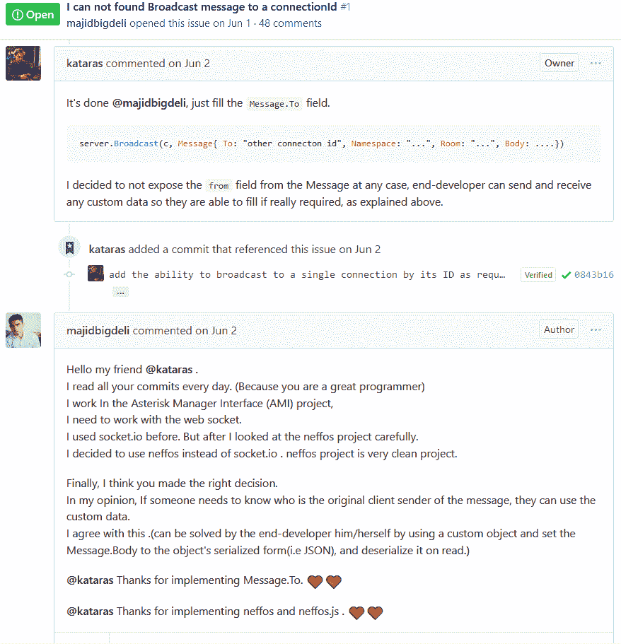](https://res.cloudinary.com/practicaldev/image/fetch/s--xtGVTfux--/c_limit%2Cf_auto%2Cfl_progressive%2Cq_auto%2Cw_880/https://thepracticaldev.s3.amazonaws.com/i/kzywdg6s1ku8uvsn8c0v.png)

[虹膜 id 生成器](https://github.com/kataras/neffos/issues/1#issuecomment-508689819)

[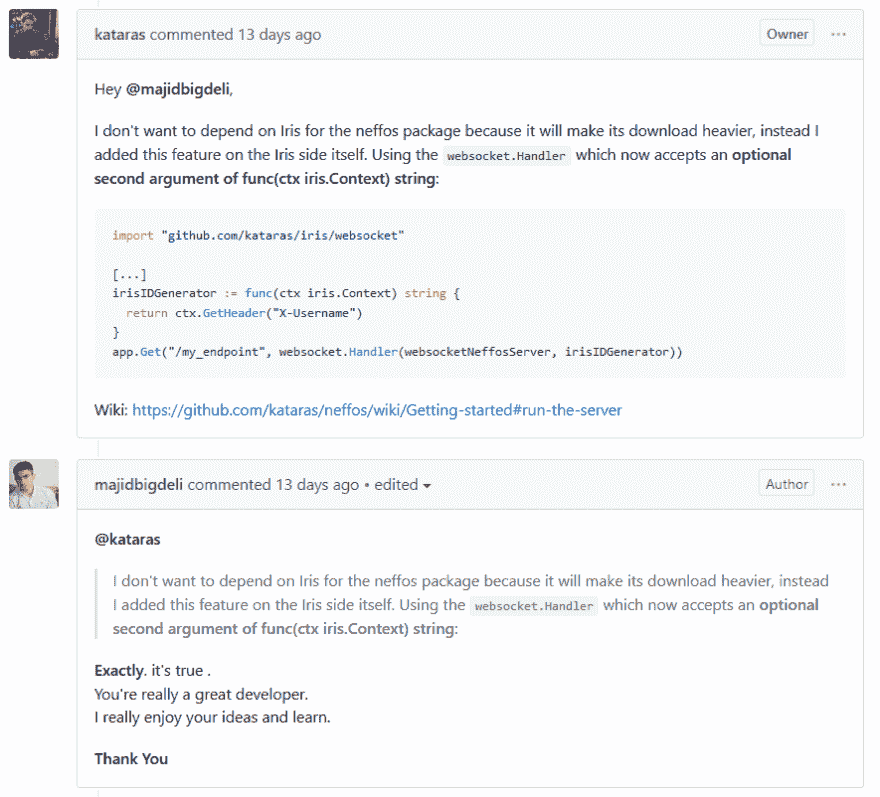](https://res.cloudinary.com/practicaldev/image/fetch/s--_eFYNmx7--/c_limit%2Cf_auto%2Cfl_progressive%2Cq_auto%2Cw_880/https://thepracticaldev.s3.amazonaws.com/i/iad8w2370gh1s7d1couk.png)

[服务器询问方法，如连接询问](https://github.com/kataras/neffos/issues/1#issuecomment-509024562)

[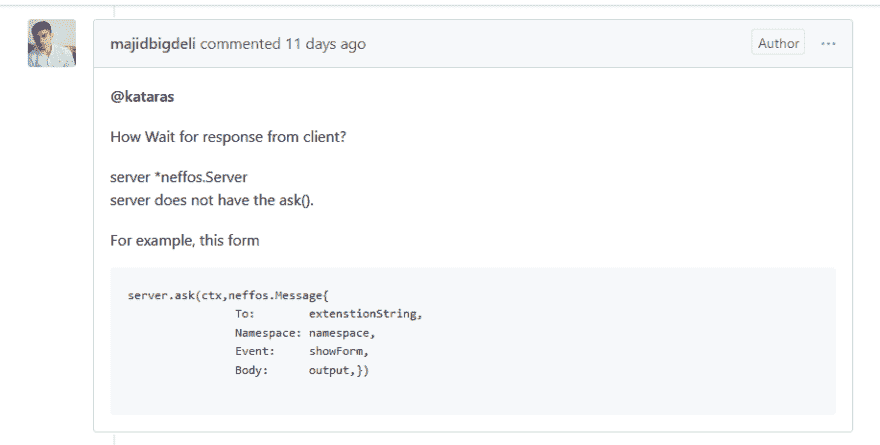](https://res.cloudinary.com/practicaldev/image/fetch/s--7Ly1sv-t--/c_limit%2Cf_auto%2Cfl_progressive%2Cq_auto%2Cw_880/https://thepracticaldev.s3.amazonaws.com/i/rhgavv5stehk8i80tuof.png)

[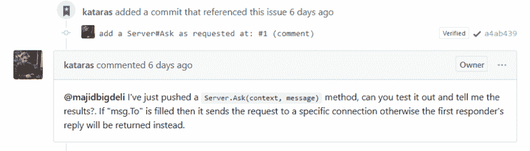](https://res.cloudinary.com/practicaldev/image/fetch/s--s3FWP5Ug--/c_limit%2Cf_auto%2Cfl_progressive%2Cq_auto%2Cw_880/https://thepracticaldev.s3.amazonaws.com/i/q2ozhqlxh9k8nz650nmt.png)

[添加一个 cron 示例](https://github.com/kataras/neffos/issues/1#issuecomment-511046580)

[适配器支持可扩展性](https://github.com/kataras/neffos/issues/3)

[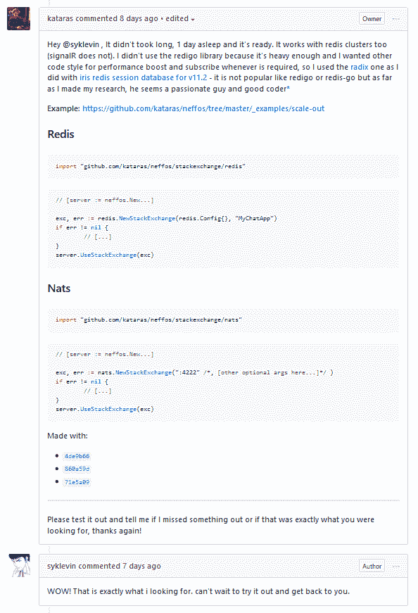](https://res.cloudinary.com/practicaldev/image/fetch/s--Vi7s5pUW--/c_limit%2Cf_auto%2Cfl_progressive%2Cq_auto%2Cw_880/https://thepracticaldev.s3.amazonaws.com/i/5j7r5unu2gu4uazaj504.png)

在所有用例中，新的 websocket 实现都比我们以前的要好得多，也快得多，而且没有了以前版本的不中断更改规则所带来的缺陷和妥协。与之前只有一个简单的 go 客户端不同，新版本提供了 Go 和 Typescript/Javascript(节点和浏览器端)客户端，任何人都可以轻松地制作任何语言的客户端，例如 C++。我可以说，我们的新 websocket 模块非常独特，但感觉就像在家里一样，需要做大量的准备和原型制作。结果值得我在这件事上花费的日日夜夜——当然，你——作为社区将证明这一点，基于你在一天结束时的反馈。

我们来看看新版 websocket 包提供了哪些之前的 v11.1.x 版无法处理的东西。

| 特征 | v11.1.x | v11.2.x (neffos) |
| --- | --- | --- |
| 使用 NAT 或 Redis 进行横向扩展 | 不 | 是 |
| Gorilla 协议实现 | 是 | 是 |
| Gobwas/ws 协议实现 | 不 | 是 |
| 承认 | 是 | 是 |
| 名称空间 | 不 | 是 |
| 房间 | 是 | 是 |
| 广播 | 是(但很慢) | 是的(比 socket.io 和我们测试过的其他产品都快) |
| 事件驱动架构 | 是 | 是 |
| 请求-响应架构 | 不 | 是 |
| 错误意识 | 不 | 是 |
| 异步广播 | 不 | 是 |
| 超时设定 | 是 | 是 |
| 编码 | 是(仅 JSON) | 是 |
| 本机 WebSocket 消息 | 是 | 是 |
| 重接 | 不 | 是 |
| 浏览器、Nodejs 和 Go 的现代客户端 | 不 | 是 |

除了新的自托管 [neffos 库](https://github.com/kataras/neffos)。 [kataras/iris/websocket](https://github.com/kataras/iris/tree/v11.2.0/websocket) 子包现在包含(仅)特定于 iris 的迁移和 neffos websocket framework one 的助手。

例如，要获得对请求的`Context`的访问，您可以从事件消息处理程序/回调:
内部调用`websocket.GetContext(Conn)`

```
// GetContext returns the Iris Context from a websocket connection.
func GetContext(c *neffos.Conn) Context 
```

Enter fullscreen mode Exit fullscreen mode

使用`websocket.Handler`函数:
将 websocket `neffos.Server`注册到路线

```
// IDGenerator is an iris-specific IDGenerator for new connections.
type IDGenerator func(Context) string

// Handler returns an Iris handler to be served in a route of an Iris application.
// Accepts the neffos websocket server as its first input argument
// and optionally an Iris-specific `IDGenerator` as its second one.
func Handler(s *neffos.Server, IDGenerator ...IDGenerator) Handler 
```

Enter fullscreen mode Exit fullscreen mode

**用法**

```
import (
    "github.com/kataras/neffos"
    "github.com/kataras/iris/websocket"
)

// [...]

onChat := func(ns *neffos.NSConn, msg neffos.Message) error {
    ctx := websocket.GetContext(ns.Conn)
    // [...]
    return nil
}

app := iris.New()
ws := neffos.New(websocket.DefaultGorillaUpgrader, neffos.Namespaces{
    "default": neffos.Events {
        "chat": onChat,
    },
})
app.Get("/websocket_endpoint", websocket.Handler(ws)) 
```

Enter fullscreen mode Exit fullscreen mode

### MVC |新的 Websocket 控制器

neffos 包包含一个从 Go struct 值创建事件的特性，它的`NewStruct`包级函数。此外，Iris 拥有自己的`iris/mvc/Application.HandleWebsocket(v interface{}) *neffos.Struct`来在现有的 Iris MVC 应用程序中注册控制器(为请求值和静态服务提供一个全功能的依赖注入容器),就像您习惯的任何常规 HTTP 控制器一样。

```
// HandleWebsocket handles a websocket specific controller.
// Its exported methods are the events.
// If a "Namespace" field or method exists then namespace is set,
// otherwise empty namespace will be used for this controller.
//
// Note that a websocket controller is registered and ran under
// a connection connected to a namespace
// and it cannot send HTTP responses on that state.
// However all static and dynamic dependencies behave as expected.
func (*mvc.Application) HandleWebsocket(controller interface{}) *neffos.Struct 
```

Enter fullscreen mode Exit fullscreen mode

让我们来看一个使用示例，我们想用控制器的方法绑定`OnNamespaceConnected`、`OnNamespaceDisconnect`内置事件和一个自定义`"OnChat"`事件。

**1。**我们通过将 NSConn 类型字段声明为`stateless`来创建控制器，并编写我们需要的方法。

```
type websocketController struct {
    *neffos.NSConn `stateless:"true"`
    Namespace string

    Logger MyLoggerInterface
}

func (c *websocketController) OnNamespaceConnected(msg neffos.Message) error {
    return nil
}

func (c *websocketController) OnNamespaceDisconnect(msg neffos.Message) error {
    return nil
}

func (c *websocketController) OnChat(msg neffos.Message) error {
    return nil
} 
```

Enter fullscreen mode Exit fullscreen mode

Iris 足够聪明，可以捕捉到`Namespace string` struct 字段，用它将控制器的方法注册为该名称空间的事件，或者您可以创建一个`Namespace() string { return "default" }`的控制器方法，或者使用`HandleWebsocket`的返回值给`.SetNamespace("default")`，这取决于您。

**2。**我们将 MVC 应用程序目标初始化为一个 websocket 端点，就像我们过去对 HTTP 路由的常规 HTTP 控制器所做的那样。

```
import (
    // [...]
    "github.com/kataras/iris/mvc"
)
// [app := iris.New...]

mvcApp := mvc.New(app.Party("/websocket_endpoint")) 
```

Enter fullscreen mode Exit fullscreen mode

**3。**我们注册我们的依赖项，如果有的话。

```
mvcApp.Register(
    &prefixedLogger{prefix: "DEV"},
) 
```

Enter fullscreen mode Exit fullscreen mode

**4。**我们注册了一个或多个 websocket 控制器，每个 websocket 控制器映射到一个名称空间(一个就足够了，因为在大多数情况下你不需要更多，但这取决于你的应用的需求和要求)。

```
mvcApp.HandleWebsocket(&websocketController{Namespace: "default"}) 
```

Enter fullscreen mode Exit fullscreen mode

**5。**接下来，我们继续将 mvc 应用程序作为连接处理程序映射到 websocket 服务器(您可以通过`neffos.JoinConnHandlers(mvcApp1, mvcApp2)`在每个 websocket 服务器上使用多个 mvc 应用程序)。

```
websocketServer := neffos.New(websocket.DefaultGorillaUpgrader, mvcApp) 
```

Enter fullscreen mode Exit fullscreen mode

**6。**最后一步是通过普通的`.Get`方法将服务器注册到我们的端点。

```
mvcApp.Router.Get("/", websocket.Handler(websocketServer)) 
```

Enter fullscreen mode Exit fullscreen mode

我们不会在这里涵盖整个 neffos 包，有很多新的特性。不要害怕，你仍然可以做你以前做过的所有事情，不需要很多学习过程，但是随着你进一步进入更高级的应用程序，你可以通过阅读它的 [wiki](https://github.com/kataras/neffos/wiki) 页面获得更多。事实上，有如此多的新事物都写在电子书里，你可以要求 100%免费的直接在线访问。

### 例子

*   [Websocket 控制器](https://github.com/kataras/iris/tree/v11.2.0/_examples/mvc/websocket)
*   [基础](https://github.com/kataras/iris/blob/v11.2.0/_examples/websocket/basic)
    *   [服务器](https://github.com/kataras/iris/blob/v11.2.0/_examples/websocket/basic/server.go)
    *   [Go 客户端](https://github.com/kataras/iris/blob/v11.2.0/_examples/websocket/basic/go-client/client.go)
    *   [浏览器客户端](https://github.com/kataras/iris/blob/v11.2.0/_examples/websocket/basic/browser/index.html)
    *   [浏览器 NPM 客户端(browserify)](https://github.com/kataras/iris/blob/v11.2.0/_examples/websocket/basic/browserify/app.js)

有意思？导航至 **[学习内福斯章节](https://github.com/kataras/neffos#learning-neffos)** 继续阅读。

## 新建文件服务器

我们将继续查看新的`FileServer`包级函数和`Party.HandleDir`方法。

下面是我们目前使用的函数和方法的列表(从 v11.1.x 开始):

1.  `Party.StaticWeb(requestPath string, systemPath string) *Route` [*](https://github.com/kataras/iris/blob/6564922661686d43954b8bcf1d4f469a3d2c3fa3/core/router/api_builder.go#L806) (最常用)
2.  `func NewStaticHandlerBuilder(dir string) StaticHandlerBuilder` [*](https://github.com/kataras/iris/blob/6564922661686d43954b8bcf1d4f469a3d2c3fa3/core/router/fs.go#L194)
3.  `func StaticHandler(systemPath string, showList bool, gzip bool) Handler` [*](https://github.com/kataras/iris/blob/6564922661686d43954b8bcf1d4f469a3d2c3fa3/core/router/fs.go#L133)
4.  `Party.StaticHandler(systemPath string, showList bool, gzip bool) Handler` [*](https://github.com/kataras/iris/blob/6564922661686d43954b8bcf1d4f469a3d2c3fa3/core/router/api_builder.go#L640)
5.  `Party.StaticServe(systemPath string, requestPath ...string) *Route` [*](https://github.com/kataras/iris/blob/6564922661686d43954b8bcf1d4f469a3d2c3fa3/core/router/api_builder.go#L648)
6.  `func StaticEmbeddedHandler(vdir string, assetFn func(name string) ([]byte, error), namesFn func() []string, assetsGziped bool) Handler` [*](https://github.com/kataras/iris/blob/6564922661686d43954b8bcf1d4f469a3d2c3fa3/core/router/fs.go#L28)
7.  `Party.StaticEmbeddedGzip(requestPath string, vdir string, gzipAssetFn func(name string) ([]byte, error), gzipNamesFn func() []string) *Route` [*](https://github.com/kataras/iris/blob/6564922661686d43954b8bcf1d4f469a3d2c3fa3/core/router/api_builder.go#L704)
8.  `Party.StaticEmbedded(requestPath string, vdir string, assetFn func(name string) ([]byte, error), namesFn func() []string) *Route` [*](https://github.com/kataras/iris/blob/6564922661686d43954b8bcf1d4f469a3d2c3fa3/core/router/api_builder.go#L688)
9.  `Application.SPA(assetHandler Handler) *router.SPABuilder` [*](https://github.com/kataras/iris/blob/6564922661686d43954b8bcf1d4f469a3d2c3fa3/iris.go#L481)

**这是一大堆函数，它们做的事情略有不同，但最终都产生了 Iris-Dev 想要的相同功能**。此外，嵌入式文件服务器缺少一个(物理)系统的文件服务器所具有的重要特性，即按内容范围提供服务(公平地说，我们并不孤单，其他第三方工具和框架甚至没有或认为我们为用户提供的嵌入式文件的一半特性，包括这个)。

所以，我在想，*本着我们在 websocket 级别*上摆脱了这个版本的不中断更改规则的精神，通过不仅替换而且移除所有现有的静态处理函数，也在 websocket 模块之外带来一些中断更改，然而我得出了一个决定，最好让它们在一个主要版本中存在~并且在幕后调用新方法，但是~带有将被记录到开发人员终端的*弃用*警告。假设你有一个`main.go`并且在它的第 18 行上有`app.StaticWeb("/static", "./assets")`存在，这个错误看起来会是这样的:

[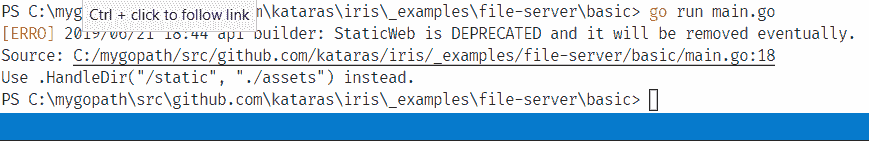](https://res.cloudinary.com/practicaldev/image/fetch/s--Xr-gyRt0--/c_limit%2Cf_auto%2Cfl_progressive%2Cq_auto%2Cw_880/https://user-images.githubusercontent.com/22900943/59934728-e4e6b780-9454-11e9-8494-af050fbd4cb6.png)

> 请注意悬停，大多数代码编辑器会引导您找到问题的根源，弃用日志接受被弃用方法的参数值，在这种情况下是`StaticWeb`，并建议新的方法。

所有这些功能都可以用一个单一的包级和一方方法来代替。包级函数给你一个`Handler`来操作，另一个`Party`方法将在子域、子路由器等上注册路由。此时我正在写这个问题，我已经在本地完成了这个功能，还没有推出，但很快就会推出。看起来是这样的:

```
FileServer(directory string, options ...DirOptions) Handler 
```

Enter fullscreen mode Exit fullscreen mode

```
Party.HandleDir(requestPath string, directory string, options ...DirOptions) *Route 
```

Enter fullscreen mode Exit fullscreen mode

其中`DirOptions`是:

```
type DirOptions struct {
// Defaults to "/index.html", if request path is ending with **/*/$IndexName
// then it redirects to **/*(/) which another handler is handling it,
// that another handler, called index handler, is auto-registered by the framework
// if end developer wasn't managed to handle it manually/by hand.
IndexName string
// Should files served under gzip compression?
Gzip bool

// List the files inside the current requested directory if `IndexName` not found.
ShowList bool
// If `ShowList` is true then this function will be used instead
// of the default one to show the list of files of a current requested directory(dir).
DirList func(ctx Context, dirName string, dir http.File) error

// When embedded.
Asset      func(name string) ([]byte, error)   
AssetInfo  func(name string) (os.FileInfo, error)
AssetNames func() []string

// Optional validator that loops through each found requested resource.
AssetValidator func(ctx Context, name string) bool
} 
```

Enter fullscreen mode Exit fullscreen mode

如果你使用上述方法之一，**重构**你的项目的静态文件服务代码块**是强烈推荐的**，事实上这很简单，你可以这样做:

### 聚会。StaticWeb 和 Party。静态服务

**v11.1.x**

```
app.StaticWeb("/static", "./assets") 
```

Enter fullscreen mode Exit fullscreen mode

**v11.2.x**

```
app.HandleDir("/static", "./assets") 
```

Enter fullscreen mode Exit fullscreen mode

> 如果您使用了`StaticWeb/StaticServe`，只需在代码编辑器中对`HandleDir`进行替换所有文件的操作，就大功告成了。

### 静态处理器

**v11.1.x**

```
handler := iris.StaticHandler("./assets", true, true) 
```

Enter fullscreen mode Exit fullscreen mode

**v11.2.x**

```
handler := iris.FileServer("./assets", iris.DirOptions {ShowList: true, Gzip: true}) 
```

Enter fullscreen mode Exit fullscreen mode

### StaticEmbeddedHandler

**v11.1.x**

```
handler := iris.StaticEmbeddedHandler("./assets", Asset, AssetNames, true) 
```

Enter fullscreen mode Exit fullscreen mode

**v11.2.x**

```
handler := iris.FileServer("./assets", iris.DirOptions {
  Asset: Asset,
  AssetInfo: AssetInfo,
  AssetNames: AssetNames,
  Gzip: true}) 
```

Enter fullscreen mode Exit fullscreen mode

### 聚会。StaticEmbedded 和党。静态嵌入压缩

**v11.1.x**

```
app.StaticEmbedded("/static", "./assets", Asset, AssetNames) 
```

Enter fullscreen mode Exit fullscreen mode

**v11.2.x**

```
app.HandleDir("/static", "./assets", iris.DirOptions {
  Asset: Asset,
  AssetInfo: AssetInfo,
  AssetNames: AssetNames,
  Gzip: true/false}) 
```

Enter fullscreen mode Exit fullscreen mode

### 申请。矿泉

**v11.1.x**

```
app.RegisterView(iris.HTML("./public", ".html"))

app.Get("/", func(ctx iris.Context) {
    ctx.ViewData("Page", page)
    ctx.View("index.html")
})

assetHandler := app.StaticHandler("./public", false, false)
app.SPA(assetHandler) 
```

Enter fullscreen mode Exit fullscreen mode

**v11.2.x**

```
app.RegisterView(iris.HTML("./public", ".html"))

// Overrides the file server's index route. 
// Order of this route registration does not matter.
app.Get("/", func(ctx iris.Context) {
    ctx.ViewData("Page", page)
    ctx.View("index.html")
})

app.HandleDir("/", "./public") 
```

Enter fullscreen mode Exit fullscreen mode

以上变化不仅仅是句法上的。与标准的 net/http 设计不同，我们为最终开发人员提供了使用不同的索引文件处理程序来定制中间件以及设计单页面应用程序时所需的任何其他选项和代码的机会和功能。
以前类似于`/static/index.html` - > `/static`的东西都是需要开发者通过`app.Get`手动处理，来服务一个目录的`index.html`文件。现在，如果缺少这样的处理程序，那么框架会自动注册它，路由注册的顺序并不重要，Iris 会在构建状态处理它们。另一个新特性是，现在文件服务器可以处理内容范围的嵌入式文件，并通过`DirOptions.ShowList`显示嵌入式目录中的文件列表，就像系统目录一样。

上面的`FileServer`函数和`HandleDir`方法在一个单独的点上处理每一种情况，所有以前的和新的特性都存在于这两个函数中。

作为我们拥有的 9 个(**九个**)函数和方法的结果，我们**最终只拥有 2 个(**两个**)更少的代码、更多的改进和新特性。这一事实给任何用户，无论是有经验的还是新手，一个理想的开始工作的地方，而不需要搜索和阅读超过他们需要的内容。**

## 新的喷射视图引擎

这个版本包含了一个新的`View Engine`用于`jet`模板解析器，请求地址:【https://github.com/kataras/iris/issues/1281

[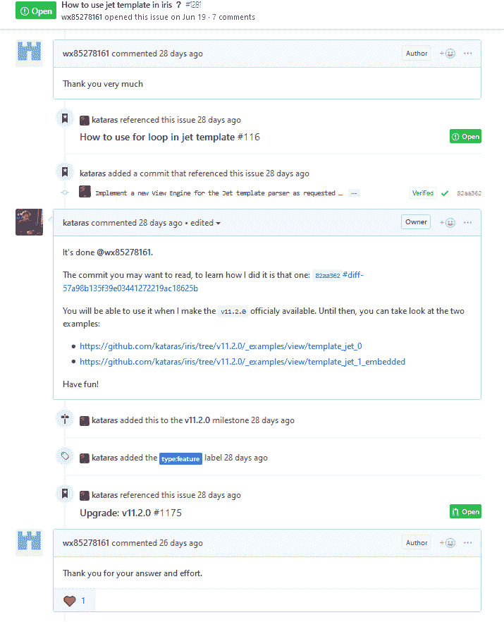](https://res.cloudinary.com/practicaldev/image/fetch/s--8GVx_dae--/c_limit%2Cf_auto%2Cfl_progressive%2Cq_auto%2Cw_880/https://thepracticaldev.s3.amazonaws.com/i/c8h82fi59rc0ndxqaacm.png)T3】

```
tmpl := iris.Jet("./views", ".jet")
app.RegisterView(tmpl) 
```

Enter fullscreen mode Exit fullscreen mode

## bug 修正和小改进

让我们继续列出小的错误修正、改进和新功能。有关更多信息，请查看函数或方法声明后的链接。

**1** 。`Context.FullRequestURI()` -应要求于:[https://github.com/kataras/iris/issues/1167](https://github.com/kataras/iris/issues/1167)。

**2** 。应要求于:[https://github.com/kataras/iris/issues/1170](https://github.com/kataras/iris/issues/1170)。

**3** 。应要求于:[https://github.com/kataras/iris/issues/1180](https://github.com/kataras/iris/issues/1180)。

[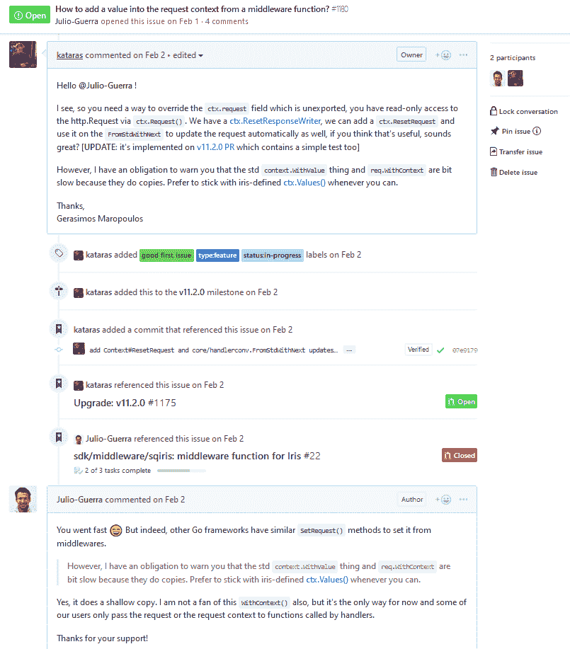](https://res.cloudinary.com/practicaldev/image/fetch/s--jv7PLNqG--/c_limit%2Cf_auto%2Cfl_progressive%2Cq_auto%2Cw_880/https://thepracticaldev.s3.amazonaws.com/i/io3q7d7hlxasq5jn82o4.png)

**4** 。修正`Context.StopExecution()`没有被 MVC 控制者的方法尊重，在:[https://github.com/kataras/iris/issues/1187](https://github.com/kataras/iris/issues/1187)被报告。

**5** 。提供在 Start 和`Update/ShiftExpiration`方法上修改整个会话的 cookie 的能力，并根据请求在:【https://github.com/kataras/iris/issues/1186】的[添加一个`StartWithPath`助手。](https://github.com/kataras/iris/issues/1186)

[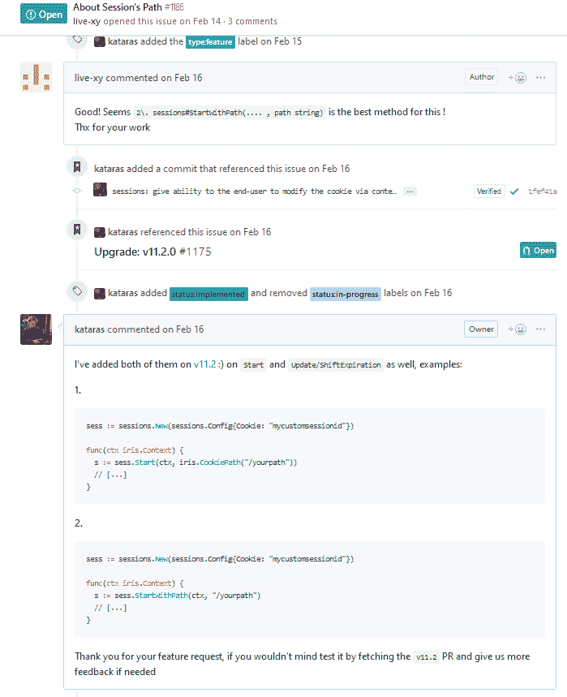](https://res.cloudinary.com/practicaldev/image/fetch/s--0GUGjm7N--/c_limit%2Cf_auto%2Cfl_progressive%2Cq_auto%2Cw_880/https://thepracticaldev.s3.amazonaws.com/i/c0vx7r2034yl7jwtrpi9.png)

**6** 。添加`Context.ResponseWriter().IsHijacked() bool`报告下划线连接是否被劫持。

**7** 。通过设置一个定制的`ErrorHandler`到 MVC 应用程序级或每个控制器，增加拦截默认错误处理程序的能力，请求在:[https://github.com/kataras/iris/issues/1244:](https://github.com/kataras/iris/issues/1244:)

[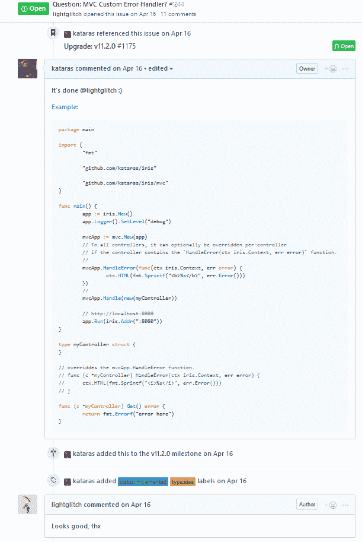](https://res.cloudinary.com/practicaldev/image/fetch/s--goGCmFQi--/c_limit%2Cf_auto%2Cfl_progressive%2Cq_auto%2Cw_880/https://thepracticaldev.s3.amazonaws.com/i/y9gokutivkj8qdbecctb.png)T3】

```
mvcApp := mvc.New(app)
mvcApp.HandleError(func(ctx iris.Context, err error) {
    ctx.HTML(fmt.Sprintf("<b>%s</b>", err.Error()))
})
// OR

type myController struct { /* [...] */ }

// Overriddes the mvcApp.HandleError function.
func (c *myController) HandleError(ctx iris.Context, err error) {
    ctx.HTML(fmt.Sprintf("<i>%s</i>", err.Error()))
} 
```

Enter fullscreen mode Exit fullscreen mode

**8** 。在[https://github.com/kataras/iris/issues/1256](https://github.com/kataras/iris/issues/1256)按照请求提取 redis sessiondb 的`Delim`配置字段。并将下划线 redis 客户端库替换为[基数](https://github.com/mediocregopher/radix)的那个。

[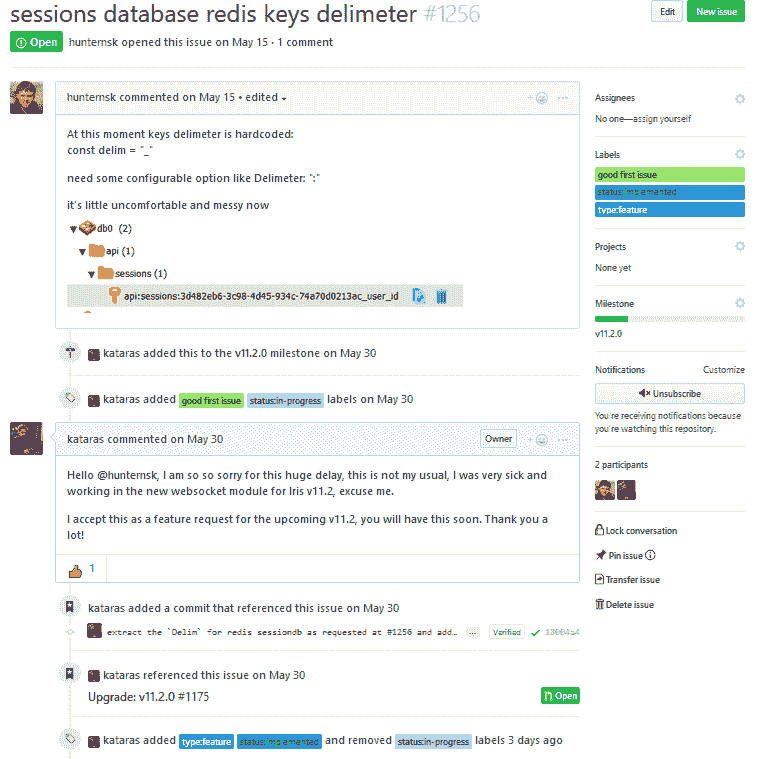](https://res.cloudinary.com/practicaldev/image/fetch/s--bSlejL16--/c_limit%2Cf_auto%2Cfl_progressive%2Cq_auto%2Cw_880/https://thepracticaldev.s3.amazonaws.com/i/xzgthdshrhgdr5n71s7t.png)

**9** 。修复了 JSON 响应中当 map，struct，slice 返回 nil 为 null 时的 hero/mvc，如在:【https://github.com/kataras/iris/issues/1273】T2 所报告的。

[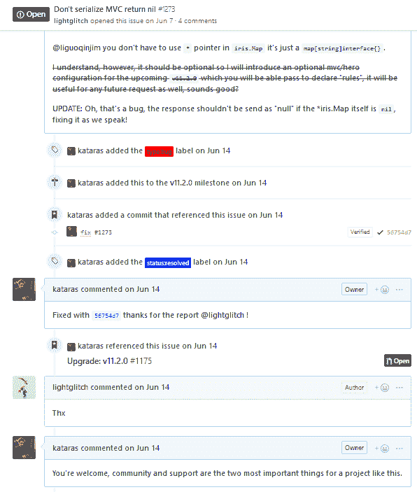](https://res.cloudinary.com/practicaldev/image/fetch/s--KPIwjj7---/c_limit%2Cf_auto%2Cfl_progressive%2Cq_auto%2Cw_880/https://thepracticaldev.s3.amazonaws.com/i/gwynvz0shtkyljrsqzg9.png)

**10。**在 https://github.com/kataras/iris/issues/1284 的[按要求使能`view.Django` pongo2 `addons`。](https://github.com/kataras/iris/issues/1284)

**11。**在 https://github.com/kataras/iris/issues/1292 的[按要求增加`mvc#Before/AfterActivation.HandleMany`和`GetRoutes`方法。](https://github.com/kataras/iris/issues/1292)

**12。修复在[https://github.com/kataras/iris/issues/1297](https://github.com/kataras/iris/issues/1297)报告的`Context.ReadForm`和`Context.FormValues`上`WithoutBodyConsumptionOnUnmarshal`选项不被尊重的问题。**

13。修复 [jwt](https://github.com/iris-contrib/middleware/tree/master/jwt) 、 [casbin](https://github.com/iris-contrib/middleware/tree/master/casbin) 和 [go-i81n](https://github.com/iris-contrib/middleware/tree/master/go-i81n) 中间件。

**14。**搞定 https://github.com/kataras/iris/issues/1298 的。

**15。在[https://github.com/kataras/iris/issues/1207](https://github.com/kataras/iris/issues/1207)按要求添加`ReadQuery`。**

**16。**将会话注册为中间件的简单方法。添加`sessions/Sessions#Handler`和包级`sessions.Get`函数(示例如下)。

### 调试

1.  MVC 依赖项和控制器字段或方法输入参数的无效注册的警告消息。
2.  MVC 控制器的方法映射到 websocket 事件的打印信息。
3.  `Context.RouteName()`返回当前路线的名称。
4.  `Context.HandlerFileName()`返回正在执行的当前处理函数的确切程序源代码位置(文件:行)。

## 例子

Iris 为有经验的和新的地鼠提供了超过 110 个例子。

## 新例子

*   [根据请求使用 HTTP/3 Quic](https://github.com/kataras/iris/blob/v11.2.0/_examples/http-listening/http3-quic) 在 https://github.com/kataras/iris/issues/1295[进行服务](https://github.com/kataras/iris/issues/1295)

[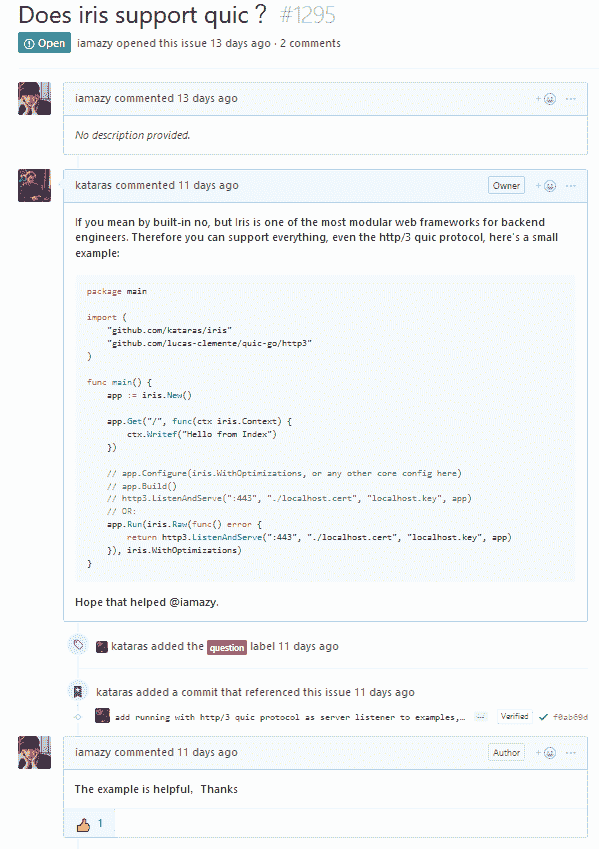](https://res.cloudinary.com/practicaldev/image/fetch/s--87-hjtmX--/c_limit%2Cf_auto%2Cfl_progressive%2Cq_auto%2Cw_880/https://thepracticaldev.s3.amazonaws.com/i/wa944fg9cka7b3zwu8t8.png)

*   [公共域地址](https://github.com/kataras/iris/blob/v11.2.0/_examples/http-listening/listen-addr-public/main.go)
*   [用官方的 MongoDB Go 驱动和 Iris 构建 RESTful API](https://github.com/kataras/iris/tree/4cfdc6418532f49ff0159045a06080db0457eb55/_examples/tutorial/mongodb)
*   [又一个依赖注入的例子和良好实践](https://github.com/kataras/iris/blob/v11.2.0/_examples/hero/smart-contract/main.go)
*   [MVC 正则表达式](https://github.com/kataras/iris/blob/v11.2.0/_examples/mvc/regexp/main.go)
*   [Jet 视图引擎](https://github.com/kataras/iris/blob/v11.2.0/_examples/view/template_jet_0)和[嵌入式 Jet 模板](https://github.com/kataras/iris/blob/v11.2.0/_examples/view/template_jet_1_embedded)
*   [Websocket](https://github.com/kataras/iris/blob/v11.2.0/_examples/websocket/basic)
    *   [服务器](https://github.com/kataras/iris/blob/v11.2.0/_examples/websocket/basic/server.go)
    *   [Go 客户端](https://github.com/kataras/iris/blob/v11.2.0/_examples/websocket/basic/go-client/client.go)
    *   [浏览器客户端](https://github.com/kataras/iris/blob/v11.2.0/_examples/websocket/basic/browser/index.html)
    *   [浏览器 NPM 客户端(browserify)](https://github.com/kataras/iris/blob/v11.2.0/_examples/websocket/basic/browserify/app.js)
*   [热](https://github.com/kataras/iris/pull/1275)
*   [ReadQuery](https://github.com/kataras/iris/tree/master/_examples/http_request/read-query)
*   [会话中间件](https://github.com/kataras/iris/blob/master/_examples/sessions/middleware/main.go)
*   [内容协商](https://github.com/kataras/iris/blob/master/_examples/http_responsewriter/content-negotiation)
*   [阅读 YAML](https://github.com/kataras/iris/blob/master/_examples/http_request/read-yaml)

## 更新示例

*   [定制路由器包装器](https://github.com/kataras/iris/blob/v11.2.0/_examples/routing/custom-wrapper/main.go)
*   [文件服务器基础知识](https://github.com/kataras/iris/blob/v11.2.0/_examples/file-server/basic/main.go)
*   [将文件嵌入 App 可执行文件](https://github.com/kataras/iris/blob/v11.2.0/_examples/file-server/embedding-files-into-app/main.go)
*   [将 Gziped 文件嵌入 App 可执行文件](https://github.com/kataras/iris/blob/v11.2.0/_examples/file-server/embedding-gziped-files-into-app/main.go)
*   [单页应用](https://github.com/kataras/iris/blob/v11.2.0/_examples/file-server/single-page-application/basic/main.go)
*   [嵌入式单页应用](https://github.com/kataras/iris/blob/v11.2.0/_examples/file-server/single-page-application/embedded-single-page-application/main.go)
*   [嵌入式单页应用与其他路由](https://github.com/kataras/iris/blob/v11.2.0/_examples/file-server/single-page-application/embedded-single-page-application-with-other-routes/main.go)
*   [Websocket 本地消息](https://github.com/kataras/iris/blob/v11.2.0/_examples/websocket/native-messages/main.go)
*   [Websocket 控制器](https://github.com/kataras/iris/tree/v11.2.0/_examples/mvc/websocket)
*   [使用 Redis 会话数据库](https://github.com/kataras/iris/blob/v11.2.0/_examples/sessions/database/redis/main.go)