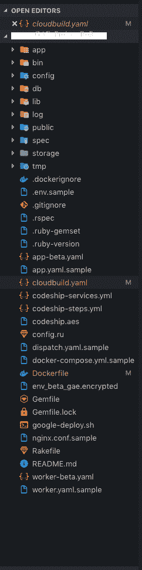

# 在 GAE 和 Codeship CI/CD 管道上部署 RoR

> 原文：<https://dev.to/pauld/deploy-ror-on-gae-and-codeship-ci-cd-pipeline-21k4>

## 与 Ruby on Rails 持续集成并持续部署到 Google App Engine

我有时间获取将 Ruby on Rails 应用程序部署到 Google 云平台的知识。使用 CloudBees Codeship 到 Google App Engine (GAE)创建 CI/CD 管道。GAE 是一种非常简单的部署服务的方式。更多关于 GAE 的信息可以在这里找到。 [GAE 博士](https://cloud.google.com/appengine/)
GAE 很容易做到蓝/绿金丝雀升级和许多其他功能。在这个部署中，可以说有相当多的工作设备，但是一旦完成，对代码的任何更改都将变得非常简单。唯一不好的是，云构建需要花费很长时间，如果你不得不改变一行代码，你至少要等两个小时。

首先，我们选择 GAE 应用引擎 flex。我最终通过 Docker 构建了自己的 Ruby 映像，并将其推送到 GCR (Google 容器注册表)。当前的 app engine flex 与我们的 RoR 版本不兼容。其他服务包括 GCP Sql (postgres)和 GCP memorystore (redis)。
我还添加了 sidekiq 来创建一个实例来连接云 sql。(详见下文)

```
cloudsql sidekiq
beta_settings:
  cloud_sql_instances: GCP_Project_ID:us-central1:Name_CloudSql

network:
  name: default

skip_files:
  - .env
  - .bundle
  - .byebug_history
  - .vscode/
  - .idea/
  - storage/
  - vendor/
  - log/
  - tmp/ 
```

<svg width="20px" height="20px" viewBox="0 0 24 24" class="highlight-action crayons-icon highlight-action--fullscreen-on"><title>Enter fullscreen mode</title></svg> <svg width="20px" height="20px" viewBox="0 0 24 24" class="highlight-action crayons-icon highlight-action--fullscreen-off"><title>Exit fullscreen mode</title></svg>

我使用 CloudBees Codeship 服务来实现安全的 CI/CD 管道，使用 GCP KMS 来加密凭证。

随着部署到 GAE，您将需要添加 Dockerfile，然后在 cloudbuild 上构建它。让我们进入战壕，建造一些很酷的东西。
(仅举例)

```
FROM gcr.io/GCP_Project_Name/Name_of_Image

EXPOSE 8080
ARG ruby_version=2.5.3
ARG bundler_version=1.17.1

# Ruby
ENV DEFAULT_RUBY_VERSION=${ruby_version}

# Install Ruby, set default Ruby version, and install Bundler
RUN rbenv global 2.5.3

# Workdir
ADD . /workspace/
WORKDIR /workspace/

# CloudSQL
VOLUME /cloudsql

# Set up environment variables used in production
ENV RACK_ENV=production \
RAILS_ENV=production \
RAILS_SERVE_STATIC_FILES=true

# Run bundle
RUN gem install bundler 
RUN rbenv exec gem install bundler
RUN bundle install --deployment --without="development test"

#ARG for authentication docker image 
ARG DB_PASS
ARG SECRET_B_KEY 

#env-variable for app-beta.yaml and worker-beta.yaml
ENV SECRET_KEY_BASE=${SECRET_B_KEY}
ENV RAILS_ENV="production"
ENV RACK_ENV="production"
ENV SERVICE_NAME="authentication"
ENV REDIS_HOST="10.0.0.3"
ENV REDIS_PORT=6379
ENV DATABASE_USER="postgres"
ENV DATABASE_PASS=${DB_PASS}
ENV DATABASE_NAME="postgres"
ENV DATABASE_HOST="/cloudsql/GCP-project:us-central1:nameofdb"
 ENV RAILS_LOG_TO_STDOUT: enabled
 ENV RAILS_SERVE_STATIC_FILES: enabled
 ENV LANG: en_US.UTF-8

# Entrypoint
CMD bundle exec puma -p 8080 -e production && bundle exec sidekiq -t 120 -C config/sidekiq.yml 
```

<svg width="20px" height="20px" viewBox="0 0 24 24" class="highlight-action crayons-icon highlight-action--fullscreen-on"><title>Enter fullscreen mode</title></svg> <svg width="20px" height="20px" viewBox="0 0 24 24" class="highlight-action crayons-icon highlight-action--fullscreen-off"><title>Exit fullscreen mode</title></svg>

如你所见， *ENV-Var* 并不是你所期望的。这是因为我已经把它们加密了，直到它们到达 GAE，在那里 GCP·KMS 会自动解密它们(稍后会有更多内容)

创建自己的 docker ruby 映像并推送到 Google 容器注册表

```
 # Use the base image provided by Google
FROM gcr.io/gcp-runtimes/ruby/ubuntu16

# Ruby 2.4.5
ARG ruby_version=2.4.5
ARG bundler_version=1.17.1
RUN rbenv install -s ${ruby_version} \
    && rbenv global ${ruby_version} \
    && rbenv rehash \
    && (bundle version > /dev/null 2>&1 \
        || gem install bundler --version ${bundler_version}) \
    && rbenv rehash && gem cleanup

# Ruby 2.5.3
ARG ruby_version=2.5.3
ARG bundler_version=1.17.1
RUN rbenv install -s ${ruby_version} \
    && rbenv global ${ruby_version} \
    && rbenv rehash \
    && (bundle version > /dev/null 2>&1 \
        || gem install bundler --version ${bundler_version}) \
    && rbenv rehash && gem cleanup

# Ruby 2.6.1
ARG ruby_version=2.6.1
ARG bundler_version=2.0.1
RUN rbenv install -s ${ruby_version} \
    && rbenv global ${ruby_version} \
    && rbenv rehash \
    && (bundle version > /dev/null 2>&1 \
        || gem install bundler --version ${bundler_version}) \
    && rbenv rehash && gem cleanup

# ENV
ENV DEFAULT_RUBY_VERSION=${ruby_version} 
```

<svg width="20px" height="20px" viewBox="0 0 24 24" class="highlight-action crayons-icon highlight-action--fullscreen-on"><title>Enter fullscreen mode</title></svg> <svg width="20px" height="20px" viewBox="0 0 24 24" class="highlight-action crayons-icon highlight-action--fullscreen-off"><title>Exit fullscreen mode</title></svg>

我还想指出，cloudsql 已经在 sidekiq
中被代理，在-config -database.yml 和 Dockerfile ENV DATABASE_HOST=中添加配置。

## 现在转到 CloudBees CODESHIP

CloudBees Codeship 为 CI/CD 管道提供了一种非常简单和安全的方式。为了做到这一点，你可以获得免费服务或付费服务。在下面的例子中是由专业订阅。[cloud bees code ship GCP](https://documentation.codeship.com/pro/continuous-deployment/google-cloud/)T2[我的例子](https://github.com/Arconapalus/GCP-example-solutions)

*我们需要认证 CloudBees Codeship to GCP*
这将通过转到项目，然后项目设置并获取 aes 密钥，以便 jet cli(在 docker 上运行)加密 GCP 项目证书的 env_var 来完成。

*为 CloudBees Codeship 创建服务和步骤以执行到 GCP*
Codeship GCP 服务应该看起来像这样

```
googleclouddeployment:
  image: codeship/google-cloud-deployment
  encrypted_env_file: env_e.encrypted
  add_docker: true
  working_dir: /google-deploy.sh
  volumes:
    - ./:/deploy 
```

<svg width="20px" height="20px" viewBox="0 0 24 24" class="highlight-action crayons-icon highlight-action--fullscreen-on"><title>Enter fullscreen mode</title></svg> <svg width="20px" height="20px" viewBox="0 0 24 24" class="highlight-action crayons-icon highlight-action--fullscreen-off"><title>Exit fullscreen mode</title></svg>

尽管这取决于您是否部署了一个以上的 GCP 服务，例如 GKE，但是服务将会更加详细。

代码 GCP 步骤应该是这样的

```
- name: google-cloud-deployment
  service: googleclouddeployment
  command: bash /deploy/google-deploy.sh 
```

<svg width="20px" height="20px" viewBox="0 0 24 24" class="highlight-action crayons-icon highlight-action--fullscreen-on"><title>Enter fullscreen mode</title></svg> <svg width="20px" height="20px" viewBox="0 0 24 24" class="highlight-action crayons-icon highlight-action--fullscreen-off"><title>Exit fullscreen mode</title></svg>

最后是代码 GCP google-deploy.sh

```
 #!/bin/bash
set -e
# Authenticate with the Google Services
codeship_google authenticate
echo "Setting default project $GOOGLE_PROJECT_ID"
gcloud config set project *Project_name

# switch to the directory containing your app.yml (or similar) configuration file
# note that your repository is mounted as a volume to the /deploy directory
cd /deploy/
# deploy the application
gcloud builds submit --config cloudbuild.yaml --verbosity debug 
```

<svg width="20px" height="20px" viewBox="0 0 24 24" class="highlight-action crayons-icon highlight-action--fullscreen-on"><title>Enter fullscreen mode</title></svg> <svg width="20px" height="20px" viewBox="0 0 24 24" class="highlight-action crayons-icon highlight-action--fullscreen-off"><title>Exit fullscreen mode</title></svg>

## CloudBuild.yaml 正在构建 docker 并推送到 GAE

```
steps:
# Build the Docker image.
- name: 'gcr.io/cloud-builders/docker'
  entrypoint: 'bash'
  args: [ '-c','docker  build  -t  gcr.io/$PROJECT_ID/_service_:latest  --build-arg  DB_PASS=$$DATABASE_PASS  --build-arg  SECRET_B_KEY=$$SECRET_KEY
.']
  secretEnv: [ 'DATABASE_PASS', 'SECRET_KEY']

# Build Docker authentication-worker image 
- name: 'gcr.io/cloud-builders/docker'
  entrypoint: 'bash'
  gcr.io/$PROJECT_ID/appengine/_Service_:latest --build-arg DB_PASS=$$DATABASE_PASS --build-arg SECRET_B_KEY=$$SECRET_KEY --build-arg  .']

  args: [ '-c','docker  build  -t  gcr.io/$PROJECT_ID/_Service_:latest  --build-arg  DB_PASS=$$DATABASE_PASS  --build-arg  SECRET_B_KEY=$$SECRET_KEY  --build-arg  .']
  secretEnv: [ 'DATABASE_PASS', 'SECRET_KEY']

  # Push it to GCR.
- name: 'gcr.io/cloud-builders/docker'
  args: ['push', 'gcr.io/$PROJECT_ID/_Service_']   

- name: 'gcr.io/cloud-builders/docker'
  args: ['push', 'gcr.io/$PROJECT_ID/_Service_']  

# build to google app engine 
- name: 'gcr.io/cloud-builders/gcloud'
  args: ['app', 'deploy', 'app.yaml', '--image-url=gcr.io/$PROJECT_ID/_Service_']

- name: 'gcr.io/cloud-builders/gcloud'
  args: ['app', 'deploy', 'worker.yaml', '--image-url=gcr.io/$PROJECT_ID/_Service_']
timeout: 1600s

#KMS secrets 
secrets:             
- kmsKeyName:  projects/_Project-name_/locations/global/keyRings/KR_NAME/cryptoKeys/CK_name
  secretEnv:
      DATABASE_PASS: KMS encyption base_64
      SECRET_KEY: KMS encyption base_64 
```

<svg width="20px" height="20px" viewBox="0 0 24 24" class="highlight-action crayons-icon highlight-action--fullscreen-on"><title>Enter fullscreen mode</title></svg> <svg width="20px" height="20px" viewBox="0 0 24 24" class="highlight-action crayons-icon highlight-action--fullscreen-off"><title>Exit fullscreen mode</title></svg>

这里发生了很多事情，但我想指出的是，KMS 一旦进入 GCP 网络就会被解密，这对于自动化来说非常简单。

我实现自动化的方法是创建一个脚本，将它从纯文本转换为加密文本。

```
#!/bin/bash

gcloud kms encrypt --plaintext-file=filename.txt --ciphertext-file=filename.enc.txt --location=global --keyring=KR_Name --key=CK_Name

base64 filename.enc.txt -i 0 > filename.enc64.txt 
```

<svg width="20px" height="20px" viewBox="0 0 24 24" class="highlight-action crayons-icon highlight-action--fullscreen-on"><title>Enter fullscreen mode</title></svg> <svg width="20px" height="20px" viewBox="0 0 24 24" class="highlight-action crayons-icon highlight-action--fullscreen-off"><title>Exit fullscreen mode</title></svg>

(这是针对 macos bash 终端的，base64 对于其他 os 会有所不同。还有就是安装了 gcloud sdk)

这里的文件结构是
[](https://res.cloudinary.com/practicaldev/image/fetch/s--sWnqu0yh--/c_limit%2Cf_auto%2Cfl_progressive%2Cq_auto%2Cw_880/https://thepracticaldev.s3.amazonaws.com/i/gn19nidi9qj3qlwl0p45.png)