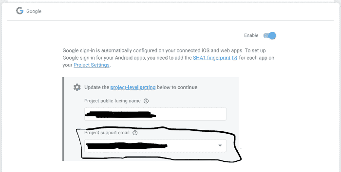
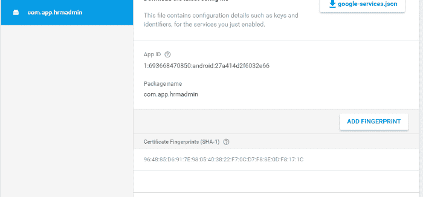
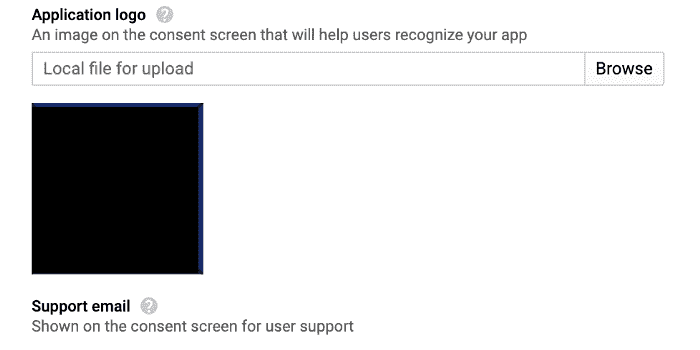

# 12500，一个安卓开发者的噩梦…

> 原文：<https://dev.to/gattalraouf/12500-an-android-developer-s-nightmare-1i3b>

我正在开发一个 Android 应用程序，它使用 Firebase 认证服务为脸书和谷歌提供登录，所以我开始编码，涵盖了文档推荐的所有内容。做完所有事情后，我很乐观，认为一切都会很好，脸书做得很好，但谷歌登录应用了众所周知的说法:

> 第一次从来没有成功过

起初我认为这只是一个偶然的错误，并试图理解它，我显然检查了 Stackoverflow，GitHub 问题和官方文档，但它浪费了我很多时间，没有解决方案，这促使我写了一篇关于如何修复它的文章…

## 调试错误

### 尝试 1:检查我是否错过了在 Firebase 上启用 Google 登录

虽然我 100%确定我确实启用了它，但我还是检查了，我所要做的就是前往我的 Firebase 控制台，选择我的应用程序，并在身份验证登录方法下，检查谷歌登录是否启用。

**—假设被驳回👎**

### 尝试 2:检查是否配置了项目支持电子邮件

在谷歌搜索了一番后，我发现应该提供支持电子邮件以便登录工作，我知道我没有配置它，所以我应用了以下过程来添加它:
在 Firebase 控制台的我的应用程序中，在身份验证登录方法下，并启用了谷歌登录，我选择了谷歌登录选项。最后添加了支持邮件。

添加了支持邮件后，我很乐观，修复了问题，重新构建了应用程序并再次测试，但令人惊讶的是 12500 再次出现…
**——假设被驳回👎**

### 尝试 3:检查 SHA-1(证书指纹)配置是否正确

沿着我的问题原因的谷歌搜索过程，SHA-1 问题出现了几次，但我确信它配置良好，我优先考虑其他假设，无论如何，在所有之前的尝试都没有解决问题(浪费我的时间)后，我决定检查 SHA-1 作为最后的希望…
我非常绝望地使用几种方法来再生 SHA-1，(你可以检查[这个](https://medium.com/pen-bold-kiln-press/sha-1-android-studio-ec02fb893e72)或[官方文档](https://developers.google.com/android/guides/client-auth)，以便双重或三重检查 SHA-1。常识告诉我们，SHA-1 在每一次尝试中都是一样的…

要将 SHA-1 添加到您的应用程序中，您可以勾选[此](https://stackoverflow.com/questions/39144629/how-to-add-sha-1-to-android-application/47783568)。

PS:确保每次更改 SHA-1 时更新 google-services.json 文件。
总之，不管我把 SHA-1 换了多少次，12500 一直显示…
**——假设被驳回👎**

### 尝试 4:在[谷歌云平台](https://console.developers.google.com/apis/)控制台中为您的项目添加应用程序徽标

做了以上所有事情后，我对解决问题失去了希望，甚至开始考虑启动一个新项目，希望不再面临这个问题，但我决定利用社区的力量寻求帮助，我在几个 slack 工作区发布了这个问题，并在等待其他事情，直到有人回复建议在我的 Firebase 应用程序的配置中添加一个徽标，我从未想过会导致这样的错误，但我还是尝试了一下，因为我没有其他选择，我做了以下事情:

在我的谷歌云平台上，选择我的项目后，在左侧导航栏上，在凭据 OAuth 同意屏幕下，我向下滚动到应用程序徽标部分，并添加了一张随机图片来测试它，然后单击保存，尝试我手机中已经存在的应用程序调试版本，它确实有效。

我至今不知道为什么，但是 Firebase 应用的 logo 似乎是 Google 签到必备的东西…
**—假设是 Eurêka！！！👍**

## 最后的想法

如您所见，找到错误的原因并不容易。这是推动你跳出框框思考的时刻之一，并且肯定让你相信这个社区是多么的有帮助。

这些是我从这次经历中学到的一些经验:

*   错误消息既不 100%正确也不清晰。(显示没有详细信息的 12500 错误没有任何帮助)。
*   仔细阅读 Android 文档并不容易，但它非常重要，因此你可以理解它是如何工作的，但有时它们可能一点帮助也没有。
*   作为一名开发人员，成为一名谷歌专家是至关重要的…开发人员社区非常感谢所有分享他们的经验并试图帮助任何需要帮助的人。
*   导致错误的并不总是逻辑上的东西，跳出框框思考，期待一切。
*   错误确实会浪费时间，但它们会给你一些教训和经验，你不能否认它们的重要性。

就这些，希望你喜欢，在某个时候觉得有用。我真的很感激你的反馈，如果你需要任何帮助，只要给我一个 DM。