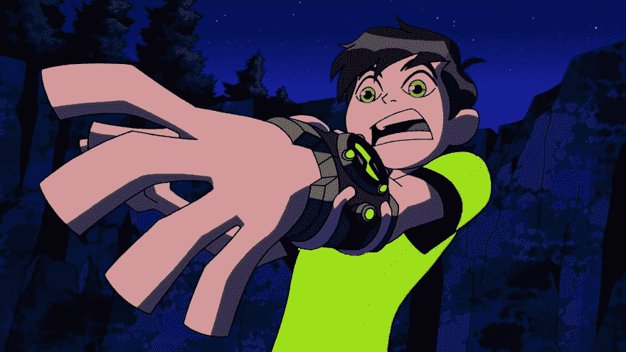
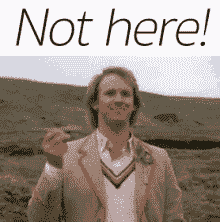

# AYDT - 03(你是做这个的)-编程和案例。

> 原文：<https://dev.to/chintukarthi/aydt-03-are-you-doing-this-programming-and-cases-1enj>

本，一个普通的大学毕业生，找到了他的第一份工作。然后，他的一个队友向他介绍了他们应用程序的代码库。

你猜怎么着我不想解释本的反应，我想让你直接看到他的反应。

[](https://res.cloudinary.com/practicaldev/image/fetch/s--sn0DkirG--/c_limit%2Cf_auto%2Cfl_progressive%2Cq_auto%2Cw_880/https://thepracticaldev.s3.amazonaws.com/i/fgw34xyvaaypowf2ynmx.png)

很酷吧？🤣

为什么他的脸和他第一次见到 Omnitrix 时一样？

我们来看看这背后的原因。

欢迎来到本系列的第三集:你在做 This❓.吗如果你还没有读过以前的文章，我强烈推荐你看看那些。你肯定会喜欢的💙。快乐编码👨🏻‍💻。

上一周链接:
[https://dev . to/chintukarthi/aydt-02-你正在做这一步走向忍者之地-5gm0](https://dev.to/chintukarthi/aydt-02-are-you-doing-this-one-step-towards-ninja-land-5gm0)

**你在做 This❓-编程和案例**

为什么本看到源代码时会抓狂？

这是因为他遇到了一些奇怪的单词，就像这样，

```
# This is a ruby file containing a function called first_omnitrix.

module AzmuthFromOmniverse

  NO_HARM = '0'
  IS_HARMFUL = '1'

  def first_omnitrix(person)
    return IS_HARMFUL if person!= 'ben'
  end
end 
```

<svg width="20px" height="20px" viewBox="0 0 24 24" class="highlight-action crayons-icon highlight-action--fullscreen-on"><title>Enter fullscreen mode</title></svg> <svg width="20px" height="20px" viewBox="0 0 24 24" class="highlight-action crayons-icon highlight-action--fullscreen-off"><title>Exit fullscreen mode</title></svg>

等等。什么？

Ben 是一个有编程背景的孩子，但是这些代码太疯狂了。为什么世界上有人会使用这种会引起很多混乱的混合字母呢？

亲爱的，不要冲动。你并不孤单😅。

在 Ruby 中，这很常见。许多不熟悉 ruby 的人一开始会觉得这很奇怪(去过那里。🥶)，但稍后你会在理解引擎盖下的含义时绕过你的方法。

**为什么使用案例？**

案例是区分事物的唯一标准。比如说，类对函数对变量。

有趣吧？😋

来，我们深入了解一下🏄🏻‍♂️

首先要做的事。

**1)茶包:**

[](https://res.cloudinary.com/practicaldev/image/fetch/s--8IiaNum2--/c_limit%2Cf_auto%2Cfl_progressive%2Cq_auto%2Cw_880/https://thepracticaldev.s3.amazonaws.com/i/gvt96hjutkl6sen9tffi.jpg)

ruby 中的 CamelCases 用于模块、类和包含定义等地方。

```
# This is a module with include.

module AzmuthFromOmniverse
  include OmnitrixPrototype
    ... something goes here ...
  end
end 
```

<svg width="20px" height="20px" viewBox="0 0 24 24" class="highlight-action crayons-icon highlight-action--fullscreen-on"><title>Enter fullscreen mode</title></svg> <svg width="20px" height="20px" viewBox="0 0 24 24" class="highlight-action crayons-icon highlight-action--fullscreen-off"><title>Exit fullscreen mode</title></svg>

上述代码中使用的名为“AzmuthFromOmniverse”和“OmnitrixPrototype”的名称称为 CamelCase。

你看，一般来说，当我们在一个句子中使用单词时，我们用空格来区分它们。但是在编程中，尤其是在 ruby 中，我们不使用空格作为模块名。相反，我们以大写字母开头，后面跟着另一个以大写字母开头的单词，没有任何空格。

这就是众所周知的骆驼案。

**2)蛇 _ 案例:**

[](https://res.cloudinary.com/practicaldev/image/fetch/s--qeFFLjQe--/c_limit%2Cf_auto%2Cfl_progressive%2Cq_auto%2Cw_880/https://thepracticaldev.s3.amazonaws.com/i/zzjhrc17mziwfp6q2m6a.jpg)

哇，那是蛇兄弟。这和代码有什么关系？

snake_case 顾名思义它有起伏，表面有些平坦。在下面的代码片段中，您可以对蛇的情况有所了解。

```
# Example method

def first_omnitrix
  return 'true'
end 
```

<svg width="20px" height="20px" viewBox="0 0 24 24" class="highlight-action crayons-icon highlight-action--fullscreen-on"><title>Enter fullscreen mode</title></svg> <svg width="20px" height="20px" viewBox="0 0 24 24" class="highlight-action crayons-icon highlight-action--fullscreen-off"><title>Exit fullscreen mode</title></svg>

大多数情况下，ruby 使用 snake_case 来定义一个名为“def”的函数。这些用于在用户端产生视觉效果，以便他/她可以通过查看案例本身来区分代码。

这就是所谓的蛇案

**3)死刑案件**

抱歉，我的标题很粗鲁。这不是有意冒犯🤭。通常使用大写字母被认为是大喊大叫。

[](https://res.cloudinary.com/practicaldev/image/fetch/s--KgpRGs-_--/c_limit%2Cf_auto%2Cfl_progressive%2Cq_66%2Cw_880/https://thepracticaldev.s3.amazonaws.com/i/kan5aoj25xrn6mhwhdln.gif)

不在这里。不在编码里。

大写字母或大写字母用于表示 ruby 中的常量。

```
# Example of Capital case

module AzmuthFromOmniverse

  IS_HARMFUL = '1'

  def first_omnitrix
    return IS_HARMFUL
  end
end 
```

<svg width="20px" height="20px" viewBox="0 0 24 24" class="highlight-action crayons-icon highlight-action--fullscreen-on"><title>Enter fullscreen mode</title></svg> <svg width="20px" height="20px" viewBox="0 0 24 24" class="highlight-action crayons-icon highlight-action--fullscreen-off"><title>Exit fullscreen mode</title></svg>

这里，IS _ habital 是常数。它将 string、int 或任何其他类型的输入作为输入。

这就是所谓的大写字母。

**奖励提示:**

您可能已经错过了我在编写一段代码时节省两行代码的部分。

仔细阅读我在本文中给出的所有代码片段，找出是哪一个。

已经找到了？🤓

这:

```
return IS_HARMFUL if person!= 'ben' 
```

<svg width="20px" height="20px" viewBox="0 0 24 24" class="highlight-action crayons-icon highlight-action--fullscreen-on"><title>Enter fullscreen mode</title></svg> <svg width="20px" height="20px" viewBox="0 0 24 24" class="highlight-action crayons-icon highlight-action--fullscreen-off"><title>Exit fullscreen mode</title></svg>

不熟悉 ruby 的人通常会这样写:

```
if(person) != 'ben' {
  return IS_HARMFUL
} 
```

<svg width="20px" height="20px" viewBox="0 0 24 24" class="highlight-action crayons-icon highlight-action--fullscreen-on"><title>Enter fullscreen mode</title></svg> <svg width="20px" height="20px" viewBox="0 0 24 24" class="highlight-action crayons-icon highlight-action--fullscreen-off"><title>Exit fullscreen mode</title></svg>

看，节省了两行😎。

想知道更多吗？

你知道答案，等到下周吧😉。

这就是本周的总结。🧙周围的人再见🏻‍♂️.

封面图片提供:[https://www.codeninja.com.sg/](https://www.codeninja.com.sg/)