# 使用数据流将数据从不知何处转移到 SSIS 的 Neo4j

> 原文：<https://dev.to/cskardon/using-a-data-flow-to-move-data-from-who-knows-where-to-neo4j-in-ssis-4fd7>

在迅速成为一系列的帖子中，我们来看看 Neo4j 的 SSIS 组件包中的另一个组件。[上一篇文章](https://dev.to/cskardon/neo4j-ssis-connecting-and-executing-cypher-in-a-control-flow-5f60-temp-slug-8430168)着眼于在控制流中使用“执行密码任务”,但这并不太有用，我的意思是——它对于删除数据库、添加索引等操作来说很棒,但当我们想要从一个数据源到另一个数据源获取数据时，我们必须让所有的数据流动起来。

我的原则是，你已经看完了上一篇文章，我将从我们停止的地方继续，我不会为我的假设道歉。

## 清除 DB

我应该提到——请检查您连接到哪个数据库实例——没有什么比删除您的生产数据库更能说明“问题”了。

让我们首先将 Neo4j 实例清空回空状态，运行:

```
MATCH (n) DETACH DELETE n 
```

<svg width="20px" height="20px" viewBox="0 0 24 24" class="highlight-action crayons-icon highlight-action--fullscreen-on"><title>Enter fullscreen mode</title></svg> <svg width="20px" height="20px" viewBox="0 0 24 24" class="highlight-action crayons-icon highlight-action--fullscreen-off"><title>Exit fullscreen mode</title></svg>

在浏览器中。

## 清除包裹

我们不再需要执行密码任务，所以选择它——按 Delete 键，或者鼠标右键——这是你的选择

<figure>[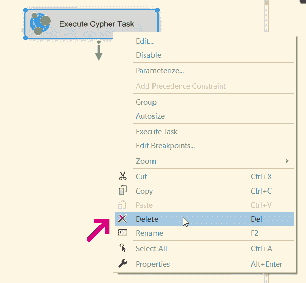](https://res.cloudinary.com/practicaldev/image/fetch/s--RA8RXF-g--/c_limit%2Cf_auto%2Cfl_progressive%2Cq_auto%2Cw_880/https://xclave.co.uk/wp-content/uploads/2019/07/image-14.png) 

<figcaption>删除鼠标方式</figcaption>

</figure>

## 咱们数据流(任务)！

将数据流任务拖到控制流工作区上:

[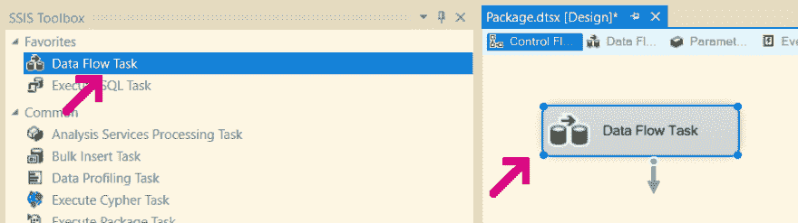](https://res.cloudinary.com/practicaldev/image/fetch/s--fIZc_6jf--/c_limit%2Cf_auto%2Cfl_progressive%2Cq_auto%2Cw_880/https://xclave.co.uk/wp-content/uploads/2019/07/image-15.png)

双击要带到数据流工作区的任务，该工作区将是空的。因此，让我们将“平面文件源”拖到空间中:

[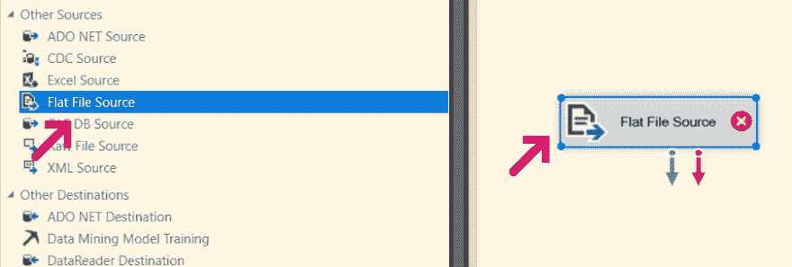](https://res.cloudinary.com/practicaldev/image/fetch/s--XYrGwlZn--/c_limit%2Cf_auto%2Cfl_progressive%2Cq_auto%2Cw_880/https://xclave.co.uk/wp-content/uploads/2019/07/image-16.png)

双击平面文件源，编辑器就会弹出。我们需要添加一个新的连接管理器，所以请按“新建…”

[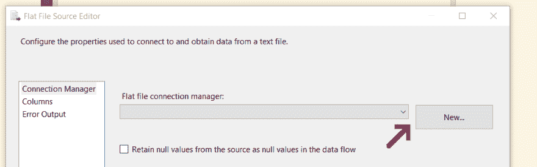](https://res.cloudinary.com/practicaldev/image/fetch/s--luwlX0NN--/c_limit%2Cf_auto%2Cfl_progressive%2Cq_auto%2Cw_880/https://xclave.co.uk/wp-content/uploads/2019/07/image-17.png)

现在，我们想使用一个 CSV 文件，你可以通过从[下载这个链接](https://anabranch-my.sharepoint.com/%E2%9D%8C/g/personal/cskardon_anabranch_co_uk/EdRCjAVnCmxCk_JiJRMbOfwBkTiCbrL3FDSskFVyQxJbNg?e=8Nn1sh)来使用我所使用的文件，恐怕它不是很令人兴奋，只是一些名字 [](https://res.cloudinary.com/practicaldev/image/fetch/s--2EAkP1Kt--/c_limit%2Cf_auto%2Cfl_progressive%2Cq_auto%2Cw_880/https://s.w.oimg/core/emoji/12.0.0-1/72x72/1f642.png) 无论如何——填写与你的文件相匹配的细节(这张图片中的那些与我的文件相匹配，我唯一改变的是代码页是 65001 (UTF-8))

[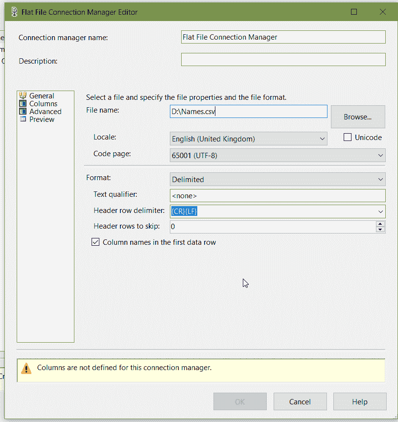](https://res.cloudinary.com/practicaldev/image/fetch/s--h1E8TNS6--/c_limit%2Cf_auto%2Cfl_progressive%2Cq_auto%2Cw_880/https://xclave.co.uk/wp-content/uploads/2019/07/image-18.png)

然后点击左侧的“列”位，确保一切正常，然后按“确定”。您将返回到“平面文件源编辑器”，现在您也应该单击此处的“列”部分:

[](https://res.cloudinary.com/practicaldev/image/fetch/s--sJfKTXzR--/c_limit%2Cf_auto%2Cfl_progressive%2Cq_auto%2Cw_880/https://xclave.co.uk/wp-content/uploads/2019/07/image-19.png)

确保至少在这里检查了名字/姓氏——显然，如果您使用自己的文件——选择您的列！按确定并返回工作区。

现在将“执行密码目标”任务拖到工作区:

[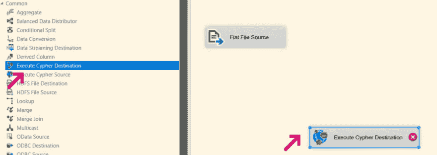](https://res.cloudinary.com/practicaldev/image/fetch/s--d2QE09uu--/c_limit%2Cf_auto%2Cfl_progressive%2Cq_auto%2Cw_880/https://xclave.co.uk/wp-content/uploads/2019/07/image-20-1024x363.png)

从平面文件源拖动“蓝色箭头”,并将其附加到执行密码任务:

[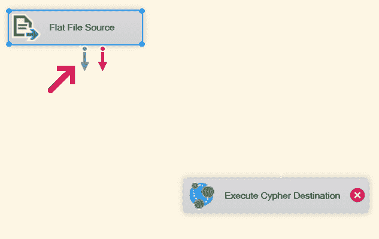](https://res.cloudinary.com/practicaldev/image/fetch/s--Kf8w6Au---/c_limit%2Cf_auto%2Cfl_progressive%2Cq_auto%2Cw_880/https://xclave.co.uk/wp-content/uploads/2019/07/image-22.png)

然后，右键单击执行密码任务，并选择“显示高级编辑器…”

[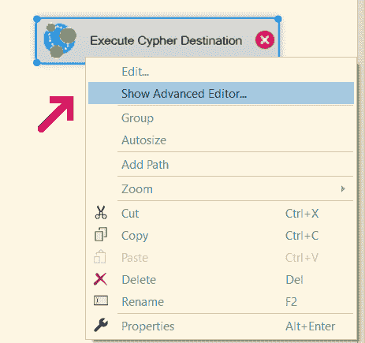](https://res.cloudinary.com/practicaldev/image/fetch/s--6Im57ecF--/c_limit%2Cf_auto%2Cfl_progressive%2Cq_auto%2Cw_880/https://xclave.co.uk/wp-content/uploads/2019/07/image-21.png)

首先，设置连接管理器，我们希望使用现有的 Neo4j 连接管理器

[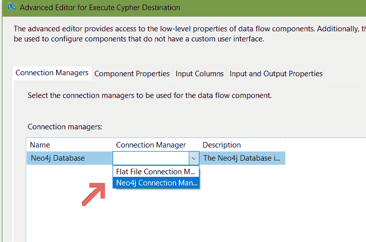](https://res.cloudinary.com/practicaldev/image/fetch/s--nIBSgHjM--/c_limit%2Cf_auto%2Cfl_progressive%2Cq_auto%2Cw_880/https://xclave.co.uk/wp-content/uploads/2019/07/image-23.png)

然后，我们要选择“输入列”，现在只需选择它们:

[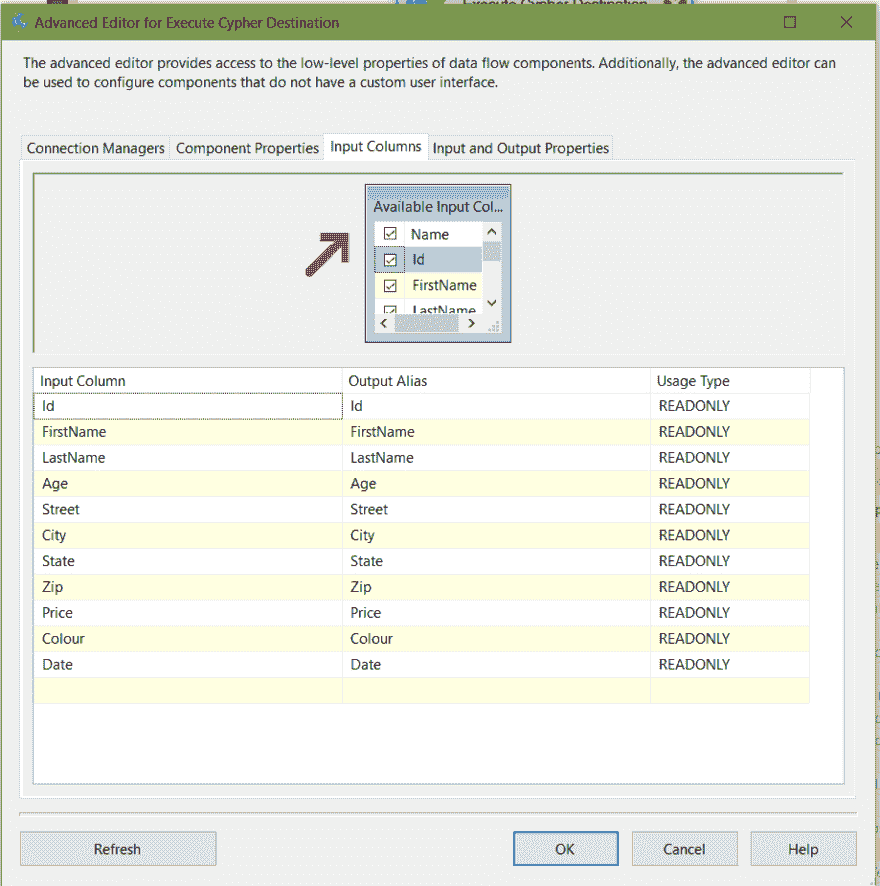](https://res.cloudinary.com/practicaldev/image/fetch/s--EDPmYpHP--/c_limit%2Cf_auto%2Cfl_progressive%2Cq_auto%2Cw_880/https://xclave.co.uk/wp-content/uploads/2019/07/image-24.png)

按 OK，然后双击执行密码任务，以获得密码编辑器

[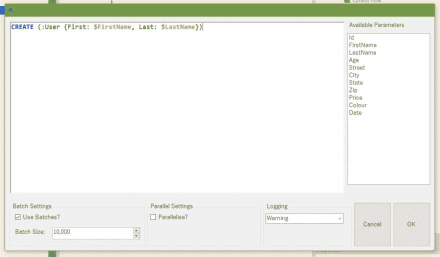](https://res.cloudinary.com/practicaldev/image/fetch/s--9x65SqzX--/c_limit%2Cf_auto%2Cfl_progressive%2Cq_auto%2Cw_880/https://xclave.co.uk/wp-content/uploads/2019/07/image-25-1024x598.png)

添加我上面的密码:

```
CREATE (:User {First: $FirstName, Last: $LastName}) 
```

<svg width="20px" height="20px" viewBox="0 0 24 24" class="highlight-action crayons-icon highlight-action--fullscreen-on"><title>Enter fullscreen mode</title></svg> <svg width="20px" height="20px" viewBox="0 0 24 24" class="highlight-action crayons-icon highlight-action--fullscreen-off"><title>Exit fullscreen mode</title></svg>

然后按确定。

## 做一些 SSISing！

现在，剩下要做的就是按下 Start(或右键-执行任务),这是你的喜好！

[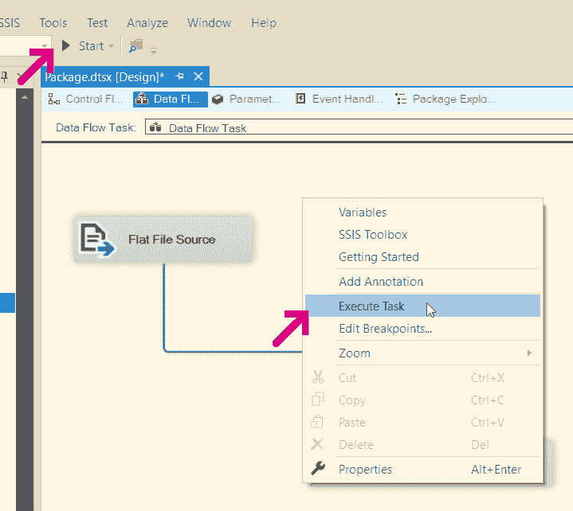](https://res.cloudinary.com/practicaldev/image/fetch/s--UP0urkcz--/c_limit%2Cf_auto%2Cfl_progressive%2Cq_auto%2Cw_880/https://xclave.co.uk/wp-content/uploads/2019/07/image-26.png)

它将运行，并为您提供以下内容:

[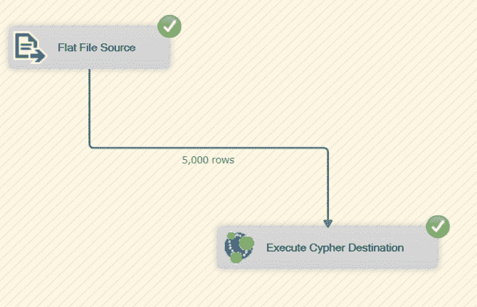](https://res.cloudinary.com/practicaldev/image/fetch/s--hwX7WjpR--/c_limit%2Cf_auto%2Cfl_progressive%2Cq_auto%2Cw_880/https://xclave.co.uk/wp-content/uploads/2019/07/image-27.png)

您可以通过运行:
在您的数据库中检查它

```
MATCH (n) RETURN COUNT(n) 
```

<svg width="20px" height="20px" viewBox="0 0 24 24" class="highlight-action crayons-icon highlight-action--fullscreen-on"><title>Enter fullscreen mode</title></svg> <svg width="20px" height="20px" viewBox="0 0 24 24" class="highlight-action crayons-icon highlight-action--fullscreen-off"><title>Exit fullscreen mode</title></svg>

[](https://res.cloudinary.com/practicaldev/image/fetch/s--zzywRojo--/c_limit%2Cf_auto%2Cfl_progressive%2Cq_auto%2Cw_880/https://xclave.co.uk/wp-content/uploads/2019/07/image-28.png)

现在事情变得更有趣了，因为我们从不同的来源提取数据并放入数据库，显然 SSIS 支持来源的*加载*—

这些控件目前处于公开测试阶段，要注册获得这些控件，请前往:[http://bit.ly/neo4jssis](http://bit.ly/neo4jssis)