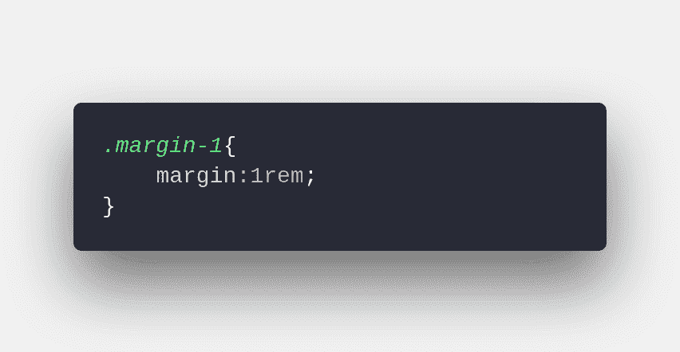
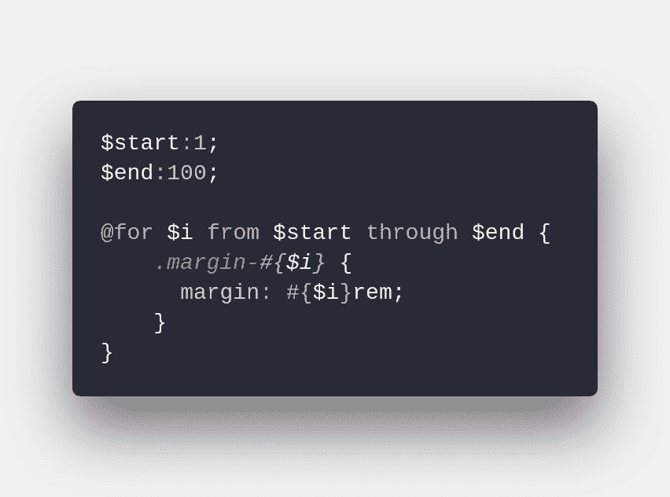
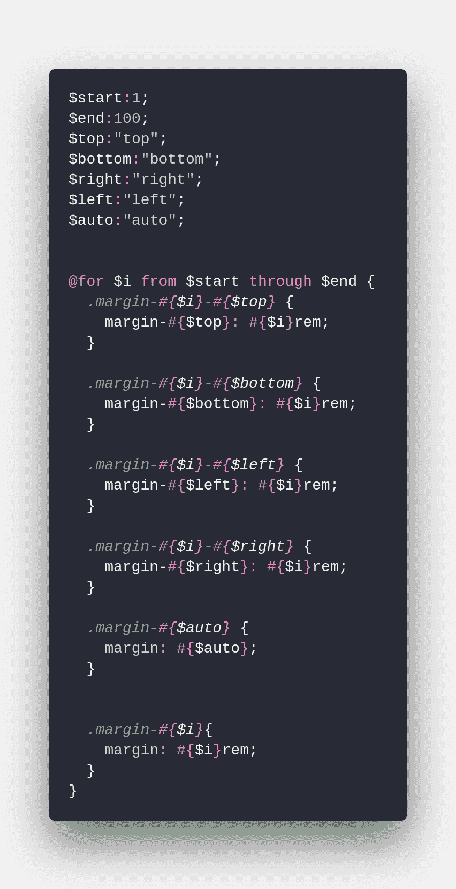
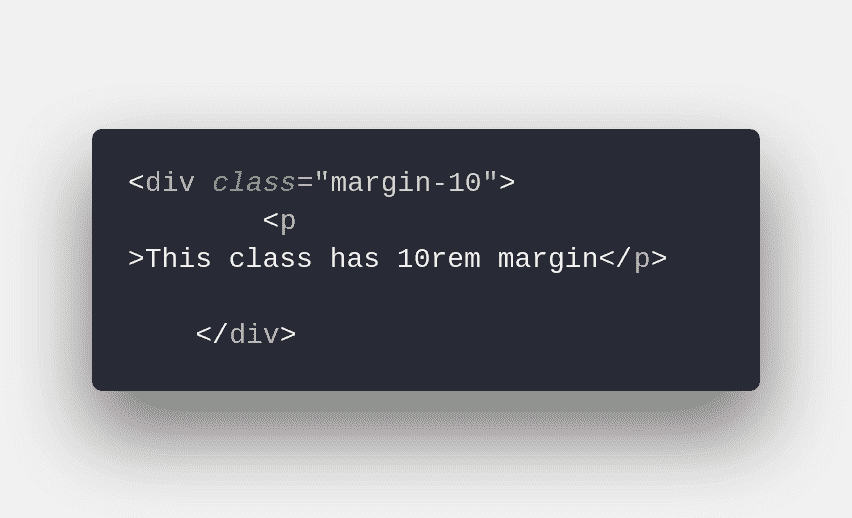

# 使用 SASS 创建有变化的类可以节省时间

> 原文：<https://dev.to/rock_67/save-time-using-sass-to-create-classes-with-variations-59n9>

上周，我遇到了一个问题。

我需要在 HTML 中定义一个类，根据最后一个字符给我一个边距。但这最后一个字符并不总是相同的，也不是应用边距的位置。

我想要一个类，可以是 margin-top-1，或 bottom，或 left 或 right，最后一个数字从 1 到 5 rem。我已经在用 SCSS 了，但是我不知道该怎么做。

上帝知道我在寻找一个答案，但仍然找不到应该如何去做。也许我谷歌错了，但我现在知道了答案，而且我不局限于边缘。
现在我到处都用这个。
让我们看看我是怎么做到的。

我们都经历过。我们需要创建一个具有不同变体的类，这样我们就可以在 HTML 中使用它们。尽管 SCSS 可以帮我们省下很多工作，但它仍然是重复的，仍然是令人厌烦的。有时候，避免重复任务的最好方法是做重复性的工作。
如何？你问。
通过一个@for 指令。

假设你需要定义一个 CSS 类，在你的 HTML 中使用一些变量。假设您想要定义类 margin-(number)，这个数字就是实物的价值。大概是这样的:

如果你只想定义。margin-1 没有必要进行循环。你可以简单地写成这样，但是，为了这篇文章，我们假设你想要定义一路到 100 雷姆的边距。这就是 SAAS 的美妙之处。

您可以定义一个起点、一个终点和一个@for 指令来遍历这些数字。

所以，让我们看看它看起来怎么样！

仅此而已。编译之后，就好像你写了 300 多行代码。

我不会在这里张贴完整的 CSS，因为它太大了，但是如果你不打开你的文本编辑器，自己尝试一下，你就会明白了。现在你可以随心所欲地在 HTML 上使用 margin 类了。

但是如果我想定义顶部或者底部或者其他的呢？那么，在这种情况下，你应该定义变量，并创建其他类。

仍然可以使用相同的指令。唯一的区别是你需要定义上、下、左、右和自动。但是最后还是和我们上面做的一样。你可以用这个做任何事情。

开始吧，用大约 30 行代码，你已经编译了一个超过 2000 行的 CSS 文件。

可能性是无穷的，你可以用它来处理几乎所有的属性，宽度，高度，你能想到的。
玩得开心！