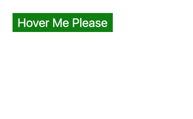

# 你的按钮在悬停时变宽是因为你改变了它们的字体粗细？下面是解决这个问题的方法。

> 原文：<https://dev.to/mimafogeus2/your-buttons-get-wider-on-hover-because-you-change-their-font-weight-here-s-how-to-solve-this-4bhi>

**所以，**不久前，我不得不实现一个设计，要求按钮在悬停时改变它们的`font-weight`。这里有一个问题:

[](https://res.cloudinary.com/practicaldev/image/fetch/s--PbOTBlFt--/c_limit%2Cf_auto%2Cfl_progressive%2Cq_66%2Cw_880/https://thepracticaldev.s3.amazonaws.com/i/u6r9z0ftiy010hz7dqbg.gif)

可以试试这里:
[https://codepen.io/mimafogeus/embed/RXwaYL?height=600&default-tab=result&embed-version=2](https://codepen.io/mimafogeus/embed/RXwaYL?height=600&default-tab=result&embed-version=2)

这种宽度变化是不好的。它通过推动相邻的元素来破坏布局，宽度变化本身就让人感觉跳动，这一切都导致了不愉快的用户体验。这可能不是设计师的本意。

让我们解决这个问题。

# 设定恒定宽度

在 CSS 中设置按钮的宽度是这里最好也是最简单的解决方案...如果只有几个宽度，你应该设置。

```
// Button definition
.constant-width-button {
    width: 120px;
    /* Colors and shape and position and stuff */
}

// Modifier class
.constant-width-button--larger {
    width: 240px;
} 
```

Enter fullscreen mode Exit fullscreen mode

然而，如果你正在制作一个可重用的按钮，它具有依赖于文本的动态宽度，那么调整一个合适的边距值是一个很大的麻烦。用不同的字体也容易破损。我是这样解决的:

# 用 CSS 复制标签

[https://codepen.io/mimafogeus/embed/jgOybj?height=600&default-tab=result&embed-version=2](https://codepen.io/mimafogeus/embed/jgOybj?height=600&default-tab=result&embed-version=2)

## TL；速度三角形定位法(dead reckoning)

*   我们使用 CSS 创建一个不可见的伪元素，其中包含粗体文本。此元素拉伸按钮，当您不将鼠标悬停在按钮上时，按钮现在具有较大的宽度。
*   我们用一个 span 包装元素的文本，并使用绝对定位将它放在它的父按钮上。
*   **🎉🎉🎉问题已解决🎉🎉🎉**

## 你会得到一个:

*   正常工作的按钮组件。
*   规范、有效的 HTML，无论有无样式都可以正确显示，无论您使用什么阅读器。

**我们来看一下代码:**

## HTML

```
<button type="button" data-label="Hover Me Please" class="button">
  <span class="button__label">
    Hover Me Please
  </span>
</button> 
```

Enter fullscreen mode Exit fullscreen mode

HTML 中有两个主要的附加内容:

*   标签周围增加了一个额外的`span`。我们需要它来应用一些 CSS。
*   标签被复制到一个`data-`属性中。这将在一个`:before`伪元素中使用。理论上，您可以使用相同的属性生成一个`:after`元素，并删除 span 和它的内容，但是这不是语义性的——如果 CSS 无法加载，按钮就不会有任何标签。

## CSS

### 按钮本身没怎么变:

*   我们添加了`position: relative`，这样我们可以在孩子身上使用绝对定位，而不会让他们溢出。
*   我们将填充值移动到变量中，这样我们就可以重用它们并清楚地了解它:

```
:root {
  --vertical-padding: 5px;
  --horizontal-padding: 10px;
}

.button {
  padding: var(--vertical-padding) var(--horizontal-padding);
  position: relative;

  // Design
  background: green;
  border: none;
  color: #fff;
  font-size: 24px;
}

.button:hover {
  font-weight: bold;
} 
```

Enter fullscreen mode Exit fullscreen mode

### 伪元素:

*   从数据标签中获取文本。
*   以粗体显示。
*   是隐藏的，但是它的盒子仍然影响它的周围。

```
.button:before {
  content: attr(data-label);
  font-weight: bold;
  visibility: hidden;
} 
```

Enter fullscreen mode Exit fullscreen mode

### 标签:

*   绝对定位
*   适合按钮的内容区域。

```
.button__label {
  position: absolute;
  top: var(--vertical-padding);
  bottom: var(--vertical-padding);
  left: var(--horizontal-padding);
  right: var(--horizontal-padding);
} 
```

Enter fullscreen mode Exit fullscreen mode

# 示例:React 中的实现

如果你使用这个逻辑，它可能会在你的代码中重复出现。我在一个组件中使用了它，这允许我处理标签复制和封装样式。我在我的项目中使用了 CSS 模块，但是你可以使用任何你喜欢的样式方法。
还要注意，这个例子假设按钮的标签是一个字符串，而不是其他的 React 元素。

```
import React from 'react'

import styles from './MyButton.module.scss'

export default ({ children, className, ...restOfProps }) => {
  const buttonClassNames = className ? `${styles.button}  ${className}` : styles.button

  return (
    <button type='button' className={buttonClassNames} data-text={children} {...restOfProps}>
      <span className={styles.button__label}>{children}</span>
    </button>
  )
} 
```

Enter fullscreen mode Exit fullscreen mode

# 结论

作为一个坚持干净 HTML 的人，不喜欢在每次重用组件时都做 CSS 调整，这是目前为止我找到的解决这个问题的最好方法。如果你有更好的，请在评论中告诉我:)

# 感谢

[Amir Grozki](https://github.com/gerev) ，提出了复制标签的想法，并讨论了最佳实施方案。