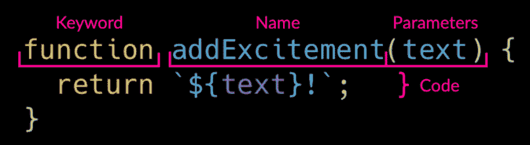

# 声明 Javascript 函数

> 原文：<https://dev.to/raddevon/declaring-javascript-functions-2amc>

在本系列关于 Javascript 函数的前一篇文章中，我谈到了[Javascript 中的函数如何像足球中的一场比赛](https://raddevon.com/articles/your-apps-playbook-why-use-functions-in-javascript/)。在这篇文章中，我将向你展示**如何在你的应用程序中声明一个**，这样你就可以开始在你的代码中使用它。

## 喜欢写出你的剧本

声明一个函数**就像在剧本**中写出你的剧本。一旦你声明了它，你就可以通过名字来“调用”它，你的应用程序会准确地知道该做什么。下面是一个基本函数声明的各个部分。

[](https://res.cloudinary.com/practicaldev/image/fetch/s--OKK_5-yp--/c_limit%2Cf_auto%2Cfl_progressive%2Cq_auto%2Cw_880/https://raddevon.com/wp-content/uploads/2019/07/function-declaration-diagram-1024x282.png)

## 部分功能声明

让我们来看看这个简单函数中通过用感叹号返回文本来使文本更加精彩的部分。

### 功能关键字

`function` **关键字**告诉 Javascript 后面的**是函数**的声明。

### 名称

函数的**名**是**，你以后会用它来称呼它**。它应该不同于同一范围内的任何其他函数和变量。(在后面的文章中会有更多关于作用域的内容。)名称不能与任何一个 [Javascript 关键字](https://developer.mozilla.org/en-US/docs/Web/JavaScript/Reference/Lexical_grammar#Keywords)完全相同。

在本例中，您将调用名为`addExcitement`的函数。

### 参数

**参数**允许你**添加新信息**当你调用你的函数来影响结果的时候。参数列在函数名后面的括号内。在这个示例函数中，您提供了想要变得激动人心的文本，该函数将在末尾添加一个感叹号并返回它。

调用函数时你提供的数据叫做**一个参数**。这意味着，相同的数据有两个名字:参数和变量。

回到我们的体育类比:想想足球中的传球。如果你扔了球，那就是“传球”，但是如果你接住了球，那就是“接球”。**同一个东西的两个名字**，就像形参/实参一样。实参就像 pass，因为你在传入数据，而形参就像 catch，因为函数在获取并使用数据。函数声明有参数，函数调用有自变量。

我为参数选择的名字`text`并不神奇。这个名字可能是任何类似于`dog`或`love`的东西。不过，这并不是很好，因为当你阅读它的时候，它会让你更难理解这个函数。

您会注意到参数的名称在返回行的实际代码中重复出现。每当您在函数中使用参数名称时，该名称将在调用函数时被参数数据替换。如果我调用这个函数并传入一个字符串`'Hey'`作为参数的自变量，那么我在返回行中使用文本的地方将被那个字符串`'Hey'`替换。如果代码包含其他文本实例，这些也会被替换为`"Hey"`。(需要说明的是，代码实际上并没有改变，但是当函数运行时，Javascript 会将参数视为作为实参传递的数据。这有点像 Javascript 运行时变量的值。)

这个函数只有一个参数，但是一个函数可以有两个、三个或者任意多个参数。要有多个参数，只需在括号内添加新的参数名，在每个参数名之间加一个逗号。您可以在函数代码中使用每一个参数，当调用函数时，每一个参数都将被其对应的参数“替换”。

对应的实参是与形参位置相同的实参。如果我有这个函数，它只记录了三个参数:

```
function logAll(param1, param2, param3) {
  console.log(param1);
  console.log(param2);
  console.log(param3);
} 
```

Enter fullscreen mode Exit fullscreen mode

我这样称呼它:`logAll('everybody', 'dance', 'now')`

该函数将按照我传递参数的顺序记录参数，因为`'everybody'`对应于`param1`，因为它们都在第一个位置，`'dance'`对应于`param2`，而`'now'`对应于`param3`。参数与相同位置的参数匹配，然后函数运行，用匹配的参数替换参数。

如果我把函数改成这样:

```
function logAll(param1, param2, param3) {
  console.log(param2);
  console.log(param3);
  console.log(param1);
} 
```

Enter fullscreen mode Exit fullscreen mode

和以前一样调用它，函数现在将首先记录`'dance'`，因为它是对应于第一个被记录的参数`param2`的参数。然后，它将记录对应于`param3`的`'now'`，接着记录对应于`param1`的`'everybody'`。

### 代码

在您关闭参数的括号后，您将打开一组花括号，其中包含您的函数代码。任何你可以在函数外面写*的代码，你都可以在*函数里面写*。无论你在花括号中写了什么代码，每次函数被调用时都会被执行。*

函数可以是单行代码、1，000 行代码或介于两者之间的任何代码。一般来说，你希望你的每一个职能部门做**一项工作**。这将使您的代码更容易阅读，您的应用程序或网站更容易调试。这意味着，大部分功能将在较短的一边。

你的函数代码可以访问一个特殊的关键字，这个关键字*在函数体之外*不起作用:`return`。当一个函数返回值时，当代码运行时，你对该函数的调用将被你的值所替代。如果我们看前面的`addExcitement`例子，你会看到一个返回值的函数。

如果我们调用这个`addExcitement`函数而不做任何其他事情，那么产生的令人兴奋的文本将会消失在空气中。如果我们想对产生的令人兴奋的文本做些什么，我们可以将它捕获到一个变量中，如下所示:

```
const excitingText = addExcitement('Hey'); 
```

Enter fullscreen mode Exit fullscreen mode

这将留给我一个名为`excitingText`的变量，它包含函数返回的值——在本例中是`'Hey!'`。

如果我以后不需要使用函数返回的值，但是我现在需要记录它，我可以这样做。

```
console.log(addExcitement('Hey'); 
```

Enter fullscreen mode Exit fullscreen mode

这段代码将记录我们的函数返回的值，即“嘿！”

简单地像这样调用函数:

```
addExcitement('Hey'); 
```

Enter fullscreen mode Exit fullscreen mode

将返回值，但是因为它没有被记录、捕获到变量中或者添加到 DOM 中，所以您实际上永远看不到它的结果。

函数可以直接返回值，也可以返回任何解析为值的东西(称为**表达式**)。这意味着你可以返回`13`或者`12 + 1`或者一个变量或者一个条件，比如`text.length > 1`。

虽然函数*可以*返回值，但它们不是必须的。我在文章中使用的另一个例子——`logAll`函数不返回值。相反，它有一个**副作用**。通过调用`console.log`，该函数将数据记录到 Javascript 控制台。

注意返回值的时机。一旦你从函数中返回一个值，这个函数就结束了。你返回之外的代码永远不会执行。

有时，您可能在一个`if`语句中有一个条件返回。在这种情况下，如果条件不满足，在`return`之后可能还有代码被执行，但是要注意`return`是函数的硬停止。

## 其他方式申报

现在你已经知道了函数声明的各个部分，我们可以看看其他一些声明函数的方法。

### 函数表达式

声明函数的函数表达式方法看起来与函数声明非常相似，只是您将声明赋给了一个变量。

```
const addExcitement = function(text) {
  return `${text}!`;
} 
```

Enter fullscreen mode Exit fullscreen mode

这种声明函数方式的主要区别在于，有了函数声明，函数就被**吊起**。这意味着函数实际上是在 Javascript 的顶部定义的，而不是在代码中实际出现的地方。

如果我试图在代码中定义函数的位置上方调用函数，那么如果我使用函数声明来声明，它将按预期工作。如果我使用一个函数表达式来声明，它将抛出一个异常，因为这个函数还不在我们的应用程序中。

### 箭头功能

一个**箭头函数**是一种新类型的函数表达式，具有更紧凑的语法。当用返回的单行代码声明一个函数时是这样的:

```
const addExcitement = (text) => `${text}!`; 
```

Enter fullscreen mode Exit fullscreen mode

如您所见，与声明函数的其他方法相比，它非常简洁。它们之所以被称为箭头函数，是因为表达式中使用了粗箭头(`=>`)。对于像这样只有一个参数的 arrow 函数，可以通过省略参数名两边的括号来使它们更加简洁。如果有多个参数，括号是必需的。

在这样的单行箭头函数中，箭头后的表达式会自动返回，而不需要使用`return`关键字。

如果加上花括号，箭头函数也可以是多行。

```
const logAll = (param1, param2, param3) => {
  console.log(param1);
  console.log(param2);
  console.log(param3);
} 
```

Enter fullscreen mode Exit fullscreen mode

像其他函数语法一样，多行箭头函数不返回值，除非它前面有`return`关键字。

arrow 函数中的值`this`可能不同于以其他方式声明的函数。`this`是 Javascript 中的一个值，根据引用它的上下文而变化。默认情况下，它引用包含对此的引用的对象。由于函数是一个对象，默认情况下，函数内部的`this`通常会引用该函数，这并不是很有用。

将函数作为对象属性来编写是很常见的。你可能想在函数内部使用`this`(现在称为**方法**，因为它存在于一个对象上)来引用对象而不是函数本身。这里有一个例子。

```
const devon = {
  email: 'devon@raddevon.com',
  sendEmail: function(emailBody) {
    email.send(this.email, emailBody)
  }
} 
```

Enter fullscreen mode Exit fullscreen mode

对象`devon`有两个属性:`email`包含我的电子邮件地址作为字符串，方法`sendEmail`使用虚构的`email`对象的 send 方法通过引用对象自己的 email 属性使用`this.email`给我发送电子邮件。

出于这个例子的目的，我们假设我们有一个可以访问的 email 对象，这个对象有一个 send 方法，在给定两个参数的情况下发送电子邮件:要发送的电子邮件的地址和正文。

这里的问题是，即使我们有虚构的`email`对象**，代码也不会工作**。这是因为 sendEmail 方法中的`this`引用了没有`email`属性的`sendEmail`方法本身。

但是，如果我们将该方法写成一个箭头函数，它会将声明该函数的上下文中的当前值`this`绑定到函数中的值`this` *。换句话说，**就是我们声明函数的`this`，它也将成为函数**内部的`this`。*

如果你想写一个*没有*引用`this`作为箭头函数的函数，那就去写吧。在那种情况下，箭头功能的这个属性根本不会影响到你。

箭头函数在很多情况下都很方便。其中最常见的就是**回调函数**。如果你想了解这些，去 [Rad Devon](https://raddevon.com/) 吧，在那里你有机会参加一个免费的辅导会议，并在新文章发布时得到通知。

## 本系列文章

1.  [你的应用手册:为什么要使用 Javascript 函数](https://raddevon.com/articles/your-apps-playbook-why-use-functions-in-javascript/)
2.  声明 Javascript 函数
3.  [了解 Javascript 回调函数](https://raddevon.com/articles/javascript-callback-functions/)
4.  [Marie Kondo 您的带有函数的 Javascript 代码](https://raddevon.com/articles/marie-kondo-your-javascript-code-with-functions/)