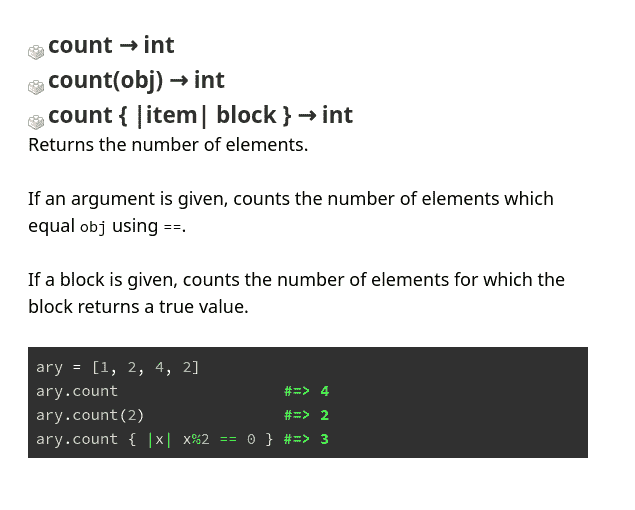

# 学习 Ruby 内部的有用资源

> 原文：<https://dev.to/tanguyandreani/useful-resources-when-studying-ruby-s-internals-485>

每当我想了解 Ruby 的某个特定部分时，我会列出一些我访问的地方。

## Github 上的 Ruby MRI

链接:[https://github.com/ruby/ruby](https://github.com/ruby/ruby)

整个源代码都镜像在那里。在这里，您可以了解该语言是如何实现的。

例如，如果我们想了解`Array`类，我们可以在`array.c`中查找。

假设我对数组#count 方法感兴趣:

```
static VALUE
rb_ary_count(int argc, VALUE *argv, VALUE ary)
{
    long i, n = 0;

    if (rb_check_arity(argc, 0, 1) == 0) {
    VALUE v;

    if (!rb_block_given_p())
        return LONG2NUM(RARRAY_LEN(ary));

    for (i = 0; i < RARRAY_LEN(ary); i++) {
        v = RARRAY_AREF(ary, i);
        if (RTEST(rb_yield(v))) n++;
    }
    }
    else {
        VALUE obj = argv[0];

    if (rb_block_given_p()) {
        rb_warn("given block not used");
    }
    for (i = 0; i < RARRAY_LEN(ary); i++) {
        if (rb_equal(RARRAY_AREF(ary, i), obj)) n++;
    }
    }

    return LONG2NUM(n);
}

// ...

rb_define_method(rb_cArray, "count", rb_ary_count, -1); 
```

Enter fullscreen mode Exit fullscreen mode

## Ruby Spec 套件

链接:[https://github.com/ruby/spec](https://github.com/ruby/spec)

假设我对数组#count 方法感兴趣:

```
describe "Array#count" do
  it "returns the number of elements" do
    [:a, :b, :c].count.should == 3
  end

  it "returns the number of elements that equal the argument" do
    [:a, :b, :b, :c].count(:b).should == 2
  end

  it "returns the number of element for which the block evaluates to true" do
    [:a, :b, :c].count { |s| s != :b }.should == 2
  end
end 
```

Enter fullscreen mode Exit fullscreen mode

## Ruby-doc

链接:[https://ruby-doc.org/](https://ruby-doc.org/)

几乎每个版本的 Ruby MRI 的文档。

这是数组#count 的文档

[](https://res.cloudinary.com/practicaldev/image/fetch/s--9aTrK6ml--/c_limit%2Cf_auto%2Cfl_progressive%2Cq_auto%2Cw_880/https://thepracticaldev.s3.amazonaws.com/i/x0uyjmvgeinacslh8f2i.png)

## 鲁宾纽斯实现

链接:[https://github.com/rubinius/rubinius](https://github.com/rubinius/rubinius)

Rubinius 基本上是用 Ruby 实现的 Ruby。与最初的 C 实现相比，这很有趣。

例如，下面是数组#count:
的源代码

```
def count(item = undefined)
  seq = 0
  if !undefined.equal?(item)
    each do
      element = Rubinius.single_block_arg
      seq += 1 if item == element
    end
  elsif block_given?
    each { |element| seq += 1 if yield(element) }
  else
    each { seq += 1 }
  end
  seq
end 
```

Enter fullscreen mode Exit fullscreen mode

它看起来像是符合红宝石的规格吗？

## JRuby，JVM 上的 Ruby

链接:[https://github.com/jruby/jruby](https://github.com/jruby/jruby)

我不懂 Java，但是这个项目激励我去学习它。

下面是来自 JRuby 的`RubyArray.java` :
的数组#count 源代码

```
@JRubyMethod(name = "count")
public IRubyObject count(ThreadContext context, Block block) {
    if (block.isGiven()) {
        int n = 0;
        for (int i = 0; i < realLength; i++) {
            if (block.yield(context, elt(i)).isTrue()) n++;
        }
        return RubyFixnum.newFixnum(context.runtime, n);
    } else {
        return RubyFixnum.newFixnum(context.runtime, realLength);
    }
}

@JRubyMethod(name = "count")
public IRubyObject count(ThreadContext context, IRubyObject obj, Block block) {
    if (block.isGiven()) context.runtime.getWarnings().warn(ID.BLOCK_UNUSED, "given block not used");

    int n = 0;
    for (int i = 0; i < realLength; i++) {
        if (equalInternal(context, elt(i), obj)) n++;
    }
    return RubyFixnum.newFixnum(context.runtime, n);
} 
```

Enter fullscreen mode Exit fullscreen mode

这些是 Java 类 RubyArray 的方法。

## 奖金，邮件列表存档为 Ruby MRI

链接:[http://blade.nagaokaut.ac.jp/](http://blade.nagaokaut.ac.jp/)

* * *

总结:

*   [https://github.com/ruby/ruby](https://github.com/ruby/ruby)
*   [https://github.com/ruby/spec](https://github.com/ruby/spec)
*   [https://github.com/ruby/rubinius](https://github.com/ruby/rubinius)
*   [https://github.com/jruby/jruby](https://github.com/jruby/jruby)
*   [https://ruby-doc.com](https://ruby-doc.com)
*   [http://blade . nagokauut . AC . jp/](http://blade.nagaokaut.ac.jp/)

关于 gems 和它们的文档(题外话，但无论如何很酷):

*   [https://rubygems.org](https://rubygems.org)
*   [https://rubydoc.info/](https://rubydoc.info/)

有什么要补充的吗？