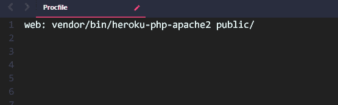
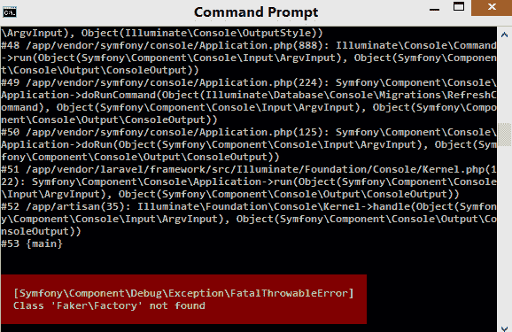

# 如何在 Heroku 上使用 MySQL 数据库托管 Laravel 应用程序

> 原文：<https://dev.to/nedsoft/how-to-host-a-laravel-app-with-mysql-database-on-heroku-52np>

本文概述了在 Heroku 上托管 Laravel 应用程序的一步一步的方法。它还解释了如何让 Heroku 上的应用程序与 MySQL 数据库一起工作，因为 Heroku 通常不支持 MySQL。在经历了一系列在 Heroku 上使用 MySQL 数据库托管我的 Laravel 测试应用程序的挑战后，我认为有必要写下这个主题。

### 要求

在本文中，我假设您已经为部署准备好了 Laravel 应用程序。将需要以下工具:

*   windows 的命令提示符或其他操作系统用户的等效命令提示符。
*   一个 Heroku 账户。如果你没有，点击这里创建一个帐户 Heroku 帐户。如果您没有点击这里创建帐户
*   Heroku 命令行界面(CLI)，Heroku 有它的 CLI 与之交互。你可以在这里下载一个

### [T1】简介](#intro)

Heroku 是为开发者提供免费托管服务的平台即服务之一。这使得开发人员能够在将应用程序转移到最终生产环境之前测试其性能。

这个平台的一个缺点是默认情况下它不提供 Mysql 服务器，但是当然，有一种方法可以解决这个问题，因为有其他平台也提供免费的 MySQL 服务器，比如 db4free(将在本文中使用)或 ClearDB addons 来弥补这个不足。

请跟随我解释如何在 Heroku 上托管您的 Laravel 应用程序，并从其他平台使用 MySQL 服务器服务。

**第一步**

打开命令提示符。导航到您的 Laravel 项目所在的目录。(注意 git bash 不支持 Heroku CLI)。通过运行以下命令登录您的 Heroku 帐户:

```
heroku login 
```

<svg width="20px" height="20px" viewBox="0 0 24 24" class="highlight-action crayons-icon highlight-action--fullscreen-on"><title>Enter fullscreen mode</title></svg> <svg width="20px" height="20px" viewBox="0 0 24 24" class="highlight-action crayons-icon highlight-action--fullscreen-off"><title>Exit fullscreen mode</title></svg>

**第二步**
运行以下命令:

```
git init  //to initialize a new repo
git add --all 
git commit -m "my first commit" 
```

<svg width="20px" height="20px" viewBox="0 0 24 24" class="highlight-action crayons-icon highlight-action--fullscreen-on"><title>Enter fullscreen mode</title></svg> <svg width="20px" height="20px" viewBox="0 0 24 24" class="highlight-action crayons-icon highlight-action--fullscreen-off"><title>Exit fullscreen mode</title></svg>

**第三步**

创建一个 Procfile。Heroku 启动了一个带有 PHP 的 Apache 服务器，从项目的根目录(在我们的例子中是 public/ folder)为应用程序提供服务。配置它需要一个 Procfile。

在项目的根目录下创建一个文件，并将其命名为 Procfile。注意不需要扩展名，字母 P 必须大写。复制下面的字符串并粘贴到您创建的 Procfile 中，然后保存它。

```
web: vendor/bin/heroku-php-apache2 public/ 
```

<svg width="20px" height="20px" viewBox="0 0 24 24" class="highlight-action crayons-icon highlight-action--fullscreen-on"><title>Enter fullscreen mode</title></svg> <svg width="20px" height="20px" viewBox="0 0 24 24" class="highlight-action crayons-icon highlight-action--fullscreen-off"><title>Exit fullscreen mode</title></svg>

Procfile 应该类似于下面的屏幕截图:

[](https://res.cloudinary.com/practicaldev/image/fetch/s--84UaJLAn--/c_limit%2Cf_auto%2Cfl_progressive%2Cq_auto%2Cw_880/https://thepracticaldev.s3.amazonaws.com/i/26vm1nzt551y7g0hstou.png)

或者，您可以运行下面的命令来创建 Procfile:

```
echo "web: vendor/bin/heroku-php-apache2 public/" > Procfile 
```

<svg width="20px" height="20px" viewBox="0 0 24 24" class="highlight-action crayons-icon highlight-action--fullscreen-on"><title>Enter fullscreen mode</title></svg> <svg width="20px" height="20px" viewBox="0 0 24 24" class="highlight-action crayons-icon highlight-action--fullscreen-off"><title>Exit fullscreen mode</title></svg>

然后跑，

```
git add Procfile
git commit -m "Heroku Procfile" 
```

<svg width="20px" height="20px" viewBox="0 0 24 24" class="highlight-action crayons-icon highlight-action--fullscreen-on"><title>Enter fullscreen mode</title></svg> <svg width="20px" height="20px" viewBox="0 0 24 24" class="highlight-action crayons-icon highlight-action--fullscreen-off"><title>Exit fullscreen mode</title></svg>

接下来是创建新的 Heroku 应用程序。

**第四步**
创建你的 heroku app 运行；

```
heroku create <myappname> 
```

<svg width="20px" height="20px" viewBox="0 0 24 24" class="highlight-action crayons-icon highlight-action--fullscreen-on"><title>Enter fullscreen mode</title></svg> <svg width="20px" height="20px" viewBox="0 0 24 24" class="highlight-action crayons-icon highlight-action--fullscreen-off"><title>Exit fullscreen mode</title></svg>

> 注:上面的`<myappname>`是你的域名。如果不加，Heroku 会给你生成一个 app 名。

接下来是指定应用程序的语言为 PHP。

**步骤 5**
创建一个 buildpack，将 PHP 指定为运行的 app 语言；

```
heroku buildpacks:set heroku/php 
```

<svg width="20px" height="20px" viewBox="0 0 24 24" class="highlight-action crayons-icon highlight-action--fullscreen-on"><title>Enter fullscreen mode</title></svg> <svg width="20px" height="20px" viewBox="0 0 24 24" class="highlight-action crayons-icon highlight-action--fullscreen-off"><title>Exit fullscreen mode</title></svg>

接下来是为 Heroku 环境上的 Laravel 应用程序生成一个应用程序密钥。

第六步
运行`php artisan key:generate --show`

复制生成的密钥并运行下面的命令，将 APP_KEY 值设置为您复制的密钥。

```
heroku config:set APP_KEY=<key generated above> 
```

<svg width="20px" height="20px" viewBox="0 0 24 24" class="highlight-action crayons-icon highlight-action--fullscreen-on"><title>Enter fullscreen mode</title></svg> <svg width="20px" height="20px" viewBox="0 0 24 24" class="highlight-action crayons-icon highlight-action--fullscreen-off"><title>Exit fullscreen mode</title></svg>

我们需要将错误日志设置为 Heroku 错误日志。

为此，转到`config/app.php`并设置`"log"=>"errorlog"`。

有了这个，你可以在 Heroku 仪表盘上查看你的应用错误日志。保存和 git 添加和提交。

是时候托管 app 了！☕️，拿一杯咖啡，喝一小口，然后进入下一步。

**第六步**

要将应用托管到 heroku，运行

```
git push heroku master --app <myappname> 
```

<svg width="20px" height="20px" viewBox="0 0 24 24" class="highlight-action crayons-icon highlight-action--fullscreen-on"><title>Enter fullscreen mode</title></svg> <svg width="20px" height="20px" viewBox="0 0 24 24" class="highlight-action crayons-icon highlight-action--fullscreen-off"><title>Exit fullscreen mode</title></svg>

> 注意:只有在 Heroku 上有多个应用程序时，才需要这个部分。

要从命令行启动应用程序，请运行

```
heroku open --app <myappname> 
```

<svg width="20px" height="20px" viewBox="0 0 24 24" class="highlight-action crayons-icon highlight-action--fullscreen-on"><title>Enter fullscreen mode</title></svg> <svg width="20px" height="20px" viewBox="0 0 24 24" class="highlight-action crayons-icon highlight-action--fullscreen-off"><title>Exit fullscreen mode</title></svg>

如果你的唯一目标是在没有数据库的情况下托管你的 Laravel 应用，那么你可以忽略下一节，直接跳到结论。

## 第二部分:将 Mysql 数据库集成到应用程序中

我们的下一个目标是给我们的应用程序添加一个 Mysql 数据库。有几个网站提供免费的 Mysql 服务器。但是对于本文，我们将使用 [db4free](https://db4free.net/) 。

步骤如下:

在 [db4free](https://db4free.net/) 上报名。注册后，邮件会提示您验证您的电子邮件。验证后，您将被重定向到一个页面，在那里您将看到以下数据:

```
Database: [database name you specified]
Username: [username you specified]
Email:    [your email] 
```

<svg width="20px" height="20px" viewBox="0 0 24 24" class="highlight-action crayons-icon highlight-action--fullscreen-on"><title>Enter fullscreen mode</title></svg> <svg width="20px" height="20px" viewBox="0 0 24 24" class="highlight-action crayons-icon highlight-action--fullscreen-off"><title>Exit fullscreen mode</title></svg>

**第二步**

转到您的 Laravel 项目，导航到`config/database.php`，用您之前创建的 db4free MySQL 数据库细节更新它，如下所示:

```
'mysql' => [
            'driver' => 'mysql',
            'host' => env('DB_HOST', 'db4free.net'),
            'port' => env('DB_PORT', '3306'),
            'database' => env('DB_DATABASE', 'your_database_name from_db4free'),
            'username' => env('DB_USERNAME', 'your_db4free_      username'),
            'password' => env('DB_PASSWORD', 'your_db4free_password'),
            'unix_socket' => env('DB_SOCKET', ''),
            'charset' => 'utf8mb4',
            'collation' => 'utf8mb4_unicode_ci',
            'prefix' => '',
            'strict' => true,
            'engine' => null,
        ], 
```

<svg width="20px" height="20px" viewBox="0 0 24 24" class="highlight-action crayons-icon highlight-action--fullscreen-on"><title>Enter fullscreen mode</title></svg> <svg width="20px" height="20px" viewBox="0 0 24 24" class="highlight-action crayons-icon highlight-action--fullscreen-off"><title>Exit fullscreen mode</title></svg>

省省吧。git 添加、提交并推送到 Heroku。

```
git add config/database.php
git commit -m "update database"
git push heroku master --app <myappname> 
```

<svg width="20px" height="20px" viewBox="0 0 24 24" class="highlight-action crayons-icon highlight-action--fullscreen-on"><title>Enter fullscreen mode</title></svg> <svg width="20px" height="20px" viewBox="0 0 24 24" class="highlight-action crayons-icon highlight-action--fullscreen-off"><title>Exit fullscreen mode</title></svg>

**第四步**

您需要使用 Heroku bash 来运行您的迁移。运行，

```
heroku run bash 
```

<svg width="20px" height="20px" viewBox="0 0 24 24" class="highlight-action crayons-icon highlight-action--fullscreen-on"><title>Enter fullscreen mode</title></svg> <svg width="20px" height="20px" viewBox="0 0 24 24" class="highlight-action crayons-icon highlight-action--fullscreen-off"><title>Exit fullscreen mode</title></svg>

接下来是运行您的迁移，确保您现在正在 Heroku bash 上运行后续命令。

```
php artisan migrate --app <myappname> 
```

<svg width="20px" height="20px" viewBox="0 0 24 24" class="highlight-action crayons-icon highlight-action--fullscreen-on"><title>Enter fullscreen mode</title></svg> <svg width="20px" height="20px" viewBox="0 0 24 24" class="highlight-action crayons-icon highlight-action--fullscreen-off"><title>Exit fullscreen mode</title></svg>

至此，您的数据库已经设置好了。如果您想要为数据库设定种子，那么您可以继续下面的步骤，如下所示:

**第五步**

```
php artisan db:seed --app <myappname> 
```

<svg width="20px" height="20px" viewBox="0 0 24 24" class="highlight-action crayons-icon highlight-action--fullscreen-on"><title>Enter fullscreen mode</title></svg> <svg width="20px" height="20px" viewBox="0 0 24 24" class="highlight-action crayons-icon highlight-action--fullscreen-off"><title>Exit fullscreen mode</title></svg>

如果你遇到一个类似下面截图的错误，不要惊慌，你已经得到了保护。😌

[](https://res.cloudinary.com/practicaldev/image/fetch/s--HSHF-xzR--/c_limit%2Cf_auto%2Cfl_progressive%2Cq_auto%2Cw_880/https://thepracticaldev.s3.amazonaws.com/i/1ue36p0hd6wryto2ibau.png)

要解决这个问题，请按照以下步骤操作:

*   转到您的 laravel 项目，导航到 composer.json
*   将“要求开发”中的“fzaninotto/faker”替换为“要求”
*   运行 Exit 退出 heroku bash
*   Git 添加并提交对项目的更改

```
git add composer.json
git commit -m "modified composer.json"
git push heroku master --app <myappname> 
```

<svg width="20px" height="20px" viewBox="0 0 24 24" class="highlight-action crayons-icon highlight-action--fullscreen-on"><title>Enter fullscreen mode</title></svg> <svg width="20px" height="20px" viewBox="0 0 24 24" class="highlight-action crayons-icon highlight-action--fullscreen-off"><title>Exit fullscreen mode</title></svg>

*   回到 Heroku bash，
*   Runheroku 跑吧
*   运行编写器安装
*   在 composer 安装完必要的依赖项后，通过运行以下命令继续迁移和播种您的数据库:

```
php artisan migrate:refresh --seed --force 
```

<svg width="20px" height="20px" viewBox="0 0 24 24" class="highlight-action crayons-icon highlight-action--fullscreen-on"><title>Enter fullscreen mode</title></svg> <svg width="20px" height="20px" viewBox="0 0 24 24" class="highlight-action crayons-icon highlight-action--fullscreen-off"><title>Exit fullscreen mode</title></svg>

嘣！现在一切正常！👯‍♂️

### 结论

你现在已经学会了如何在 Heroku 上运行你的 Laravel 应用程序。您还了解了如何整合 MySQL 服务器，使您的应用程序能够使用 MySQL 数据库。如果你想了解更多关于 Heroku 的信息，你可以访问 Heroku Docs。如果你也想从 Git 了解自动部署到 Heroku，点击[这里](https://devcenter.heroku.com/articles/github-integration#automatic-deploys)。

感谢您花时间阅读，我希望这篇文章对您有所帮助！

如果您有任何问题或贡献可以让这篇文章对社区更好，请随时联系我们。

*本文原载于[媒体](https://medium.com/@Oriechinedu/how-to-host-a-laravel-app-with-mysql-database-on-heroku-ab56b08be735)T3】*