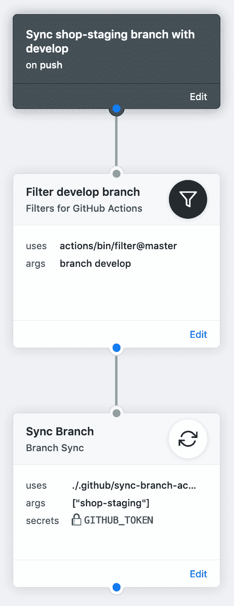

# 开发一个网站与反应，功能标志，Netlify 和 GitHub 的行动

> 原文：<https://dev.to/timon/developing-a-website-with-react-feature-flags-netlify-and-github-actions-2eld>

> **请注意:**这篇帖子是为 GitHub Actions v1 写的。GitHub Actions v2 已经发布，[反对工作流的 HCL 语法](https://github.blog/changelog/2019-09-17-github-actions-will-stop-running-workflows-written-in-hcl/)，这使得这篇博文的某些部分无法使用。要了解更多关于 GitHub Actions v2 的信息，请参考 Edward Thomson 的[文档](https://help.github.com/en/actions/automating-your-workflow-with-github-actions)和优秀的[帖子](https://www.edwardthomson.com/blog/github_actions_advent_calendar.html)。

最近几周，我帮助开发了一个非常令人兴奋的项目的网站，这个项目叫做本杰明的咖啡。本杰明咖啡是一个咖啡烘焙套件，允许任何人在家烘焙他们的咖啡，这保证了咖啡的新鲜度。该项目将很快在 Kickstarter 上推出。如果你想随时了解这个项目，你可以在 [Instagram](https://www.instagram.com/coffeebybenjamin/) 上关注他们，或者访问[网站](https://coffeebybenjamin.com/)。

这个项目是我在尴尬的最后一个项目，因为我很快将在另一家公司接受新的挑战。尽管我不会参与这个项目，但我仍然想分享一些关于我们利用 React、feature flags、Netlify 和 GitHub Actions 开发和发布网站的方法。

## 问题陈述

该网站将分以下三个阶段推出。我们目前处于第一阶段，但第二阶段即将完成。同时，我们已经开始了第三阶段的开发。

*   阶段 1:一个简单的登录页面，人们可以填写他们的电子邮件地址，以便在项目启动时得到通知。
*   第二阶段:一个完整的网站，包含更多关于该项目的信息，一个常见问题和一个支持表格。这将与 Kickstarter 活动一起推出。
*   第三阶段:将 Shopify 整合到网站中，直接销售产品。这将在项目成功获得资金和发货后启动。

尽管第三阶段要很久以后才会启动，但我们希望尽快开始这一阶段的开发，因为这是网站建设中最复杂的部分。这使得我们可以在商店功能发布前很久就开始测试它，并捕捉潜入网站的代价高昂的 bug。

现在我们可以在一个单独的分支中构建阶段 3，但是当我们更新阶段 2 的网站时，我们必须不断地更新和解决这个分支上的合并冲突。这尤其困难，因为有许多重叠的部分，我们将在第 3 阶段进行更改。此外，这将导致在第 3 阶段启动时不得不合并一个巨大的拉请求，这带来了现有功能中的错误风险。相反，我们希望逐步将阶段 3 的功能合并到主分支中，而不将其公开。我们还希望团队能够检查阶段 2 和阶段 3 的进展。最后，我们希望在第二阶段运行时完全排除第三阶段的任何代码，这样我们就不会发布任何不必要的代码。

在这篇文章的剩余部分，我将解释我们如何结合使用特性标志、Netlify 和 GitHub 动作来实现这些目标。

<figure>

[](https://res.cloudinary.com/practicaldev/image/fetch/s--Yw9pkHxZ--/c_limit%2Cf_auto%2Cfl_progressive%2Cq_auto%2Cw_880/https://thepracticaldev.s3.amazonaws.com/i/evod8hvfe3zz2lzbe66r.jpg)

<figcaption>The tray you'll get as part of the home roasting kit</figcaption>

</figure>

## 特征标志

问题陈述只是要求特性标志，这正是我们将要使用的。特性标志允许我们发布第 3 阶段的部分内容，但实际上并不会向公众展示。让我们来看看特性标志的定义:

> 发布切换允许不完整和未测试的代码路径作为潜在代码被发布到产品中，这些代码可能永远不会被打开。
> 
> — [功能切换，皮特·霍奇森](https://martinfowler.com/articles/feature-toggles.html)

特性标志的好处在于，它允许您通过切换开关在新旧功能之间切换。通常你可以这样做，把新的功能包装在这样的条件中:

```
function Header() {
  if (USE_NEW_FEATURE) {
    return <NewHeader />;
  }

  // feature flag is not enabled
  return <OldHeader />;
} 
```

在受特性标志影响的代码中，您将添加新代码而不替换旧代码。这允许具有新的但是重叠的功能的拉请求被合并，因为它们不会替换任何现有的功能。稍后，当特性标志被淘汰时，您可以移除条件并移除任何旧代码。

让我们看看如何在堆栈中实现这一点。

## 创建 React 应用程序中的特征标志

我们可以通过使用环境变量[来实现特性标志，这些变量创建了 React 应用程序的现成支持](https://facebook.github.io/create-react-app/docs/adding-custom-environment-variables)。使用环境变量的好处是它们易于使用，并且是编译时常数，这意味着由检查标志是否被启用的条件保护的代码将被完全排除在标志被禁用的构建之外。

Create React App 中的环境变量可以在一个`.env`文件中提供。`.env`文件将包含要使用的缺省值，并被登记到 Git 中，只有在第 3 阶段上线时才会被更改。

`.env` :

```
 REACT_APP_SHOPIFY_INTEGRATION_ENABLED=false 
```

现在我们可以使用`App.js`中的特征标志来有条件地渲染商店路线。通过使用编译时常数有条件地呈现商店路线，代码不会在产品包中结束，除非启用了该标志，并且用户将无法路由到这些页面。页面的代码仍然会出现在产品包中，稍后会详细介绍。

`src/App.js` :

```
import React, { Suspense } from 'react';
// ... more imports hidden
import Home from 'pages/Home';
import Shop from 'pages/shop';
import Cart from 'pages/cart';
import ProductDetail from 'pages/product-detail';

const App = () => (
  <Router>
    <Switch>
      <Route exact path="/" component={Home} />
      <Route path="/faq" component={Faq} />
      <Route path="/support" component={Support} />
      {process.env.REACT_APP_SHOPIFY_INTEGRATION_ENABLED === 'true' && (
        <>
          <Route path="/shop" component={Shop} />
          <Route path="/cart" component={Cart} />
          <Route path="/product/:productId" component={ProductDetail} />
        </>
      )}
    </Switch>
  </Router>
);

ReactDOM.render(<App />, document.getElementById('root')); 
```

现在我们已经设置了特性标志，开发者可以添加一个`.env.local`(或者任何一个[支持的`.env`文件](https://facebook.github.io/create-react-app/docs/adding-custom-environment-variables#what-other-env-files-can-be-used))，它不会被签入 git。

`.env.local` :

```
REACT_APP_SHOPIFY_INTEGRATION_ENABLED=true 
```

## 配置网络寿命

现在只有开发人员可以通过在本地签出并更改`.env.local`中的环境变量来查看 Shopify 集成，那么其他人可能想通过一个简单的链接来查看该站点呢？这就是 Netlify 的用武之地。Netlify 允许开发人员配置每个分支的构建设置，所有分支都将使用唯一的 URL 进行部署(独立于部署预览)，我将让 Netlify 文档来说明这一点:

> 分支部署发布到一个 URL，该 URL 将分支名称作为前缀。例如，如果一个分支称为暂存，它将部署到暂存-yoursitename.netlify.com。

**注意:**您可能需要手动设置分支部署设置来部署所有分支，这在 [Netlify 文档](https://www.netlify.com/docs/continuous-deployment/#branch-deploy-controls)中有说明。

我们可以在 Git 中添加一个名为`shop-staging`的分支，并配置`netlify.toml`来构建这个启用了`REACT_APP_SHOPIFY_INTEGRATION_ENABLED`特性标志的分支。

`netlify.toml` :

```
[build]
  publish = "build"
  command = "npm run build"

[context."shop-staging"]
  command = "REACT_APP_SHOPIFY_INTEGRATION_ENABLED=true npm run build" 
```

以`REACT_APP_SHOPIFY_INTEGRATION_ENABLED=true`作为构建命令的前缀将覆盖`.env`中的设置。启用了功能标志的站点现在将自动部署到车间-暂存-yoursitename.netlify.com。我们现在可以把这个网址给测试人员，他们将能够检查第三阶段的进展，他们仍然可以通过访问开发-yoursitename.netlify.com 来检查第二阶段的进展。您还可以使用这种方法为某些拉取请求启用部署预览的功能标志。

但是还有一个问题，`shop-staging`分支必须与主分支保持同步(在我们的例子中是`develop`)。幸运的是，GitHub 提供了一个扩展的 API，它提供了一种为分支进行[快速更新](https://developer.github.com/v3/git/refs/#update-a-reference)的方法，这允许我们将`shop-staging`分支与`develop`分支保持同步。我们所要做的就是向它提供我们想要更新的 ref(`heads/shop-staging`)和开发分支上最新提交的提交 SHA，然后`shop-staging`将与`develop`分支同步。此外，我们可以通过使用 GitHub Actions 来自动化这个过程！

## 创建 GitHub 动作以保持分支同步

GitHub 动作，就像 shell 命令一样，非常容易组合。通过组合一些预定义的动作，您可以完成很多事情。在这种情况下，我们技术上只需要[滤波器动作](https://github.com/actions/bin/tree/master/filter)和[动作](https://github.com/actions/bin/tree/master/curl)。但是我无法让`cURL`动作接受带有插值的 JSON 主体，所以我们将创建自己的。

有两种方法可以创建 GitHub 动作，你可以创建一个包含该动作的单独的资源库，这样其他项目就可以重用该动作。但是对于那些你不会重用的小东西，你可以直接在存储库中创建一个动作，你的项目的其余代码就在存储库中。

我们首先创建一个文件夹`.github`，在其中我们创建一个名为`branch-sync-action`的文件夹。然后我们必须创建一个`Dockerfile`，内容是从`cURL`动作中复制的，我们只是改变了一些标签。这个`Dockerfile`确保我们可以使用`cURL`，我们将用它来进行 HTTP 调用。

`.github/branch-sync-action/Dockerfile`

```
FROM debian:stable-slim

LABEL "com.github.actions.name"="Branch Sync"
LABEL "com.github.actions.description"=""
LABEL "com.github.actions.icon"="refresh-cw"
LABEL "com.github.actions.color"="white"

COPY entrypoint.sh /entrypoint.sh

RUN apt-get update && \
    apt-get install curl -y && \
    apt-get clean -y

ENTRYPOINT ["/entrypoint.sh"] 
```

接下来，我们创建一个`entrypoint.sh`，它是运行动作时将执行的脚本。

`.github/branch-sync-action/entrypoint.sh`

```
#!/bin/sh

TARGET_BRANCH=$1

curl \
  -X PATCH \
  -H "Authorization: token $GITHUB_TOKEN" \
  -d "{\"sha\": \"$GITHUB_SHA\"}" \
  "https://api.github.com/repos/$GITHUB_REPOSITORY/git/refs/heads/$TARGET_BRANCH" 
```

`$1`代表提供给脚本的第一个参数。为了清楚起见，我们将其命名为`TARGET_BRANCH`。

别忘了通过做`chmod +x entrypoint.sh`来提供执行权限。

动作本身就是这样。现在我们必须将它连接到一个工作流程中:

`.github/main.workflow`

```
workflow "Sync shop-staging branch with develop" {
  on = "push"
  resolves = ["Sync Branch"]
}

action "Filter develop branch" {
  uses = "actions/bin/filter@master"
  args = "branch develop"
}

action "Sync Branch" {
  needs = ["Filter develop branch"]
  uses = "./.github/sync-branch-action"
  secrets = ["GITHUB_TOKEN"]
  args = ["shop-staging"]
} 
```

在`.github/main.workflow`中，我们定义了项目的工作流程。工作流决定运行哪些操作以及何时运行。在`workflow`块中，我们通过定义`on`属性来告诉它何时运行，在我们的例子中，工作流应该为每个`push`事件运行，我们还通过定义`resolves`属性来定义它应该(并行)执行的动作。

接下来，我们定义过滤器动作。GitHub 将为任何分支的每次推送发送一个`push`事件，我们想添加一个过滤器，以便当有人推送至`develop`分支时，我们只同步`shop-staging`分支，我们对任何其他分支的推送不感兴趣。在`uses`参数中，我们指向提供这个动作的 [GitHub 存储库](https://github.com/actions/bin)的 slug，在本例中是这个存储库(过滤器)中的文件夹。`@master`部分告诉它使用发布在主分支上的代码。

最后，我们添加将`shop-staging`分支与`develop`分支同步的动作。它定义了`needs`参数，该参数告诉 GitHub Actions 它应该首先运行过滤操作，只有在过滤操作成功的情况下才继续执行`Sync Branch`。此外，我们定义了`uses`参数，该参数将指向包含 GitHub 操作用来运行它的`Dockerfile`和`entrypoint.sh`的文件夹。我们还将`GITHUB_TOKEN`作为一个秘密传递给它，我们需要它来进行一个经过认证的 HTTP 调用，`GITHUB_TOKEN`是为 GitHub 上的每个项目唯一生成的令牌。最后，我们为`entrypoint.sh`提供参数，它应该同步到哪个目标分支。

我们将得到这样一个流程图:

[](https://res.cloudinary.com/practicaldev/image/fetch/s--AQAfyG-T--/c_limit%2Cf_auto%2Cfl_progressive%2Cq_auto%2Cw_880/https://thepracticaldev.s3.amazonaws.com/i/vr4etpfh33kmpjm3fekr.png)

需要注意的是，同步只是单向的。推送到`develop`的所有内容都将被快进到`shop-staging`，如果你推送到`shop-staging`什么都不会发生，这将导致未来同步的问题，因为更新不能再快进了。您可以通过启用`cURL`请求中的 [`force`参数](https://developer.github.com/v3/git/refs/#update-a-reference)或使用`git reset`重置`shop-staging`分支来解决这个问题。

## 懒装店路线

我们仍然需要解决的最后一个问题是，在第 2 阶段运行时，从捆绑包中排除第 3 阶段相关的代码。我们可以利用 React 去年发布的一些新特性来解决这个问题: [`React.lazy`](https://reactjs.org/docs/code-splitting.html#reactlazy) 和`Suspense`。我们必须对代码做的改动非常小，我们必须通过利用`React.lazy`和动态导入来改变导入商店页面的方式:

`src/App.js` :

```
import React, { Suspense } from 'react';
// ... more imports hidden
import Home from 'pages/Home';
const Shop = React.lazy(() => import('pages/shop'));
const Cart = React.lazy(() => import('pages/cart'));
const ProductDetail = React.lazy(() => import('pages/product-detail'));

const App = () => (
  <Suspense fallback={<div>Loading...</div>}>
    <Router>
      <Switch>
        <Route exact path="/" component={Home} />
        <Route path="/faq" component={Faq} />
        <Route path="/support" component={Support} />
        {process.env.REACT_APP_SHOPIFY_INTEGRATION_ENABLED === 'true' && (
          <>
            <Route path="/shop" component={Shop} />
            <Route path="/cart" component={Cart} />
            <Route path="/product/:productId" component={ProductDetail} />
          </>
        )}
      </Switch>
    </Router>
  </Suspense>
);

ReactDOM.render(<App />, document.getElementById('root')); 
```

现在，商店页面将不会出现在主包中，而是在用户点击其中一条商店路线时被延迟加载。这在标志未启用时是不可能的。所有的路由都包装在一个`Suspense`组件中，该组件负责在访问一个延迟加载的路由时显示一个回退状态，因为下载包仍然需要一些时间。如果你想了解更多关于代码拆分(在 React 中)的知识，我可以推荐优秀的 [React 文档](https://reactjs.org/docs/code-splitting.html)。

## 演示

我在这篇文章中创建了一个代码的简化示例，你可以在这里查看:[https://github.com/TimonVS/sync-branch-demo](https://github.com/TimonVS/sync-branch-demo)。您可以克隆它并将提交推送到主分支，以查看车间准备分支将自动保持同步。

## 结论

我们对这种方法很满意。GitHub 的动作被认为是非常灵活的。如果 Netlify 支持这种开箱即用的用例，事情会变得更简单，但既然不是这样，同步两个分支也不是太糟糕。

这篇文章中描述的方法也可以在使用 Netlify 内置的分割测试时使用，它允许你测试一个网站的两个(或更多)变种。这不是我们自己在使用的东西，但是分割测试会带来问题陈述中描述的同样的问题。

最后，我必须指出，我们目前只使用一个特性标志。如果您希望使用大量的功能标志，这种方法可能无法很好地扩展，因为您可能希望为所有标志组合部署单独的中转站点。

烘焙快乐！