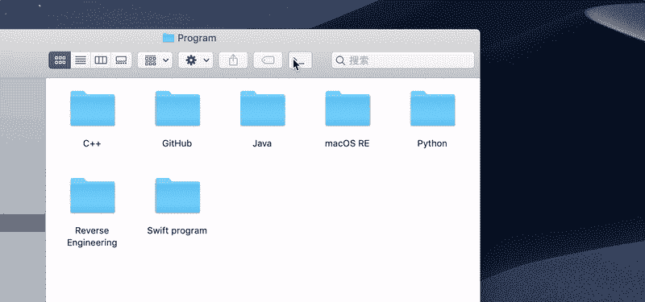
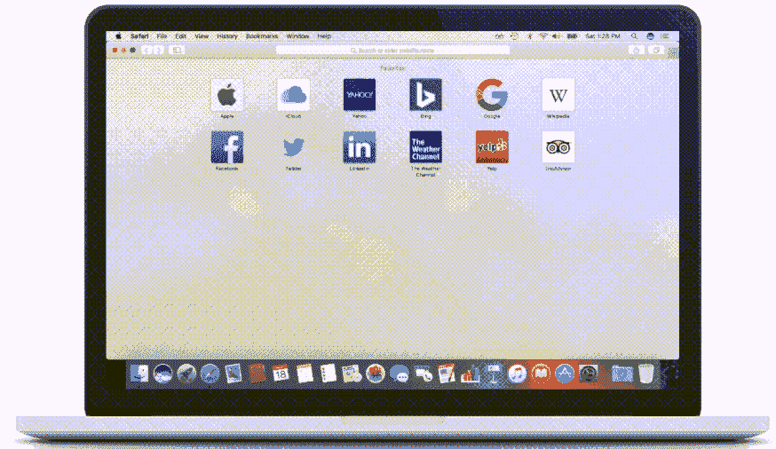
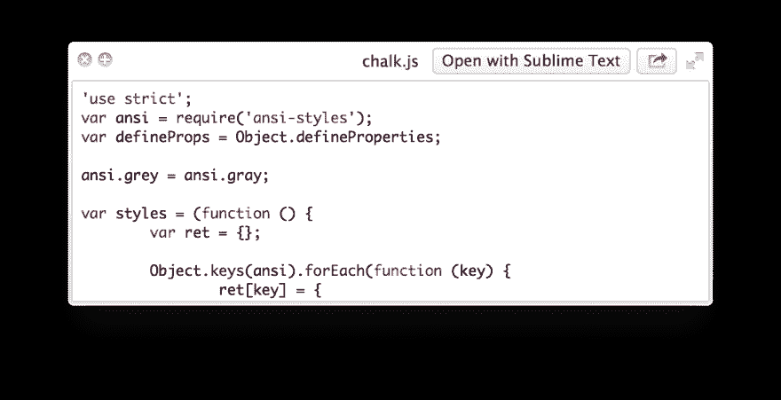
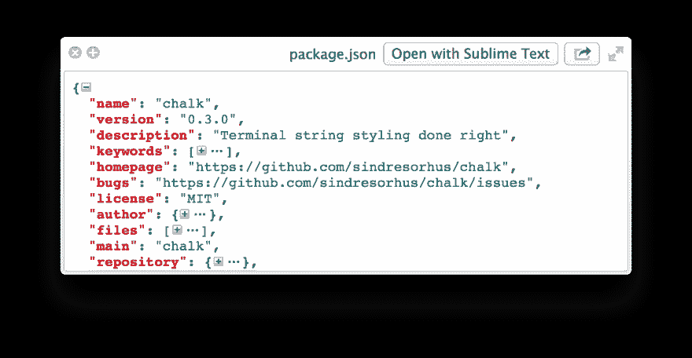

# 适合所有人的 6 款 mac 应用

> 原文：<https://dev.to/sobolevn/6-mac-apps-that-fit-everyone-4b7o>

**最初发表于我的博客**:【https://sobolevn.me/2019/07/6-best-mac-apps T2】

你经常会看到一些你不会用的很棒的应用程序或者不适合你的应用程序。

这个不一样。这个列表包含了简单却非常强大的生产力提升工具，完全适合每个人。

**TLDR** :这是我正在使用的所有 mac 应用程序的列表，它们可以在我的[点文件](https://github.com/sobolevn/dotfiles/blob/master/Brewfile#L126-L164)中找到，还有我其余的设置。

以前的相关文章:

1.  [命令行生产力](https://sobolevn.me/2017/08/instant-command-line-productivity)
2.  [使用更好的 CLI](https://sobolevn.me/2017/10/using-better-clis)

## 数据

那是来自 [@sindresorhus](https://github.com/sindresorhus) 的新项目。这很简单，却很神奇。
出于某种原因，传统的 mac 时钟不显示日期和日历。
因此，当有人问你今天是几号时，你必须打开日历应用程序。真的吗？

这个 app 解决了。这只是一个改进的时钟，带有日历和时区。

这是一款新应用，刚刚发布:

> Sindre Sorhus[@ sindresorhus](https://dev.to/sindresorhus)宣布我最新的 Mac app:
> Dato——更好的带日历和时区的菜单栏时钟。
> 2019 年 7 月 14 日下午 18:412171371

您可能还想在状态栏中隐藏原来的时钟。这就是如何能够[完成](https://appsliced.co/ask/how-do-i-hide-the-clock-from-my-menu-bar-in-os-x)。

## hazeo over

下一个应用程序允许高亮显示当前聚焦的窗口。这听起来不多，但这个应用程序的感觉是惊人的。它对浅色和深色背景都很适用。看这个:

[https://www.youtube.com/embed/PFZopC9ZgXA](https://www.youtube.com/embed/PFZopC9ZgXA)

看起来棒极了，不是吗？

## OpenInTerminal-Lite

在 Finder 中浏览文件时，您可能需要打开终端中的当前文件夹。你可以把它拖放到终端(很多用户不喜欢)，或者你可以使用[open internal-Lite](https://github.com/Ji4n1ng/OpenInTerminal)。

它为您的 Finder 添加了新图标，只需点按一下即可打开终端或编辑器中的任何内容:

## 奇观

[奇观](https://www.spectacleapp.com/)允许使用键盘快捷键来重组桌面上的窗口。

对于那些有很多打开的窗口和复杂工作流程的人来说，这是一个救命稻草。您想在浏览器旁边打开 IDE 吗？两次按键。你想要你的终端分类吗？两次按键。

就这么简单。

## 预览

那就是[这个奇妙的回购](https://github.com/sindresorhus/quick-look-plugins)里的一整套不同的快速预览插件。

他们对你的快速预览做了惊人的事情，比如:

*   突出显示您的代码
*   允许查看图像尺寸
*   高光、美化和变换`json` 

## 通量

我真的应该提到通量吗？因为每个人都应该已经安装了一个。

Flux 让你的显示器颜色在晚上变暖。这可以让你的眼睛和大脑得到休息。[用吧！](https://justgetflux.com/)

你也可以尝试在线演示[外观和感觉](https://fluxometer.com/rainbow)。

你用什么 app？它们解决什么问题？在评论中为你最喜欢的应用和你的点文件点赞！