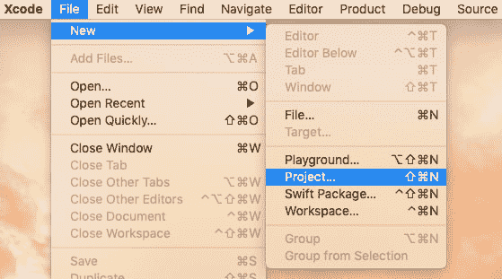
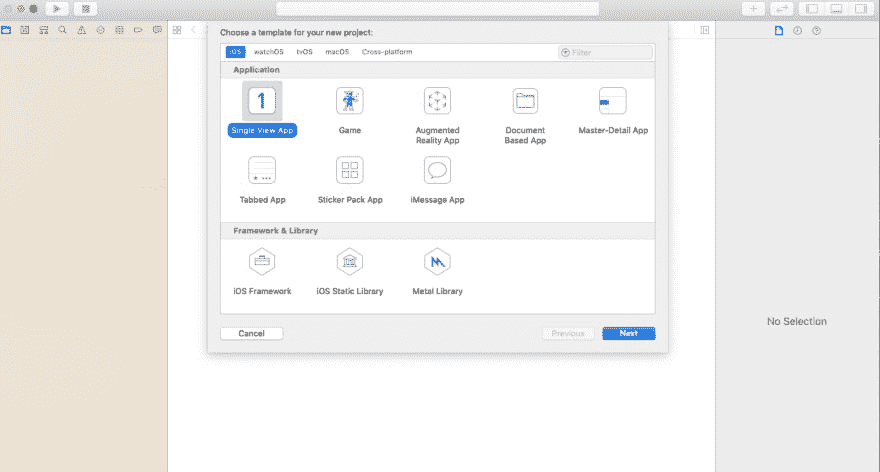
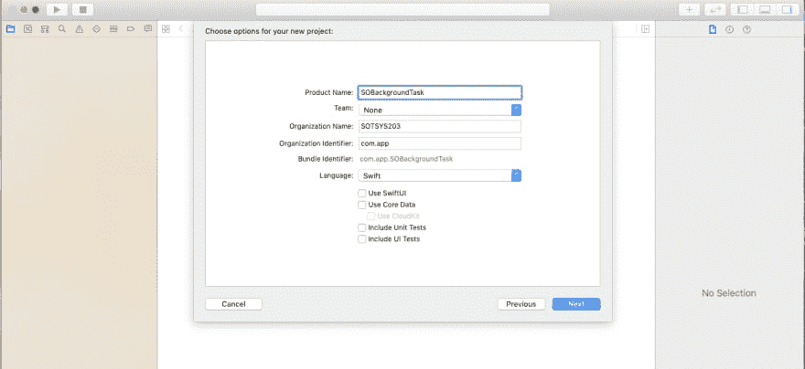
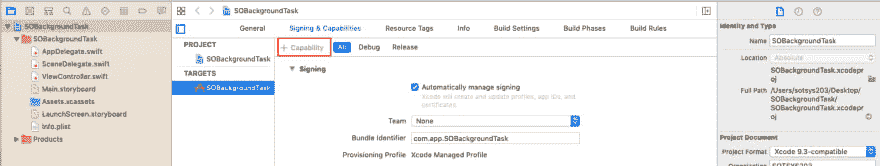
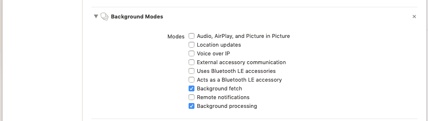
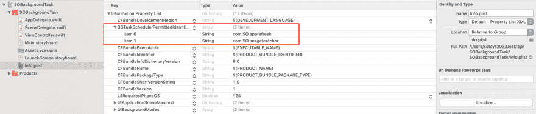

# 如何使用 BackgroundTasks 框架让你的 iOS app 内容保持最新？

> 原文：<https://dev.to/amitspaceo/how-to-use-backgroundtasks-framework-to-keep-your-ios-app-content-up-to-date-4he6>

在这篇技术博客中，我们将了解如何安排 iOS 后台任务。这篇 iOS 教程是为那些想在他们最新的 iOS 应用程序开发项目中实现后台任务调度器的人准备的。

**你会学到什么？**

*   在本 iOS 教程中，您将看到一个使用新的 BackgroundTasks 框架在手机处于空闲模式时在后台获取图像的示例。

上个月，在 2019 年 WWDC 开发者大会上，苹果发布了最新的 iOS 13，其中包含大量新功能和新特性。这是全球超过 10 亿台 iOS 设备正在使用的操作系统的第二次重大修订，也是最重要的修订之一。

苹果带来的最重要的事情是优化趋势，这是随着 iOS 12 推出的，现在使 iOS 13 更快更高效。应用程序更新时间得到了改进，而应用程序启动时间变得快了 2 倍。此外，应用程序下载大小已经减少到一半(50%)。

先说一下 iOS 13 的一些新特性和功能，然后继续了解其中最重要的一个功能——**background tasks 框架。**

以下是 iOS 13 带来的一些重要功能:

*   深色模式
*   改进的照片应用程序
*   [登录苹果](https://www.spaceotechnologies.com/reduce-android-app-size-tutorial/) **(我们已经用插图详细介绍过了)**
*   HomeKit 安全视频
*   邮件中的名称和图像
*   滑动键盘
*   多用户 HomePod
*   全新的提醒应用
*   Memoji 和贴纸
*   更智能、更流畅的 Siri 语音辅助

在技术功能方面，苹果推出了:

*   iOS、macOS 和 iPadOS 中上下文操作菜单的进步
*   UIWindowScene API 和 iPadOS 中的多任务处理
*   AI/ML 功能，如图像和语音显著性、单词嵌入、声音分析、文本目录和识别、图像相似性和分类、设备上的语音、人脸捕捉质量、情感分类
*   Siri 中应用程序的对话快捷方式
*   新的后台任务框架

在这个 iOS app 教程里，我们就来说说**“background tasks 框架”。**

**背景任务框架**

这个新框架用于清理数据库、更新机器学习模型或更新应用程序的显示数据等任务，以及其他最好在后台完成的可推迟任务。它有效地利用了处理时间和功率，并在设备空闲时运行类似这样的任务。

背景任务框架在 BGTaskScheduler 下有两个主要的任务请求:

*   **BGAppRefreshTaskRequest:** 这是一个在后台启动应用程序以执行简短刷新任务的请求。

*   **BGProcessingTaskRequest:** 这是在后台启动应用程序并执行需要较长时间才能完成的流程的请求。

背景任务可用于执行各种活动，如数据库清理、将图片上传到服务器、同步其他设备中的图片等等。

当 BackgroundTasks Framework 推出时，Space-O Technologies 的 iOS 开发专家收到了来自客户和其他开发人员的大量询问。我们的开发人员很乐意帮助他们，并决定拿出一个关于 iOS 背景图像抓取的小型 iOS 演示，来解释一些事情。

在本 iOS 教程中，我们将以 iOS 后台任务为例，获取图像库中添加的图像的最新数量。

**在后台处理任务时获取图像计数**

在项目中实现 BackgroundTasks 框架

1)使用 XCODE 11 创建一个新项目。

2)在 iOS 部分选择“单视图应用”，输入项目名称。(我们将项目名称保留为“SOBackgroundTask”)。

3)进入 SoBackgroundTask 目标，点击“签名&能力”，然后点击“+能力”，

4)双击“背景模式”

5)从所有后台任务中选择“后台获取”和“后台处理”。

6)在 info.plist 中添加“BGTaskSchedulerPermittedIdentifiers”键，并添加一个任务标识符数组。

**注意:系统只运行用任务标识符白名单上的标识符注册的任务。**

7)在 AppDelegate.swift 中导入后台任务。

8)使用标识符创建 registerBackgroundTaks()方法(使用我们在 info.plist 中使用的相同标识符),并从应用程序中调用它:didFinishLaunchingWithOptions

func application(_ application:ui application，didFinishLaunchingWithOptions launch options:[ui application。LaunchOptionsKey: Any]？)-> Bool {

registerBackgroundTaks()
返回 true
}

//MARK:注册后台任务
private func registerBackgroundTaks(){

bgtaskscheduler . shared . register(forTaskWithIdentifier:" com。SO.imagefetcher "，using:nil){ task in
//此任务用处理请求(BGProcessingTask)
self . schedulelocalnotification()
self . handleimagefetchertask(task:task as！BGProcessingTask)
}

bgtaskscheduler . shared . register(forTaskWithIdentifier:" com。SO.apprefresh "，using:nil){ task in
//此任务强制转换为处理请求(bgapprefresh task)
self . schedulelocalnotification()
self . handleapprefresh task(task:task as！BGAppRefreshTask)
}
}

9)创建 scheduleImagefetcher()和 scheduleAppRefresh()方法，用于从图库中获取图像，并在图像获取完成后刷新应用程序。这些方法是从 applicationDidEnterBackground 调用的。

func applicationdienter background(_ application:ui application){
scheduleaprefresh()
scheduleImagefetcher()
}

func scheduleImagefetcher(){
let request = BGProcessingTaskRequest(identifier:" com。so . image fetcher ")
request . requires network connectivity = false//如果你的任务需要网络进程需要为 true。默认为 false。
request . requires externalpower = false
//如果我们保持 requiredExternalPower = true，那么它所要求的设备是连接到外部电源的。

request . earliestbegindate = Date(timeintervalsinnow:1 * 60)//1 分钟后获取图像计数。
//注意::EarliestBeginDate 不应设置为太远的将来。
do {
try bgtaskscheduler . shared . submit(request)
} catch {
print("无法安排图像获取:(错误)")
}
}

func scheduleaprefresh(){
let request = BGAppRefreshTaskRequest(identifier:" com。so . appre fresh ")
request . earliestbegindate = Date(timeintervalsinnow:2 * 60)//2 分钟后 App 刷新。
//注意::EarliestBeginDate 不应设置为太远的将来。
do {
try bgtaskscheduler . shared . submit(request)
} catch {
print("无法安排应用刷新:(错误)”)
}
}

**注意:如果有未完成的后台任务，需要取消，否则会显示错误代码=2。**

要取消挂起的后台任务，我们在调度新任务之前调用 below 方法。

func cancelalpendingbtask(){
bgtaskscheduler . shared . cancelaltaskrequests()
}

注意:iOS 后台任务时间限制为 30 秒，政策依旧。

# 总结一下吧！

我们希望这篇 iOS 教程能够帮助你理解 BackgroundTasks 框架是如何工作的。可以参考 [github 演示](https://github.com/spaceotech/BackgroundTask)获取源代码。

这里，我们只举了一个在后台获取图像的例子，我们可以使用这个框架完成各种任务。

如果您对本教程有任何建议或疑问，或者对 iPhone 应用程序开发有任何疑问，请告诉我们。我们是领先的 iPhone 应用程序开发公司之一，已经成功开发了 2500 多个 iOS 应用程序。

因此，如果你有一个 iPhone 应用程序的想法，或者想在 iOS 平台上创建一个像这样具有高级特性和功能的移动应用程序，请通过我们的联系方式与我们讨论。我们洗耳恭听！