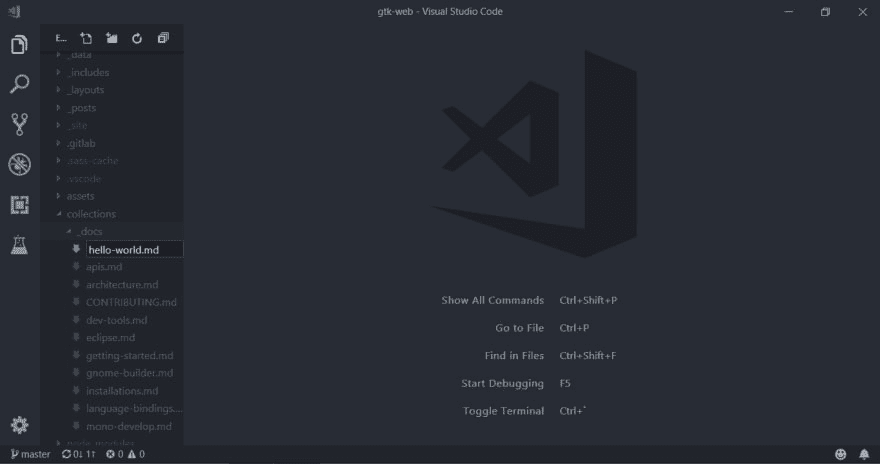
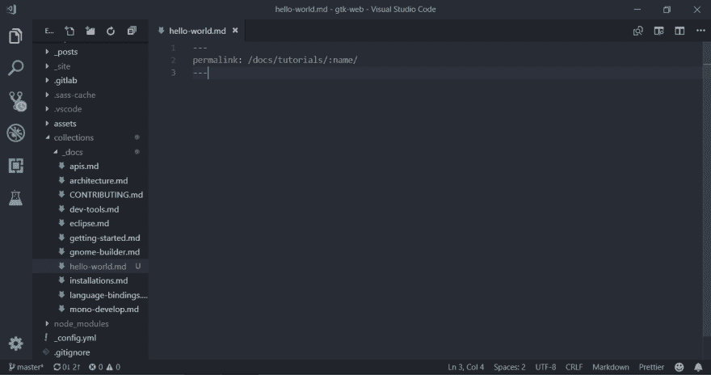
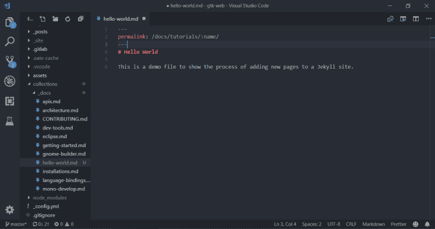
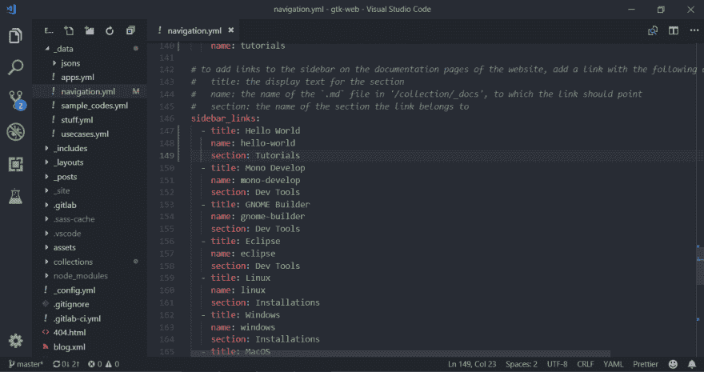
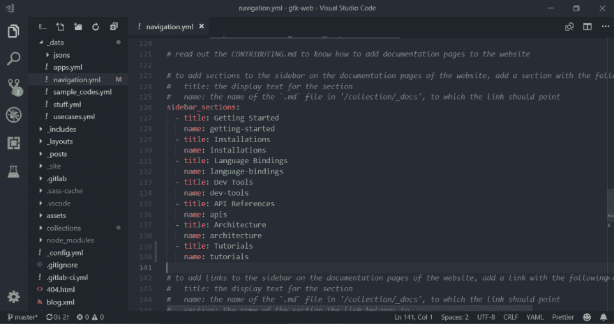
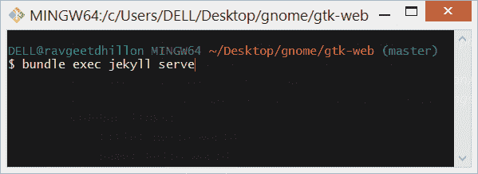
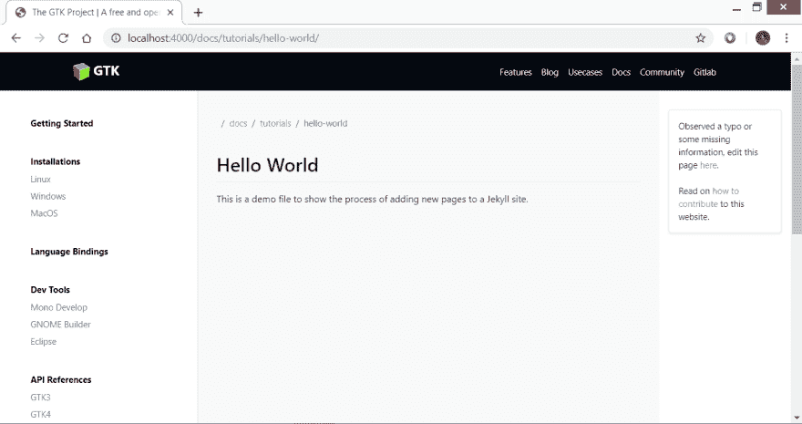
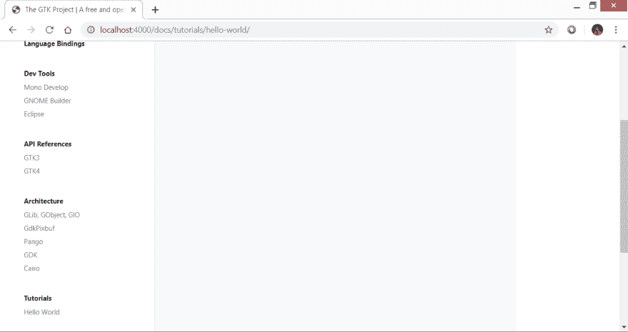

# 向 Jekyll 站点添加页面

> 原文：<https://dev.to/ravgeetdhillon/adding-pages-to-jekyll-site-4e6g>

这是教程，可用于添加网页到任何 Jekyll 网站。我假设您已经设置好了 Ruby 开发环境。如果没有，那么请参考此处的文档轻松开始。

下面是几个简单的步骤，你可以按照添加网页到您的 Jekyll 网站。我还附上了图片，以更好地解释这一过程。

*注:我举了 GTK 网站的例子，我正在做。你可以在这里找到它的 Gitlab 实例[。](https://gitlab.gnome.org/ravgeetdhillon/gtk-web)*

### 第一步。

在`collections/_docs`目录下，新建一个名为`hello-world.md`的文件。

[](https://res.cloudinary.com/practicaldev/image/fetch/s--WOxw1h_c--/c_limit%2Cf_auto%2Cfl_progressive%2Cq_auto%2Cw_880/https://www.ravgeet.dev/assets/img/blog/adding-pages-to-jekyll-site-screen-1.png)

### 第二步。

我希望这个页面可以在以下链接:[http://localhost:4000/docs/tutorials/hello-world/](http://localhost:4000/docs/tutorials/hello-world/)

将以下前置事项添加到`hello-world.md`。

```
---
permalink: /docs/tutorials/:name/
--- 
```

[](https://res.cloudinary.com/practicaldev/image/fetch/s--Kt4oSkjn--/c_limit%2Cf_auto%2Cfl_progressive%2Cq_auto%2Cw_880/https://www.ravgeet.dev/assets/img/blog/adding-pages-to-jekyll-site-screen-2.png)

### 第三步。

将您的内容以 Markdown 格式添加到“hello-world.md”中。

这是一个演示文件，展示了向 Jekyll 站点添加新页面的过程。

`

 `[](https://res.cloudinary.com/practicaldev/image/fetch/s--B_YHtslN--/c_limit%2Cf_auto%2Cfl_progressive%2Cq_auto%2Cw_880/https://www.ravgeet.dev/assets/img/blog/adding-pages-to-jekyll-site-screen-3.png)

### 第四步。

在`_data`目录中，打开`navigation.yml`文件，通过添加以下内容来更新 sidebar_links 数组:

 `*   标题:Hello World 名称:hello-world 部分:教程

`

 `这里，

*   `title`是否在`docs`页面的侧边栏上显示文本
*   `name`是访问链接时应该指向的文件的名称
*   此页面应属于哪个类别

[](https://res.cloudinary.com/practicaldev/image/fetch/s--zp4Vbn7i--/c_limit%2Cf_auto%2Cfl_progressive%2Cq_auto%2Cw_880/https://www.ravgeet.dev/assets/img/blog/adding-pages-to-jekyll-site-screen-4.png)

### 第五步。

如果新文件是主节页面，则通过添加以下内容来更新 sidebar_sections 数组:

 `*   标题:教程名称:教程

`

 `这里，

*   `title`是否在`docs`页面的侧边栏上显示文本
*   `name`是访问链接时应该指向的文件的名称

[](https://res.cloudinary.com/practicaldev/image/fetch/s--HkwARHO7--/c_limit%2Cf_auto%2Cfl_progressive%2Cq_auto%2Cw_880/https://www.ravgeet.dev/assets/img/blog/adding-pages-to-jekyll-site-screen-5.png)

### 第六步。

通过运行以下命令，保存所有文件并在本地服务器上为网站提供服务。

``
捆绑销售执行杰基尔发球`

 ``

 `[](https://res.cloudinary.com/practicaldev/image/fetch/s--1cfcl3cH--/c_limit%2Cf_auto%2Cfl_progressive%2Cq_auto%2Cw_880/https://www.ravgeet.dev/assets/img/blog/adding-pages-to-jekyll-site-screen-6.png)

### 第七步。

转到[http://localhost:4000/docs/tutorials/hello-world/](http://localhost:4000/docs/tutorials/hello-world/)，页面就启动并运行了。

[](https://res.cloudinary.com/practicaldev/image/fetch/s--j8X5F4OQ--/c_limit%2Cf_auto%2Cfl_progressive%2Cq_auto%2Cw_880/https://www.ravgeet.dev/assets/img/blog/adding-pages-to-jekyll-site-screen-7.png)

[](https://res.cloudinary.com/practicaldev/image/fetch/s--NJIQcu0h--/c_limit%2Cf_auto%2Cfl_progressive%2Cq_auto%2Cw_880/https://www.ravgeet.dev/assets/img/blog/adding-pages-to-jekyll-site-screen-8.png)

让我知道如果你有任何疑问，赞赏或其他任何事情，你想与我沟通。可以发微博给我 [@ravgeetdhillon](https://twitter.com/intent/tweet?screen_name=ravgeetdhillon&original_referer=https://www.ravgeet.dev/blog/adding-pages-to-jekyll-site/&ref_src=twsrc%5Etfw) 。我会尽快回复所有的问题。😄如果你喜欢这篇文章，请[也和你的 twitter 社区分享](https://twitter.com/intent/tweet?text=Check%20out%20this%20amazing%20blog%20post%20by%20Ravgeet%20Dhillon%20sharing%20his%20thoughts%20on%20Adding%20pages%20to%20Jekyll%20site&screen_name=ravgeetdhillon&original_referer=https://www.ravgeet.dev/blog/adding-pages-to-jekyll-site/&ref_src=twsrc%5Etfw)。```````