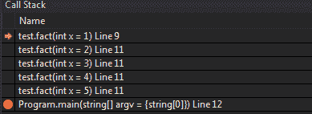

# 递归——如何溢出堆栈以及如何不溢出

> 原文：<https://dev.to/vijesh_salian/recursion-how-to-overflow-the-stack-and-how-not-to-a8k>

递归函数是调用自身的函数。如果你是递归函数的新手，它可能会伤害你的大脑。今天的博客也是类似的思路。它可以帮助你更好地理解递归。有趣的练习:试着在谷歌上搜索“递归”。

我们将创建一个递归函数来计算一个数的阶乘。一个数的阶乘是它之前所有整数的乘积，直到 1。1 的阶乘是 1。这是基本情况。

```
let rec fact x =
 if x <= 1 then 1
 else
  x * fact (x-1) 
```

人类编写的任何递归函数都必须有基格或终止格。递归函数有被吸进黑洞的趋势，而黑洞又是递归吸盘。幸运的是，当我们在计算机上编写递归函数时，调用栈将我们从黑洞中拯救出来。

***什么是调用栈？*T3】**

调用堆栈是存储函数调用的地方。当调用一个函数时，控件需要进入该函数。当函数完成执行时，控件需要返回到调用它的函数。调用堆栈跟踪当前正在执行的函数以及当它完成执行时需要返回的函数。调用栈为此使用的数据结构就是，你猜对了，栈。

在这篇博客的标题中，我用了 stack 这个词。出于这个博客的目的，我交替使用 stack 和 call stack。调用堆栈由堆栈帧组成。每个堆栈帧代表一个函数调用。最上面的堆栈帧表示最新的。

正在运行的阶乘函数的调用堆栈。

[](https://res.cloudinary.com/practicaldev/image/fetch/s--32Y9s29e--/c_limit%2Cf_auto%2Cfl_progressive%2Cq_auto%2Cw_880/https://thepracticaldev.s3.amazonaws.com/i/43z2idm1ieh8q01zl2hj.png) 
<sub>提供:Visual Studio 2017</sub>

堆栈可以容纳的帧数是有限的。当堆栈不能容纳更多的帧时，就称之为溢出。这时就会出现臭名昭著的堆栈溢出异常。学会打碎东西以防止它被打碎是很重要的。

让我们故意得到堆栈溢出异常。
用非常大的数字调用上面的函数。比如说十万。

```
let factorial = fact 100000 
```

这就是你溢出堆栈的方式。

尾递归
尾递归是一种函数的递归，它不消耗堆栈空间，从而防止堆栈溢出。如果递归函数是尾递归的，那么它比非尾递归函数更有效，因为每次函数调用都不需要在调用完成时进行堆栈和弹出。它还防止了难看的堆栈溢出。

让我们创建一个递归函数来寻找从 1 到给定 n 的整数之和。这将是函数的一个参数。递归停止的基本情况是当 n 为零时。下面是函数

```
let rec sumOfIntegers n =
 if n = 0 then 0
 else
  n + sumOfIntegers (n-1) 
```

如果您调试这个函数，您会注意到每个函数调用都会消耗一个堆栈空间。这个函数不是尾递归的。如果你注意到在上面的递归函数中，有一个基本情况和一个递归情况。递归情况是所有递归行为发生的地方。递归情况的最后一个表达式是加法。当进行递归调用时，它仍然必须在一系列调用之后返回来做加法。如果我们使最后一个表达式只是一个递归调用，那么我们给编译器一个机会来优化递归，以便不消耗堆栈空间。所以我们可以使上面的函数尾递归，如果我们可以使递归情况的最后一个表达式只是一个递归函数调用，没有任何其他额外的评估。下面是 sumo integers
的尾部递归版本

```
let sumOfIntegersTr n =
 let rec sumrec n sum =
  if n<= 0 then sum
  else
   sumrec (n-1) (n+sum)
 sumrec n 0 
```

sumOfIntegersTr 函数将 n 作为参数。请注意，它不是一个递归函数。它定义了一个递归的嵌套函数 sumrec。紧接在 sumrec 的定义之后，它调用 sumrec。

递归函数 sumrec 看起来是尾递归的，因为递归情况下的最后一个表达式只是一个函数调用。sumrec 有两个参数。n，明显的 1 和 sum，它用来累加数的和。sumrec 的第一次调用是由外部函数 sumOfIntegersTr 完成的。它是用 n 和 0 调用的，0 是 sum 的初始值。这样，它在函数调用的参数中做加法。基本情况是返回累加和。相当整洁。调试并查看调用堆栈以进行验证。

现在，让我们使阶乘函数尾递归。记住递归情况的最后一个表达式必须只是一个函数调用。我还将使用一个名为 factorial 的累加器来保存阶乘的值。就像 sumrec 的 sum 一样。

```
let factTr n =
 let rec factRec n factorial =
  if n <= 1I then factorial
  else
   factRec (n-1I) (n*factorial)
 factRec n 1I 
```

注意到整数后面的“I”了吗？只是说明这个数是一个大整数。它是一种保存大整数的类型。继续下去，看看调用堆栈，它应该只消耗一个堆栈帧的任何数量的调用。

希望你喜欢读这篇文章。下次见。干杯。