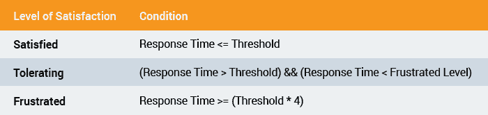
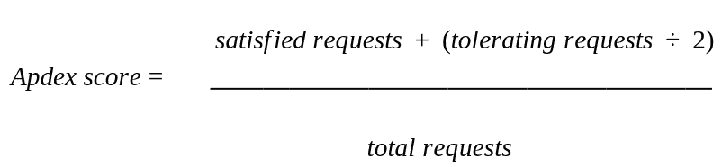
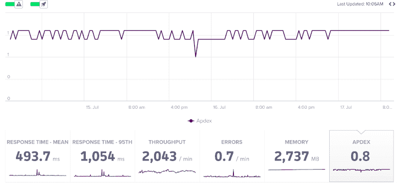
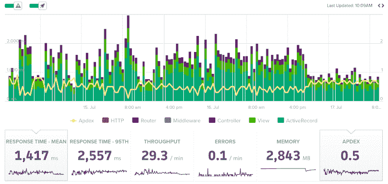

# 使用 Scout APM 监控 Apdex

> 原文：<https://dev.to/scoutapm/monitoring-apdex-with-scout-apm-49cl>

*这篇文章最初出现在[童子军博客](https://scoutapm.com/blog/monitoring-apdex-with-scout-apm)上。*

毫无疑问，查看响应时间和内存使用情况对于了解应用程序的总体健康状况和性能至关重要。但是我相信您也知道，监控应用程序的方法不止一种。从不同的角度进行监控是获得新见解的有力途径。如果您所做的只是观察高响应时间或内存膨胀区域，那么您可能会忽略一些更简单的东西:用户的总体满意度。那么，我们如何监控这个相当宽泛的用户满意度概念呢？我们可以用一个非常有用的指标来监控这一点，这个指标就是 Apdex 分数...

## 什么是 Apdex？

*应用程序性能指数*，或 **Apdex** ，是用户使用应用程序时总体满意度的衡量指标。例如，如果系统的一部分在功能更新后需要很长时间才能响应，那么用户自然会开始感到沮丧。这是我们在谈论 apdex 时试图衡量的，在这种情况下，我们会看到 apdex 评级下降，这将是一个明确的指标，表明最近的变化引入了一个潜在的问题。

与 apdex 相关的客户满意度分为三个级别(总结于上表):满意、容忍和沮丧。**满意**水平是指系统响应时间等于或低于某个我们知道用户会满意的任意值。我们称这个任意值为*阈值*。我们可以假设，当响应时间从这个阈值上升四倍时，用户会对系统感到**沮丧**。那么，**容忍**水平就是当响应时间介于这两种情况之间时，此时用户尚未感到沮丧，但如果情况继续或恶化，他们可能会感到沮丧。

如果我们把一段时间内的所有请求分成两组:满意/容忍的用户和沮丧的用户，那么我们得出一个比率。这个比率被称为 **apdex 得分**，它可以清楚地向我们展示在任何给定的时间**对我们的客户的满意度**。apdex 得分为 1 表示我们的所有客户都非常满意，而 apdex 得分为 0 则表示我们的客户都不满意。上面显示的等式显示了 Scout 如何计算 apdex 分数，您可以看到我们对容忍请求的重视程度较低，因为我们假设这些用户在这种情况下不是 100%满意。

## 使用 Scout 测量 Apdex

你的申请的 Apdex 分数在 Scout 的主图表上是可见的。您可以使用下图所示的 APDEX 选项随时打开或关闭此指标。然后，您可以尝试将 Apdex 分数与另一个指标相结合，以识别相关的模式。

## 如何提高自己的 Apdex 分数？

为了提高你的 Apdex 分数，你首先需要意识到这一点。因此，您需要使用 Scout 这样的 APM 解决方案[来监控情况。一旦您开始监视 Apdex，您可能会发现模式开始出现，例如在特定部署后突然下降(由火箭图标显示)。另一个例子可能是，在某些时间段内，响应时间反复出现高峰，从而使 Apdex 快速下降，这表明您可能遇到了基础架构限制。](https://scoutapm.com/users/sign_up)

## 总结

如您所见，Apdex 是监控应用程序的一种有趣方式。它允许你问类似这样的问题:“这个特性让人们讨厌吗？”以及“我们的用户最近对他们的体验满意吗？”。这类问题可能很难通过其他方式来回答，因此 Apdex 绝对是我们建议您关注的东西。