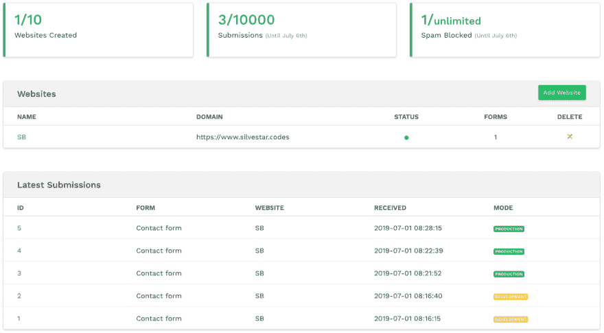

# 如何向静态网站添加联系人表单

> 原文：<https://dev.to/starbist/how-to-add-a-contact-form-to-a-static-website-2oji>

*本文最初发表于[共同导师](https://www.codementor.io/malimirkeccita/how-to-add-a-contact-form-to-a-static-website-wyl9gsuha)。*

随着静态网站的兴起，开发人员需要一种可以处理表单的服务。静态网站联系表单是最常见的情况，在本文中，您将学习如何使用 [Kwes 表单生成器](https://kwes.io)添加一个。

向静态站点添加联系表单可能是一个挑战，因为静态站点通常没有可以处理表单提交的后端。在这种情况下，我们可以使用一个服务来完成这项工作。有许多服务，如 Netlify forms 或 Typeform，但在这种情况下，我们将使用 Kwes 服务。

我们将创建一个包含以下字段的联系表单:

| 形状要素 | 表单字段 |
| --- | --- |
| 名字 | 文本输入 |
| 电子邮件 | 电子邮件输入 |
| 消息 | 文本区域输入 |
| 纽扣 | 提交按钮 |

所有输入字段都应该是必填的，并且应该验证电子邮件表单字段。

## 整合

既然我们要将 Kwes 表单添加到我们的站点，我们应该先免费注册。

注册后，从 Kwes dashboard 添加一个新网站和一个新表单。

[](https://res.cloudinary.com/practicaldev/image/fetch/s--eS9cBc1u--/c_limit%2Cf_auto%2Cfl_progressive%2Cq_auto%2Cw_880/https://ucarecdn.com/2070d39e-b198-46b8-8b27-8a31097edce9/)

为了完成集成，您应该在联系人页面的`body`标签底部添加 JavaScript 文件。

```
<script src="https://kwes.io/js/kwes.js"></script> 
```

<svg width="20px" height="20px" viewBox="0 0 24 24" class="highlight-action crayons-icon highlight-action--fullscreen-on"><title>Enter fullscreen mode</title></svg> <svg width="20px" height="20px" viewBox="0 0 24 24" class="highlight-action crayons-icon highlight-action--fullscreen-off"><title>Exit fullscreen mode</title></svg>

我正在为我的网站使用 Hexo 静态页面生成器，但它可以与其他静态站点生成器一起工作，如 Hugo 或 Jekyll。因为大多数静态站点生成器都支持 Markdown，所以你可以直接在 Markdown 中粘贴联系代码，这也是可行的。否则，您可以创建一个单独的页面或布局，并将代码粘贴到那里。

> 专业提示:没有必要向没有联系表单的页面添加 JavaScript 文件。

接下来，我们将向联系人页面添加一个 HTML 表单。为此，添加常用的表单标记和属性。

> 专业提示:不要忘记为属性添加与输入 id 相匹配的标签，以使表单更易于访问。

现在我们应该添加 Kwes 属性。用`kwes-from`类将表单包装在`div`中是很重要的。之后，将`action`属性添加到`form`元素中，然后将`rules`属性添加到输入字段中。代码应该是这样的:

```
<div class="kwes-form">
  <form method="POST" action="https://kwes.io/api/foreign/forms/youruniqueid">
    <label for="name">Name</label>
    <input type="text" name="name" id="name" rules="required">
    <label for="email">E-mail</label>
    <input type="email" name="email" id="email" rules="required|email|max:255">
    <label for="message">Message</label>
    <textarea name="message" id="message" rules="required"></textarea>
    <button type="submit">Submit</button>
  </form>
</div> 
```

<svg width="20px" height="20px" viewBox="0 0 24 24" class="highlight-action crayons-icon highlight-action--fullscreen-on"><title>Enter fullscreen mode</title></svg> <svg width="20px" height="20px" viewBox="0 0 24 24" class="highlight-action crayons-icon highlight-action--fullscreen-off"><title>Exit fullscreen mode</title></svg>

你可以在官方文档中看到所有的规则选项。

在发布表单之前，您应该先测试表单。使用 Kwes，您可以通过两种不同的方式来完成:

*   通过在站点设置中提供测试域，或者
*   通过将 HTML 属性`mode="test"`添加到表单元素中。

在[测试模式](https://kwes.io/docs/form-mode)期间，您的所有提交都不会影响您计划中的数据。您可以通过切换开关在仪表板中查看测试数据。就这么简单。

最后一步是将代码设置为生产模式。现在我们应该坐下来等待提交，因为我们知道 Kwes 会为我们处理所有的事情——从表单验证，到垃圾邮件过滤，再到发送确认邮件。

您可以自定义通知消息的样式，以匹配您的品牌。

## Kwes 特性

Kwes 有一个内置的[逻辑，用于在条件](https://kwes.io/docs/hide-show-logic)下显示或隐藏任何内容。例如，您可以根据所选计划显示不同的计划详细信息。

对我来说，最显著的优势是表单验证。验证在前端和后端站点上都采取行动。不必重新发明轮子，一遍又一遍地编写验证规则，这可以节省时间，但也是我非常乐意在每个项目中避免的任务。Kwes 有 50 多条验证规则，可以覆盖大多数场景，甚至是最复杂的场景，比如处理日期、时间、密码和文件上传。

如果您的表单是公开的，您很有可能会收到垃圾邮件。有了 Kwes，你可以得到垃圾邮件保护，甚至帮助 Kwes 学习过滤掉哪些邮件。

如果你想对你的表单有更多的控制，并把它和其他服务如 Zapier 整合，你可以做到。您甚至可以利用 Kwes API 自己管理提交。

## 结论

Kwes 伴随着成本，但是您应该考虑为您自己和您的团队节省几个小时的开发时间。我认为将验证工作留给专门从事这一领域的开发人员来做是值得的，他们专注于项目或业务的其他部分。

联系页面