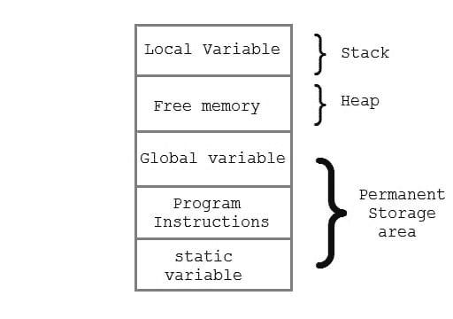

# 第一次接触 C++

> 原文：<https://dev.to/calebwatters/first-contact-with-c-2bfl>

我最近开始玩 C++，主要是为了我自己的个人副业项目，并发现这是一种非常有趣的学习语言，尤其是在我学习过程的这个阶段。与 Ruby 和 Javascript 等解释型语言不同，C++是一种编译型语言。关于编译语言和解释语言之间的区别，有大量的信息，所以在这篇文章中我不会花太多时间来讨论。用最基本的术语来说，编译语言需要编译器 vs 和解释器(有点不言自明)，但是尽管它们被称为不同的东西，但它们的功能是相当相似的，因为它负责将您编写的代码片段转换成计算机可以执行的东西。对于 C++和其他“编译”语言来说，这是一个独立的过程。您必须首先运行编译器，如果一切顺利，您将拥有一段可执行的代码。

关于 C++的另一个有趣的事实是，它是最早实现面向对象编程方法的语言之一。虽然 Javascript 和 C++的类结构有一些关键的区别，主要是 JS 仍然使用原型继承，而 ES6 的一些视觉结构是相似的。然而，主要的区别在于，对于一个类声明，通常要创建两个不同的文件。一个是创建类并声明其所有函数的头文件，另一个是定义该类所有“公共”和“私有”方法的单独的 C++文件。“public”可以在程序的任何地方访问，而“private”只能在类内部访问。C++还有第三种方法类型，叫做“protected ”,类似于“private”方法，但它们可以在子类或派生类中访问。与 ES6 类类似，C++中也有静态方法，它们是类定义的一部分，但不是它创建的对象的一部分。

```
class Base {
public:
   // public members go here
protected:

   // protected members go here
private:
   // private members go here
}; 
```

<svg width="20px" height="20px" viewBox="0 0 24 24" class="highlight-action crayons-icon highlight-action--fullscreen-on"><title>Enter fullscreen mode</title></svg> <svg width="20px" height="20px" viewBox="0 0 24 24" class="highlight-action crayons-icon highlight-action--fullscreen-off"><title>Exit fullscreen mode</title></svg>

关于 C++有一件非常奇怪的事情，至少对于那些主要使用像 Ruby/Javascript 这样的语言的人来说，就是 C++要求你导入库来完成一些最基本的功能。例如，为了构建 CLI 应用程序，您必须导入一个名为 iostream 的标准输入/输出库。C++也是一种强类型语言，这意味着，在许多其他语言中，在任何函数声明中，您必须声明您希望该函数返回的数据类型。C++还处理手动内存分配，这不是我目前非常精通的概念，但我非常有兴趣学习。

[](https://res.cloudinary.com/practicaldev/image/fetch/s--Xn5XG8J5--/c_limit%2Cf_auto%2Cfl_progressive%2Cq_auto%2Cw_880/https://thepracticaldev.s3.amazonaws.com/i/wsyoxvlbkzuxi26gruh2.jpg)

本质上，它包括理解 C++程序中你可以访问的不同类型的内存(堆/栈)以及程序中的函数是如何占用空间的。还有引用和指针的概念，它们处理基于特定内存地址的数据查找。在像 Ruby 或 Javascript 这样的语言中，所有这些问题都是您在编写程序时永远不必考虑的，但在讨论 C++程序的可伸缩性时却成为一个重要的话题。