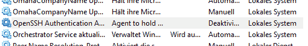
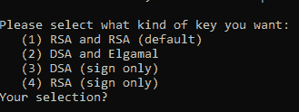

# 在 Windows 10 上设置 SSH 和 Git

> 原文：<https://dev.to/bdbch/setting-up-ssh-and-git-on-windows-10-2khk>

欢迎来到我的第一个关于 Dev.to 的官方指南。今天我想解释一下如何在你的 Windows 10 电脑上设置 SSH 和 Git。

**注意**:这不是关于 100%保护你的密钥，而是关于如何生成 GitHub 使用的密钥。

感谢 [garethdd](https://dev.to/garethdd) 的建设性反馈。

## 什么是 SSH？

SSH 代表**安全外壳**，是一种在远程服务器(例如 Github 服务器)上验证自己身份的绝佳方式，无需每次都输入密码。

SSH 通过两个密钥工作，即**私钥**和**公钥**。虽然私钥应该始终保持私密和安全，但公钥可以毫无问题地在互联网上共享。

私钥允许您访问注册了您的公钥的服务器，因此只有当攻击者以某种方式获得了您的私钥时，您的访问才能被窃取，所以要确保它的安全！

SSH 应该预装在新的 Windows 10 机器上。

## 什么是 Git？

Git 是一个免费的版本管理工具，它可以帮助你将代码版本化，并可能将它保存在远程服务器上(例如 Github、Gitlab 或 Bitbucket)。

你可以从这里安装 Git:
[https://git-scm.com/download/win](https://git-scm.com/download/win)

你也可以通过 [chocolatey](https://chocolatey.org/) :
安装 Git

```
choco install git -Y 
```

## 创建一个 SSH 密钥

第一步是生成一个新的 SSH 密钥。使用 cmd 或 Powershell 并运行以下命令:

```
ssh-keygen -t rsa -b 4096 -C "your_email@example.com" 
```

你可以但不需要给它一个密码，因为你应该**永远不要**分享你的秘密密钥，但使用一个会保护你的密钥。请记住，每个人都可以拥有任意多的私钥。

这将生成一个使用 rsa 加密和 4096 位的新的私有 SSH 密钥。它还从秘密密钥生成一个公开密钥，您可以在周围共享。

您的 Windows 用户文件夹中将有一个新文件夹和文件。

一般来说，你可以创建任意多的密钥。 **id_rsa** 密钥是 ssh 生成的默认密钥，如果您不告诉它使用另一个密钥，它将自动被您的 ssh 代理使用。

## 什么是 ssh 代理？

ssh-agent 是一个代理进程，用于通过 ssh 对您进行身份验证。已经有一些了(例如 PuTTY with Pageant ),但是对于这个例子，我们将使用本地和默认的 Windows 10 ssh-agent 提供的 ssh-agent。

如果你愿意，你可以使用 PuTTY 和 Pageant 来使你的密钥更加安全。阅读[数字海洋](https://www.digitalocean.com/community/tutorials/how-to-use-pageant-to-streamline-ssh-key-authentication-with-putty)上的这篇文章了解更多信息。

如果您想更改 ssh 代理使用的密钥，您必须首先启动该服务。默认情况下，Windows 10 将禁用该服务。搜索服务并打开服务设置，查找“OpenSSH 身份验证代理”并将其激活:

[](https://res.cloudinary.com/practicaldev/image/fetch/s--UD8Etuhj--/c_limit%2Cf_auto%2Cfl_progressive%2Cq_auto%2Cw_880/https://thepracticaldev.s3.amazonaws.com/i/4vw72d4y7h1spzr7t45s.png)

现在您将能够通过`ssh-agent`从您的控制台访问 ssh-agent。

在这个例子中，我们将尝试加载另一个名为`example`的键到我们的代理中，并使用它来代替`id_rsa`键。为此，您可以运行以下命令:

```
ssh-add example 
```

现在，这两把钥匙都可以用于本次会话。

## 在 Github 上注册您的 SSH 密钥

下一步是在 Github 上注册您生成的 SSH 密钥。为此，运行以下命令:

```
type C:\Users\your_user_name\.ssh\id_rsa.pub 
```

并将输出字符串复制到剪贴板中。现在转到您的 [Github keys 设置](https://github.com/settings/keys)，用您的公钥添加一个新的 SSH 密钥并保存它。

恭喜你！你现在可以不需要任何密码就可以获取和推送代码到 Github 了！

**注意**:还应该有一个`C:\Users\your_user_name\.ssh\id_rsa`文件。这是你的私人钥匙，不要到处分享！

## 在你的 Shell 中设置 Github

现在是时候在您的机器上设置 Git 了。从上面的链接安装后，打开一个新的 cmd 或 Powershell 窗口。现在我们需要设置您的公共 Git 名称和 Git 电子邮件地址。在推送代码时，这将始终是公共的。

幸运的是 Github 给了你一个私有的邮箱地址供你使用。前往[https://github.com/settings/emails](https://github.com/settings/emails)，你会找到你账户的`@users.noreply.github.com`电子邮件地址。复制此电子邮件地址。

接下来在 Git 中注册你的名字和邮箱:

```
git config --global user.name "Your Name"
git config --global user.email your_email@users.noreply.github.com 
```

恭喜你！现在你所有的提交都将被注册为 Github 用户提交的。

## 签署您的 GitHub 提交(可选步骤)

要签署你的提交，你首先必须安装 [GPG 命令行工具](https://www.gnupg.org/download/)。在你安装了 GPG 工具包之后，你可以运行下面的命令来生成一个新的 gpg 密钥:

```
gpg --full-generate-key 
```

这会询问你想要什么样的钥匙。选 RSA 和 RSA。

[](https://res.cloudinary.com/practicaldev/image/fetch/s--YudicaUB--/c_limit%2Cf_auto%2Cfl_progressive%2Cq_auto%2Cw_880/https://i.imgur.com/ZicWfXM.png)

现在你需要输入一个位长。推荐是 **4096 位**。

之后，您可以指定一个过期时间长度，或者密钥是否应该永不过期。随便挑。一般来说，过期密钥更安全，因为您必须不时地更新它们。

现在输入您的个人信息，用您的 gpg 密钥验证您的身份。

完成后，您将被要求输入密码。给它一个安全的密码，你就完成了 gpg 密钥的生成。

之后，您将能够在成功消息中指定的 users `.gnupg`文件夹中找到您的密钥。

如果你想列出你的 gpg 键，只需运行

```
// short version
gpg --list-secret-keys

// long version
gpg --list-secret-keys --keyid-format LONG 
```

您可以与 Github 共享的 GPG 密钥是在`sec rsa4096/`之后的密钥，例如在
中

```
/Users/hubot/.gnupg/secring.gpg
------------------------------------
sec   4096R/3AA5C34371567BD2 2016-03-10 [expires: 2017-03-10]
uid                          Hubot 
ssb   4096R/42B317FD4BA89E7A 2016-03-10 
```

gpg 密钥应该是`3AA5C34371567BD2`

要获得您的公钥块，只需运行

```
gpg --armor --export YOUR_GPG_KEY 
```

这将输出您的公共 GPG 密钥块。复制并粘贴到你的 GitHub 账户[这里](https://github.com/settings/keys)。

从现在开始，你的承诺将在提交时签署。

## [去吧](#use-git)

现在您已经准备好实际使用 Git 了。从现在起，你可以通过`git clone`克隆软件库，或者将新代码推送到 Github。这里有一个快速参考:

```
# Clone a repository to the current directory
git clone [REPOSITORY_CLONE_URL]

# Create a new commit with a message
git commit -m "Your commit message"

# Add files to the commit
git add .
git add ./filename.ext

# Push your commits to Github
git push origin master
git push origin [YOUR_BRANCH_NAME]

# Reset your repo to the last version
git reset --hard

# Create a new branch
git checkout -b [YOUR_BRANCH_NAME]

# Switch branches
git checkout [YOUR_BRANCH_NAME]
git checkout master

# Reset a single file
git checkout ./filename.ext 
```

* * *

### 结论

感谢你阅读这篇文章。我希望它对你的设置有所帮助。如果您需要帮助或有问题，请告诉我！