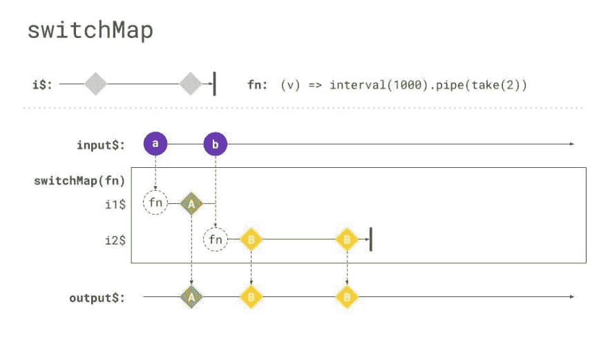
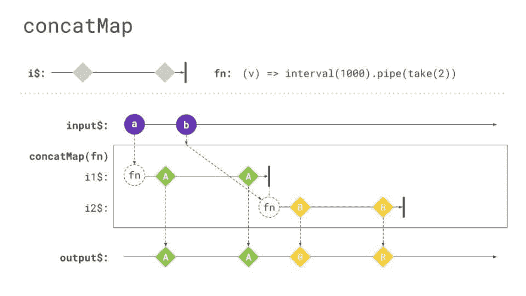
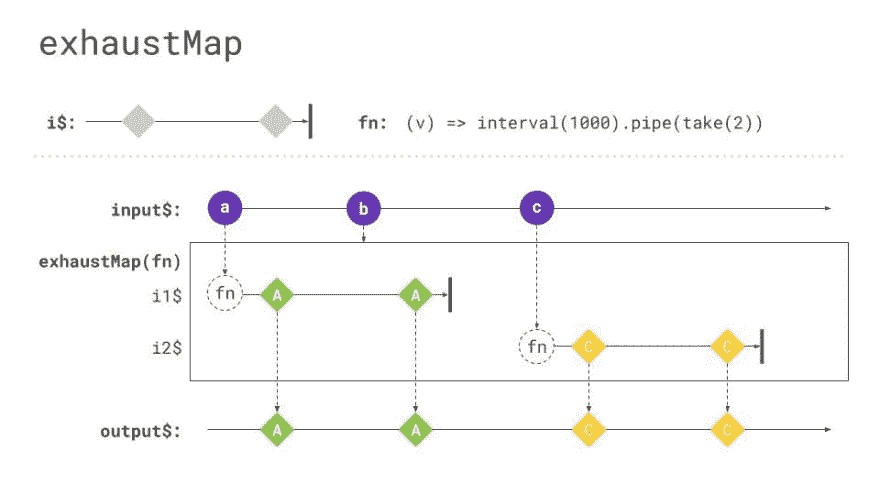

# 关于 switchMap 和朋友

> 原文：<https://dev.to/rxjs/about-switchmap-and-friends-2jmm>

RxJS 有 100 多个不同的操作符。 [SwitchMap](https://rxjs.dev/api/operators/switchMap) 可能是讨论最多的一个。这是一个非常强大的操作符，在许多情况下非常有用，但也非常危险。在这篇博客文章中，我们将讨论`switchMap`,并涵盖它可能给你的应用程序带来的问题。此外，我们将讨论具有类似用例的操作者。这将使你更容易，下次你需要选择其中之一。

在我们开始讨论使用`switchMap`的注意事项之前，让我们先总结一下`switchMap`的工作方式。SwitchMap 是所谓的高阶算子。也许你已经熟悉高阶函数的概念，因为它非常相似。
以防万一，高阶函数是返回另一个函数或接受一个函数作为参数的函数。想想`map`的阵法。它将一个函数作为参数，用于定义数组中每一项的转换。

一个高阶算子正在处理一个可观测量。`SwitchMap`特别是返回一个内部可观察的通知。

```
of('hello world').pipe(
  switchMap(value => {
    return ajax.getJSON('http://my.api.com?search=' + value);
  }),
); 
```

<svg width="20px" height="20px" viewBox="0 0 24 24" class="highlight-action crayons-icon highlight-action--fullscreen-on"><title>Enter fullscreen mode</title></svg> <svg width="20px" height="20px" viewBox="0 0 24 24" class="highlight-action crayons-icon highlight-action--fullscreen-off"><title>Exit fullscreen mode</title></svg>

这个代码示例将用来大致解释一下`switchMap`。我们稍后将扩展它，更深入地了解它。

但首先要做的是。`SwitchMap`从外部可观察值(由操作符的[返回)中获取值，并将这些值作为参数传递给一个函数，该函数必须返回一个新的可观察值。在这个特殊的例子中，我们使用 RxJS 的 ajax 模块(作为参考，你可以在这里找到一些信息](https://rxjs.dev/api/index/function/of))。这里我们使用`getJSON`方法来执行 get 请求，并将其响应作为新的可观察值返回。

从技术上讲，我们订阅新返回的可观察对象，并将其值传递给链中的下一个操作符，或者像往常一样传递给 subscribe 方法中的下一个处理程序。

现在你已经熟悉了`switchMap`的基础知识，我们将深入了解一下。不要担心可能需要一段时间才能完全理解`switchMap`的细节。但是如果你懂了，你会注意到，`concatMap`、`mergeMap`和`exhaustMap`非常相似。但首先，让我们深入了解一下`switchMap`。正如我承诺的，我扩展了上面的
例子，为了让它更具探索性，我为它创建了一个[闪电战](https://stackblitz.com/edit/rxjs-about-switchmap?file=index.ts)。
在`index.ts`中，你会偶然发现下面这段代码。

```
const httpCall$ = ajax.getJSON('https://rickandmortyapi.com/api/character/');
const click$ = fromEvent(document, 'click');

const switchMapExample$ = click$.pipe(
  tap(() => console.log('inside switchMap - click happend')),
  switchMap(() => {
    console.log('inside switchMap - start http request');
    return httpCall$.pipe(tap(val => console.log('inside switchMap - http response ', val)));
  }),
); 
```

<svg width="20px" height="20px" viewBox="0 0 24 24" class="highlight-action crayons-icon highlight-action--fullscreen-on"><title>Enter fullscreen mode</title></svg> <svg width="20px" height="20px" viewBox="0 0 24 24" class="highlight-action crayons-icon highlight-action--fullscreen-off"><title>Exit fullscreen mode</title></svg>

我们现在每次点击都调用 switchMap，而不是向 switchMap 函数传递一个值(参考一下来自 Event 的[)。`fromEvent`用作任何类型输入流的例子。也可以是你喜欢的任何其他`Observable`。所以只要你点击页面上的某个地方，它就会立即将`inside switchMap - click happened`登录到控制台。事后，`switchMap`谓之。这也将立即记录`inside switchMap - start http request`。在传递给`switchMap`的函数结束时，我们返回一个`httpCall$`可观察值。一旦有人订阅它，它就会执行 HTTP 请求。此外，我们再次使用](https://rxjs.dev/api/index/function/fromEvent)[点击](https://rxjs.dev/api/operators/tap)来记录 HTTP 响应的值。
< >
我上面已经提到过，`switchMap`正在传递一个源`Observable`的值，并将这个值传递给一个需要返回新的`Observable`的函数。`SwitchMap`将负责订阅返回的可观察值。但是现在有两种边缘情况。

1.  如果`switchMap`里面返回的`Observable`是一个散发多种物品的长寿`Observable`会怎么样？
2.  如果我的源可观察对象发出的速度比返回的速度快会发生什么

这两个问题都可以在下面的大理石图中看到。
如果你不熟悉大理石图语法，看一看[大理石图部分](https://rxjs.dev/guide/operators)。

请注意，以下所有大理石图都是由迈克尔·赫拉迪克好心提供的。

[](https://res.cloudinary.com/practicaldev/image/fetch/s--zyDfK4i3--/c_limit%2Cf_auto%2Cfl_progressive%2Cq_auto%2Cw_880/https://raw.githubusercontent.com/rxjs-blog/blog/master/blog-posts/about-switchmap-and-friends/assets/switchMap-marble-diagram.jpg)

让我们一个一个地研究这些问题。如果我们在我们的`switchMap`函数中返回一个长期存在的`Observable`，我们将在大理石图中看到，所有的通知都被输出。长期存在的`Observable`的一个非常常见的例子是 HTTP 轮询，我们每 X 秒请求一个 API 并返回它的响应。所有这些响应将被传递给`Observable`链中的下一个操作员。正如您在`i2$`可观察对象中看到的，两个通知都被传递给了`output$`可观察对象。现在我们知道了`switchMap`如何处理长寿命的`Observables`，第二种边缘情况出现了。当源`Observable`比新创建的`Observable`发射得更快时，会发生什么。
`SwitchMap`一旦有来自源`Observable`的新值，就中断`Observable`的执行。如果您用大理石图仔细检查，您会注意到通知`b`一到来，流`i1$`就立即结束。此外，它将触发新的可观察对象`i2$`并订阅该对象。
我们已经说过，那个`switchMap`自动订阅内部的`Observable`。此外，一旦有新的值来自数据源`Observable`，它会自动取消订阅。这意味着`switchMap`还包含一个内置的订阅管理机制。

您可以在链接的 Stackblitz 示例中体验此运算符。它会在你点击某个地方后触发一个 HTTP 调用。如果你点击得足够快，你会注意到一些 HTTP 呼叫被取消了。你可以在 Chrome DevTools 的网络视图中看到。如果其中一个请求标有`canceled`，这意味着执行 HTTP 调用的可观察对象被取消订阅。

现在我们知道了`switchMap`，我建议，让我们看看其他的操作者。

## 比喻相似

所以现在是时候兑现我的承诺了。我已经提到过`switchMap`与`concatMap`、`mergeMap`、`exhaustMap`非常相似。那么有什么区别呢？

### 串联图

先说 [concatMap](https://rxjs.dev/api/operators/concatMap) 。`ConcatMap`还将源可观察对象的通知传递给内部可观察对象。它订阅该消息，并等待它完成，然后使用由源`observable`发出的下一个通知。因此，如果源可观察对象无休止地发出，并且比内部可观察对象完成得更快，就有可能出现内存泄漏。`ConcatMap`注意内部观察值被实例化的顺序。因此，从商业角度来看，它是我们在本文中涉及的最安全的运营商。理论上你可能会遇到内存泄漏的技术问题，但是，如果你不确定选择哪一个操作符，我推荐使用`concatMap`。你或多或少会没事的。因此，如果您在`concatMap`函数中执行 HTTP 请求，您可以确保在源可观察对象的下一个通知被传递给内部可观察对象之前，您会收到响应的响应。与此同时，一旦内部观察完成，它就缓冲那些通知。

也许下面的大理石图很好地总结了`concatMap`的行为。它不再像过去使用`switchMap`那样中断`i1$`，而是等待`i1$`完成，并在中间缓冲通知，就像`b`。第一个流完成后，它将开始处理缓冲的通知。

[](https://res.cloudinary.com/practicaldev/image/fetch/s--jFpczqhy--/c_limit%2Cf_auto%2Cfl_progressive%2Cq_auto%2Cw_880/https://raw.githubusercontent.com/rxjs-blog/blog/master/blog-posts/about-switchmap-and-friends/assets/concatMap-marble-diagram.jpg)

你也可以在我上面链接的 Stackblitz 中探索`concatMap`的行为。你需要把所有文件从`operators/concatMap.ts`复制到`index.ts`。代码和以前几乎一样，只是现在使用了`concatMap`。如果你在窗口的某个地方疯狂点击，你会注意到，它会为你的每次点击进行 HTTP 调用，但只是一个接一个。更重要的是，在实例化下一个 HTTP 调用之前，它会等待每个 HTTP 调用完成。

### 合并地图

[MergeMap](https://rxjs.dev/api/operators/mergeMap) 或`flatMap`(只是`mergeMap`的别名)与`concatMap`十分相似，虽然它不考虑顺序，也不等待一个内部可观察对象完成后再订阅下一个。如果我们坚持以 HTTP 为例，理论上可能会遇到在 mergeMap 函数中发起多个 HTTP 请求的情况，如果它没有等待完成，则可能会在第一个实例发出响应之前收到第二个实例的响应。

下图很好地展示了这种行为。流`i2$`的通知可以传递给`output$`流，即使`i1$`还没有完成。

[](https://res.cloudinary.com/practicaldev/image/fetch/s--Q5nWU8ad--/c_limit%2Cf_auto%2Cfl_progressive%2Cq_auto%2Cw_880/https://raw.githubusercontent.com/rxjs-blog/blog/master/blog-posts/about-switchmap-and-friends/assets/mergeMap-marble-diagram.jpg)

同样，您可以在链接的 Stackblitz 中尝试`mergeMap`的行为。

请注意，如果通知的顺序对您很重要，那么`mergeMap`肯定是错误的操作符。如果您需要顺序处理通知，请使用`concatMap`！

### 耗尽图

最后但同样重要的是，[耗尽图](https://rxjs.dev/api/operators/exhaustMap)。这与`switchMap`完全相反。当 switchMap 一收到来自源可观察对象的通知就取消订阅内部可观察对象时，exhaustMap 会完全忽略这些通知，直到内部可观察对象完成。如果您担心紧张地点击用户会使您的应用程序崩溃，那么这个操作符是完美的匹配。但是请注意，中间的通知不会被缓冲，它们会被完全忽略。这种行为使得它与`concatMap`不同，后者会缓冲那些通知。

下面的大理石图很好地证明了这一点。通知“b”被完全忽略！它一直等到`i1$`完成。之后会被可观测源的下一个通知触发，就是下面大理石图中的`c`。

[](https://res.cloudinary.com/practicaldev/image/fetch/s--ynVL6ouK--/c_limit%2Cf_auto%2Cfl_progressive%2Cq_auto%2Cw_880/https://raw.githubusercontent.com/rxjs-blog/blog/master/blog-posts/about-switchmap-and-friends/assets/exhaustMap-marble-diagram.jpg)

同样，您可以在链接的 Stackblitz 中摆弄`exhaustMap`的行为。如果你要做双击或三击之类的事情，你会注意到，只要 HTTP 请求正在进行，这些都会被忽略。之后，您可以再次单击来重新触发 HTTP 调用。

## 使用 switchMap 的风险

现在我们已经知道了所有这些神奇的操作符，你们中的许多人可能已经听说过，使用`switchMap`可能会有一些问题。让我们弄清楚这个谣言是怎么回事。

`switchMap`的问题是，即使从客户端的角度来看它取消了 HTTP 请求，后端还是会“接收”这些请求并执行一些动作。这样做的问题是，后端无论如何都会处理请求，并可能对对象执行变异。这将导致客户端和后端的状态不同。例如，您正在结合`switchMap`执行账户交易。如果您多次启动此操作，对于客户端来说，它看起来就像只发生了一次，但是后端会收到多个请求，从而导致多个事务。当然，没有人想要多次转账:D，只要你不在服务器端的对象实例上执行任何突变或者触发任何额外的动作，你就可以使用`switchMap`。获取对象或轮询对象是`switchMap`完全有效的用例，但是要注意服务器端的动作或变化！

## 总结起来

*   switchMap 订阅每个新通知的内部可观察对象
*   它自动退订旧的内在可观察的
*   使用开关映射时要小心
*   当您不确定时，请使用串联映射
    *   考虑长期存在的可观测量的内存泄漏
*   使用 switchMap 获取/轮询/只读事务
*   注意服务器端的变化或执行的操作

## 特别感谢

非常感谢所有帮助我写这篇博客文章的人。
感谢[托德·莫斯特](https://twitter.com/toddmotto)、[韦斯·格莱姆斯](https://twitter.com/wesgrimes)和[布莱恩·特朗肯](https://twitter.com/BTroncone)审阅文章并提供非常有价值的反馈。此外，我要感谢[迈克尔·赫拉迪克](https://twitter.com/Michael_Hladky)提供了那些令人惊叹的大理石图！