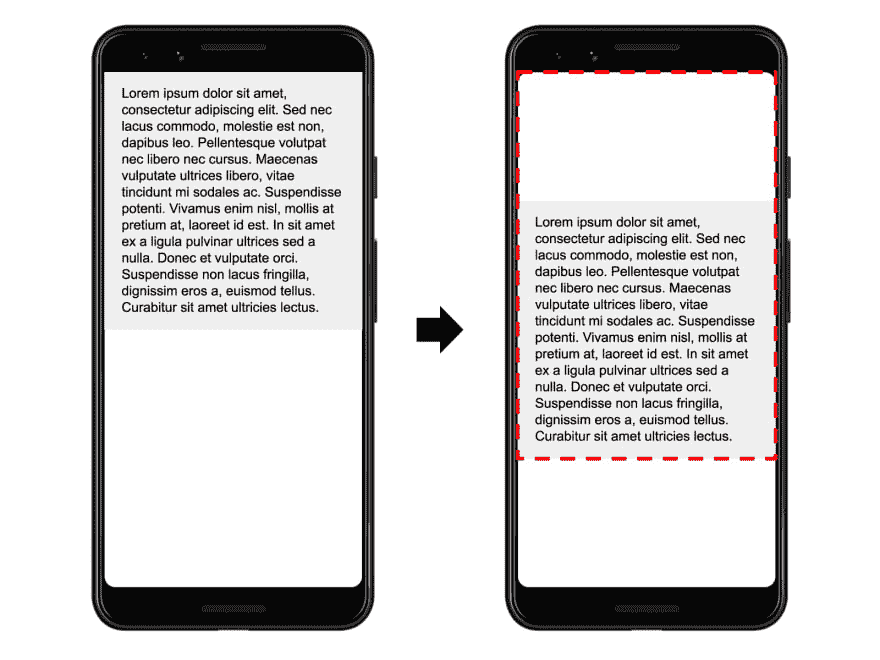
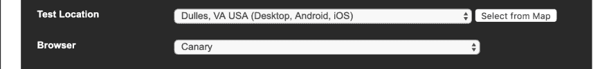
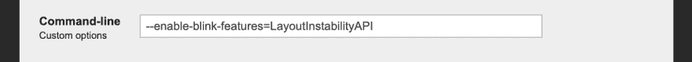
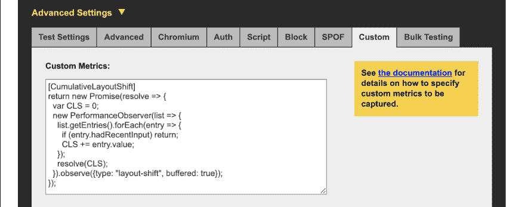
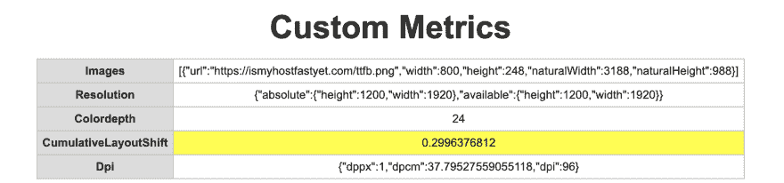
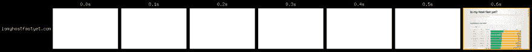

# 测量网页测试中的累积布局偏移(CLS)

> 原文：<https://dev.to/chromiumdev/measuring-cumulative-layout-shift-cls-in-webpagetest-5cle>

# 什么是 CLS？

累积布局偏移(CLS)是一个相对较新的指标，可以帮助你理解用户体验的愉悦程度。你可能正在浏览一个网站，突然文本下移了 100 个像素，你失去了你的位置。那不是一次愉快的经历。

[](https://res.cloudinary.com/practicaldev/image/fetch/s--Vd7T5aQC--/c_limit%2Cf_auto%2Cfl_progressive%2Cq_auto%2Cw_880/https://web.dev/layout-instability-api/layout-shift-1.png)

布局偏移的值是移动的视口的百分比。所以在这个例子中，大约 10%的视口发生了移动。如果稍后发生另一个 2%的移动，页面的 CLS 将是 12%。

# 怎么才能测出来？

[web.dev/layout-instability/api](https://web.dev/layout-instability-api)是了解 API 以及如何使用它来测量 CLS 的绝佳资源。下面是他们计算 CLS 的示例代码:

```
// Stores the current layout shift score for the page.
let cumulativeLayoutShiftScore = 0;

// Detects new layout shift occurrences and updates the
// `cumulativeLayoutShiftScore` variable.
const observer = new PerformanceObserver((list) => {
  for (const entry of list.getEntries()) {
    cumulativeLayoutShiftScore += entry.value;
  }
});

observer.observe({entryTypes: ['layoutShift']});

// Sends the final score to your analytics back end once
// the page's lifecycle state becomes hidden.
document.addEventListener('visibilitychange', () => {
  if (document.visibilityState === 'hidden') {
    // Force any pending records to be dispatched.
    observer.takeRecords();

    // Send the final score to your analytics back end
    // (assumes `sendToAnalytics` is defined elsewhere).
    sendToAnalytics({cumulativeLayoutShiftScore});
  }
}); 
```

<svg width="20px" height="20px" viewBox="0 0 24 24" class="highlight-action crayons-icon highlight-action--fullscreen-on"><title>Enter fullscreen mode</title></svg> <svg width="20px" height="20px" viewBox="0 0 24 24" class="highlight-action crayons-icon highlight-action--fullscreen-off"><title>Exit fullscreen mode</title></svg>

目前，`layoutShift`类型只有在 API 被显式启用时才可用。如果你运行的是 Chrome 76 或更高版本，你可以通过命令行启动它，并设置这个标志:

```
--enable-blink-features=LayoutInstabilityAPI 
```

<svg width="20px" height="20px" viewBox="0 0 24 24" class="highlight-action crayons-icon highlight-action--fullscreen-on"><title>Enter fullscreen mode</title></svg> <svg width="20px" height="20px" viewBox="0 0 24 24" class="highlight-action crayons-icon highlight-action--fullscreen-off"><title>Exit fullscreen mode</title></svg>

# 在网页测试中测量 CLS

web page test(WPT)是一个流行的工具，用于控制 web 性能统计的测量。让我们看看如何配置它来记录 CLS。

## 选择合适的浏览器

[](https://res.cloudinary.com/practicaldev/image/fetch/s--dn6Pz5-T--/c_limit%2Cf_auto%2Cfl_progressive%2Cq_auto%2Cw_880/https://thepracticaldev.s3.amazonaws.com/i/2kdlzdb70xoy1offzlj4.png)

WPT 支持来自世界各地的多种浏览器。为了进行这项测试，我们需要一个支持`LayoutInstabilityAPI`闪烁功能的新版 Chrome。因为在撰写本文时，WPT 的默认 Chrome 版本是 75 版，所以我们将选择 Chrome Canary(77 版)，它可以从弗吉尼亚州的杜勒斯测试中心获得。

## 设置命令行标志

[](https://res.cloudinary.com/practicaldev/image/fetch/s--_XIZyoVn--/c_limit%2Cf_auto%2Cfl_progressive%2Cq_auto%2Cw_880/https://thepracticaldev.s3.amazonaws.com/i/0ypjcoktsl7churljf9a.png)

在高级设置“Chromium”标签下有一个提供命令行选项的字段。

## 测量 CLS 作为自定义度量

[](https://res.cloudinary.com/practicaldev/image/fetch/s--FZVQal4c--/c_limit%2Cf_auto%2Cfl_progressive%2Cq_auto%2Cw_880/https://thepracticaldev.s3.amazonaws.com/i/1xm790hc4dwdtjjulnx3.png)

自定义指标是在网页测试结束时执行的 JavaScript 片段。语法是在第一行给它一个`[name]`格式的名称，后面跟着一个带有单个返回值的脚本。这里有一个衡量 CLS 的自定义指标:

```
[CumulativeLayoutShift]
return new Promise(resolve => {
  var CLS = 0;
  new PerformanceObserver(list => {
    list.getEntries().forEach(entry => {
      if (entry.hadRecentInput) return;
      CLS += entry.value;
    });
    resolve(CLS);
  }).observe({type: "layout-shift", buffered: true});
}); 
```

<svg width="20px" height="20px" viewBox="0 0 24 24" class="highlight-action crayons-icon highlight-action--fullscreen-on"><title>Enter fullscreen mode</title></svg> <svg width="20px" height="20px" viewBox="0 0 24 24" class="highlight-action crayons-icon highlight-action--fullscreen-off"><title>Exit fullscreen mode</title></svg>

侧注:精明的 WPT 超级专业用户阅读这篇文章后反对这个脚本，因为它返回了一个承诺，并且自定义指标只支持同步代码。不再是了！几个小时前，WPT 现在支持异步定制指标！

该脚本将解析测试页面的 CLS 值，其布局偏移已保存到缓冲区中。

* * *

好吧！配置好这些选项后，您就可以输入想要测试和运行的页面的 URL 了。您可以在[自定义指标](https://www.webpagetest.org/custom_metrics.php?test=190718_R6_69b9deac766918ca221a7c1b66326ed2&run=1&cached=0)页面上找到结果。

[](https://res.cloudinary.com/practicaldev/image/fetch/s--3-xbw9mf--/c_limit%2Cf_auto%2Cfl_progressive%2Cq_auto%2Cw_880/https://thepracticaldev.s3.amazonaws.com/i/y8ywcfpb2lmdn9r0da4a.png)

对于此页面，CLS 是`0.3`。这是我创建的一个页面，它的大部分用户界面都是由脚本动态呈现的，所以大约有 30%是正确的。

[](https://res.cloudinary.com/practicaldev/image/fetch/s--otK0bulo--/c_limit%2Cf_auto%2Cfl_progressive%2Cq_auto%2Cw_880/https://thepracticaldev.s3.amazonaws.com/i/n2v6fbnng0zj02yxsujx.png)

为了形象化这一点，我们可以使用[幻灯片视图](https://www.webpagetest.org/video/compare.php?tests=190718_R6_69b9deac766918ca221a7c1b66326ed2-r:1-c:0)，它向我们展示了页面加载时的样子。在这种情况下，它是空白的半秒钟，然后整个事情渲染。目前还不清楚布局的变化在哪里，但它可能在几毫秒内发生。如果布局变化发生在渲染开始的附近，这并不一定是糟糕的用户体验，所以这可能是调整 CLS 算法的一个例子。

# 包装完毕

CLS 仍然是一个非常新的指标，所以如果你开始使用它，请在[布局不稳定性 API GitHub 库](https://github.com/WICG/layout-instability)上留下任何反馈。