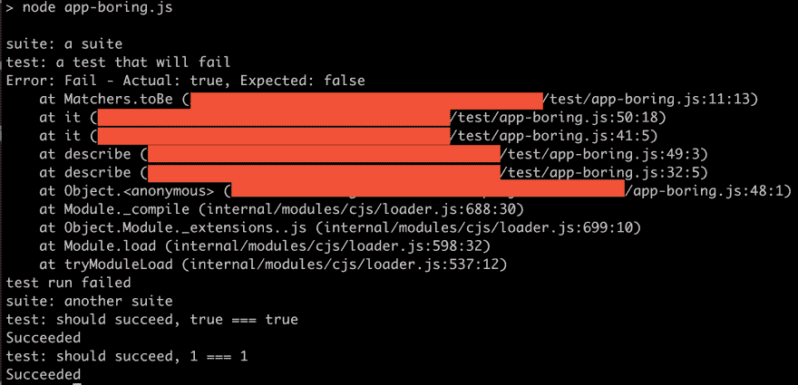

# 逆向工程，如何用 JavaScript 构建测试库

> 原文：<https://dev.to/itnext/reverse-engineering-how-you-can-build-a-test-library-53e3>

在 [Twitter](https://twitter.com/chris_noring) 上关注我，很乐意接受您对主题或改进的建议/Chris

> 我知道你在想什么。在外面有这么多测试库的情况下构建我自己的测试库？？听我说完。这篇文章是关于能够进行*逆向工程*并理解可能发生的事情。为什么？只是为了更好地理解和欣赏你所使用的库。

只是想说清楚。我不打算完全实现一个测试库，只是看一下公共 API，大致了解一下发生了什么，然后开始实现它。通过这样做，我希望获得对整体架构的一些理解，包括如何规划它，如何扩展它，以及理解哪些部分是复杂的，哪些是简单的。

我希望你喜欢这个旅程:)

我们将涵盖以下内容:

*   **为什么**，试着解释逆向工程的所有好处
*   **什么**，我们将建造什么和不建造什么
*   **构建**，慢慢带你完成构建的步骤

## 为什么

很多年前，在我软件开发职业生涯的初期，我问一位资深开发人员他们是如何变得更好的。这不仅仅是一个答案，但有一点很突出，即*逆向工程*或者更确切地说，重建他们正在使用或好奇的库或框架。

> 在我听来，你是在试图重新发明轮子。这有什么好的，难道我们没有足够的图书馆做同样的事情吗？

当然，这种观点也有可取之处。不要主要因为你不喜欢某个库的风格而构建东西，除非你确实需要，尽管有时候你确实需要。

> 那什么时候？

当你试图在你的职业中变得更好的时候。

> 听起来很模糊

嗯，是的，部分是。变得更好有很多方法。我认为，要真正理解某样东西，仅仅使用它是不够的- *你需要建立它*。

> 什么，全部吗？

取决于库或框架的大小。有些很小，值得全部建造。但大多数人不是。尽管尝试实现某些东西很有价值，但是只要开始*就能理解很多东西，如果只是陷入*的话。这就是这个练习的目的，试着去理解更多。

## 那个啥

我们在开始时提到了构建一个测试库。什么测试库？好吧，让我们看看大多数测试库在 JavaScript 中是什么样子的。它们往往看起来像这样:

```
describe('suite', () => {
  it('should be true', () => {
    expect(2 > 1).toBe(true)
  })
}) 
```

这是我们将要建设的范围，让上面的工作，并在这个过程中对架构进行评论，也许还会加入一个库来使它变得漂亮:)

让我们开始吧。

## 构造

那好吧。如果你建造了它，他们会来的。

> 确定吗？

你知道，电影《梦的领域》？

> 随便爷爷*烦了*

### 期待、断言我们的价值观

让我们从最内部的语句开始，`expect()`函数。通过查看调用，我们可以学到很多:

```
expect(2 > 1).toBe(true) 
```

`expect()`看起来像一个带`boolean`的函数。它似乎在返回一个对象，这个对象有一个方法`toBe()`，这个方法还能够比较`expect()`中的值和`toBe()`所得到的值。我们来试着勾画一下这个:

```
function expect(actual) {
  return {
    toBe(expected) { 
      if(actual === expected){ 
        /* do something*/ 
      } else {
        /* do something else*/
      }
    }
  }
} 
```

此外，我们应该考虑到，如果匹配成功或失败，应该会产生某种语句。所以还需要一些代码:

```
function expect(actual) {
  return {
    toBe(expected) { 
      if(expected === actual){ 
        console.log(`Succeeded`)
      } else {
        console.log(`Fail - Actual: ${actual}, Expected: ${expected}`)
      }
    }
  }
}

expect(true).toBe(true) // Succeeded
expect(3).toBe(2)  // Fail - Actual: 3, Expected: 2 
```

请注意，`else`语句有一个更加特殊的消息，并给出了失败的提示。

像这样比较两个值的方法叫做`matchers`。让我们试着添加另一个匹配者`toBeTruthy()`。原因是术语 *truthy* 匹配 JavaScript 中的许多值，我们不希望必须对所有事情都使用`toBe()`匹配器。

> 所以我们在偷懒？

是的，最好的理由是:)

这一条的规则是，JavaScript 中任何被认为是真的东西都应该成功，其他任何东西都应该失败。让我们通过访问 MDN 来欺骗一下，看看什么被认为是真实的 :

```
if (true)
if ({})
if ([])
if (42)
if ("0")
if ("false")
if (new Date())
if (-42)
if (12n)
if (3.14)
if (-3.14)
if (Infinity)
if (-Infinity) 
```

好的，所以一个`if`语句中的所有内容都计算为`true`。时间补充说方法:

```
function expect(actual) {
  return {
    toBe(expected) { 
      if(expected === actual){ 
        console.log(`Succeeded`)
      } else {
        console.log(`Fail - Actual: ${val}, Expected: ${expected}`)
      }
    },
    toBeTruthy() {
      if(actual) {
        console.log(`Succeeded`)
      } else {
        console.log(`Fail - Expected value to be truthy but got ${actual}`)
      }
    }
  }
}

expect(true).toBe(true) // Succeeded
expect(3).toBe(2)  // Fail - Actual: 3, Expected: 2 
expect('abc').toBeTruthy(); 
```

我不知道你怎么想，但是我感觉我的`expect()`函数开始包含很多东西了。因此，让我们把我们的`matchers`移到一个`Matchers`类，就像这样:

```
class Matchers {
  constructor(actual) {
    this.actual = actual;
  }

  toBe(expected) { 
    if(expected === this.actual){ 
      console.log(`Succeeded`)
    } else {
      console.log(`Fail - Actual: ${this.actual}, Expected: ${expected}`)
    }
  }

  toBeTruthy() {
    if(this.actual) {
      console.log(`Succeeded`)
    } else {
      console.log(`Fail - Expected value to be truthy but got ${this.actual}`)
    }
  }
}

function expect(actual) {
  return new Matchers(actual);
} 
```

### it，我们的测试方法

从我们的角度来看，它应该是这样工作的:

```
it('test method', () => {
  expect(3).toBe(2)
}) 
```

好的，逆向工程这一点我们可以写我们的`it()`方法:

```
function it(testName, fn) {
  console.log(`test: ${testName}`);
  fn();
} 
```

好吧，让我们停下来想一想。我们想要什么样的行为？我肯定见过单元测试库在失败时退出测试。我猜如果你有 200 个单元测试(不是说你应该在一个文件中有 200 个测试:)，你不想等它们完成，不如直接告诉我哪里出了问题，这样我就可以修复它。为了让后者成为可能，我们需要稍微调整一下我们的匹配器:

```
class Matchers {
  constructor(actual) {
    this.actual = actual;
  }

  toBe(expected) { 
    if(expected === actual){ 
      console.log(`Succeeded`)
    } else {
      throw new Error(`Fail - Actual: ${val}, Expected: ${expected}`)
    }
  }

  toBeTruthy() {
    if(actual) {
      console.log(`Succeeded`)
    } else {
      console.log(`Fail - Expected value to be truthy but got ${actual}`)
      throw new Error(`Fail - Expected value to be truthy but got ${actual}`)
    }
  }
} 
```

这意味着我们的`it()`函数需要捕捉任何错误，比如:

```
function it(testName, fn) {
  console.log(`test: ${testName}`);
  try {
    fn();
  } catch(err) {
    console.log(err);
    throw new Error('test run failed');
  }

} 
```

正如您在上面看到的，我们不仅捕获错误并记录下来，还重新抛出它来结束运行本身。同样，主要原因是我们认为继续下去没有意义。你可以用你认为合适的方式来实现它。

### 形容，我们的测试套件

好了，我们讨论了如何编写`it()`和`expect()`，甚至还加入了几个匹配器函数。所有的测试库都应该有一个套件的概念，也就是说这是一组属于一起的测试。

让我们看看代码可能是什么样子:

```
describe('our suite', () => {
  it('should fail 2 != 1', () => {
    expect(2).toBe(1);
  })

  it('should succeed', () => { // technically it wouldn't get here, it would crash out after the first test
    expect('abc').toBeTruthy();
  })
}) 
```

至于实现，我们知道失败的测试会抛出错误，所以我们需要捕获错误，以免整个程序崩溃:

```
function describe(suiteName, fn) {
  try {
    console.log(`suite: ${suiteName}`);
    fn();
  } catch(err) {
    console.log(err.message);
  }
} 
```

### 运行代码

此时，我们的完整代码应该是这样的:

```
// app.js

class Matchers {
  constructor(actual) {
    this.actual = actual;
  }

  toBe(expected) {
    if (expected === this.actual) {
      console.log(`Succeeded`)
    } else {
      throw new Error(`Fail - Actual: ${this.actual}, Expected: ${expected}`)
    }
  }

  toBeTruthy() {
    if (actual) {
      console.log(`Succeeded`)
    } else {
      console.log(`Fail - Expected value to be truthy but got ${this.actual}`)
      throw new Error(`Fail - Expected value to be truthy but got ${this.actual}`)
    }
  }
}

function expect(actual) {
  return new Matchers(actual);
}

function describe(suiteName, fn) {
  try {
    console.log(`suite: ${suiteName}`);
    fn();
  } catch(err) {
    console.log(err.message);
  }
}

function it(testName, fn) {
  console.log(`test: ${testName}`);
  try {
    fn();
  } catch (err) {
    console.log(err);
    throw new Error('test run failed');
  }
}

describe('a suite', () => {
  it('a test that will fail', () => {
    expect(true).toBe(false);
  })

  it('a test that will never run', () => {
    expect(1).toBe(1);
  })
})

describe('another suite', () => {
  it('should succeed, true === true', () => {
    expect(true).toBe(true);
  })

  it('should succeed, 1 === 1', () => {
    expect(1).toBe(1);
  })
}) 
```

而当用`node app.js`在终端中运行时，应该渲染成这样:

[](https://res.cloudinary.com/practicaldev/image/fetch/s--AU3RQVD8--/c_limit%2Cf_auto%2Cfl_progressive%2Cq_auto%2Cw_880/https://thepracticaldev.s3.amazonaws.com/i/y3hmyys7hsph5gbg16bb.png)

## 做得漂亮

现在上面的似乎在工作，但是看起来很无聊。那么我们能做些什么呢？颜色，大量的颜色会让这个更好。使用库`chalk`我们真的可以在其中引入一些生命:

```
npm install chalk --save 
```

好了，接下来让我们添加一些颜色，一些制表符和空格，我们的代码应该是这样的:

```
const chalk = require('chalk');

class Matchers {
  constructor(actual) {
    this.actual = actual;
  }

  toBe(expected) {
    if (expected === this.actual) {
      console.log(chalk.greenBright(`    Succeeded`))
    } else {
      throw new Error(`Fail - Actual: ${this.actual}, Expected: ${expected}`)
    }
  }

  toBeTruthy() {
    if (actual) {
      console.log(chalk.greenBright(`    Succeeded`))
    } else {
      throw new Error(`Fail - Expected value to be truthy but got ${this.actual}`)
    }
  }
}

function expect(actual) {
  return new Matchers(actual);
}

function describe(suiteName, fn) {
  try {
    console.log('\n');
    console.log(`suite: ${chalk.green(suiteName)}`);
    fn();
  } catch (err) {
    console.log(chalk.redBright(`[${err.message.toUpperCase()}]`));
  }
}

function it(testName, fn) {
  console.log(`  test: ${chalk.yellow(testName)}`);
  try {
    fn();
  } catch (err) {
    console.log(` ${chalk.redBright(err)}`);
    throw new Error('test run failed');
  }
}

describe('a suite', () => {
  it('a test that will fail', () => {
    expect(true).toBe(false);
  })

  it('a test that will never run', () => {
    expect(1).toBe(1);
  })
})

describe('another suite', () => {
  it('should succeed, true === true', () => {
    expect(true).toBe(true);
  })

  it('should succeed, 1 === 1', () => {
    expect(1).toBe(1);
  })
}) 
```

运行时呈现如下:

[](https://res.cloudinary.com/practicaldev/image/fetch/s--Gt0KQDcz--/c_limit%2Cf_auto%2Cfl_progressive%2Cq_auto%2Cw_880/https://thepracticaldev.s3.amazonaws.com/i/nusgojpo4vmi22r8q7zx.png)

## 总结

我们的目标是寻找一个相当小的库，比如单元测试库。通过查看代码，我们可以推断出它下面的样子。

我们创造了一些东西，一个起点。说到这里，我们需要意识到大多数单元测试库还附带了很多其他东西，比如处理异步测试、多测试套件、模仿、间谍等等。试图了解你每天使用的东西会有很多收获，但请意识到你不必完全重新发明它来获得很多洞察力。

我的希望是，你可以使用这个代码作为一个起点，也许可以玩它，从头开始或扩展，选择权在你。

另一个结果可能是你对 OSS 有了足够的了解，并改进了现有的一个库。

记住，如果你建造了，他们会来的:

[](https://res.cloudinary.com/practicaldev/image/fetch/s--YY1Wgcm0--/c_limit%2Cf_auto%2Cfl_progressive%2Cq_auto%2Cw_880/https://thepracticaldev.s3.amazonaws.com/i/vndsyrcrelnklmbamhhy.jpg)