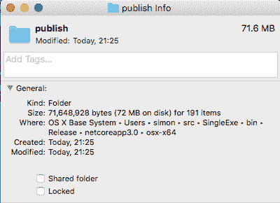
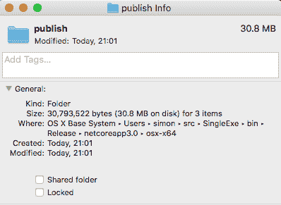

# 在中创建单个文件应用程序。网络核心

> 原文：<https://dev.to/simonreynolds/creating-a-single-file-application-in-net-core-5ab5>

[](https://res.cloudinary.com/practicaldev/image/fetch/s--BY4cdmy6--/c_limit%2Cf_auto%2Cfl_progressive%2Cq_auto%2Cw_880/https://images.unsplash.com/photo-1465920431246-94bf7d9d4269%3Fixlib%3Drb-1.2.1%26q%3D80%26fm%3Djpg%26crop%3Dentropy%26cs%3Dtinysrgb%26w%3D1080%26fit%3Dmax%26ixid%3DeyJhcHBfaWQiOjExNzczfQ)

。NET Core 长期以来一直支持自包含应用程序的概念，在这种情况下，构建过程会产生一个可执行的应用程序。直到发布。NET Core 3 preview 6，结果输出将是一个单独的可执行文件和它需要的所有支持库或 dll。

让我们使用一个简单的 Hello World 应用程序来研究这些变化...

```
mkdir SingleExe
dotnet new console 
```

<svg width="20px" height="20px" viewBox="0 0 24 24" class="highlight-action crayons-icon highlight-action--fullscreen-on"><title>Enter fullscreen mode</title></svg> <svg width="20px" height="20px" viewBox="0 0 24 24" class="highlight-action crayons-icon highlight-action--fullscreen-off"><title>Exit fullscreen mode</title></svg>

这将创建一个简单的控制台应用程序，带有如下所示的`csproj`

```
<Project Sdk="Microsoft.NET.Sdk">

  <PropertyGroup>
    <OutputType>Exe</OutputType>
    <TargetFramework>netcoreapp3.0</TargetFramework>
  </PropertyGroup>

</Project> 
```

<svg width="20px" height="20px" viewBox="0 0 24 24" class="highlight-action crayons-icon highlight-action--fullscreen-on"><title>Enter fullscreen mode</title></svg> <svg width="20px" height="20px" viewBox="0 0 24 24" class="highlight-action crayons-icon highlight-action--fullscreen-off"><title>Exit fullscreen mode</title></svg>

如果我们为我们的环境添加一个`RuntimeIdentifier`,那么我们就可以发布一个为该环境构建的应用程序，它可以在不需要。要安装的. NET 核心运行时。运行时标识符的分类可以在[这里](https://docs.microsoft.com/en-us/dotnet/core/rid-catalog)找到。

一旦我们添加了适当的标识符，例如`<RuntimeIdentifier>osx-x64</RuntimeIdentifier>`，我们就可以使用

`dotnet publish -c Release`

这样会产生大量的输出！

<figure>[](https://res.cloudinary.com/practicaldev/image/fetch/s--Pvo8VeZN--/c_limit%2Cf_auto%2Cfl_progressive%2Cq_auto%2Cw_880/https://simonreynolds.ie/conteimg/2019/07/Screen-Shot-2019-07-18-at-21.25.18.png) 

<figcaption>72MB 横跨 191 项不算小的自带应用！</figcaption>

</figure>

。NET Core 3 引入了许多新的选项来整合所有这些输出。

如果我们将我们的`csproj`更新为以下内容，那么我们的输出将被合并到一个可执行文件中，未调用的代码将被删除

```
<PublishTrimmed>true</PublishTrimmed>
<PublishSingleFile>true</PublishSingleFile> 
```

<svg width="20px" height="20px" viewBox="0 0 24 24" class="highlight-action crayons-icon highlight-action--fullscreen-on"><title>Enter fullscreen mode</title></svg> <svg width="20px" height="20px" viewBox="0 0 24 24" class="highlight-action crayons-icon highlight-action--fullscreen-off"><title>Exit fullscreen mode</title></svg>

<figure>[](https://res.cloudinary.com/practicaldev/image/fetch/s--k6gpaMd2--/c_limit%2Cf_auto%2Cfl_progressive%2Cq_auto%2Cw_880/https://simonreynolds.ie/conteimg/2019/07/Screen-Shot-2019-07-18-at-21.02.36.png) 

<figcaption>单个 30MB 的可执行文件更易于管理</figcaption>

</figure>

现在，30MB 对于一个在控制台屏幕上简单地写“Hello World”的应用程序来说可能看起来太大了，但是请记住这包括了。NET 核心的应用程序需要运行，它绝对没有外部依赖！

> 不过这里要小心，任何使用反射的东西都可能被不正确地修剪。

调整应用程序后测试它们！您可以使用`TrimmerRootAssembly`元素告诉 trimmer 包含特定的名称空间、类或方法。

```
<ItemGroup>
  <TrimmerRootAssembly Include="Namespace.To.Keep" />
</ItemGroup> 
```

<svg width="20px" height="20px" viewBox="0 0 24 24" class="highlight-action crayons-icon highlight-action--fullscreen-on"><title>Enter fullscreen mode</title></svg> <svg width="20px" height="20px" viewBox="0 0 24 24" class="highlight-action crayons-icon highlight-action--fullscreen-off"><title>Exit fullscreen mode</title></svg>

这仍然只是使用 IL(中间语言)，字节码。每次运行应用程序时，NET 代码都会编译为目标计算机的本机代码，并被 JIT(实时)编译为目标计算机的本机代码。

如果我们要为一个特定的平台构建，或者为多个平台提供构建，那么将尽可能多的代码预编译成本机代码是有意义的。

进入`PublishReadyToRun`选项。我们将它包含在我们的`csproj`文件中，所以整个文件现在看起来像这样...

```
<Project Sdk="Microsoft.NET.Sdk">

  <PropertyGroup>
    <OutputType>Exe</OutputType>
    <TargetFramework>netcoreapp3.0</TargetFramework>
    <PublishTrimmed>true</PublishTrimmed>
    <PublishSingleFile>true</PublishSingleFile>
    <PublishReadyToRun>true</PublishReadyToRun>
    <!-- Set the RuntimeIdentifier below to match your own system -->
    <RuntimeIdentifier>osx-x64</RuntimeIdentifier>
  </PropertyGroup>

</Project> 
```

<svg width="20px" height="20px" viewBox="0 0 24 24" class="highlight-action crayons-icon highlight-action--fullscreen-on"><title>Enter fullscreen mode</title></svg> <svg width="20px" height="20px" viewBox="0 0 24 24" class="highlight-action crayons-icon highlight-action--fullscreen-off"><title>Exit fullscreen mode</title></svg>

现在，编译器将尽可能多地将代码预编译成(在本例中)特定于 Mac 的机器代码。这将不必在每次应用程序运行时进行 JIT，从而显著加快应用程序的启动。

这里的权衡是，现在生成的可执行文件是特定于平台的，但是如果您可以为每个主要平台提供一个预构建的可执行文件，那么这将是非常值得考虑的。