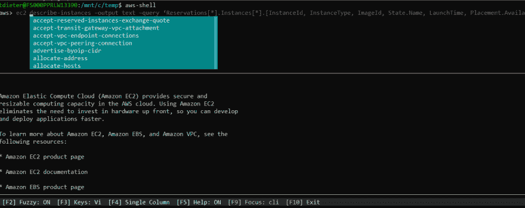

# aws-shell，AWS CLI 体验增强

> 原文：<https://dev.to/dietertroy/aws-shell-aws-cli-experience-enhanced-1od3>

你渴望 AWS CLI 工具中的自动完成和手册页吗？不要再看了，因为 [aws-shell](https://github.com/awslabs/aws-shell) 是来拯救(还是 shell？)这一天。

下面是一个使用 aws-shell 的例子:
[](https://res.cloudinary.com/practicaldev/image/fetch/s--Vl2m6D6---/c_limit%2Cf_auto%2Cfl_progressive%2Cq_auto%2Cw_880/https://snag.gy/pFrPEL.jpg)

aws-shell 需要 python 和 [pip](http://www.pip-installer.org/en/latest/) 来安装。您可以使用 [pip](http://www.pip-installer.org/en/latest/) 安装 aws-shell:

```
$ pip install aws-shell 
```

<svg width="20px" height="20px" viewBox="0 0 24 24" class="highlight-action crayons-icon highlight-action--fullscreen-on"><title>Enter fullscreen mode</title></svg> <svg width="20px" height="20px" viewBox="0 0 24 24" class="highlight-action crayons-icon highlight-action--fullscreen-off"><title>Exit fullscreen mode</title></svg>

如果您没有安装到 virtualenv 中，您可以运行:

```
$ sudo pip install aws-shell 
```

<svg width="20px" height="20px" viewBox="0 0 24 24" class="highlight-action crayons-icon highlight-action--fullscreen-on"><title>Enter fullscreen mode</title></svg> <svg width="20px" height="20px" viewBox="0 0 24 24" class="highlight-action crayons-icon highlight-action--fullscreen-off"><title>Exit fullscreen mode</title></svg>

一旦安装了 aws-shell，就可以用以下命令对其进行配置:

```
$ aws-shell
aws> configure 
```

<svg width="20px" height="20px" viewBox="0 0 24 24" class="highlight-action crayons-icon highlight-action--fullscreen-on"><title>Enter fullscreen mode</title></svg> <svg width="20px" height="20px" viewBox="0 0 24 24" class="highlight-action crayons-icon highlight-action--fullscreen-off"><title>Exit fullscreen mode</title></svg>

在 GitHub 的知识库页面上，你可以随意了解更多关于 aws-shell 的信息。