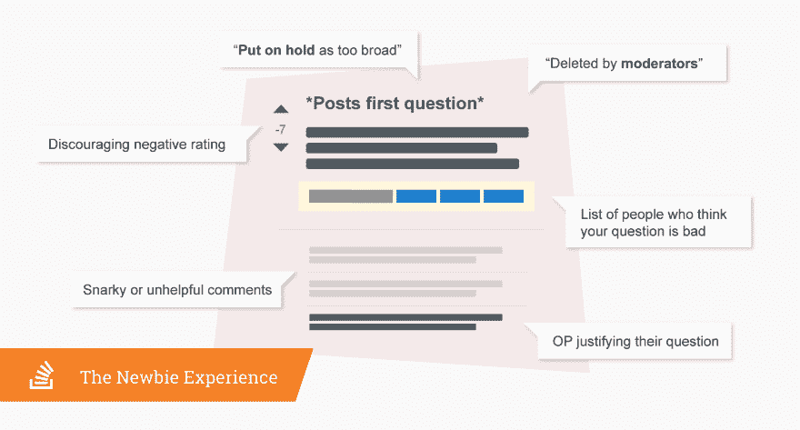

# 多么糟糕的一天工作教会了我如何建立 Stack Overflow 的社区

> 原文：<https://dev.to/stackoverflow/what-a-very-bad-day-at-work-taught-me-about-building-stack-overflow-s-community-4gmm>

嗨，我的名字是 Sara Chipps，第一次 Stack 博客，长时间 Stacker(我一直想这么说！).我是 Stack Overflow 公共问答的新主管。我现在已经在 Stack 工作了一年，我想和你分享我工作中最糟糕的一天，以及它教会我关于 Stack Overflow 社区的事情。

简单介绍一下我:我是堆栈溢出用户#4140。我当时在测试版，是第一批在平台上提问的人之一。长期以来，堆栈溢出一直是我工作的一个重要部分。我一直是问答的活跃成员，51 区的参与者，世界建设、烹饪和代码高尔夫的潜行者。我已经在我们的就业公告板上寻找新的机会，并在我帮助运营的公司招聘优秀人才时发布招聘广告，如[犹太机器人](http://jewelbots.com)或 [GDI](http://girldevelopit.com) 。

然而，真正将我与 Stack Overflow 及其社区联系起来的是一个简单的事实，即我已经做了 18 年的软件开发人员。我在 MS SQL 和数据仓库方面初露头角。我转到了 C#和。NET 在 2006 年。在 2011 年转向 JavaScript、Node.js 和构建 Nodebots 之前，我是 2009 年和 2010 年的. NET MVP。我全心全意地热爱 JavaScript，毫无保留。自从 2018 年加入 Stack Overflow 的工程管理团队，我又回到了。的[板](https://dotnetfoundation.org/blog/2019/03/28/net-foundation-board-of-directors-election-results)上。NET foundation 帮助框架构建互联网的未来。

我非常关心技术领域的代表性，以及来自技术领域代表性不足的群体的人被雇用并以与同龄人相同的速度成功的未来。成为团队的一员，帮助引导社区的方向和发展是一种难以置信的荣誉。

在过去的几个月里，我们一直在做一些令人兴奋的事情，让这个网站变得更受欢迎、更多样化、更包容。为了启动这些变化，我们从我们的版主和高级用户所依赖的工具开始，使 Stack Overflow 成为在线开发人员的最佳站点。我看到我们的社区经理最想做的事情就是更新这些过时的工具，其中一些工具从我们第一次发布以来就没有被使用过！该团队以前被称为 DAG(开发倡导和发展),现在是社区团队的一部分，开始推出标签同义词刷新和改进的版主仪表板。偿还这笔债务将继续是我们的首要任务，因为我们努力让我们的 mods 获得一流的工具来管理他们的社区。

我们优先考虑的第二件事需要一点故事。当我大约一年前加入 Stack Overflow 时，我被我所有的同事的善良和慷慨所震惊，工程团队也不例外。作为团队的工程经理，我负责开发我们的人才产品，与我真正尊敬的杰出人士密切合作。与终身学习者和自然老师合作是一种享受，这种工程师是你在任何团队中都想要的。

大约三个月后的一个周五下午，我们推出了一项全公司范围的新政策，我觉得它相对来说是良性的。接下来发生的事情是，从我的角度来看，工程团队完全失去了它。没有人同意这一政策，他们通过看似数百次的闲置 pings 使这一政策为人所知。经过一个下午的来回奔波，我离开时感觉情绪疲惫。我那些如此善良和优秀的同事们都发生了什么？我觉得受到了攻击和贬低。似乎人们不重视我的工作或我的判断。

我回家度周末，沮丧地闷闷不乐。我在脑海里回放了发生的一切，每次都对人们的反应感到更加沮丧。当星期天来临的时候，我决定要回顾一下我们之间松散的谈话，看看我的哪个同事是最粗鲁和最不讲道理的。我想直接反馈给他们，他们伤害了我的感情。

当我回顾那个周五下午的聊天记录时，我震惊地发现没有人在辱骂我。没有人说我的坏话或直接攻击我的功效。事实上，我发现人们有一些很好的论据来解释为什么他们觉得这个政策是个坏主意。整个工程部门明确地提出了他们的批评，但我没有发现有人质疑我作为经理的能力，四处辱骂，或说任何说明我为什么感觉如此受到攻击的话。

就在那时，一些事情变得非常清楚:我的同事没有变成怪物，他们仍然是我认为的善良和有爱心的人。在这种情况下，怪物不是一个人，而是当许多人，甚至是怀着伟大的意图，同时公开反对你时产生的。当背后有一群人时，即使是善意的反馈也会显得刻薄和刻薄。不管他们说得多好，当一大群你真正尊重的人公开挑战你所做的事情时，感觉就像是人身攻击。

当我意识到这一点时，我看到的关于堆栈溢出不受欢迎的一些困惑开始变得有意义了。在我们的开发者调查结果中，我们读到了这样的内容:

*   ***针对新用户的损人社区。不善良是没有借口的！*"–6 年编码**
***   ***对于新开发人员来说感觉太恐怖，难以接近*“–3 年编码*****   ***P**人可以不那么野蛮*"–6 年编码*****   ***对初学者的态度并不友好。提问者在提问之前应该已经做了大量的研究(回复:问题格式和内容)，即使他们对社区或主题完全陌生。当他们完全是编程新手时，不是每个人都能理解甚至知道去寻找文档。*–12 年编码经验********

 ******然而，当我们更有经验的用户听到这个反馈时，他们会要求我们提供明确的例子，告诉他们人们到底在哪里不友好？没有很多骂人或者愤怒，为什么他们被指责不友好？

人们告诉我们，他们害怕参与，因为他们的同龄人可能会很刻薄。这个系统目前的构建方式是，当你问一个可能需要一些编辑或重复的问题时，一群人会突然冒出来告诉你你做错了。

他们可以用最中性的方式来说，但是不管你怎么说，十几个人指出你的错误感觉很糟糕。这不仅让人感觉很糟糕，而且对整体内容质量也没有好处，更不用说是一种让别人改进他们问题的无效方式。还有一个黄色的大框，给你投票决定关闭或删除你的问题的工程师的名字。这本身就很糟糕，尤其是当我们的高信誉用户倾向于更有经验和更受尊敬的工程师时。

一方面，我们更有经验的高级用户告诉我们，即使他们只是想提供帮助，他们也会因为不友好而感到被叫了出来；另一方面，我们的新用户和没有参与的人告诉我们，他们认为栈溢出是可怕的，他们害怕判断。在过去，我们优先处理掉不友好的评论。我们已经看到了[的改善](https://meta.stackoverflow.com/questions/367768/was-there-an-uptick-in-comment-flags-after-the-be-nicer-blog-post/367769#367769) [那里](https://meta.stackoverflow.com/questions/373801/when-is-a-comment-hostile-or-unfriendly-educating-newer-users-how-to-flag-comm/373929#373929)，但是我们仍然听到人们感觉被针对，即使没有不友好的评论。这个问题出在我们身上，因为我们设计了提问和结束流程。人们按照产品的设计来使用产品，结果人们觉得被叫了出来，或者更糟的是，不再提问题。

在接下来的几个季度中，我们将后退一步，重新评估我们如何向用户提供有关他们问题的反馈。我们希望确保人们得到必要的反馈，而不会感到被叫出来或在公共场合感到尴尬。我们将努力寻找新的途径来提高内容质量，减少人与人之间的摩擦。我们的目标是让提问过程变得轻松，对新用户和堆栈溢出老手都有好处。

通过改善人们相互反馈的方式，我们可以提高问题的质量，而不会给用户带来监管网站的负担。我们将授权我们的长期用户成为导师和老师，以使 Stack Overflow 的精神回到最初的样子，一个人们来分享和学习的地方。通过认真思考如何提供反馈，我们将帮助人们学习，而不是赶走他们。我们将让更多人参与进来**和**提高问题质量。

我和社区团队非常兴奋能够改善所有级别的编码人员在 Stack Overflow 上的体验，从第一次学习前端的新用户到我们尊敬的已经编码 20 多年的版主。我们都有如何让系统变得更好的想法。好消息是，我们有经验丰富的研究人员、数据科学家和出色的产品经理，他们将从我们、社区和许多其他地方和合作伙伴那里收集反馈，以做出关于解决方案的明智决策。

我们重视我们的社区，并很高兴听到您对我们所做改进的看法。我们将一如既往地确保让您了解最新情况。

关于建立 Stack Overflow 社区的帖子最先出现在 [Stack Overflow 博客](https://stackoverflow.blog)上。******