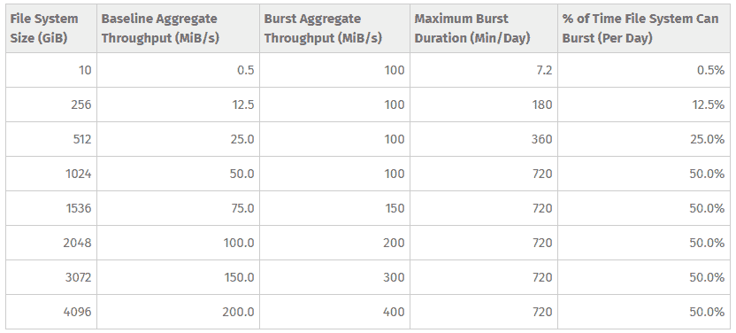

# 根据您的应用调整 AWS EFS 突发模式

> 原文：<https://dev.to/dietertroy/sizing-aws-efs-bursting-mode-to-your-application-296l>

[AWS 弹性文件系统](https://docs.aws.amazon.com/efs/latest/ug/whatisefs.html)是在自动扩展组情况下使用共享存储的一个很好的工具。您的文件系统有两种吞吐量模式可供选择，*突发吞吐量*和*调配吞吐量*。借助突发吞吐量模式，亚马逊 EFS 上的吞吐量会随着标准存储类中文件系统的大小增长而扩展。EFS 的性能在这篇 AWS 知识库文章中有很好的记录，所以我们在这里不会太深入。

我们将在本帖中讨论的关于**突发吞吐量**的一个警告是小型文件系统的突发限制。

[](https://res.cloudinary.com/practicaldev/image/fetch/s--QlvcRLb9--/c_limit%2Cf_auto%2Cfl_progressive%2Cq_auto%2Cw_880/https://snag.gy/rZwujR.jpg) 
如上表所示，*越小，文件系统大小(GiB)* 越小，*基线聚合吞吐量(MiB/s)* 越小。

为了确保您有合适的初始基线聚合吞吐量，您需要使用工具`dd`增加文件系统的大小**。创建并装载了 EFS 文件系统(在本例中，它是 mounted /efs)后，使用以下命令将大小增加到 256GB:**

```
cd /efs
sudo nohup dd if=/dev/urandom of=2048gb-b.img bs=1024k count=256000 status=progress & 
```

<svg width="20px" height="20px" viewBox="0 0 24 24" class="highlight-action crayons-icon highlight-action--fullscreen-on"><title>Enter fullscreen mode</title></svg> <svg width="20px" height="20px" viewBox="0 0 24 24" class="highlight-action crayons-icon highlight-action--fullscreen-off"><title>Exit fullscreen mode</title></svg>

可以通过修改`count=`参数来更改 256GB 的值，但是请记住上表中允许的%突发时间。

已部署的应用程序(如在 EFS 装载中装载 Jenkins 共享)将从中受益。例如，Jenkins `/workspace`路径需要许多突发写入，具体取决于作业\管道\项目数量。