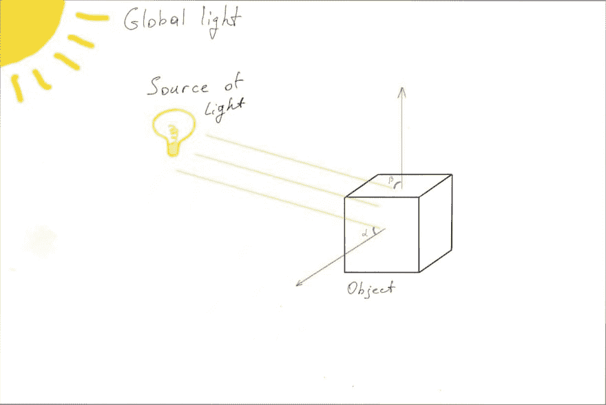
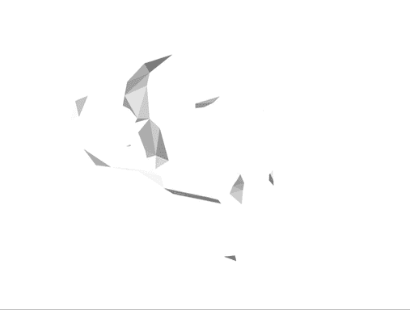
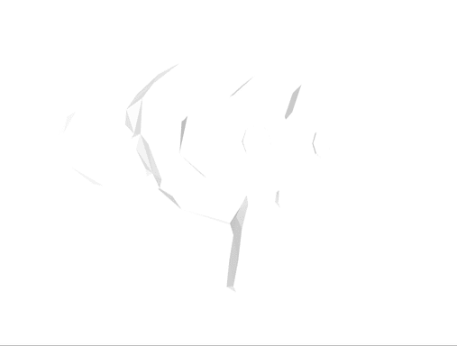
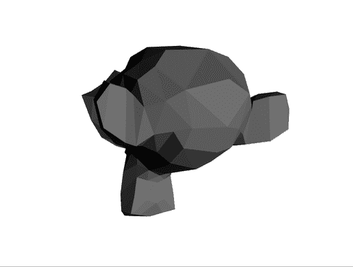
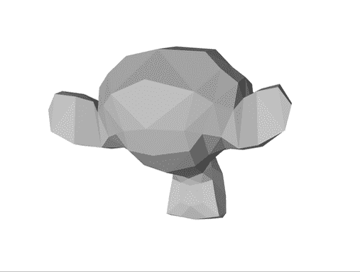

# WebGL 月份。第 18 天。平面阴影

> 原文：<https://dev.to/lesnitsky/webgl-month-day-18-flat-shading-3nhg>

## 平面阴影

这是一系列与 WebGL 相关的博文。每天都会有新帖子

[](https://github.com/lesnitsky/webgl-month)
[T6】](https://twitter.com/lesnitsky_a)

[加入邮件列表](http://eepurl.com/gwiSeH),让新邮件直接进入你的收件箱

[此处提供源代码](https://github.com/lesnitsky/webgl-month)

建造于

[](https://github.com/lesnitsky/git-tutor)

* * *

嘿👋

欢迎来到 WebGL 月。

今天我们将学习如何实现平面阴影。不过先说光本身。

一个典型的 3d 场景将包含一个物体，全局光源和一些特定的光源(火炬，灯等。)

那么，我们如何将所有这些分解成可以转化为代码的东西呢

这里有一个例子

[](https://res.cloudinary.com/practicaldev/image/fetch/s--VsUMalbc--/c_limit%2Cf_auto%2Cfl_progressive%2Cq_auto%2Cw_880/https://git-tutor-assets.s3.eu-west-2.amazonaws.com/light-illustration.png)

注意来自立方体表面的红色箭头。这些箭头是“法线”，每个面的颜色将取决于光线矢量和面法线之间的角度。

让我们改变我们的物体着色的方式，使所有的面颜色相同，以更好地观察光线如何影响面的颜色

📄src/3d.js

```
 const { vertices, indices } = parseObj(monkeyObj);

  const faceColors = [
-     [1.0, 1.0, 1.0, 1.0], // Front face: white
-     [1.0, 0.0, 0.0, 1.0], // Back face: red
-     [0.0, 1.0, 0.0, 1.0], // Top face: green
-     [0.0, 0.0, 1.0, 1.0], // Bottom face: blue
-     [1.0, 1.0, 0.0, 1.0], // Right face: yellow
-     [1.0, 0.0, 1.0, 1.0], // Left face: purple +     [0.5, 0.5, 0.5, 1.0]
  ];

  const colors = [];

  for (var j = 0; j < indices.length / 3; ++j) {
-     const randomColorIndex = Math.floor(Math.random() * faceColors.length);
-     colors.push(randomColorIndex, randomColorIndex, randomColorIndex); +     colors.push(0, 0, 0, 0);
  }

  faceColors.forEach((color, index) => { 
```

我们还需要从我们的对象中提取法线并使用`drawArrays`而不是`drawElements`，因为每个顶点不能被索引引用，因为顶点坐标和法线有不同的索引

📄src/3d.js

```
 const programInfo = setupShaderInput(gl, program, vShaderSource, fShaderSource);

- const { vertices, indices } = parseObj(monkeyObj);
+ const { vertices, normals } = parseObj(monkeyObj); 
  const faceColors = [
      [0.5, 0.5, 0.5, 1.0]

  const colors = [];

- for (var j = 0; j < indices.length / 3; ++j) {
+ for (var j = 0; j < vertices.length / 3; ++j) {
      colors.push(0, 0, 0, 0);
  }

  const vertexBuffer = new GLBuffer(gl, gl.ARRAY_BUFFER, vertices, gl.STATIC_DRAW);
  const colorsBuffer = new GLBuffer(gl, gl.ARRAY_BUFFER, new Float32Array(colors), gl.STATIC_DRAW);
- const indexBuffer = new GLBuffer(gl, gl.ELEMENT_ARRAY_BUFFER, indices, gl.STATIC_DRAW); 
  vertexBuffer.bind(gl);
  gl.vertexAttribPointer(programInfo.attributeLocations.position, 3, gl.FLOAT, false, 0, 0);

  gl.viewport(0, 0, canvas.width, canvas.height);

- gl.drawElements(gl.TRIANGLES, indexBuffer.data.length, gl.UNSIGNED_SHORT, 0);
+ gl.drawArrays(gl.TRIANGLES, 0, vertexBuffer.data.length / 3); 
  function frame() {
      mat4.rotateY(modelMatrix, modelMatrix, Math.PI / 180);

      gl.uniformMatrix4fv(programInfo.uniformLocations.modelMatrix, false, modelMatrix);
-     gl.drawElements(gl.TRIANGLES, indexBuffer.data.length, gl.UNSIGNED_SHORT, 0); + 
+     gl.drawArrays(gl.TRIANGLES, 0, vertexBuffer.data.length / 3); 
      requestAnimationFrame(frame);
  } 
```

📄src/gl-helpers.js

```
 }

  export function parseObj(objSource) {
-     const vertices = [];
-     const indices = []; +     const _vertices = [];
+     const _normals = [];
+     const vertexIndices = [];
+     const normalIndices = []; 
      objSource.split('\n').forEach(line => {
          if (line.startsWith('v ')) {
-             vertices.push(...parseVec(line, 'v ')); +             _vertices.push(parseVec(line, 'v '));
+         }
+ 
+         if (line.startsWith('vn ')) {
+             _normals.push(parseVec(line, 'vn '));
          }

          if (line.startsWith('f ')) {
-             indices.push(...parseFace(line).map(face => face[0] - 1)); +             const parsedFace = parseFace(line);
+ 
+             vertexIndices.push(...parsedFace.map(face => face[0] - 1));
+             normalIndices.push(...parsedFace.map(face => face[2] - 1));
          }
      });

+     const vertices = [];
+     const normals = [];
+ 
+     for (let i = 0; i < vertexIndices.length; i++) {
+         const vertexIndex = vertexIndices[i];
+         const normalIndex = normalIndices[i];
+ 
+         const vertex = _vertices[vertexIndex];
+         const normal = _normals[normalIndex];
+ 
+         vertices.push(...vertex);
+         normals.push(...normal);
+     }
+ 
      return { 
          vertices: new Float32Array(vertices), 
-         indices: new Uint16Array(indices), +         normals: new Float32Array(normals), 
      };
  } 
```

定义正常属性

📄src/3d.js

```
 const vertexBuffer = new GLBuffer(gl, gl.ARRAY_BUFFER, vertices, gl.STATIC_DRAW);
  const colorsBuffer = new GLBuffer(gl, gl.ARRAY_BUFFER, new Float32Array(colors), gl.STATIC_DRAW);
+ const normalsBuffer = new GLBuffer(gl, gl.ARRAY_BUFFER, normals, gl.STATIC_DRAW); 
  vertexBuffer.bind(gl);
  gl.vertexAttribPointer(programInfo.attributeLocations.position, 3, gl.FLOAT, false, 0, 0);
  colorsBuffer.bind(gl);
  gl.vertexAttribPointer(programInfo.attributeLocations.colorIndex, 1, gl.FLOAT, false, 0, 0);

+ normalsBuffer.bind(gl);
+ gl.vertexAttribPointer(programInfo.attributeLocations.normal, 3, gl.FLOAT, false, 0, 0);
+ 
  const modelMatrix = mat4.create();
  const viewMatrix = mat4.create();
  const projectionMatrix = mat4.create(); 
```

📄src/shaders/3d.v.glsl

```
 attribute vec3 position;
+ attribute vec3 normal;
  attribute float colorIndex;

  uniform mat4 modelMatrix; 
```

让我们也定义一个位置的光，并通过统一传递给着色器

📄src/3d.js

```
 gl.uniformMatrix4fv(programInfo.uniformLocations.viewMatrix, false, viewMatrix);
  gl.uniformMatrix4fv(programInfo.uniformLocations.projectionMatrix, false, projectionMatrix);

+ gl.uniform3fv(programInfo.uniformLocations.directionalLightVector, [0, 0, -7]);
+ 
  gl.viewport(0, 0, canvas.width, canvas.height);

  gl.drawArrays(gl.TRIANGLES, 0, vertexBuffer.data.length / 3); 
```

📄src/shaders/3d.v.glsl

```
 uniform mat4 viewMatrix;
  uniform mat4 projectionMatrix;
  uniform vec4 colors[6];
+ uniform vec3 directionalLightVector; 
  varying vec4 vColor; 
```

现在，我们可以使用法线矢量和方向光矢量来计算光的“强度”和乘以初始颜色

📄src/shaders/3d.v.glsl

```
 void main() {
      gl_Position = projectionMatrix * viewMatrix * modelMatrix * vec4(position, 1.0);
-     vColor = colors[int(colorIndex)]; + 
+     float intensity = dot(normal, directionalLightVector);
+ 
+     vColor = colors[int(colorIndex)] * intensity;
  } 
```

[](https://res.cloudinary.com/practicaldev/image/fetch/s--M0Y0q3zJ--/c_limit%2Cf_auto%2Cfl_progressive%2Cq_66%2Cw_880/https://git-tutor-assets.s3.eu-west-2.amazonaws.com/lighting-1.gif)

现在一些脸更亮了，一些更亮了，所以整体效果不错，但是图像看起来太亮了

当前实现的一个问题是，我们对光的方向使用了“非标准化”的矢量

📄src/shaders/3d.v.glsl

```
 void main() {
      gl_Position = projectionMatrix * viewMatrix * modelMatrix * vec4(position, 1.0);

-     float intensity = dot(normal, directionalLightVector);
+     float intensity = dot(normal, normalize(directionalLightVector)); 
      vColor = colors[int(colorIndex)] * intensity;
  } 
```

[](https://res.cloudinary.com/practicaldev/image/fetch/s--2lEXuXYc--/c_limit%2Cf_auto%2Cfl_progressive%2Cq_66%2Cw_880/https://git-tutor-assets.s3.eu-west-2.amazonaws.com/lighting-2.gif)

看起来好多了，但还是太亮了。

这是因为我们也将颜色的`alpha`分量乘以我们的强度，所以较暗的面会变亮，因为它们的不透明度接近于`0`。

📄src/3d.js

```
- import { mat4 } from 'gl-matrix'; + import { mat4, vec3 } from 'gl-matrix'; 
  import vShaderSource from './shaders/3d.v.glsl';
  import fShaderSource from './shaders/3d.f.glsl'; 
```

📄src/shaders/3d.v.glsl

```
 float intensity = dot(normal, normalize(directionalLightVector));

-     vColor = colors[int(colorIndex)] * intensity;
+     vColor.rgb = vec3(0.3, 0.3, 0.3) + colors[int(colorIndex)].rgb * intensity;
+     vColor.a = 1.0;
  } 
```

[](https://res.cloudinary.com/practicaldev/image/fetch/s--x4iZu__H--/c_limit%2Cf_auto%2Cfl_progressive%2Cq_66%2Cw_880/https://git-tutor-assets.s3.eu-west-2.amazonaws.com/lighting-3.gif)

现在太暗了😕

让我们添加一些“全局光”

[](https://res.cloudinary.com/practicaldev/image/fetch/s--jlCCDkpi--/c_limit%2Cf_auto%2Cfl_progressive%2Cq_66%2Cw_880/https://git-tutor-assets.s3.eu-west-2.amazonaws.com/lighting-4.gif)

看起来更好，但仍不完美。光源似乎和物体一起旋转。这是因为我们变换了顶点位置，但是法线保持不变。我们也需要转换法线。有一个特殊的变换矩阵，可以作为模型矩阵的逆转置来计算。

📄src/3d.js

```
 const modelMatrix = mat4.create();
  const viewMatrix = mat4.create();
  const projectionMatrix = mat4.create();
+ const normalMatrix = mat4.create(); 
  mat4.lookAt(
      viewMatrix,
  function frame() {
      mat4.rotateY(modelMatrix, modelMatrix, Math.PI / 180);

+     mat4.invert(normalMatrix, modelMatrix);
+     mat4.transpose(normalMatrix, normalMatrix);
+ 
      gl.uniformMatrix4fv(programInfo.uniformLocations.modelMatrix, false, modelMatrix);
+     gl.uniformMatrix4fv(programInfo.uniformLocations.normalMatrix, false, normalMatrix); 
      gl.drawArrays(gl.TRIANGLES, 0, vertexBuffer.data.length / 3); 
```

📄src/shaders/3d.v.glsl

```
 uniform mat4 modelMatrix;
  uniform mat4 viewMatrix;
  uniform mat4 projectionMatrix;
+ uniform mat4 normalMatrix;
  uniform vec4 colors[6];
  uniform vec3 directionalLightVector;

  void main() {
      gl_Position = projectionMatrix * viewMatrix * modelMatrix * vec4(position, 1.0);

-     float intensity = dot(normal, normalize(directionalLightVector));
+     vec3 transformedNormal = (normalMatrix * vec4(normal, 1.0)).xyz;
+     float intensity = dot(transformedNormal, normalize(directionalLightVector)); 
      vColor.rgb = vec3(0.3, 0.3, 0.3) + colors[int(colorIndex)].rgb * intensity;
      vColor.a = 1.0; 
```

[](https://res.cloudinary.com/practicaldev/image/fetch/s--1o0qvnXD--/c_limit%2Cf_auto%2Cfl_progressive%2Cq_66%2Cw_880/https://git-tutor-assets.s3.eu-west-2.amazonaws.com/lighting-5.gif)

酷，看起来足够好！

今天到此为止。

明天见👋

* * *

[](https://github.com/lesnitsky/webgl-month)
[T6】](https://twitter.com/lesnitsky_a)

[加入邮件列表](http://eepurl.com/gwiSeH),让新邮件直接进入你的收件箱

[此处提供源代码](https://github.com/lesnitsky/webgl-month)

建造于

[](https://github.com/lesnitsky/git-tutor)