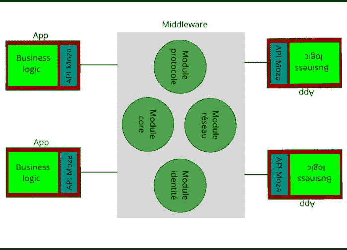

# 推出你自己的妈妈或我是如何做到的-概述

> 原文：<https://dev.to/cppchedy/rolling-out-your-own-mom-or-how-i-did-it-overview-20c9>

# 简介

这篇文章旨在给读者一个整个系统的概述。具体来说，我们展示了全球架构、其构建模块(如消息传递模型)、我们将开发的模块以及我们将使用的工具/框架。

# 系统架构

我们的系统主要由两部分组成:客户端和“服务器”(或实际的中间件)，如下图所示:

企业应用程序使用客户端与中间件进行通信。通信是使用 Moza 协议完成的，这是项目的一部分。我的意思是，我们将为我们的特定用途设计这个协议。稍后将详细介绍。

# 中间件

中间件是系统的核心组件。它的主要作用是将接收到的消息发送到合适的目的地。然而，交付过程并不是唯一的:例如，消息的生产者可能希望将它发送给许多消费者，或者它可能希望将它交付给特定的消费者，甚至它可能只关心将消息交付给某人，而不管是谁。上述场景带来了指定消息分发策略的问题:通过什么方式用户将表达他们的意图并选择他们想要的设置？

## 消息传递模式

这个问题是通过设计一个一致的消息传递模型来解决的，该模型可以捕获消息传递过程中涉及的许多方面。更准确地说，使用模型的元素，我们可以与中间件进行通信，就像我们将要在需要集成的不同应用程序之间安排/组织消息交换一样。

正如我们所看到的，消息传递模型在我们的系统中扮演着重要的角色。中间件需要知道用户为消息循环设计的拓扑，以便完成它的工作。所以事先，用户必须*根据他的问题配置*服务器的实例。第三部分更详细地谈到了这一点。

## Moza 协议

无论是发送消息还是配置中间件，我们都需要一种方法来通知被寻址的系统。对于这个项目，我决定专门为这些任务(配置和消息传递)设计一个协议。它规定了此过程中涉及的格式、通信规则和 PDU。我们将在本系列的第四部分深入研究 Moza。

## 模块

在分析阶段，我确定了 4 个模块:

*   网络模块:顾名思义，负责网络通信。我们将为此使用一个框架，而不是实现我们自己的解决方案。

*   身份模块:它管理在代码库的所有部分中使用的身份概念。

*   核心模块:这是我们的消息传递模型所在的地方。这对妈妈来说很重要。

*   Moza 模块:这里我们实现了我们的协议。

每个模块都将在下一篇文章中介绍。

## 框架，库&工具

中间件是用 C++17 实现的。至于编译器，我用的是 gcc 8.1。除此之外，我还使用 CMake 和 [conan](https://conan.io/) 进行包管理。

依赖 Seastar 的网络部分对我来说是一个巨大的推动:我学到了一些新概念，发现了一个优雅的代码库。这是从教育的角度。另一个要点是使用这项技术获得的性能。话虽如此，我还是不能充分利用它，尽管我已经有了自己的想法。我快没时间了，所以我更喜欢保持简单，并在完成年终项目后改进。在本系列的下一篇文章中，我将对这个框架进行适当的介绍。

# 客户端

当我开始从事这个项目时，我以为我将为客户实现协议，并分发库。然而，由于时间限制，我退回到可以配置中间件并可以模拟消费者和生产者的 CLI。也许将来我会实现库并记录这个过程，但是现在我们已经有了:用 nodejs 实现的 CLI。

# 下一部分

在下一部分中，我们将开始设置项目并开始具体的工作。