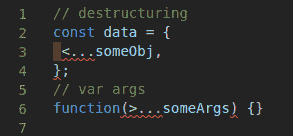

# 本周的 JavaScript:与 Ryland Goldstein 的对话

> 原文：<https://dev.to/deleteman123/javascript-of-the-week-a-conversation-with-ryland-goldstein-4eln>

大家好，欢迎来到我称之为“本周 JavaScript”的新一期。在这篇文章中，我想介绍一个来自我们亲爱的 Node.js + JavaScript 社区的人，向他们提出一些有趣的问题，并为新来者提供一些建议。

希望展示这些有巨大影响力的人开始就像其他人一样，如果他们成功了，你也可以！

本周我们请到了来自 [ShiftJS](https://shiftjs.com/) 的产品经理 Ryland Goldstein(在 Twitter 上也称为 [@taillogs](https://dev.to/taillogs) )。

我们来看看他说了些什么，好吗？

## 1。告诉我一些关于你自己的情况(爱好、教育等)

我是一名 24 岁的产品经理，在我帮助创立的初创公司 ShiftJS 工作。我就读于华盛顿大学，直到我的研究教授说服我加入他的尖端人工智能创业公司。

在我 8 年的编程生涯中，开发游戏引擎占据了我大部分的时间。我喜欢建造东西，而建造一个游戏引擎只是建造一个永远不会完整的东西的一个练习。

## 2。你几岁开始编程的？那是什么语言？

我当时~16，是 x86 汇编。这一切都是因为我想在魔兽世界里作弊。当时(可能还是 idk)，进入 WoW 秘籍的途径是通过内存编辑和逆向工程反汇编指令。我很快意识到我真的喜欢那种类型的工作，所以没过多久(1-2 个月)我就开始学习 C 和 Java。

## 3。你从事 JavaScript 工作多久了？

两年多一点。

## 4。是什么让你开始的？

当我们开始 ShiftJS(当时是 Binaris)的时候，我和联合创始人都不知道任何 JavaScript、NodeJS 或任何关于云的东西。这显然是我们需要知道的技能，所以我们都花了一个月左右的时间变得非常舒服。我是我们用 NodeJS/Typescript 编写的大规模扩展计算引擎的首席架构师，所以我现在认为自己是一名资深的 JS/cloud 开发人员。

## 5。如果可以重新定义语言，你会改变什么？

我有两样东西。一个是让我很恼火的事情，但我认为没那么严重。

我不同意使用椭圆符号的选择...用于签名中的对象析构和变量参数。

我只是认为相同的操作符被用于本质上相反的目的，DX 可以改进。也许…

我的不是很好，但是现在的标准也不是。我的重大改变将围绕着类型系统，尤其是语言处理数字的方式。用 JavaScript 做数字工作比用其他语言要困难得多。

## 6。你认为 JavaScript 最好的特性是什么？

事实上，我有几个

*   模板字符串
*   箭头功能
*   部分应用程序(使用 TypeScript 更好)

## 7。你会给刚开始学 JS/Node 的人什么建议？

基本上有两个基本概念是大多数 JS 开发人员避免学习的。如果你真的花时间去学习它们，90%你认为与 JavaScript/NodeJS 有关的问题都会消失。

*   事件循环、回调和承诺(包括异步、并行和并发之间的差异)
*   原型遗传模型

我的另一个建议是，如果你刚刚进入 JS 世界，感到不知所措并不奇怪。信息太多了，而且总是在变化。提高效率的唯一方法是有选择地过滤掉一些噪音。

## 8。你有什么特别想推荐的学习资源吗？

我最近写了一个非常受欢迎的帖子[https://dev . to/taillogs/the-best-book-to-read-as-a-developer-1h4m](https://dev.to/taillogs/the-best-book-to-read-as-a-developer-1h4m)，所以这是我推荐的书。

我也真的真的很喜欢塔妮娅在 https://www.taniarascia.com 做的辅导/工作。这些评论只是和大多数人的作品处于不同的水平。

## 9。有没有你想推广的项目/网站/东西？

当然，我有一个爱好项目，与码头工人[https://github.com/rylandg/myos](https://github.com/rylandg/myos)共享终端环境。
我们正在构建一些东西，这些东西将真正改变 ShiftJS 的全栈开发环境，它是基于我的想法。这显然是一种很棒的感觉，我真的认为我们正在打造一款很棒的产品。我们在这里接受测试注册[https://shiftjs.com/](https://shiftjs.com/)

## 10。最喜欢的超级英雄？

我和我的朋友经常为此争吵。客观地说，超人是最好的超级英雄。他启用了所有作弊代码。就个人而言，我非常喜欢蜘蛛侠，我爸爸是他的超级粉丝，所以蜘蛛侠是我童年的重要组成部分。

* * *

那么，你觉得怎么样？

Ryland 正在为 Fullstack 开发人员做下一件最好的事情，同时通过 Dev.to 成为我们社区的主要贡献者。如果你还没有，请确保你在 Twitter 和 Dev.to 上关注他，以确保你与他保持同步。

如果你对他有任何问题或对他的回答有任何意见，请在下面留下你的评论！

下一次再见！