# 我们如何构建一个高度可扩展的分布式状态机

> 原文：<https://dev.to/berndruecker/how-we-built-a-highly-scalable-distributed-state-machine-10hd>

#### 向云原生工作流自动化问好—第 2 部分

[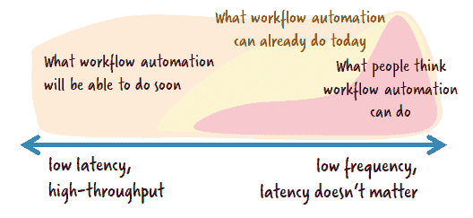](https://res.cloudinary.com/practicaldev/image/fetch/s--vNcNrCMp--/c_limit%2Cf_auto%2Cfl_progressive%2Cq_auto%2Cw_880/https://cdn-images-1.medium.com/max/528/1%2AZDy0wSgUZL3rIsAK_j-ZGQ.png)

在[zeebe . io——一个可水平扩展的分布式工作流引擎](https://blog.bernd-ruecker.com/zeebe-io-a-highly-scalable-distributed-workflow-engine-45788a90d549)中，我解释了 [Zebee](http://zeebe.io/) 是一个超级高性能、高度可扩展和弹性的云原生工作流引擎(是的——时髦的话检查！).我展示了这如何允许您在更多的用例中利用工作流自动化[，同样在低延迟、高吞吐量的场景中。我透露说，齐贝和阿帕奇·卡夫卡属于同一个阵营。我暗示了 Zeebe 的关键要素:一个真正的分布式系统，没有任何核心组件，根据顶级的分布式计算概念设计，符合](https://blog.bernd-ruecker.com/5-workflow-automation-use-cases-you-might-not-have-thought-of-9bdeb0e71996)[反应宣言](https://www.reactivemanifesto.org/)，应用高性能计算的技术。

在这篇文章中，我想更深入。我将回顾在 Zeebe 中使用的重要概念，并解释我们在途中做出的决定。这应该让你对我们如何进入云级工作流自动化的新时代有一个正确的想法，我的联合创始人[将这个新时代命名为“大工作流”](https://blog.camunda.com/post/2017/12/camunda-year-in-review/)。

但是我想先表扬一下 Zeebe 团队。伙计们——你们做了真正了不起的工作，将改变(工作流程自动化)世界！摇滚起来。

### 事件采购

Zeebe 的创意来自 [**事件采购**](https://martinfowler.com/eaaDev/EventSourcing.html) 。这意味着对工作流状态的所有更改都被捕获为*事件*，这些事件与*命令一起存储在事件日志中。*两者都被认为是日志中的*记录*。*快速提示*[*DDD*](https://en.wikipedia.org/wiki/Domain-driven_design)*爱好者:这些事件是 Zeebe 内部的，与工作流状态有关。如果你在你的领域内运行你自己的事件源系统，你通常为你的* [*领域事件*](https://martinfowler.com/eaaDev/DomainEvent.html) *运行你自己的事件存储。*

我[在这篇博文](https://blog.bernd-ruecker.com/zeebe-io-a-horizontally-scalable-distributed-workflow-engine-45788a90d549)的第 1 部分中将这与使用 RDMS 的传统工作流引擎架构进行了对比。

[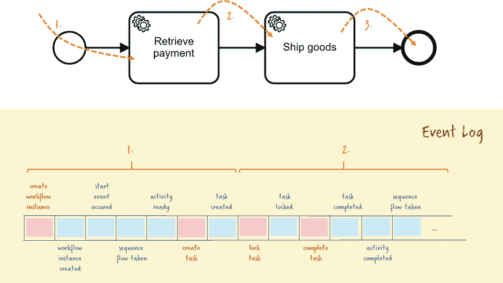](https://res.cloudinary.com/practicaldev/image/fetch/s--HgjX0Hjk--/c_limit%2Cf_auto%2Cfl_progressive%2Cq_auto%2Cw_880/https://cdn-images-1.medium.com/max/821/1%2AhUckhSMMQdw-vrIysoFJxw.png)

[事件是不可变的](https://vimeo.com/52831373)，因此该事件日志是**仅附加的**。没有什么东西一旦写出来就永远不会改变——就像会计日志一样。仅附加日志相对容易处理，因为:

*   因为没有更新，所以不能同时有多个冲突的更新。对状态的冲突更改总是被捕获为两个不可变的事件，这两个事件具有明确的顺序，因此事件源应用程序可以决定如何确定性地解决该冲突。相反的例子是 RDMS:如果多个节点并行更新相同的数据，更新会互相覆盖。必须认识到并避免这种情况。典型的策略是乐观或悲观锁定结合数据库的 ACID 保证。仅附加日志不需要这样做。
*   复制仅附加日志有一些已知的策略。
*   保存这些日志非常有效，因为您总是提前写日志。如果你按顺序写而不是随机写，你的硬盘性能会更好。

[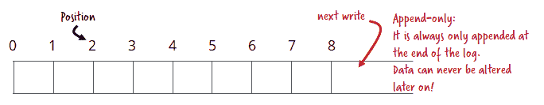](https://res.cloudinary.com/practicaldev/image/fetch/s--65RT1UjT--/c_limit%2Cf_auto%2Cfl_progressive%2Cq_auto%2Cw_880/https://cdn-images-1.medium.com/max/684/1%2AISoTuuY1qqmX4ch7sFEDcQ.png)

工作流的当前状态总是可以从这些事件中导出。这被称为**投影**。Zeebe 中的投影在内部保存为一个**快照**，利用 [RocksDB](https://rocksdb.org/) ，一个非常快速的键值存储。这也允许 Zeebe 通过密钥获取数据。一个纯日志甚至不允许像“给我 2 号工作流实例的当前状态”这样的简单查询。

[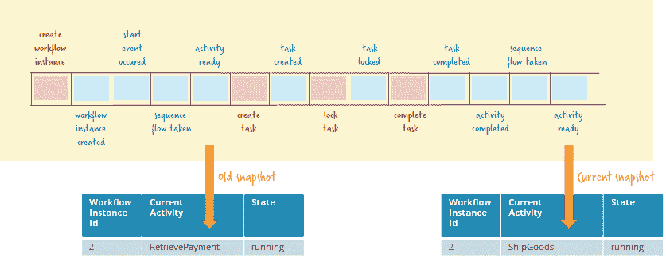](https://res.cloudinary.com/practicaldev/image/fetch/s--9bFU2CCz--/c_limit%2Cf_auto%2Cfl_progressive%2Cq_auto%2Cw_880/https://cdn-images-1.medium.com/max/837/1%2A4LCppmmxDYCaZDNruQUaHg.png)

#### 原木压实

随着日志随着时间的推移而增长，你不得不考虑从其中删除旧数据，这被称为 [**日志压缩**](https://dzone.com/articles/kafka-architecture-log-compaction) **。**在理想的情况下，我们可以，例如，删除所有结束的工作流实例的事件。不幸的是，这真的很难做到，因为来自单个工作流实例的事件可能分散在各处——特别是如果您记住工作流实例可能会运行几天甚至几个月。我们的实验清楚地表明，进行日志压缩不仅效率低下，而且产生的日志会变得非常零碎。

我们决定以不同的方式做事。一旦我们完全处理完一个事件并将其应用到快照，我们就会立即删除它。稍后我将回到“完全处理”。这使我们能够始终保持日志的整洁，而不会失去只附加日志和流处理的好处——正如一分钟内所描述的。

#### **储存**

Zeebe **将日志写入磁盘**，RocksDB 也将其状态刷新到磁盘。目前这是唯一支持的选项。我们经常讨论使存储逻辑可插拔—例如支持 Cassandra —但是到目前为止，我们只关注文件系统，它甚至可能是大多数用例的最佳选择，因为它是最快和最可靠的选择。

### 单一作家原则

当多个客户端同时访问一个工作流实例时，您需要某种冲突检测和解决方案。当您使用 RDMS 时，这通常是通过[乐观锁定](https://en.wikibooks.org/wiki/Java_Persistence/Locking#Optimistic_Locking)或一些数据库魔术来实现的。在 Zeebe 中，我们通过使用[单一作者原则](http://mechanical-sympathy.blogspot.co.uk/2011/09/single-writer-principle.html)来解决这个问题。正如[马丁·汤普森写的](https://github.com/real-logic/aeron/wiki/Design-Principles):

> 对可变状态的竞争访问需要互斥或有条件更新保护。这两种保护机制都会导致在应用竞争更新时形成队列。为了避免这种争用和相关的排队效应，所有状态都应该由单个写入器拥有，以便进行变异，从而遵循[单个写入器原则](http://mechanical-sympathy.blogspot.co.uk/2011/09/single-writer-principle.html)。

因此，不管我们机器上的线程数量如何，也不管 Zeebe 集群的整体大小如何，总会有**个线程**写入某个日志。这很好:顺序很清楚，不需要锁定，也不会发生死锁。您不必浪费时间管理争用，而是可以一直做真正的工作。

如果您想知道这是否意味着 Zeebe 只利用一个线程来处理工作流逻辑，那么到目前为止，您是对的！我稍后会谈到缩放齐伯。

#### 事件处理循环

为了更好地理解这个单线程正在做什么，让我们来看看如果一个客户端想要完成一个工作流中的任务会发生什么:

```
zeebe.newCompleteCommand(someTaskId).send() 
```

[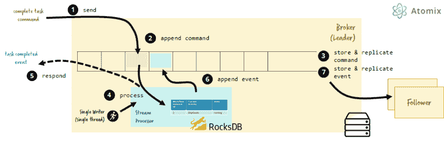](https://res.cloudinary.com/practicaldev/image/fetch/s--Ab3ceGFY--/c_limit%2Cf_auto%2Cfl_progressive%2Cq_auto%2Cw_880/https://cdn-images-1.medium.com/max/931/1%2AwW-UR3BIE4uGqknqxpVyrg.png)

1.  客户端向 Zeebe 发送命令，这是一个非阻塞调用，但是如果您愿意，您可以在 *Future* 之后收到响应。
2.  Zeebe 将该命令附加到其日志中。
3.  日志存储在磁盘上(并被复制——我稍后会处理这个问题)。
4.  Zeebe 检查一些不变量(“我现在真的可以处理这个命令吗？”)，改变快照并创建要写入日志的新事件。
5.  检查完不变量后，立即向客户端发送响应，即使新事件尚未写入日志。这是安全的，因为即使系统现在崩溃了，我们也可以重放命令并再次得到完全相同的结果。
6.  产生的事件会附加到事件日志中。
7.  日志存储在磁盘上并被复制。

如果您深入事务性思维，您可能会问一个问题:“不错，但是如果我们改变了 RocksDB 状态(步骤 4)并且在我们将事件写入日志(步骤 6 和 7)之前系统崩溃了怎么办？”很棒的问题！Zeebe 仅在处理完所有事件后才验证快照。在任何其他情况下，将使用较旧的快照，并重新处理事件。

### 流处理和出口商

我之前谈到了活动采购。其实有一个相关的概念很重要: [**流处理**](https://en.wikipedia.org/wiki/Stream_processing) 。由事件(确切地说是记录)组成的只附加日志是一个持续的事件流。Zeebe 内部是基于处理器的概念构建的，每个处理器都是一个单独的线程(如上所述)。最重要的处理器实际上实现了 BPMN 工作流引擎部分，因此它从语义上理解命令和事件，并知道下一步该做什么。它还负责拒绝无效命令。

[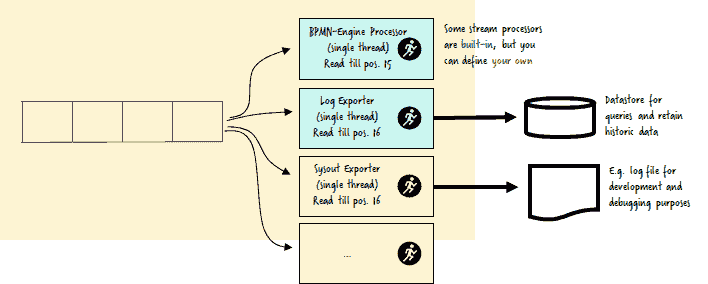](https://res.cloudinary.com/practicaldev/image/fetch/s--8bLQr_uP--/c_limit%2Cf_auto%2Cfl_progressive%2Cq_auto%2Cw_880/https://cdn-images-1.medium.com/max/708/1%2AasS6WoX1wLmQqDjJMyrcdw.png)

但是有更多的流处理器，最重要的是[出口器](https://docs.zeebe.io/basics/exporters.html)。这些导出器还处理流中的每个事件。一个[现成的导出器正在将所有数据写入 Elasticsearch，](https://github.com/zeebe-io/zeebe/tree/master/exporters/elasticsearch-exporter)在那里可以保留数据以备将来查询。例如，Zeebe 操作工具 [Operate](https://docs.zeebe.io/operate-user-guide/README.html) 利用这些数据来可视化正在运行的工作流实例、事件等的状态。

但是你也可以有其他的出口商。Zeebe 社区已经有了各种各样的出口商，例如，[阿帕奇卡夫卡](https://github.com/zeebe-io/zeebe-kafka-exporter)， [Hazelcast](https://github.com/zeebe-io/zeebe-hazelcast-exporter) 或[事件商店](https://github.com/jwulf/zeebe-eventstore-exporter)。

每个导出器都知道它将数据读取到了哪个日志位置。一旦所有流处理器成功处理了数据，就会删除数据，如上面的日志压缩中所述。这里的权衡是，你不能在以后添加一个新的流处理器，让它重放历史上的所有事件，就像你在 Apache Kafka 中所做的那样。

### 对等集群

为了提供容错和弹性，您运行多个 Zeebe 代理，这些代理形成一个对等集群。我们的设计不需要任何中央组件或协调器，因此不存在单点故障。

[](https://res.cloudinary.com/practicaldev/image/fetch/s--rTqDTYmR--/c_limit%2Cf_auto%2Cfl_progressive%2Cq_auto%2Cw_880/https://cdn-images-1.medium.com/max/422/1%2ATiKv6M45ZZX9PWvE7xmzlA.png)

要形成一个集群，您需要将至少一个其他代理配置为您的代理中的已知联系点。在代理启动期间，它与另一个代理对话并获取当前的集群拓扑。[八卦协议](https://en.wikipedia.org/wiki/Gossip_protocol)用于保持集群视图最新和同步。

### 复制使用 Raft 一致性算法

现在，事件日志必须复制到网络中的其他节点。Zeebe 使用分布式共识——更具体地说是 [Raft 共识算法](https://raft.github.io/)——在代理之间复制事件日志。使用 [Atomix](https://atomix.io/) 作为实现。网上有一个关于 Raft 共识算法的很棒的[视觉解释，所以我在这里就不赘述了。](http://thesecretlivesofdata.com/raft/)

<figure>[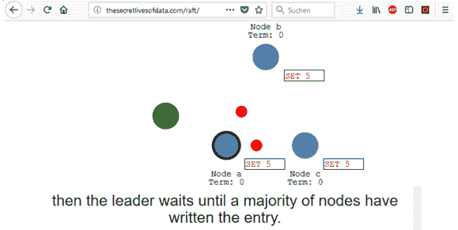](http://thesecretlivesofdata.com/raft/)

<figcaption></figcaption>

</figure>

基本思路是，有一个**单一的领导者**和**一组追随者**。当泽伯经纪人开始工作时，他们将选举一个领导者。随着集群的不断八卦，经纪人认识到如果一个领导者已经下台或断开，并试图选出一个新的领导者。

[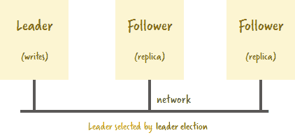](https://res.cloudinary.com/practicaldev/image/fetch/s--D0hVBX6L--/c_limit%2Cf_auto%2Cfl_progressive%2Cq_auto%2Cw_880/https://cdn-images-1.medium.com/max/422/1%2AQxkXQwLt0ad2kTsc5KilWw.png)

只有领导者被允许对数据进行写访问。领导者写的数据被复制给所有的追随者。只有在成功复制之后，事件(或命令)才会在 Zeebe 代理中处理。如果你熟悉[上限定理](https://en.wikipedia.org/wiki/CAP_theorem)，这意味着我们决定一致性而不是可用性，所以 **Zeebe 是一个 CP 系统。**(我向[马丁·克莱普曼](https://twitter.com/martinkl)道歉，他写了[请停止称数据库为 CP 或 AP，](https://martin.kleppmann.com/2015/05/11/please-stop-calling-databases-cp-or-ap.html)，但我认为这有助于理解 Zeebe 的架构)。

我们容忍网络分区，就像我们必须容忍每个分布式系统中的分区一样，你对此没有任何影响(见[http://blog . cloud era . com/blog/2010/04/cap-confusion-problems-with-partition-tolerance/](http://blog.cloudera.com/blog/2010/04/cap-confusion-problems-with-partition-tolerance/)和【https://aphyr.com/posts/293-jepsen-kafka】T2)。我们决定一致性而不是可用性，因为一致性是工作流自动化用例的承诺之一。

一个重要的配置选项是**复制组大小**。为了选举一个领导者，或者成功地复制数据，你需要一个所谓的**法定人数**，这意味着一定数量的其他 Raft 成员的确认。因为我们希望保证一致性，所以 Zeebe 要求法定人数≥(复制组大小/ 2) + 1。让我们举一个简单的例子:

*   齐伯节点:5
*   复制组大小:5
*   法定人数:3 人

[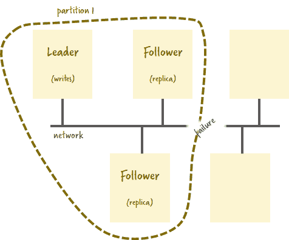](https://res.cloudinary.com/practicaldev/image/fetch/s--2zidX2XG--/c_limit%2Cf_auto%2Cfl_progressive%2Cq_auto%2Cw_880/https://cdn-images-1.medium.com/max/476/1%2Ax3lT8w4R0p2TN6JYnD9PnQ.png)

因此，如果有 **3 个节点**可达，我们仍然可以工作。在如上所述的分区的情况下，只有一个网段可以达到法定数量并继续工作，其他两个节点将不能做任何事情。因此，如果您是具有这两个节点的网段中的客户端，您将无法再工作，因此不保证可用性。一个 CP 系统。

这个**避免了**所谓的**裂脑现象**，因为你不能以两个网络段并行做冲突的工作而结束。一个[很好的深度讨论可以在论坛](https://forum.zeebe.io/t/split-brain-possibility/48)找到。

#### **复制**

当日志条目由领导者写入时，它们在被执行之前首先被复制到跟随者。

[](https://res.cloudinary.com/practicaldev/image/fetch/s--Ab3ceGFY--/c_limit%2Cf_auto%2Cfl_progressive%2Cq_auto%2Cw_880/https://cdn-images-1.medium.com/max/931/1%2AwW-UR3BIE4uGqknqxpVyrg.png)

这意味着处理的每个日志条目都保证被正确复制。并且复制保证提交的日志条目不会丢失。较大的复制组允许更高的容错能力，但会增加网络上的流量。由于向多个节点的复制是并行进行的，因此实际上可能不会对延迟产生太大影响。此外，代理本身不会被复制阻塞，因为这可以被有效地处理(正如我在下面讨论环形缓冲区时进一步描述的)。

复制也是在虚拟化和容器化环境中克服磁盘写入挑战的策略。因为在这些环境中，您无法控制数据何时真正以物理方式写入磁盘。即使你调用 *fsync* 并告诉你数据是安全的，它也可能不是。但是我们更喜欢将数据保存在几台服务器的内存中，而不是其中一台服务器的磁盘上。

虽然复制可能会增加 Zeebe 中命令处理的延迟，但它不会对吞吐量产生太大影响。Zeebe 中的流处理器不会因为等待追随者的回答而阻塞。因此，Zeebe 可以继续快速处理——但是等待他响应的客户可能需要再等一会儿。

### 网关

为了启动一个新的工作流实例或完成一项任务，您需要与 Zeebe 对话。最简单的方法是利用一个现成的语言客户端，例如在 [Java](https://docs.zeebe.io/java-client/README.html) 、 [NodeJs](https://creditsenseau.github.io/zeebe-client-node-js/) 、 [C#](https://github.com/zeebe-io/zeebe-client-csharp) 、 [Go](https://docs.zeebe.io/go-client/README.html) 、 [Rust](https://github.com/zeebe-io/zeebe-client-rust) 或 [Ruby](https://github.com/zeebe-io/zeebe-client-ruby) 中。多亏了 [gRPC](https://grpc.io/) ，几乎可以很容易地使用任何编程语言，正如[在这篇关于如何使用 Python](https://zeebe.io/blog/2018/11/grpc-generating-a-zeebe-python-client/) 的文章中所描述的。在这篇博文的第 1 部分中，我展示了不同语言的客户端代码示例。

[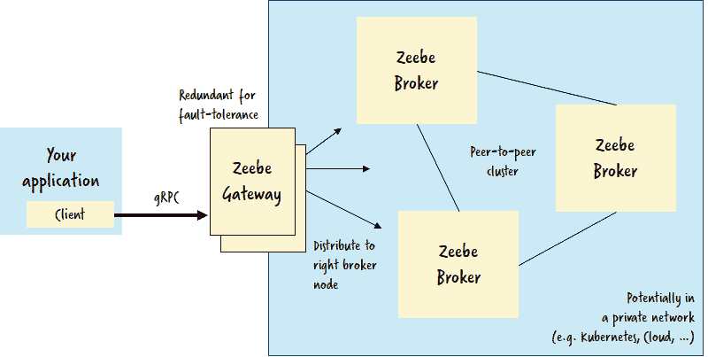](https://res.cloudinary.com/practicaldev/image/fetch/s--zT3gDqgu--/c_limit%2Cf_auto%2Cfl_progressive%2Cq_auto%2Cw_880/https://cdn-images-1.medium.com/max/800/1%2AY-sfHlwof7N_CGTPz2ZKrg.png)

客户端与 Zeebe 网关对话，该网关知道 Zeebe 代理集群拓扑结构，并将请求路由到该请求的正确领导者。这种设计使得在云中或者在 Kubernetes 中运行 Zeebe 变得非常容易，因为只需要从外部访问网关。

### **通过分区进行横向扩展**

到目前为止，我们讨论了让一个线程处理所有工作。如果你想利用多个线程，你必须创建**分区**。每个分区代表一个单独的物理仅附加日志。

[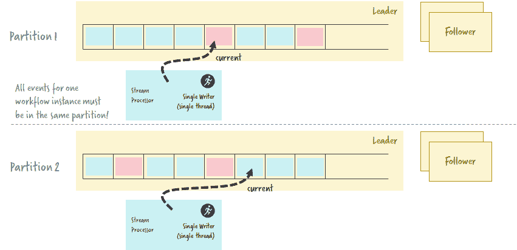](https://res.cloudinary.com/practicaldev/image/fetch/s--1AlATGtD--/c_limit%2Cf_auto%2Cfl_progressive%2Cq_auto%2Cw_880/https://cdn-images-1.medium.com/max/851/1%2AnOmrKz8fgHaGUkwmbxhsKA.png)

每个分区都有自己的单个写入器，这意味着您可以使用分区进行扩展。可以将分区分配给

*   单台机器上的不同线程，或者
*   不同的代理节点。

每个分区都有自己的筏组，因此每个分区都有自己的首领。如果运行 Zeebe 集群，一个节点可以是一个分区的领导者，也可以是其他分区的追随者。这可能是运行集群的一种非常有效的方式。

[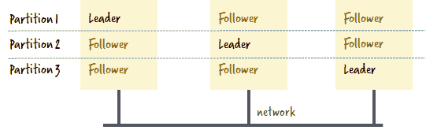](https://res.cloudinary.com/practicaldev/image/fetch/s--nN4xI8U1--/c_limit%2Cf_auto%2Cfl_progressive%2Cq_auto%2Cw_880/https://cdn-images-1.medium.com/max/541/1%2AXMGTYlDN7LLrJXEA2guaZw.png)

与一个工作流实例相关的所有事件必须进入同一个分区，否则我们将违反单个写入者原则，并且也不可能在本地重新创建代理节点中的当前状态。

一个挑战是如何决定哪个工作流实例去哪个分区。目前这是一个简单的循环机制。当您启动一个工作流实例时，网关会将其放入一个分区中。分区 id 甚至会获得工作流实例 id 的一部分，这使得系统的每个部分都很容易知道每个工作流实例所在的分区。

[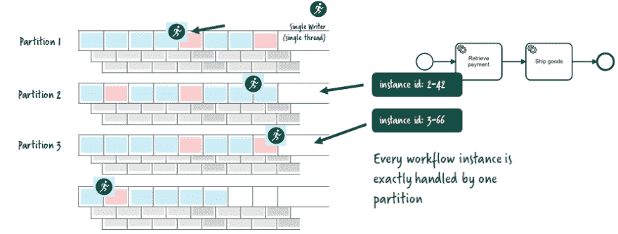](https://res.cloudinary.com/practicaldev/image/fetch/s--YiVUqfoX--/c_limit%2Cf_auto%2Cfl_progressive%2Cq_auto%2Cw_880/https://cdn-images-1.medium.com/max/894/1%2AmzNCWpQ7LDuvubwxi2b7Sw.png)

一个有趣的用例是**消息关联**。[一个工作流实例可能会等待消息(或事件)到达](https://docs.zeebe.io/bpmn-workflows/message-events.html)。通常，该消息不知道工作流实例 id，但与其他信息相关，比如订单 id。因此，Zeebe 需要找出是否有任何工作流实例正在等待具有该 order-id 的消息。如何高效地横向扩展呢？

[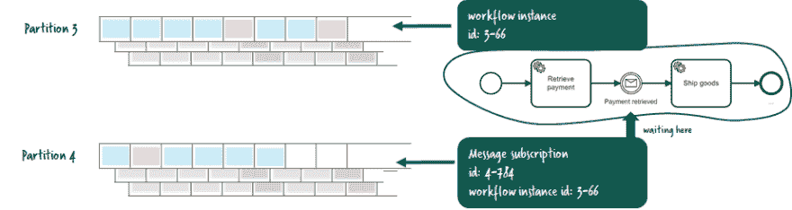](https://res.cloudinary.com/practicaldev/image/fetch/s--a_QnCSHk--/c_limit%2Cf_auto%2Cfl_progressive%2Cq_auto%2Cw_880/https://cdn-images-1.medium.com/max/921/1%2ACaNmes4xooO7S4rHseokNg.png)

Zeebe 只是创建一个消息订阅，它位于一个分区上，这个分区可能不同于工作流实例的分区。该分区由相关标识符上的哈希函数确定，因此可以很容易地被传递消息的客户端或者到达需要等待该消息的点的工作流实例找到。这甚至与发生的顺序无关(见[消息缓冲](https://docs.zeebe.io/reference/message-correlation.html#message-buffering))，因为由于是单个写入者，所以不会有冲突。消息订阅总是链接回等待的工作流实例—可能位于另一个分区上。

请注意，分区的数量在当前的 Zeebe 版本中是固定的。一旦您的代理集群投入生产，您就不能更改它。虽然这可能会在 Zeebe 的未来版本中有所改变，但从一开始就为您的用例规划合理的分区数量是非常重要的。有一个[生产指南](https://tinyurl.com/zeebe-prg)帮助你做核心决定。

#### 多数据中心复制

用户经常要求**多数据中心**复制。目前还没有特别的支持。从技术上讲，Zeebe 集群可以跨越多个数据中心，但是您必须为增加的延迟做好准备。如果您将群集设置为只有来自两个数据中心的节点才能到达仲裁，那么即使发生大灾难，您也能幸免于难，代价是延迟。

### 为什么不撬动卡夫卡或者动物园管理员？

很多人会问，为什么我们自己编写以上所有内容，而不简单地利用 Apache Zookeeper 这样的集群管理器，甚至是成熟的 Apache Kafka。做出这一决定的主要原因如下:

*   易用性和**易于上手**。我们希望**避免第三方依赖**，在使用 Zeebe 之前需要安装和运行第三方依赖。而阿帕奇动物园管理员或者阿帕奇卡夫卡都不好操作。我们努力获得非常简单的入门体验(运行 docker 映像或解压缩发行版并运行一个脚本)，即使我们确实设想复杂的 Zeebe 部署处理非常高的负载。
*   **效率**。将集群管理放在核心代理中允许我们针对具体的用例进行优化，这就是工作流自动化。如果围绕现有的通用集群管理器构建，一些特性会更难实现。
*   **支持和控制**。在我们作为开源厂商的长期经验中，我们了解到在这个核心层支持第三方依赖是非常困难的。当然，我们可以开始雇佣核心的 Zookeeper 贡献者，但这仍然很难，因为有多方参与，所以这些项目的方向不在我们的控制之下。有了 Zeebe，我们投资控制整个堆栈，让我们全速向我们预想的方向前进。

在 Zeebe 主页上还有一个关于这个的常见问题。

### 为性能而设计

除了可伸缩性之外，Zeebe 还从头开始为单个节点的高性能而构建。

例如，我们总是努力减少垃圾。Zeebe 是用 Java 写的。Java 有所谓的[垃圾收集](https://en.wikipedia.org/wiki/Garbage_collection_(computer_science))，不能关闭。垃圾收集器定期启动并检查可以从内存中移除的对象。在垃圾收集期间，您的系统会暂停—持续时间取决于检查或删除的对象数量。这种暂停会显著增加处理延迟，尤其是当您每秒处理数百万封邮件时。所以 Zeebe 在某种程度上被编程为**减少垃圾**。

另一个策略是使用 [**环形缓冲区**](https://en.wikipedia.org/wiki/Circular_buffer) ，并尽可能利用**批处理**语句。这也允许您使用多线程，而不违反上述的单个编写器原则。因此，每当您向 Zeebe 发送一个事件时，接收者都会将数据添加到一个缓冲区中。从那里，另一个线程将实际接管和处理数据。另一个缓冲区用于需要写入磁盘的字节。

这种方法支持批量操作。Zeebe 可以一口气把一堆事件写到磁盘上；或者在一次网络往返中向关注者发送几个事件。

使用**二进制协议**如 [gRPC](https://grpc.io/) 到客户端和内部的简单二进制协议，远程通信可以非常有效地完成。

### 出发！

如果您愿意，可以随意钻研代码！

[海洋 io/海洋](https://github.com/zeebe-io/zeebe)

当然，你不需要理解代码来[开始](https://docs.zeebe.io/introduction/quickstart.html)并使用 Zeebe 作为你自己的用例！

### 总结

Zeebe 是一种全新的工作流/编排引擎，用于云原生和云规模的应用程序。Zeebe 与所有其他编排/工作流引擎的区别在于它的性能，以及它被设计为一个真正可扩展和有弹性的系统，没有任何中央组件，也不需要数据库。

Zeebe 没有遵循事务性工作流引擎的传统思想，在事务性工作流引擎中，状态存储在共享数据库中，并在从工作流中的一个步骤移动到下一个步骤时进行更新。相反，Zeebe 是一个基于复制的、只附加日志的事件源系统。所以 Zeebe 和阿帕奇卡夫卡这样的系统有很多共同点。Zeebe 客户端可以发布/订阅以执行工作，因此是完全反应式的。

与市场上的其他微服务编排引擎不同，Zeebe 非常关注可视化工作流，因为我们相信可视化工作流是在[设计时、运行时和运营期间](https://blog.bernd-ruecker.com/bizdevops-the-true-value-proposition-of-workflow-engines-f342509ba8bb)提供异步交互可见性的关键。

通过这篇文章，我希望给你一个关于 Zeebe 的很好的介绍，不仅仅是从用户的角度，而且是对相关概念的更深入的探究。我希望你和我一样喜欢。

Bernd Ruecker 是 [Camunda](http://camunda.com/) 的联合创始人兼首席技术专家。我对开发人员友好的工作流自动化技术充满热情。*跟我上* [*推特*](http://twitter.com/berndruecker/) *。*一如既往，我喜欢收到您的反馈。下面评论或者[发邮件给我](http://bernd.ruecker@camunda.com)。

* * *