# 可变字体与静态字体&跨浏览器兼容性

> 原文：<https://dev.to/lambdatest/variable-fonts-vs-static-fonts-cross-browser-compatibility-3gop>

现代网页设计的关键基石之一是字体设计。对于那些意识到字体设计在网络体验中的重要性的人来说，不需要任何解释。对于那些不知道的人，没有任何解释就足够了。虽然网络正在进入一个新的、令人兴奋的和未知的领域，但自远古以来，网络字体一直保持静态和停滞不前。随着“可变字体”的出现，这一切都改变了，它彻底改变了我们看待网络字体并与之互动的方式。可变字体释放了一个全新的世界的创造性的可能性，以及提高网站的可读性，可访问性，性能，灵活性和响应性。开发人员不再需要依赖受固定设计限制约束的标准静态字体，而是采用可变字体来解锁数千种排版变化以及字体动画，并创建独特的自定义字体样式。

可变字体是“OpenType”规范的一部分，最初是由苹果、微软、Adobe 和谷歌这四大巨头联合开发的。可变字体背后的关键概念是，通过仅依赖单一字体文件，利用特定字样的无限字体样式变化。这允许开发者通过基于设备视口、设备类型、设备方向、鼠标事件等来修改或动画化字样，从而充分利用 RWD(响应式网页设计)的潜力。相反，标准静态字体要求每种字体都有单独的字体文件，这导致了糟糕的网站性能。

在本文中，我们将探讨什么是可变字体，它们相对于静态字体的优势，如何在您的网页中使用它们，以及如何利用 Lambdatest 跨浏览器兼容性云工具的强大功能，为不受支持的浏览器添加必要的静态字体回退。

## 传统静态字体的问题

在深入研究可变字体之前，这里有一小段摘录，探讨了使用传统静态字体时会遇到的限制和问题。比方说，在你的下一个网络项目中，你需要选择两种静态字体——“T0”,“Roboto”,“T1”用于标题，而“T2”,“Open sans”,“T3”用于段落文本。您实际上是在选择一个“字体系列”。反过来，字体系列由各种“字体样式”组成——基于不同字体粗细和斜体的变体。

在我们的示例中，假设您需要以下字体样式变化——

*   灯 300 '
*   普通 400 英尺
*   半粗体 600 '
*   '粗体 700 '
*   常规 400 斜体'

你需要为每种字体下载单独的文件(或使用谷歌字体嵌入链接)，包括“机器人”和“开放的 Sans”。正如你在下面的图片中看到的，Google fonts 将显示一个警告提示，表明对于我们的测试用例需求来说加载时间不足。这反过来会对你的网站性能产生不利影响。随着我们不断添加不同的字体样式，加载时间指示器将不断从快下降到中再到慢。较慢的加载时间表明在 Google SERPs(搜索引擎结果页面)上排名较低。想知道为什么吗？在我们的博客中，我们已经详细解释了测试手机网站的重要性。

虽然**【Roboto Medium】**和**【Roboto Bold】**非常相似，属于同一个字体家族，但是每一个都有自己独立的字体文件。

[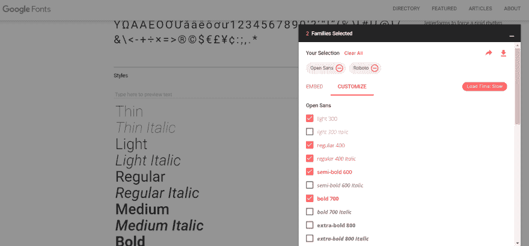](https://res.cloudinary.com/practicaldev/image/fetch/s--S9tttcjo--/c_limit%2Cf_auto%2Cfl_progressive%2Cq_auto%2Cw_880/https://www.lambdatest.com/blog/wp-content/uploads/2019/06/image2.png)

*谷歌字体——选择“Roboto”和“Open sans”字体样式*

根据我们的“Roboto”和“Open Sans”示例，您最终将需要 22 个文件，总大小约为 3mb！这些字体文件由您网站上的每个访问者的浏览器下载，以准确地显示具有预期字体的文本。这导致网站加载时间激增，并会给任何访问者带来令人沮丧的用户体验，尤其是在移动连接速度较慢的情况下。

[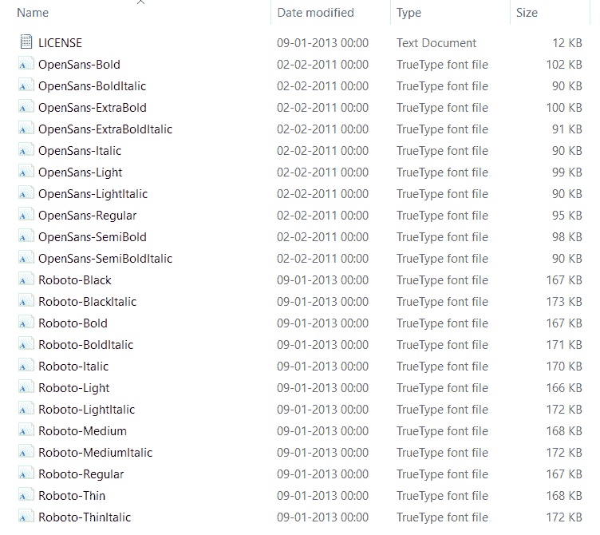](https://res.cloudinary.com/practicaldev/image/fetch/s--99QN_Kq9--/c_limit%2Cf_auto%2Cfl_progressive%2Cq_auto%2Cw_880/https://www.lambdatest.com/blog/wp-content/uploads/2019/06/image1.png)

*静态字体文件——“roboto”和“open sans”*

CSS 样式表、JavaScript 文件、插件、图像、视频、分析跟踪器和其他依赖因素都会影响网站的大小，而网站的大小与加载速度成正比。网站的加载速度可以说是 SEO(搜索引擎优化)和用户体验的最大性能因素。因此，开发人员在寻求优化他们的网站时达成妥协，让视觉外观受到影响，以获得更好的性能，并且通常将自己限制在几个字体和不超过 3-4 种字体，因为每个额外的字体文件都是页面性能的负担。

传统的静态字体没有任何灵活性，并且受限于有限数量的固定字体样式，如**、**、**、【常规】、**、【常规-斜体】、**、【半粗体】、**、**、【粗体】、**、**、【超粗体】、**。例如，与“Roboto”的 12 种风格相比，“open sans”字体系列只有 10 种风格。有些字体系列，如“龙虾”和“Abril Fatface”，只有一种字体样式可用。这就是可变字体拯救你的地方，为开发人员打开了从一个文件中使用潜在的数千种字体样式变化而不牺牲性能的可能性。****

## 什么是可变字体？

可变字体由单个字体文件中的整个字样或通常称为**字体系列**组成，而不是为每种字体样式变化都有单独的字体文件。借助 CSS **@font-face** 和样式规则，可以创建数千种不同的字体粗细、宽度和样式排列。此外，与静态字体不同，可变字体支持 CSS 过渡和动画属性，有助于在各种字体样式之间实现平滑流畅的动画转换。可变字体还提供了创建自定义字体样式的能力。这对于创建独特的品牌和标志设计非常有用，可以让你的设计与众不同。你知道导致你网站失败的[17 大 UI 设计错误](https://www.lambdatest.com/blog/top-17-ui-design-mistakes-that-leads-to-failure-of-your-website/?utm_source=dev&utm_medium=Blog&utm_campaign=Nikhil-18072019&utm_term=Nikhil)吗？

[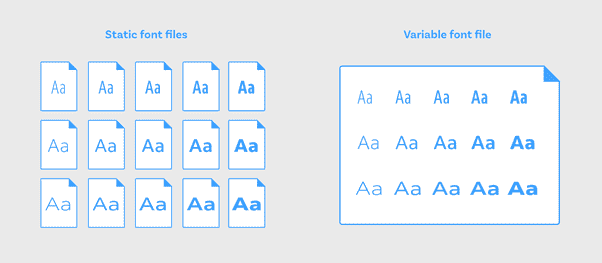](https://res.cloudinary.com/practicaldev/image/fetch/s--cePsAbFs--/c_limit%2Cf_auto%2Cfl_progressive%2Cq_auto%2Cw_880/https://www.lambdatest.com/blog/wp-content/uploads/2019/06/pasted-image-0.png)

你必须注意到，虽然可变字体文件的大小比传统的静态字体文件稍大，但总的来说，可变字体提供了更好的效率。考虑到平均而言，每个字体系列至少需要 4 到 5 种字体样式变化，单个可变字体文件的大小远远小于 4-5 个静态字体文件的组合大小。

就可变字体的历史而言，以及它是如何出现的，该功能是 2016-17 年由设计和网络领域最大的巨头之一微软、苹果谷歌和 Adobe 合作发布的“OpenType”字体格式 1.8 版规范的一部分。OpenType 格式是 TrueType 格式的扩展，因此有**"。otf"** 或**"。ttf"** 分机。

## 可变字体是如何工作的？

可变字体背后的关键概念是**“变化轴”**的概念。这些轴控制字体样式的所有方面——字体字母有多粗或多浅，字母有多宽或多窄，或者字母是否倾斜。OpenType 字体规范定义了两种变化轴——

1.  **标准变化轴**
2.  **自定义轴的变化。**

### 标准轴的变化

OpenType specs 定义了 5 个变化的标准轴，每个轴由 4 个字符长的标签表示，标签由小写字母组成

*   **权重“wgth”轴:**控制可变字体的权重。该值可以在 1 到 999 之间变化。使用字体粗细 CSS 属性控制该值。
*   **宽度“wdth”轴:**控制可变字体的宽度。该值以%为单位，通常可以在 0%到 100%(或更高)之间变化。更高的值，例如 120%或 150%，将被调整为字体定义的最高允许值。使用**字体拉伸** CSS 属性来控制该值。
*   **倾斜“slnt”轴:**控制可变字体的倾斜。该值以度为单位，可以在-90 度到 90 度之间变化。默认设置为 20 度。该值由设置为倾斜的**字体样式** CSS 属性控制。
*   **斜体“ital”轴:**控制变量字体是否为斜体。使用设置为“斜体”或“无”的**字体样式** CSS 属性来控制该值。为了避免与 slnt 轴混淆，设置字体合成:none
*   **光学尺寸“opsz”轴:**控制可变字体的光学尺寸。使用设置为“自动”或“无”的**字体-光学-尺寸**属性 CSS 属性来控制该值。如果您希望根据整体字体大小增加或减少字母的整体笔画粗细，则可以使用光学大小。

除了使用字体粗细、字体样式、字体拉伸和字体光学大小属性来定义标准变化轴的值之外，我们稍后将讨论另一种方法。

### 自定义轴的变化

OpenType Spec 允许您定义任意多的自定义变化轴。要记住的一个关键区别是，与使用 4 个字符长的小写字母标签定义的标准变化轴不同，自定义变化轴是使用大写字母定义的。

例如，一个名为**‘Decovar’**的可变字体有一个自定义的变化轴

*   SKLA:内嵌骨架
*   BLDA:内嵌
*   TRMA:圆形
*   条纹

如上所述，有两种方法来定义变化轴的值，以实现可变字体

**1。使用与每个轴相关联的 CSS 属性-**字体粗细、字体拉伸、字体样式和字体光学大小属性。

```
heading {
  font-weight: 650;
  font-style: oblique 80deg;
  font-stretch: 75%;
  font-optical-sizing: auto;
} 
```

Enter fullscreen mode Exit fullscreen mode

**2。使用“font-variation-settings”属性**
定义用于实现可变字体的字体变化轴的第二种方法是使用一个新的属性，称为–**“Font-variation-settings”**，这是 W3C 最近作为 CSS 字体模块级别 4 的一部分引入的。新属性的语法是

**字体-变化-设置:**【wgth】<值>、【wdth】<值>、【ital】<值>、【slnt】<值>、【opsz】<值>、【PROP】<值>、……；

下面是一个例子——

```
.heading {
/*
  font-weight: 650;
  font-style: oblique 80deg;
  font-stretch: 65%;
  font-optical-sizing: auto;
*/
  font-variation-settings: "wght" 650, “slnt” 80, "wdth" 65, "opsz" 70;
} 
```

Enter fullscreen mode Exit fullscreen mode

**注意:**可使用两种方法定义标准/注册的变化轴，而自定义变化轴只能使用第二种方法设置。

两种方法的区别——

*   “字体-光学-大小”的值为“自动”或“无”。此属性只能用于关闭或打开光学大小调整。然而，如果你使用第二种方法——“字体-变化-设置”，你可以添加一个数值。例如–

```
 font-optical-sizing: auto;
font-variation-settings: "opsz" 70; 
```

Enter fullscreen mode Exit fullscreen mode

*   使用“字体-变化-设置”时，设置“字体-拉伸”值时不需要添加%符号。例如–

```
font-stretch: 65%;
font-variation-settings: "wdth" 65; 
```

Enter fullscreen mode Exit fullscreen mode

```
font-style: italic;
font-variation-settings: "ital" 1; 
```

Enter fullscreen mode Exit fullscreen mode

```
font-style: oblique 80deg;
font-variation-settings: "slnt" 80; 
```

Enter fullscreen mode Exit fullscreen mode

两种方法都会产生相同的输出。但是，按照 W3C 的建议，建议使用第一种方法——字体粗细、字体拉伸、字体样式和字体光学大小属性，而不是第二种方法——字体变化设置——来控制五个标准变化轴的值。这有助于浏览器理解和洞察所有字体变化的含义，并将其应用于其他格式。然而，如上所述，为了控制自定义轴的变化，字体变化设置属性是必要的。

## 支持可变字体的跨浏览器兼容性

[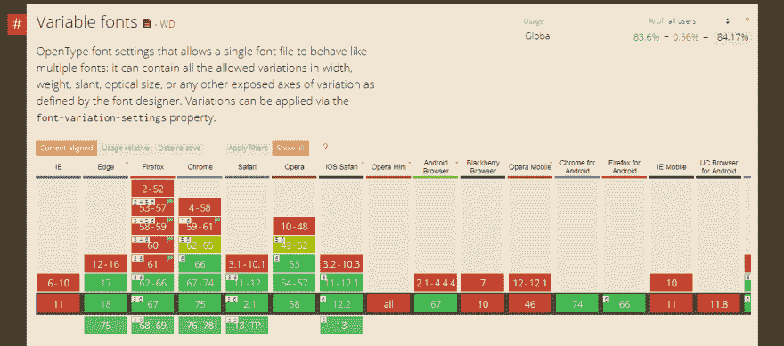](https://res.cloudinary.com/practicaldev/image/fetch/s--7tbEjgti--/c_limit%2Cf_auto%2Cfl_progressive%2Cq_auto%2Cw_880/https://www.lambdatest.com/blog/wp-content/uploads/2019/06/pasted-image-0-2.png)

*可变字体的跨浏览器兼容性表*

截至 2019 年 6 月，全球 84.17%的用户浏览器支持可变字体。所有主流浏览器的当前版本都提供了对这一特性的全面支持，唯一的例外是令人生畏的 Internet explorer，它因其糟糕的浏览器支持而臭名昭著。在桌面浏览器中-微软 edge 17+，谷歌 Chrome 66+，Firefox 62+，Safari 11+，Opera 53+，而在移动浏览器中 Chrome 74，Firefox 66，iOS Safari 11+和 Android 浏览器 67 提供对可变字体的支持。**没有聚合填充或其他修复来为可变字体提供跨浏览器兼容性。**如果你的网站访问者仍然在使用 **IE 或旧版本的浏览器**，那么可变字体可能不是你喜欢的。不过通过使用**@支持 CSS 特征查询**，可以为不支持的浏览器提供回退，保证一定程度的统一体验。

### LambdaTest 如何在跨浏览器测试中有所帮助？

LambdaTest 是一个基于云的[跨浏览器测试](https://www.lambdatest.com/?utm_source=dev&utm_medium=Blog&utm_campaign=Nikhil-18072019&utm_term=Nikhil)工具，提供 2000 多个浏览器&浏览器版本，帮助你确保你的网站在不同的桌面、&移动浏览器上运行良好。它为网络应用测试提供了众多服务，包括:

*   响应网站测试
*   跨不同浏览器的自动化批量屏幕截图测试
*   用于像素间比较的视觉回归测试
*   Selenium Grid 帮助您执行自动化的跨浏览器测试
*   使用运行在云上的虚拟机的实时交互式跨浏览器测试体验。这项服务在 LambdaTest 被称为“实时测试”。我将利用 LambdaTest 提供的这项服务与不同的浏览器进行实时交互，以验证不同字体的跨浏览器兼容性。

[](https://res.cloudinary.com/practicaldev/image/fetch/s--MsasFw8r--/c_limit%2Cf_auto%2Cfl_progressive%2Cq_auto%2Cw_880/https://www.lambdatest.com/blog/wp-content/uploads/2019/04/cta-img.png)

在云上执行跨浏览器测试

2000 多种浏览器和操作系统

[免费注册](https://accounts.lambdatest.com/register/?utm_source=dev&utm_medium=Blog&utm_campaign=Nikhil-18072019&utm_term=Nikhil)

话虽如此，让我们回到使用可变字体来制作动画。

## 使用 CSS @font-face 规则合并可变字体

要在样式表中包含可变字体，请使用 CSS @font-face 规则，该规则允许您在网页上加载任何自定义字体。您必须首先为字体定义一个名称，然后是源和字体格式，最后是每个变化轴的取值范围。例如:

```
@font-face {
  font-family: "amstelvar";
  src: url("/fonts/amstelvar.ttf") format("truetype-variations");
 /* Define value range for each variation axis */
  font-weight: 1 999;
  font-stretch: 0% 100%;
  font-optical-sizing: 0 100;
} 
```

Enter fullscreen mode Exit fullscreen mode

**注意，标准静态字体的格式为“truetype”或“woff”/“woff 2”**。为了区分静态字体和可变字体，将字体格式设置为**“truetype-variations”**或**“woff 2-variations”**，以向浏览器表明这是一种可变字体。大多数可变字体都有。ttf 格式。但是，建议使用。woff 或. woff2 格式，性能更好，尺寸更小。你可以使用流行的谷歌命令行工具[将你的字体转换成 woff2。](https://github.com/google/woff2)

下面是一个包含名为**“amstel var”**的可变字体的示例代码。您可以通过使用 axis CSS 属性或字体变化设置来更改“wgth”权重、“wdth”宽度和“opsz”光学尺寸轴的值。

```
@font-face {
   font-family: 'amstelvar';
   src: url('/Amstelvar-Roman-VF.ttf') format("truetype-variations");
   font-weight: 1 999;
   font-stretch: 0% 100%;
   font-optical-sizing: 0 100;
}
.heading-1 {
   font-size: 70px;
   font-family: 'amstelvar';
   /* Using CSS properties */
   font-weight: 850;
   font-stretch: 90%;
   font-optical-sizing: auto;
   /* Using font-variation-settings property */
   font-variation-settings: "wght"850, "wdth"90, "opsz"90;
}
.heading-2 {
   font-size: 50px;
   font-family: 'amstelvar';
   /* Using CSS properties */
   font-weight: 100;
   font-stretch: 20%;
   font-optical-sizing: auto;
   /* Using font-variation-settings property */
   font-variation-settings: "wght"100, "wdth"20, "opsz"30;
}
.heading-3 {
   font-size: 40px;
   font-family: 'amstelvar';
   /* Using CSS properties */
   font-weight: 500;
   font-stretch: 70%;
   font-optical-sizing: none;
   /* Using font-variation-settings property */
   font-variation-settings: "wght"500, "wdth"70, "opsz" 0;
} 
```

Enter fullscreen mode Exit fullscreen mode

[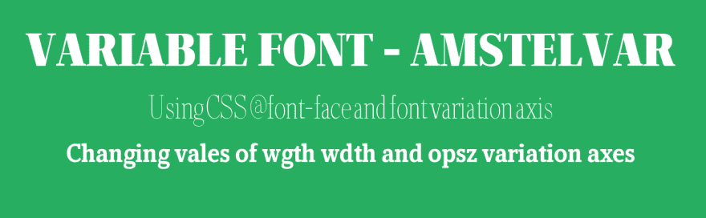](https://res.cloudinary.com/practicaldev/image/fetch/s--GReNxu3N--/c_limit%2Cf_auto%2Cfl_progressive%2Cq_auto%2Cw_880/https://www.lambdatest.com/blog/wp-content/uploads/2019/06/pasted-image-0-6.png)

阿姆斯特丹可变字体

## 制作可变字体动画

可变字体可用于创建创造性的字体动画。有两种方法可以完成这项任务

1.  **CSS 过渡属性**
2.  **CSS @keyframes 动画规则。**

如前所述，我将在下面使用 LambdaTest 演示这两种字体，这是一个跨浏览器测试云，用于显示不同浏览器上可变字体的动画。

### 使用 CSS 转场属性制作可变字体动画

CSS transition 属性可用于字体动画链接到鼠标单击或鼠标悬停等事件的情况。下面的代码片段是一个示例，展示了当鼠标光标悬停在可变字体“Amstelvar”上时，如何使用 CSS transition 属性将它制作成动画。当文本类“heading-3”悬停时，“wgth”重量轴值从 300 更改为 999，“wdth”宽度轴值从 40%更改为 70%，而“opsz”光学尺寸轴值从 0 更改为 70。

```
@font-face {
   font-family: 'amstelvar';
   src: url('/Amstelvar-Roman-VF.ttf') format("truetype-variations");
   font-weight: 1 999;
   font-stretch: 0% 100%;
   font-optical-sizing: 0 100;
}
.heading-1 {
   font-size: 70px;
   font-family: 'amstelvar';
   font-variation-settings: "wght"850, "wdth"90, "opsz"90;
}
.heading-2 {
   font-size: 50px;
   font-family: 'amstelvar';
   font-variation-settings: "wght"100, "wdth"20, "opsz"30;
}

.heading-3 {
   font-size: 40px;
   font-family: 'amstelvar';
   font-variation-settings: "wght"300, "wdth"40, "opsz"0;
   transition: font-variation-settings 2s ease;
}
.heading-3:hover{
   font-variation-settings: "wght"999, "wdth"70, "opsz"70;
} 
```

Enter fullscreen mode Exit fullscreen mode

现在，让我们进行跨浏览器测试，评估 Opera 和 IE 11 的渲染差异。请注意，桌面版本的 Opera 浏览器支持可变字体，但用于移动设备的 Opera mini 不支持可变字体。下面我用 LambdaTest 比较了桌面 Opera 和 IE11 的跨浏览器兼容性差异。

首先，我们来看看 Opera 桌面版本 61 Dev。

[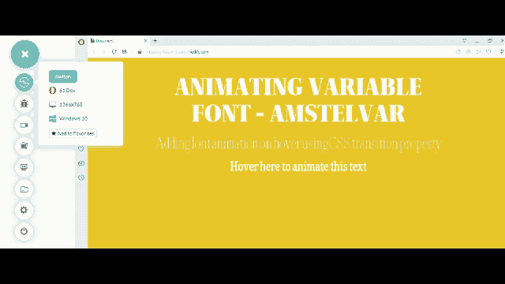](https://res.cloudinary.com/practicaldev/image/fetch/s--T4UnDBgf--/c_limit%2Cf_auto%2Cfl_progressive%2Cq_66%2Cw_880/https://www.lambdatest.com/blog/wp-content/uploads/2019/06/new-one.gif)_**Opera Desktop 61 Dev:**使用 CSS 转场属性的可变字体‘amstel var’的动画" _

现在，我们来看看 Internet Explorer 11。

[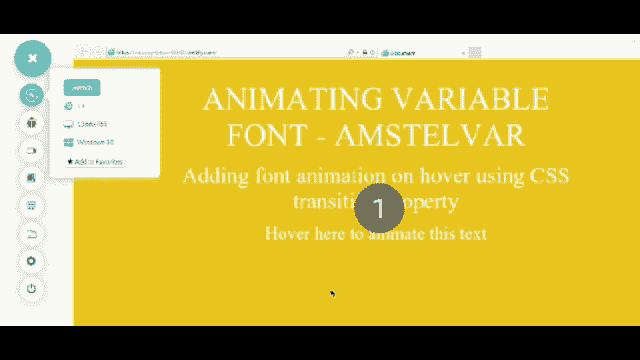](https://res.cloudinary.com/practicaldev/image/fetch/s--hw3LsneX--/c_limit%2Cf_auto%2Cfl_progressive%2Cq_66%2Cw_880/https://www.lambdatest.com/blog/wp-content/uploads/2019/06/My-Video2.gif)

_ **IE 11:** 使用 CSS 转换属性的可变字体“Amstelvar”的动画" u

在执行跨浏览器测试之后，我们确保了上面表示的 CanIUse 表在不同浏览器之间的可变字体实现方面是正确的。

### 使用 CSS @keyframes 规则制作可变字体动画

除了 CSS transition 属性之外，还有另一种使用@keyframes 动画规则来制作可变字体动画的方法。下面的代码片段是一个创建动画持续时间为 3s 的无限动画的示例，将“wdth”宽度轴值从 100 更改为 600。

```
@font-face {
   font-family: 'amstelvar';
   src: url('/Amstelvar-Roman-VF.ttf') format("truetype-variations");
   font-weight: 1 999;
   font-stretch: 0% 100%;
   font-optical-sizing: 0 100;
}
.heading {
   font-size: 40px;
   font-family: 'amstelvar';
   animation: myFont 3s ease infinite;
 }
@keyframes myFont{
   0%{
       font-variation-settings: "wght" 100;
   }
   100%{
       font-variation-settings: "wght" 500;
   }
} 
```

Enter fullscreen mode Exit fullscreen mode

是时候进行跨浏览器测试了，看看我们的代码在不同的浏览器上是如何工作的。在这个可变字体的例子中，我们将比较 IE 11 和 Safari，它们分别运行在 Windows 10 和 macOS Mojave 上。

首先，我们来看看 Safari 桌面 Mac mojave。

[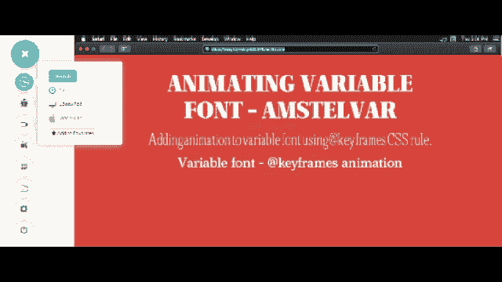 ](https://res.cloudinary.com/practicaldev/image/fetch/s--ZgYHX9Xy--/c_limit%2Cf_auto%2Cfl_progressive%2Cq_66%2Cw_880/https://www.lambdatest.com/blog/wp-content/uploads/2019/06/My-Video.gif) *动画可变字体‘amstel var’*

现在，我们来看看 Internet Explorer 11。

[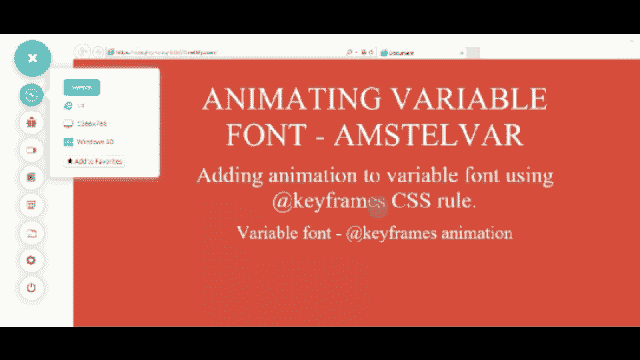](https://res.cloudinary.com/practicaldev/image/fetch/s--z_QpKqOd--/c_limit%2Cf_auto%2Cfl_progressive%2Cq_66%2Cw_880/https://www.lambdatest.com/blog/wp-content/uploads/2019/06/My-Video3.gif)

你可能不确定可变字体是否适合你的网站。然而，在对可变字体进行跨浏览器测试后，你可以肯定它们对使用 IE 11 或更低版本的网站访问者不起作用。

那么，如果字体变量对您不起作用，您能做些什么呢？如果你的网站上有相当数量的访问者是通过 Internet Explorer 访问的，你如何向他们展示设计良好的字体变化呢？别担心，我有一个解决办法给你。

## 对不支持的浏览器进行回退

在不受支持的传统浏览器(如 Internet Explorer)或移动浏览器(如 opera mini 和 UC browser)中为可变字体提供后备的最简单方法是在@font-face 规则中提供相同字体的两个文件版本。第一版本是具有“woff2-variations”或“truetype-variations”格式的可变字体文件，而第二版本是具有“woff”、“woff2”或“ttf”格式的传统静态字体文件。如果不提供静态字体格式，可变字体将不会在任何不支持的浏览器上呈现。

例如，最流行的可变字体之一“IBM Plex”既有可变字体格式，也有静态字体格式。如果您希望在不受支持的浏览器中为 IBMPlex 提供两种字体样式(字体粗细分别为 400 和 700)的回退，请添加以下代码–

```
@font-face {
   font-family: 'IBMPlex';
   src: url('IBMPlex-variable.woff2') format('woff2-variations'),
       url('IBMPlex-regular.woff2') format('woff2');
   font-weight: 400;
}

@font-face {
   font-family: 'IBMPlex';
   src: url('IBMPlex-variable.woff2') format('woff2-variations'),
       url('IBMPlex-regular.woff2') format('woff2');
   font-weight: 700;
} 
```

Enter fullscreen mode Exit fullscreen mode

支持可变字体功能的浏览器将下载“woff2-variations”/“truetype-variations”字体格式，而不支持此功能的浏览器将下载@font-face 规则中指定的“woff”、“woff 2”或“ttf”格式。

为了确保浏览器根据其功能支持下载正确的字体格式，请使用@supports CSS 功能查询，如下所示–

```
.heading {
   font-family: 'IBMPlex'sans-serif;
   font-weight: 700;
}

@supports (font-variation-settings: normal) {
   .heading {
       font-family: 'IBMPlex', sans-serif;
       font-variation-settings: "wght"850, "wdth"90, "opsz"90;
   }
} 
```

Enter fullscreen mode Exit fullscreen mode

这是另一个使用 Adobe 可变字体“Source Sans”的例子。我将再次使用 LambdaTest 跨浏览器兼容性测试工具，在 Chrome 等现代浏览器上使用可变字体查看我的网页，并在 Internet Explorer 11 等不支持的浏览器上测试备用静态字体。链接到-[SorceSans 变量](https://github.com/adobe-fonts/source-sans-pro/releases/tag/variable-fonts)和[sources sans Static](https://github.com/adobe-fonts/source-sans-pro/releases/tag/2.020R-ro%2F1.075R-it)。下载。两个版本的 ttf 格式。

```
@font-face {
   font-family: 'SourceSans';
   src: url('SourceSansVariable-Roman.ttf') format('truetype-variations'),
       url('SourceSansPro-Regular.ttf') format('truetype');
   font-weight: 400;
}

@font-face {
   font-family: 'SourceSans';
   src: url('SourceSansVariable-Roman.ttf') format('truetype-variations'),
       url('SourceSansPro-Bold.ttf') format('truetype');
   font-weight: 700;
}

.heading-1 {
   font-size: 70px;
   font-family: 'SourceSans';
   font-weight: 700; /* For IE */
}

.heading-2 {
   font-size: 50px;
   font-family: 'SourceSans';
   font-weight: 400; /* For IE */
}

.heading-3 {
   font-size: 40px;
   font-family: 'SourceSans';
   font-weight: 700; /* For IE */

}

/* For Modern Browsers */
@supports (font-variation-settings: normal) {
   .heading-1 {
       /* Using font-variation-settings property */
       font-variation-settings: "wght"850;
   }

   .heading-2 {
       /* Using font-variation-settings property */
       font-variation-settings: "wght"100;
   }

   .heading-3 {
       /* Using font-variation-settings property */
       font-variation-settings: "wght"500;
   }
} 
```

Enter fullscreen mode Exit fullscreen mode

让我们执行跨浏览器测试，并观察我们的回退是否如我们所想的那样工作。这次我将比较 Chrome 75 beta 和 IE 11 之间的跨浏览器兼容性差异。

哦，对了，我想我之前没有提到 LambdaTest 也为你提供处于测试&开发阶段的浏览器，所以你的网站随时准备着浏览器的更新。

首先，我们来看看 Chrome 桌面版 75 Beta。

[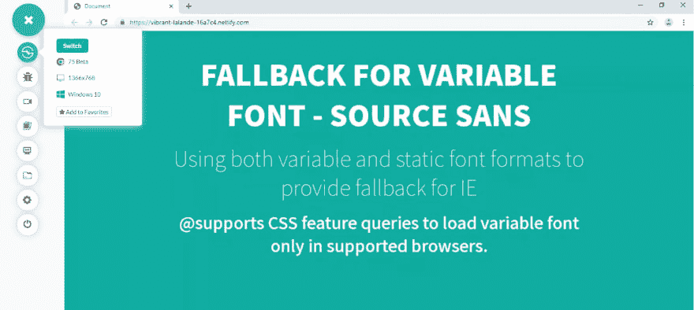](https://res.cloudinary.com/practicaldev/image/fetch/s--7WbvSzn9--/c_limit%2Cf_auto%2Cfl_progressive%2Cq_auto%2Cw_880/https://www.lambdatest.com/blog/wp-content/uploads/2019/06/pasted-image-0-4.png)

Chrome 支持源 Sans 可变字体，显示单个可变字体文件中的多个“wgth”权重轴值。

现在，我们来看看 Internet Explorer 11。

[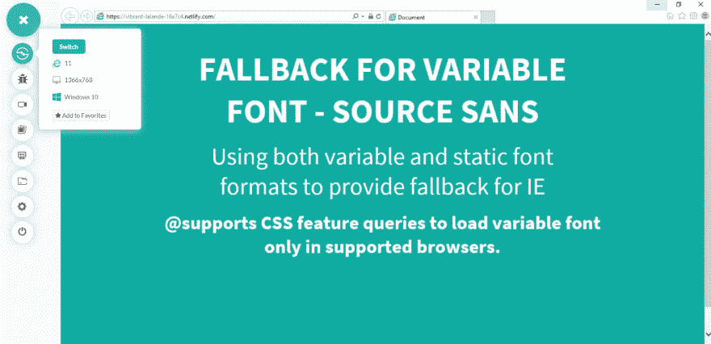](https://res.cloudinary.com/practicaldev/image/fetch/s--nFNRLG8m--/c_limit%2Cf_auto%2Cfl_progressive%2Cq_auto%2Cw_880/https://www.lambdatest.com/blog/wp-content/uploads/2019/06/pasted-image-0-17.png)

IE 中不支持源 Sans 可变字体。2 个静态字体文件–源 San“常规”和“粗体”作为后备加载。

如果你想了解更多关于使用@supports CSS 特征查询的特征检测，可以参考我之前的博客 [CSS 特征检测跨浏览器兼容性](https://www.lambdatest.com/blog/css-with-feature-detection-for-cross-browser-compatibility/?utm_source=dev&utm_medium=Blog&utm_campaign=Nikhil-18072019&utm_term=Nikhil)。

## 资源

我推荐两个非常棒的工具，在将可变字体融入项目之前，您可以在其中发现、使用和试验可变字体。

[轴轴](https://www.axis-praxis.org/specimens/%20__DEFAULT__)

[V 字型](https://v-fonts.com/)

虽然与传统的静态字体相比，目前可供您选择的可变字体并不多。但是这种选择与日俱增，而且很有可能在未来扩大。为了确保更好的性能和视觉美感，这是一个小小的折衷。

我们还使用了一个跨浏览器测试工具——LambdaTest 来测试我们在旧的传统浏览器中的网站，并检查您的 fallbacks 和 polyfills 是否正常工作。

[LambdaTest 受到全球 60，000 多家组织的信任，能够在云上进行大规模的跨浏览器测试。执行免费注册，并利用终身访问您的所有跨浏览器测试需求。](https://accounts.lambdatest.com/register?utm_source=dev&utm_medium=Blog&utm_campaign=Nikhil-18072019&utm_term=Nikhil)

## 你的网站或网络应用应该选择可变字体而不是静态字体吗？

许多开发人员可能不愿意尝试可变字体，因为他们认为可变字体缺乏通用的跨浏览器兼容性支持。然而，如上所述，这种看法相当具有欺骗性。除了 Internet Explorer 之外，包括 Microsoft Edge 在内的所有其他主流浏览器都完全支持该功能。可变字体为开发人员提供了一个充满令人兴奋的可能性的全新世界，是近年来 CSS 中最令人兴奋的新增内容之一。从一个文件中轻松自由地使用数千种不同的字体样式，以及为字体添加动画和变换的能力，再次将印刷术推向了 web 设计的前沿。以下是将改变你设计方式的 19 个移动网页排版技巧。最后但同样重要的是，关注[新出现的网页设计趋势](https://www.lambdatest.com/blog/top-19-trends-of-web-design-in-2019/?utm_source=dev&utm_medium=Blog&utm_campaign=Nikhil-18072019&utm_term=Nikhil)，因为可变字体继续在开发者社区中获得牵引力。干杯！

[](https://accounts.lambdatest.com/register/?utm_source=dev&utm_medium=Blog&utm_campaign=Nikhil-18072019&utm_term=Nikhil)