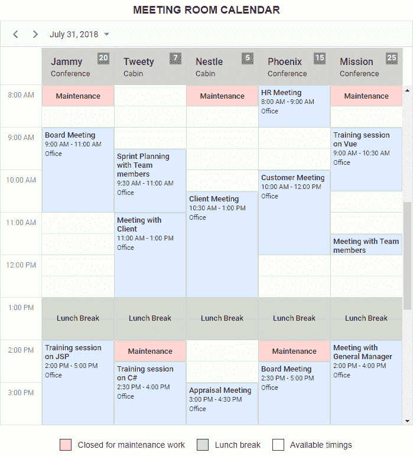
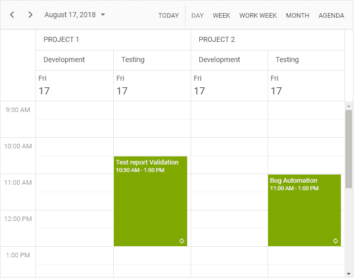
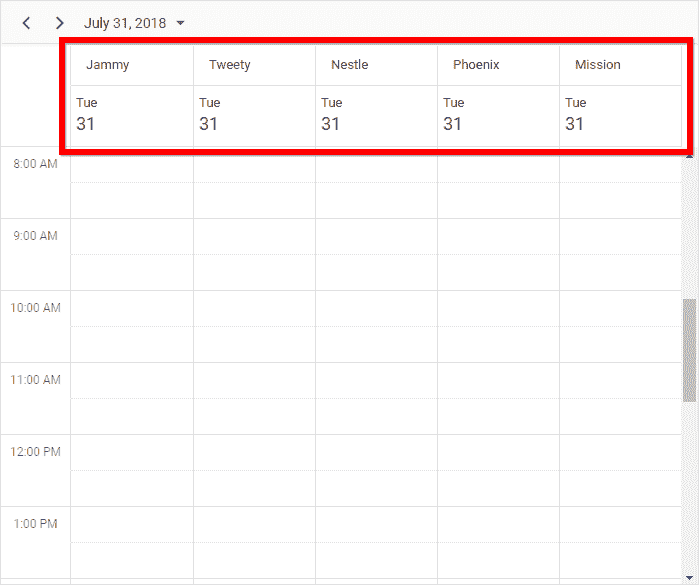
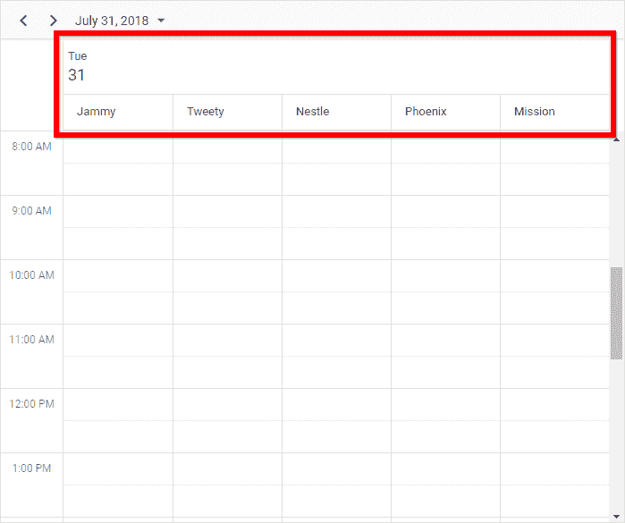
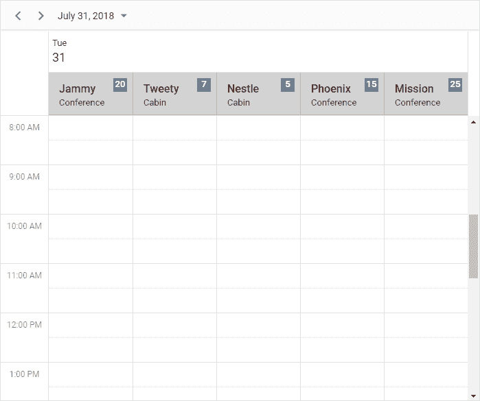

# 如何创建会议室日历

> 原文：<https://dev.to/syncfusion/how-to-create-a-meeting-room-calendar-4o02>

在当今的商业世界中，在办公室中拥有举行会议的空间起着重要的作用。除了拥有它之外，您还需要在团队之间有效地共享它，而不产生冲突，这可能有点挑战性。

为了支持不同团队之间无时间冲突地轻松预订房间，**会议室日历**允许您工作空间中的每个人查看房间的可用性，并在几秒钟内控制它们。让我们看看如何定制我们的 [JavaScript scheduler 组件](https://www.syncfusion.com/products/javascript/scheduler?devto)的外观和感觉来设计会议室日历。
[](https://res.cloudinary.com/practicaldev/image/fetch/s--ZgHWwfg5--/c_limit%2Cf_auto%2Cfl_progressive%2Cq_auto%2Cw_880/https://blog.syncfusion.com/wp-content/uploads/2018/08/image-606.png)

## 多种资源—概述

我之前的[博客](https://blog.syncfusion.com/post/designing-airfare-calendar-using-pure-javascript-scheduler2.aspx?devto)对 [JavaScript 调度器](https://www.syncfusion.com/products/javascript/scheduler?devto)及其在实时场景中的使用进行了基本概述，作为它的延续，我将在这里继续概述[多资源](https://ej2.syncfusion.com/documentation/schedule/resources/?devto)概念以及如何在设计会议室日历时利用这一特性。

特性名称本身描述了调度器为同一日历上的多个资源分配唯一的单独空间。资源名称在调度器的标题部分以分层结构分组，它们的等价工作空间部分分别显示在底部，以保存它们各自的约会。
[](https://res.cloudinary.com/practicaldev/image/fetch/s--87_pQW1r--/c_limit%2Cf_auto%2Cfl_progressive%2Cq_auto%2Cw_880/https://blog.syncfusion.com/wp-content/uploads/2018/08/image-607.png) 
多资源概念的重要选项有:

*   [按日期分组](https://ej2.syncfusion.com/demos/#/material/schedule/group-by-date.html)—给定的资源按每个日期分组。
*   [Group by child](https://ej2.syncfusion.com/demos/#/material/schedule/group-by-child.html)—所有子级资源都被分组到它们的父资源名称下。
*   [分组或链接事件](https://ej2.syncfusion.com/demos/#/material/schedule/group-editing.html)—单个约会由多个资源共享。
*   [每个资源的可定制工作日](https://ej2.syncfusion.com/demos/#/material/schedule/group-custom-work-days.html)—可以为每个资源分配不同的工作日。现在，让我们深入探讨一下如何设计会议室日历。

## 设计会议室日历

在设计我们的会议室日历时，我将只显示本例中的日视图。开始时，应该已经为预订会议室设置了一些限制，例如，如果房间已经预订，则不能预订，并且不能在不可访问的时间范围内预订，如午餐或维护工作期间。

此外，过去的会议事件将不可编辑。对于这个例子，我认为 2018 年 7 月 31 日是日程安排的当前日期，因此，试图在此日期之前预订房间是不可能的。这同样适用于编辑操作。

### 入门

由于我之前的[博客](https://blog.syncfusion.com/post/designing-airfare-calendar-using-pure-javascript-scheduler2.aspx)已经解释了如何开始使用 TypeScript 中的 scheduler 控件的详细步骤，我在这里将跳过这些基础知识。

首先，在 TypeScript 中借助 [QuickStart](https://github.com/syncfusion/ej2-quickstart) 项目创建一个新的基本 JS 2 应用程序，并进行必要的[配置](https://ej2.syncfusion.com/documentation/schedule/getting-started/)。

一旦配置工作完成，[在你的应用程序中添加](https://ej2.syncfusion.com/documentation/schedule/getting-started/#initialize-the-schedule)调度器控件，[只注入](https://ej2.syncfusion.com/documentation/schedule/module-injection/)日视图模块。

### 填充资源数据

让我们看看如何定制日程安排程序布局来显示会议室。在这里，会议室被定义为资源，每个房间都将在公共时间刻度上平行显示。

假设一个办公室有五个会议室，每个人都应该共享这些房间。一旦一个人预订了一个房间，他们就拥有了整个预订时间范围内的房间，没有其他人可以在该特定时间内预订同一房间。

首先，让我们假设资源数据保存公共房间信息，比如房间名称、房间 ID 和表示资源约会的特定颜色。除了默认资源字段，您还可以使用 **resources** 属性定义其他自定义资源字段，例如房间容量及其类型。

```
resources: [{
    field: 'RoomId', title: 'Select Room', name: 'Rooms', allowMultiple: true,
    dataSource: [
        { text: 'Jammy', id: 1, capacity: 20, type: 'Conference' },
        { text: 'Tweety', id: 2, capacity: 7, type: 'Cabin'},
        { text: 'Nestle', id: 3, capacity: 5, type: 'Cabin' },
        { text: 'Phoenix', id: 4, capacity: 15, type: 'Conference' },
        { text: 'Mission', id: 5, capacity: 25, type: 'Conference' }
    ],
    textField: 'text', idField: 'id'
}] 
```

我简单地定义了资源集合，并在调度器上直观地显示出来。现在，我们需要定义那些资源集合名称，以便将它们分组到 **group** 属性下。

```
group: {
    resources: ['Rooms']
} 
```

**注意:**在**组**属性下定义资源名称时，确保您使用的是分配给**资源**集合的**名称**字段的文本值。

### 定制资源布局

资源现在显示在 scheduler 布局上，是时候定制资源标题行和列的外观了。
[](https://res.cloudinary.com/practicaldev/image/fetch/s--fieNmx9W--/c_limit%2Cf_auto%2Cfl_progressive%2Cq_auto%2Cw_880/https://blog.syncfusion.com/wp-content/uploads/2018/08/image-608.png) 
由于我们仅在日视图中显示计划程序，因此没有必要重复上图所示的每个资源下的日期标题。显示一个普通的日期标题就足够了。为此，将 **byDate** 属性设置为 true。

```
group: {
    resources: ['Rooms'],
    byDate: true
} 
```

[](https://res.cloudinary.com/practicaldev/image/fetch/s--lK_b4DW6--/c_limit%2Cf_auto%2Cfl_progressive%2Cq_auto%2Cw_880/https://blog.syncfusion.com/wp-content/uploads/2018/08/image-609.png) 
同样，通过其 template 属性定制资源标题行，并使用 **resourceHeaderTemplate** 属性更改其外观，如下所示。
[](https://res.cloudinary.com/practicaldev/image/fetch/s--kbB1iK0s--/c_limit%2Cf_auto%2Cfl_progressive%2Cq_auto%2Cw_880/https://blog.syncfusion.com/wp-content/uploads/2018/08/image-610.png)T10】

```
<script id="resourceTemplate" type="text/x-template">
    <div class='template-wrap'>
        <div class="resource-details">
            <div class="room-name">${getRoomName(data)}</div>
            <div class="room-type">${getRoomType(data)}</div>
        </div>
        <div class="room-capacity">${getRoomCapacity(data)} Seats</div>
    </div> </script> 
```

```
let scheduleOptions: ScheduleModel = {
    width: '100%',
    height: '850px',
    currentView: "Day",
    selectedDate: new Date(2018, 6, 31),
    resourceHeaderTemplate: '#resourceTemplate',
    …
    … 
```

实现上述效果的 CSS 样式如下。此外，我将隐藏此处的日期标题行，因为我们为所有资源显示相同的日期，这在最常见的日期标题范围中已经可用。

```
<style>

    .e-schedule .e-vertical-view.e-by-date .e-date-header-wrap table tbody tr:nth-child(1) .e-header-cells,
    .e-schedule .e-vertical-view.e-by-date .e-left-indent-wrap table tbody tr:nth-child(1) .e-header-cells, 
    .e-schedule .e-schedule-toolbar .e-toolbar-items .e-toolbar-right .e-today {
        display: none;
    }    

    .e-schedule .e-vertical-view .e-resource-cells {
        height: 62px;
        background-color: lightgrey !important;
    }

    .e-schedule .e-left-indent-wrap th.e-resource-cells{
        background-color: #fff !important;
    }

    .e-schedule .template-wrap .room-capacity {
        text-align: center;
        float: right;
        height: 20px;
        width: 60px;
        background: gray;
        font-weight: 500;
        color: white;
    }

    .e-schedule .template-wrap .resource-details {
        float: left;
    }

    .e-schedule .template-wrap .resource-details .room-name {
        font-size: 16px;
        font-weight: 500;
        margin-top: 5px;
    }

</style> 
```

### 单元格定制

现在，让我们自定义单元格颜色，为它添加特殊的含义，其中绿色的槽显示房间的可用性。你可以在 CSS 的帮助下实现这种定制。

```
<style>

  .e-schedule .e-vertical-view .e-work-cells, .available {
     background-color: #f6fff3;
  }

</style> 
```

### 填充会议数据

布局定制现在已经结束，是时候用房间预订数据填充调度程序了。让我们用会议相关的字段来形成数据，比如会议摘要、开始时间和结束时间以及地点。然后，将其分配给调度器**数据源**属性。日程安排中的每个预约都记录了一个确认的预订，以传达特定时间的房间预订状态。

注意:确保正确的字段名被映射到来自**数据源**的**事件设置**默认调度器字段。

```
eventSettings: {
    dataSource: [
       { Id: 1, Subject: "Board Meeting", Location: "Office", Description: "Meeting to discuss business goal of 2018.", StartTime: new Date(2018, 6, 30, 9, 0), EndTime: new Date(2018, 6, 30, 11, 0), RoomId: 1 },
       { Id: 2, Subject: "Training session on JSP", Location: "Office", Description: "Knowledge sharing on JSP topics.", StartTime: new Date(2018, 6, 30, 14, 0), EndTime: new Date(2018, 6, 30, 17, 0), RoomId: 1 },
       …
       …
    ],
    fields: {
        id: 'Id',
        subject: { title: 'Summary', name: 'Subject' },
        location: { title: 'Location', name: 'Location' },
        description: { title: 'Comments', name: 'Description' },
        startTime: { title: 'From', name: 'StartTime' },
        endTime: { title: 'To', name: 'EndTime' }
    }
} 
```

#### 区分过去的预订

让我们通过使用 **eventRendered** 事件来区分已完成和处于禁用状态的预订。

```
// Check whether the bookings belong to the past dates
let isReadOnly: Function = (endDate: Date): boolean => {
    return (endDate < new Date(2018, 6, 31, 0, 0));
};

eventRendered: (args: EventRenderedArgs) => {
    let data: any = <any>args.data;
    if (isReadOnly(data.EndTime)) {
        args.element.setAttribute('aria-readonly', 'true');
        args.element.classList.add('e-read-only');
    }
} 
```

区分旧预订的方式如下。

```
<style>

    .e-schedule .e-read-only {
        opacity: .8;
    }

</style> 
```

#### 添加定期被阻止的约会

通过添加带有自定义字段(如 **EventType** )的自定义约会，并使用表示午休的浅灰色和表示房间清洁维护状态的浅红色来区分它们，可以阻止 scheduler 上的特定时间。此外，可以将时间范围设置为只读，并通过 CSS 定制进行区分，方法是在**事件渲染**事件的帮助下，向这些约会元素添加适当的类名。

```
eventRendered: (args: EventRenderedArgs) => {
    let data: any = <any>args.data;
    if (isReadOnly(data.EndTime) || data.EventType == "Lunch" || data.EventType == "Maintenance") {
        args.element.setAttribute('aria-readonly', 'true');
        args.element.classList.add('e-read-only');
    }
    if(data.EventType == "Lunch"){
        args.element.classList.add('e-lunch-break');
    }
    else if(data.EventType == "Maintenance"){
        args.element.classList.add('e-maintenance');
    }
} 
```

**注意:**通过在**组**属性中设置 **allowGroupEdit** 为真，这种特殊的、定制的约会被分组为多个资源。

```
group: {
    resources: ['Rooms'],
    byDate: true,
    allowGroupEdit: true
} 
```

应用于这些被阻止的约会的 CSS 如下。

```
<style>

    .e-schedule .e-maintenance .e-time, .e-schedule .e-lunch-break .e-time,
    .e-schedule .e-maintenance .e-recurrence-icon, .e-schedule .e-lunch-break .e-recurrence-icon {
        display: none !important;
    }

    .e-schedule .e-maintenance .e-appointment-details, .e-schedule .e-lunch-break .e-appointment-details{
        text-align: center !important;
        padding-top: 6px !important;
    }

    .e-schedule .e-lunch-break .e-appointment-details {
        padding-top: 22px !important;
    }

    .e-schedule .e-lunch-break {
        background-color: rgb(0,0,0,0.14) !important;
        opacity: 1 !important;
    }

    .e-schedule .e-maintenance {
        background-color: #ffd5d3 !important;
        opacity: 1 !important;
    }

</style> 
```

### 阻塞不可访问单元上的预留

单元格和约会定制完全完成。现在我们需要关注另一个重要的动作:让用户无法访问某些单元格，比如过去日期的单元格。这可以通过在 **renderCell** 和**popup en**事件中添加限制来实现。

若要检查过去的日期单元格并区分它们，请在 renderCell 事件中添加条件。

```
renderCell: (args: RenderCellEventArgs) => {
    if (args.element.classList.contains('e-work-cells')) {
        // To disable the past date cells
        if(args.date < new Date(2018, 6, 31, 0, 0)) {
            args.element.setAttribute('aria-readonly', 'true');
            args.element.classList.add('e-read-only-cells');
        }
    }
} 
```

为了防止弹出窗口在不可访问的插槽上打开，在**popup en**事件中添加如下条件。

```
popupOpen: (args: PopupOpenEventArgs) => {
    let data: any = <any>args.data;
    if(args.type === "QuickInfo" || args.type === "Editor" || args.type === "RecurrenceAlert" || args.type === "DeleteAlert"){
        let target: HTMLElement = (args.type == "RecurrenceAlert" || args.type == "DeleteAlert") ? data.element[0] : args.target;
        if(target.classList.contains('e-work-cells')){
            if ((target.classList.contains('e-read-only-cells'))) {
                args.cancel = true;
            }
        }
    }
} 
```

### 封锁已有的预约时段

如前所述，每个房间一次只能举行一次会议，因此，最好更改约会外观，将其宽度扩展到单元格的全尺寸，这样就不允许用户点击它后面的单元格。

更改约会外观的样式如下。

```
<style>

    .e-schedule .e-vertical-view .e-day-wrapper .e-appointment .e-subject{
        font-weight: 500;
    }    

    .e-schedule .e-vertical-view .e-day-wrapper .e-appointment {
        width: 100% !important;
        background: #deedff;
        color: rgba(0, 0, 0, 0.87);
        border: 1px solid lightgrey;
    }

</style> 
```

此外，我们可能还需要扩展**popup en**事件中的限制，以阻止弹出窗口打开过去的预订，以及已经被占用的单元格。

```
popupOpen: (args: PopupOpenEventArgs) => {
    let data: any = <any>args.data;
    if(args.type === "QuickInfo" || args.type === "Editor" || args.type === "RecurrenceAlert" || args.type === "DeleteAlert"){
        let target: HTMLElement = (args.type == "RecurrenceAlert" || args.type == "DeleteAlert") ? data.element[0] : args.target;
        if(!isNullOrUndefined(target) && target.classList.contains('e-work-cells')){
            let endDate = data.endTime as Date;
            let startDate = data.startTime as Date;
            let groupIndex = data.groupIndex as number;
            if ((target.classList.contains('e-read-only-cells')) || (!scheduleObj.isSlotAvailable(startDate as Date, endDate as Date, groupIndex as number))) {
                args.cancel = true;
            }
        }
        else if(target.classList.contains('e-appointment') && (isReadOnly(data.EndTime) || target.classList.contains('e-lunch-break') || target.classList.contains('e-maintenance'))){
            args.cancel=true;
        }
    }
} 
```

为了阻止与现有预留槽冲突的新预留，以及阻止扩展到附近预留槽的现有预留上的更新操作，我们需要检查 **actionBegin** 事件中的条件并取消它。

```
actionBegin: (args: ActionEventArgs) => {
    if(args.requestType == "eventCreate" || args.requestType == "eventChange"){
        let data: any = <any>args.data;
        let groupIndex = scheduleObj.eventBase.getGroupIndexFromEvent(data);
        if(!scheduleObj.isSlotAvailable(data.StartTime as Date, data.EndTime as Date, groupIndex as number)) {
            args.cancel = true;
        }
    }
} 
```

## 总结

总的来说，我们已经看到了如何使用多资源概念定制日程安排程序，通过使用附加的样式选项来设计会议室日历。请继续关注我们，因为更多有用的博客在我们的队列中等待着，它们显示了日程安排程序中更多可用的定制选项。

下载[免费 30 天试用版](https://www.syncfusion.com/downloads)或在 [GitHub](https://github.com/syncfusion/ej2-javascript-ui-controls/tree/master/controls/schedule) 上查看我们的调度器组件，并随意查看我们的[在线样本](https://ej2.syncfusion.com/demos/#/material/schedule/default.html)和[文档](https://ej2.syncfusion.com/16.2.41/documentation/schedule/data-binding.html?lang=typescript)以探索其他可用选项。如果您有任何问题或需要澄清，请在下面的评论区告诉我们。您也可以通过我们的[支持论坛](https://www.syncfusion.com/forums)或 [Direct-Trac](https://www.syncfusion.com/support/directtrac/) 联系我们。我们随时乐意为您提供帮助！

您可以从 GitHub 下载完整的示例。

如果你喜欢这篇博文，我们认为你也会喜欢下面的免费电子书:

[JavaScript 简洁地](https://www.syncfusion.com/ebooks/javascript)
[TypeScript 简洁地](https://www.syncfusion.com/ebooks/typescript)
[AngularJS 简洁地](https://www.syncfusion.com/ebooks/angularjs)
[Angular 2 简洁地](https://www.syncfusion.com/ebooks/angular2_succinctly)

帖子[如何创建会议室日历](https://blog.syncfusion.com/post/creating-a-meeting-room-calendar-using-the-syncfusion-javascript-scheduler.aspx)首先出现在 [Syncfusion 博客](https://blog.syncfusion.com)上。