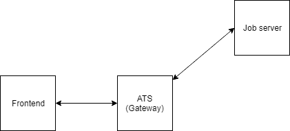
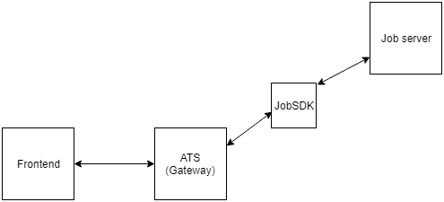
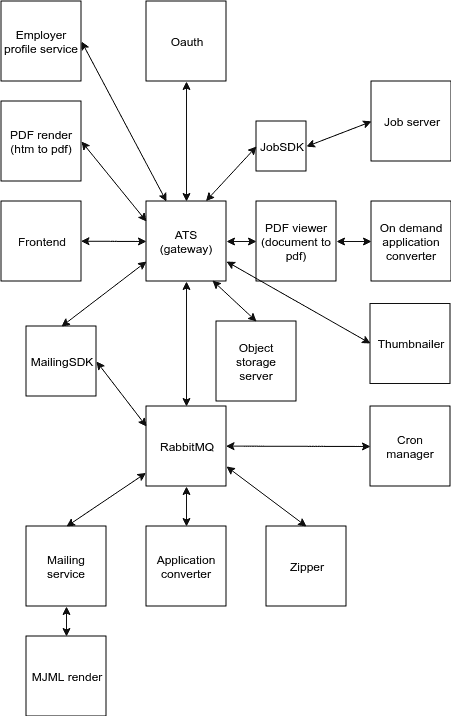

# 一年内从整体服务到微服务

> 原文：<https://dev.to/kristijankanalas/from-monolith-to-microservices-in-one-year-1fff>

所以，一年前我过着无忧无虑的生活，开发一个遗留的整体——一个用 CodeIgniter 2 编写的代码库。这不是世界上最好的框架，但至少在表面上，它完成了工作。在尽可能短的时间内为我们的客户工作了很多年之后，我们有了很多粗糙的代码。说到这里，我想你明白第一句话是个玩笑。

在对我们的业务战略进行了一些修改——并且进行了大量说服工作之后——IT 部门获得了无截止日期的绿灯，完全重写了我们的[申请人跟踪系统(ATS)](https://en.wikipedia.org/wiki/Applicant_tracking_system)——这只是我们整体的一部分，但肯定是很大的一部分。

## 问题

1.  添加新功能后，进入手动测试阶段。一旦它被批准，你就把它部署到生产环境中——但是经常发生的是你错过了一个测试场景，并且你在生产环境中结束了大量的错误。
2.  这个问题与前一个问题紧密相连:如果您有一个较旧的代码库，它的基础开始慢慢崩溃，因此在其上添加新代码最终会依赖于其他代码。有了这样的代码库，有时你最终会破坏与你当前正在写的东西完全不相关的代码。
3.  当你有 11 个人日复一日地在同一个代码库上工作，却没有任何安全措施时，问题一定会出现。

## 已知方案

1.  自动化测试——即使您没有涵盖所有可能的场景，自动化测试——除了手动测试之外——为您提供了一个非常好的解决“生产中的错误”问题的方案。自动化测试的最大好处之一是它们让你自由地升级你的依赖。如果您甚至有部分覆盖率，当您进行“composer update”并运行您的测试时，您可以立即看到依赖关系中的变化是否破坏了您的代码。
2.  将一个巨大的代码库分割成更小的代码库(即微服务)。有了微服务，你可以在两个方面解决“旧代码”问题:一方面，它们允许你把代码放在那里，而不会让它打扰任何其他东西；另一方面，如果你想重写代码，微服务让你一次重写代码库的一小部分变得更容易。例如，在我们的遗留应用程序中，我们使用了一个古老版本的 [TCPDF](https://github.com/tecnickcom/TCPDF) ，这是阻止我们将其迁移到 PHP 最新版本的原因之一。有了微服务，我们可以将 TCPDF 放在一个容器中，容器中有它需要的特定 PHP 版本，对于其余的代码库来说，这不再是一个问题。
3.  我们发现的解决问题的最佳方案之一是在我们的团队之间分割代码库，并在这些团队内部进行定期的代码评审。这样，整个团队都知道他们正在处理的代码，并且我们通过使用合并请求来避免任何潜在的问题。

## 我们是如何做到的

有史以来第一次，我们可以在没有任何具体期限的情况下完成这样一个项目(你认为我之前说的是在开玩笑吗？);即便如此，我们也不能重写与 ATS 远程相关的所有内容，即使我们想这样做——因此，我们决定只重写与 ATS 通信的部分(当然，除了 ATS 本身)。我们做的第一个微服务是管理我们的招聘广告的服务——我们称之为工作服务器。这是我的第一个 Symfony 项目；鉴于这一点，以及我们后来发现自己要处理的一些其他问题，我想你会理解为什么我必须在这个项目的过程中重写那个微服务 3 次。因此，我们得出了我能给出的第一条建议:**不要害怕重写你刚刚重写完的东西**。即使你有经验，也不太可能第一次就把所有事情都做对。

### SDKs FTW

如果你看一下“ATS”和“作业服务器”之间的箭头，它现在的绘制方式看起来像是它们在直接通信。我们知道 ATS 不会是唯一与作业服务器通信的服务。很早，我们就发现了对**SDK**的需求。除了拥有 SDK 的服务之外，没有比这更好的与服务通信的方式了。但是，我们进行这项工作的方式是有问题的…

**旁注:**我们所说的“SDK”是轻量级的、可重用的库，使得与特定服务的通信变得容易。我们发现这些特别有用，因为(几乎)我们所有的后端代码都是用一种语言(PHP)编写的，所以拥有 SDK 的服务可以很容易地集成到*任何*其他服务中。

有一天，我们发现了一个名为 [DoctrineRestDriver](https://github.com/CircleOfNice/DoctrineRestDriver) 的包。立刻，我们就像“天哪，这太棒了。”我们可以做一个 SDK，给你一个 EntityManager，让你像直接和数据库对话一样使用原则，即使它实际上是和作业服务器对话！

我们非常惊讶，于是我们立即着手将这个包实现到 Job SDK 中。

在项目的后期，我们发现它没有覆盖我们所有的用例，而且很难维护使用它的代码。DoctrineRestDriver 本身也没有维护，所以我们不得不分叉它，并花一些长时间挖掘和更改库的核心，使它为我们的用例工作。当时，我们陷得太深，无法回头，所以我们必须继续开发 SDK。对于这部分过程我能给出的建议是:**不要在构建 SDK 的时候寻找廉价的出路**。我们后来制作的所有其他 SDK 都是用不同的方法制作的——简单的描述性方法制作一个简单的 HTTP 请求；基本上只是 HTTP 客户端周围的薄薄的包装。更多的代码，但是从长远来看更容易维护。

### 测试

到目前为止，我们一直致力于将我们的代码库分割成更小的块，而且我们也做得很好；但是当这一切完成后，谁来测试呢？在项目看起来如上图的时候，我们没有测试。(好吧，我们确实做了一些测试，但我并不以此为荣。在对测试进行任何真正的研究之前，我开始为作业服务器编写测试。事情是这样的，当我试图写我认为是单元测试的东西时，我不小心写了集成测试。当我意识到自己做了什么时，我决定看一些关于如何正确编写单元测试的教程。来自 SymfonyCasts 的一个课程特别帮助我更好地理解了测试。)

经过大量的努力，该说的都说了，该做的都做了，我们对所有微服务进行了大约 200 次测试。总的来说，这还不算多，但我们希望随着我们的发展，这个数字会逐渐增加。

## 当前日期

一年后，大约 50，000 行代码和大约 2，600 次提交，一个由 3 名开发人员组成的团队——包括一名高级全栈开发人员和两名 medior 后端开发人员——完成了 18 项服务。今天，为我们的 ATS 供电的系统看起来像这样:

想象一下，在第一次投入生产之前，你的脑海中有这样一幅画面。此外，我们对这项技术都缺乏经验，我想你可以理解我对将所有这些应用于生产的前景有多焦虑。最终，撇开小问题不谈，我们都对部署的实际进展感到惊讶。今天，在这样的系统中工作是令人惊奇的，我不会用它来交换任何东西。

在过去的一年里，我们学到了很多，这篇文章只包含了我们从这个项目中获得的一小部分知识。老实说，上图中的每一个微服务都应该有一个自己的帖子，我和我的团队非常渴望分享所有的知识——所以，把这个帖子看作是许多帖子中的第一个吧。

就这些了，伙计们。我迫不及待地想听听你对此的所有想法！

## 关于我

嗨，我是克里斯蒂昂！旅游爱好者，全职食物和啤酒爱好者，偶尔软件开发人员。当我不打算下一次去日本旅行或看动漫时，我在[poslovi.infostud.com](https://poslovi.infostud.com/)工作，它是[信息研究集团](https://www.infostud.com/)的一部分。