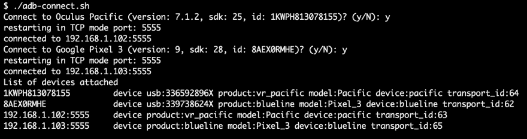

# 通过脚本自动执行 OculusQuest / OculusGo / Android 远程连接

> 原文:# t0]https://dev . to/shiena/oclusquest-ocluso-Android-5b 57

# 前言

Android 可以通过`adb tcpip [port]`和`adb connect [ipaddr:port]`远程连接。
但是因为多次执行很麻烦，所以用脚本实现了自动化。

# 使用方法

[https://gist . github . com/shiena/E0 bfbd 465 fefae 424 e 42 b 909 f 24 e 5434](https://gist.github.com/shiena/e0bfbd465fefae424e42b909f24e5434)

1.  从这里按如下方式保存适合操作系统的文件。
    *   Windows 用换行符 CRLF 保存`adb-connect.bat`
    *   macOS 和 Linux 用换行代码 LF 保存`adb-connect.command`，用`chmod +x adb-connect.command`赋予执行权限
2.  将变量`ADB`改写为 adb 指令的完整路径。

剩下的就这样执行就行了。 如果 2 台以上的 Android 连接了 USB，则可以选择分别远程连接。

# Feeling

即使是 Windows 的批处理文件也能意外地进行字符串处理呢。