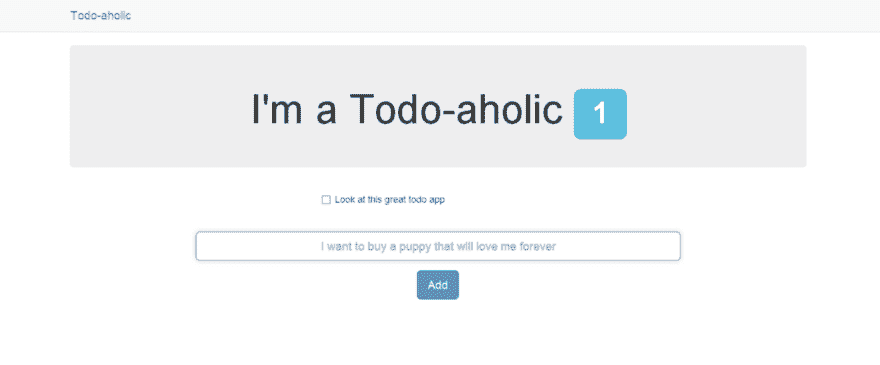
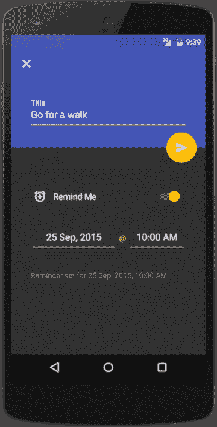
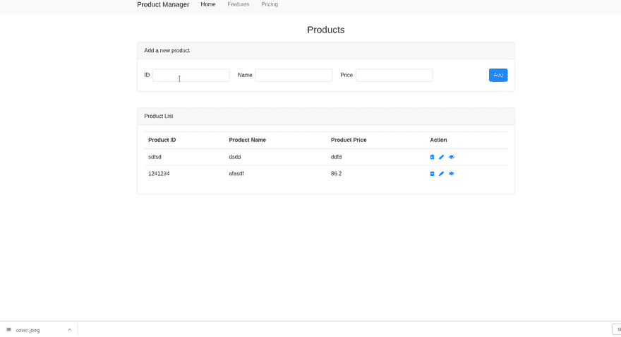
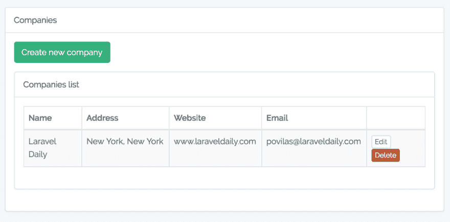
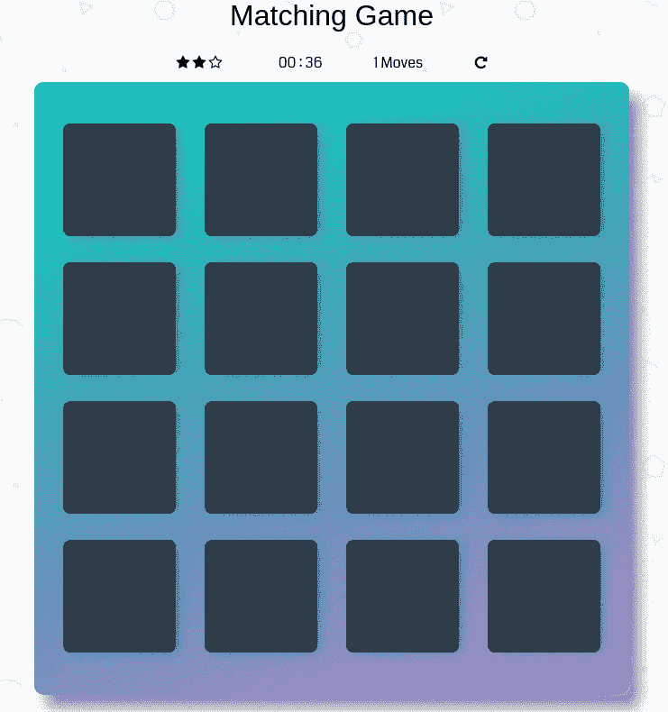
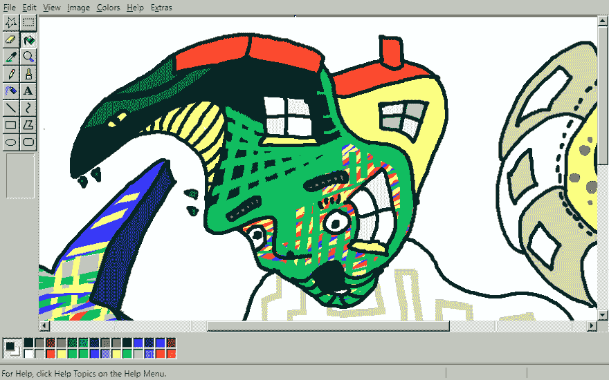
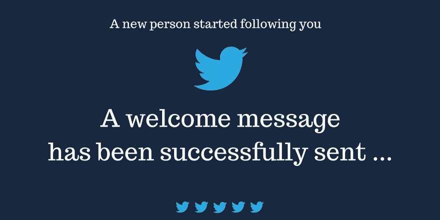
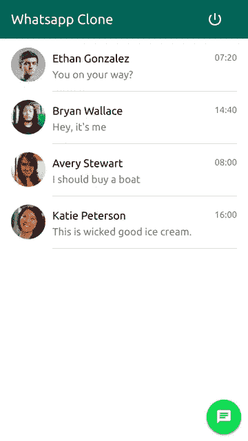
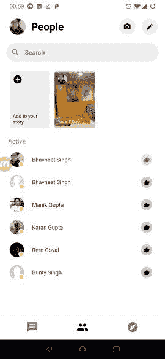

# 你想成为顶尖的开发者吗？你必须建造东西！-要构建的 7 个应用

> 原文：<https://dev.to/carlillo/do-you-want-to-be-a-top-developer-you-must-build-things-7-apps-to-build-2oje>

### 简介

经过多年在大学教室和职业培训中心培训**软件工程师**和**软件开发人员**，我得出了一些结论。我教过【1000 多名学生，他们现在都在这个行业工作，这让我看到了这些学生在 12 年后的投影。**成为顶级开发者**很简单:**训练学科**。

这种说法的一个明显的例子是，武术教师不仅仅通过学习理论而成为一名教师，而是通过与他/她的同龄人分享知识，最重要的是通过实践。有必要**‘做’**，因为它不可避免地以我们**错了**而告终。这反过来允许我们发展能力**找到简单理论没有教给我们的问题的解决方案**。

接下来，我将向你展示 **7 个项目**，你可以尝试重新创建，以训练你的精神肌肉，并能够成为一名顶级程序员。这很重要:**我不会指定使用哪种技术**，因为这是你自己可以选择的。我的建议是你开发栈中所有你想学的项目。当您更改堆栈时，请再次尝试重现这些问题。

### 项目 1。待办事项应用

如何开发一个待办事项应用程序在你能找到的大多数技术教程中都有解释。之所以这样，是因为这对初学者来说是一个很大的问题。这个问题应该算是应用开发中的一个`Hello World`。因此，我的建议是，当你学习一项新技术时，开发一个待办事项应用程序作为你的第一个程序之一。

**你将学到什么**:

*   创建新任务。
*   验证字段。
*   过滤任务(已完成、活动、全部)。利用 filter 和 reduce 函数(或编程语言中的类似函数)。

#### 待办节点+ mongoDB + Angular

用 MongoDB 和 Angular 搭建的节点 app。用于演示和教程。

节点提供了 RESTful API。Angular 提供前端并访问 API。MongoDB 像囤积者一样储存。

🔗
[https://github.com/scotch-io/node-todo](https://github.com/scotch-io/node-todo)

#### 待办安卓

一个完全物质化的 ToDo 应用程序，具有最少的功能，足够有用。

🔗
[https://github . com/avjinder/minimum-all](https://github.com/avjinder/Minimal-Todo)

### 项目二。产品管理仪表板

简单的 CRUD 应用程序，非常适合基础。

**你将学到什么:**

*   创造和管理产品。
*   与数据库交互—创建、读取、编辑和删除产品。
*   输入验证以及如何使用表单。

我们是否与产品、用户、任务等一起工作并不重要。我们必须尝试完成的是一个 CRUD 实现。

#### vuej+fire store

一个简单的 crud 应用程序，用于使用 vuejs 和 firestorm 构建的产品

🔗
[https://github.com/waseembarcha/vuejs-crud](https://github.com/waseembarcha/vuejs-crud)

#### 幼虫 5.6+vista . js—简单的生示范

展示 Laravel 如何使用 Vue.js 的简单项目

管理公司的一个 CRUD 操作—创建/编辑/更新/删除。

🔗
[https://github.com/LaravelDaily/Laravel-Vue-First-CRUD](https://github.com/LaravelDaily/Laravel-Vue-First-CRUD)

### 项目 3。卡片记忆游戏

卡片记忆是一种游戏，你必须点击一张卡片，看看它下面是什么图像，并试图找到其他卡片下面的匹配图像。

**你将学到什么:**

*   DOM 操作(JavaScript)
*   UI 事件。
*   动画片
*   视图中的基本逻辑。

#### HTML、CSS 和 JavaScript

Memory Game 项目是作为 Udacity 前端 Web 开发人员 Nanodegree 项目的 Javascript 编程部分的一部分创建的。这项任务的目的是展示对核心 web
开发技能的掌握——HTML、CSS 和 JavaScript。

🔗
[https://github.com/jdmedlock/memorygame/](https://github.com/jdmedlock/memorygame/)

### JavaScript 记忆游戏

有趣而简单的记忆游戏，像《超级马里奥 3》中的那个，用普通的 JavaScript 编写。

### 项目 4。绘画软件

在网上的画布上创建数字作品，以便在线共享，也可以导出为图像。

**你将学到什么:**

*   UI 事件。
*   低级屏幕操作
*   命令、单例或策略等几种设计模式。
*   操作画布的几个库(或不同堆栈中的类似库)

#### JS 油漆

一个很好的基于网络的 MS Paint 翻拍和更多…

目标是改造 MS Paint(包括其鲜为人知的功能)，对其进行改进，并扩展其可以编辑的图像类型。到目前为止，它做得很好。

#### style2 绘画(JavaScript + Python)

Style2paints V4 是目前最好的 AI 驱动的线性着色工具。

与以前端到端的图像到图像翻译方法不同，style2paints V4 是第一个在现实生活的人类工作流中对 lineart 进行着色的系统，输出是分层的。

### 项目 5。制造一个机器人

如今，我们正处于机器人(聊天机器人和语音机器人)的时代。因此，你可能想制作可以在 Twitter、Telegram 或 Slack 上工作的机器人。最重要的社交网络提供几种语言的 API。

几年前，我开始建议我的学生制作一个带有一点人工智能的推特或电报机器人。在我们的“机器人之旅”中，一个好的发展可能如下:

*   **0 级**:制作一个 twitter/slack/telegram 机器人，当有成员加入房间时，它会打招呼。
*   第一级:制作一个 twitter/slack/telegram 机器人，发布来自数据库的励志名言。
*   第二级:每当有人关注该账户或听到某个具体话题时，让它发布一条感谢信息。
*   第三级:机器人回复评论，了解其他用户的行为。

#### 王牌 2 现金

这个机器人会观察唐纳德·特朗普的推文，并等待他提到任何上市公司。当他这样做时，它使用情绪分析来确定他对这些公司的看法是积极还是消极。然后，机器人会根据预期的市场反应自动执行相关股票的交易。它还在@Trump2Cash 上实时发布了其研究结果的摘要。

🔗
[https://github.com/maxbbraun/trump2cash](https://github.com/maxbbraun/trump2cash)

#### Twitter-Bot 教程

在 twitter 上为你的新粉丝创建欢迎信息是让更多人关注你的推文和链接的第一步，因为你知道有很多在线服务可以帮助你向你的新粉丝发送自动直接信息，但我认为在线服务对一个简单的工具收取 5 至 15 美元的费用是疯狂的，当你可以建立自己的机器人时。

在这个回购中，你一步一步地学习如何创建自己的 twitter-bot。为了开发这个机器人，我们需要:

*   已安装节点 js
*   Twit:用于节点的 Twitter API 客户端(REST & Streaming API)
*   Github 帐户
*   Twitter 账户
*   Heroku 帐户来部署机器人。

🔗[https://github.com/yjose/twitter-bot](https://github.com/yjose/twitter-bot)

### 项目 6。信使克隆体

了解本地或混合应用程序和 web 应用程序的工作方式。

**你将学到什么:**

*   Web 套接字(即时消息)。
*   原生或混合应用的工作原理。
*   布局如何在本机中工作。
*   为本地应用程序提供路由，或使用 Ionic、NativeScript、Angular 或 React 等框架。

#### WhatsApp 克隆教程

你现在看到的 Whatsapp 克隆版使用的是:

*   反应(用钩子和悬念)
*   样式组件
*   材料-用户界面
*   以打字打的文件
*   阿波罗图表
*   GraphQL 代码生成器
*   GraphQL 模块
*   一种数据库系统
*   图形 SQL 检查器

🔗
[https://github.com/urigo/whatsApp-Clone-Tutorial](https://github.com/urigo/whatsApp-Clone-Tutorial)

#### 一款飘起的聊天 app

用 Firestore 和 Firebase Cloud 构建的 flutter 聊天应用程序。它是信使的克隆。用户可以实时创作故事、聊天和搜索。

🔗
[https://github.com/singhbhavneet/chat_app](https://github.com/singhbhavneet/chat_app)

### 项目 7。象棋引擎/象棋游戏

试着写一个能和人类对手下棋的引擎。对于一个不那么令人生畏的挑战，您可能希望只关注一个部分的行为，

了解本地应用和网络应用的工作原理，会让你脱颖而出。

您将学到的内容:

*   Web 套接字(即时消息)。
*   本机应用程序如何工作。
*   布局如何在本机中工作。
*   本机应用程序的路由。

#### 【李】李

Lila (li[chess in sca]la)是一个免费的在线国际象棋游戏服务器，专注于实时游戏和易用性。

它有一个搜索引擎，用渔网分发的计算机分析，比赛，模拟，论坛，团队，战术训练器，一个移动应用程序和一个共享的分析板。多亏了这个社区，用户界面可以使用 80 多种语言。

web 客户端用 TypeScript 和 snabbdom 编写，使用 Sass 生成 CSS。

🔗[https://github.com/ornicar/lila](https://github.com/ornicar/lila)

#### Sunfish:111 行代码的 Python 象棋引擎

Sunfish 是一个简单但强大的象棋引擎，用 Python 编写，主要用于教学目的。没有表格和简单的界面，它只占用了 111 行代码！

因为 Sunfish 很小并且力求简单，所以代码提供了一个很好的实验平台。人们已经用它来测试并行搜索算法，试验评估函数，开发深度学习象棋程序。今天就叉吧，看看你能做什么！

🔗
[https://github.com/thomasahle/sunfish](https://github.com/thomasahle/sunfish)

#### Chess.js

chess.js 是一个 Javascript 国际象棋库，用于国际象棋棋步
生成/验证、棋子放置/移动和检验/将死/相持
检测——基本上除了 AI 之外的一切。

chess.js 已经在 node.js 和大多数现代浏览器中进行了广泛的测试。

🔗[https://github.com/jhlywa/chess.js](https://github.com/jhlywa/chess.js)

### 结论

在这篇文章中，我向你展示了训练编码技能的方法。你在工作之外开发的任何想法或项目都是有益的，可以帮助提高你的技能。

一旦你完成了你的项目，分享你的代码！其他年轻的开发者需要灵感。随着您开发不同的项目，您对特定的
栈的了解将会增加，您将能够毫无困难地从一个栈跳到另一个栈。

如果你有任何有趣的想法或项目，请随时联系我！在这篇文章的最后，我会留下几个问题让你在评论中回答:

在你的个人项目中，你学到了什么？
对于开始类似项目的人，你有什么建议？

* * *

最初发布于[https://carloscaballero . io](https://carloscaballero.io)