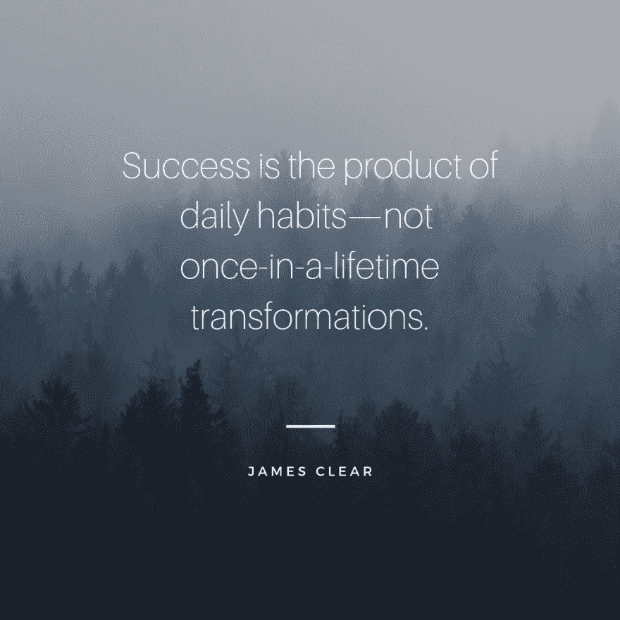
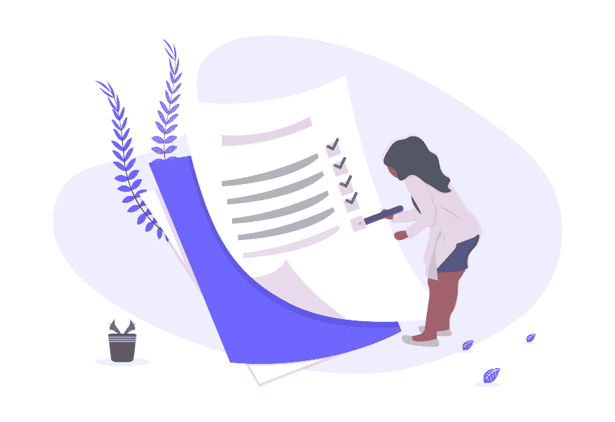
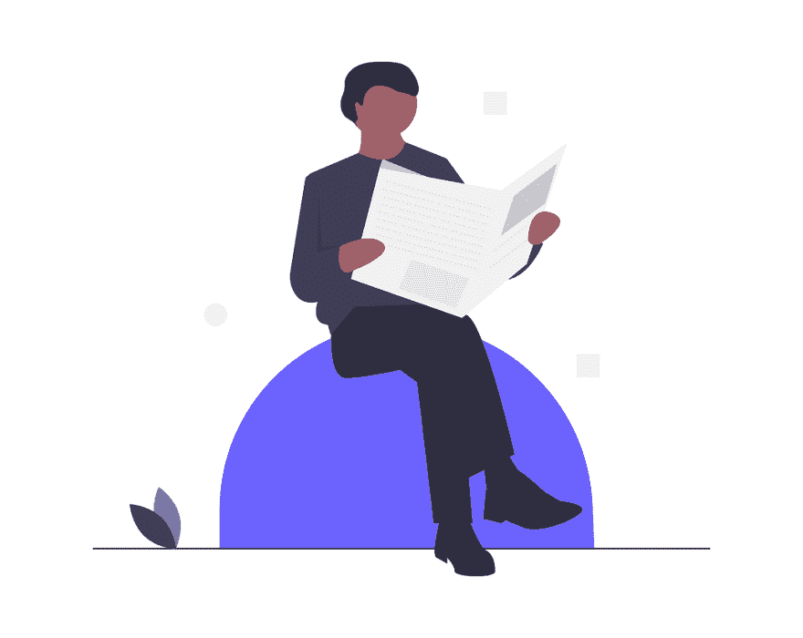
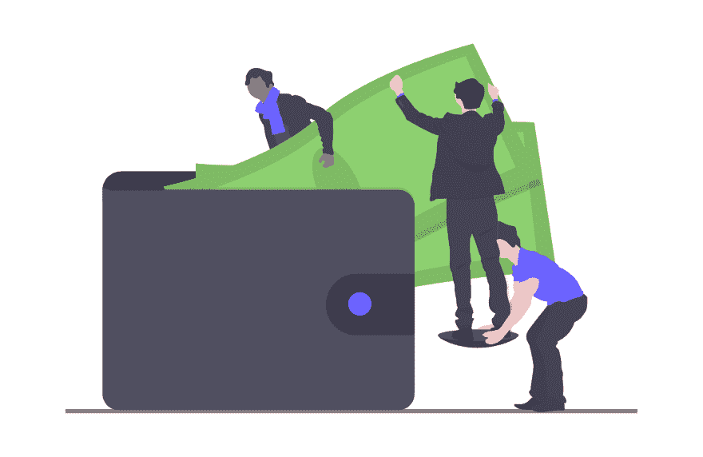

# 我的新职业之旅:下班后工作

> 原文：<https://dev.to/theryanfurrer/journey-to-my-new-career-working-after-work-14en>

我知道不止我一个人说下班后工作让人筋疲力尽。这是必要的，这样我就可以及时地成为一名 Jr. Web 开发人员，然而，这并没有减少我的劳累。

我也知道我并不孤单。有些人一边做两份工作，一边学习。我赞扬每个人在下班后工作，因为这确实令人钦佩。不管是 1 小时还是 5 小时，你都在投入时间。

我想谈谈我这几天的日程安排。也许有人正在考虑加入，但由于时间的限制而犹豫不决。也许你和我一样在学习，但却在努力学习你想学的东西。不管怎样，我们来谈谈吧！

## 工作安排

我的工作是早上 8:30 到下午 5:00。虽然它能支付账单，但每天去办公室却越来越难。不是因为这是一份困难的工作，也不是因为他们没有给我足够的工资，而是因为我希望我能把每周 40 个小时投入到我未来的职业生涯中。

我还想指出，我非常幸运能有 10 - 15 分钟的通勤时间。这让我(通常)在进办公室之前就能完成一些事情。

## 日常事务

*   早上 6:30|*起床放狗出去*
*   **早上 6:45**|*冥想 10-15 分钟*
*   **早上 7:00**|*拿着我的一杯冷咖啡(前一天晚上准备的)坐在电脑前，做**一些**有成效的事情，比如:*

*   查看 [dev.to](https://dev.to/) 或 [Twitter](https://twitter.com/) 上的最新消息
*   跳到前一天晚上的代码中
*   继续我目前的[树屋](https://teamtreehouse.com/home)课程

*   **早上 7:45**|*准备上班，早上 8:15 离开*
*   **上午 8:30-下午 5:00**|[*工作工作工作工作工作*](https://youtu.be/HL1UzIK-flA?t=18)
*   **下午 5:30-9:30 左右** | *回家做事情*

*   下午 5:30 通常是我下班回家最晚的时间——有些天我会呆得稍微晚一点，以完成一项任务。在我到家后，直到晚上 9:30 左右，我会做一些事情，比如:家务杂事，照顾我的狗，散步，准备和烹饪晚餐，当然，还有工作！

晚上 9:30 以后，我会和我的女朋友以及我们的狗一起出去玩，我们会看电视或者阅读或者只是聊天。这是我每天非常珍惜和重视的时间，即使我们在睡觉前只有 1.5 - 2 个小时。

## 对外承诺

有时候，我希望我能每天 100%的投入到工作中，然而，这不是生活。老实说，如果是那样的话，我会更加孤独。

其他的承诺，比如家庭，维持我的关系，我的狗(如上所述)，保持我的体重下降——这些都是减损我编码的事情。我会虚度光阴吗？不会吧！

享受你的生活。尽管我已经很想有一份网络开发的工作了，但我还是希望一路走来都很快乐——这都是关于平衡的。

## 休息

每个人都需要偶尔休息一下。老实说，有时候我会为*没有*编码而感到内疚，不管休息一段时间有多重要。如果我坐下来编码 2 小时，那更像是 1 小时 40 分钟。

我是番茄工作法的坚定信徒，如果你觉得你在努力提高工作效率，我强烈建议你尝试一下。我个人使用一款名为[Tide](https://tide.fm/en_US/)(iOS 和 Android 都有)的应用程序来帮助跟踪我的 [*Pomodoros*](https://en.wikipedia.org/wiki/Pomodoro_Technique) 。

更长的休息时间也是一件好事！我通常每周至少休息一天，这让我有了两天规则。

### 两天规则

两天规则很简单:**永远不要连续休息两天**。

我个人知道，如果我连续休息一天以上，那两天会很快&很容易变成 3 天、4 天、5 天或更多天。这在这次旅行中是不可能发生的。

## 动机

动力的感觉会非常强大。如果没有动力，我们可能永远也不会登上月球。如果没有动力，阿诺德·施瓦辛格可能不会创造出他所拥有的体格。如果没有动力，我就不会开始致力于这个新的职业。

动机是一个很好的工具——但也仅仅是一个工具。

如果你依靠动力来完成任务，你永远也不会完成。动机可能会像催化剂一样启动你想要和需要在生活中做出的改变，但需要勤奋和决心才能看到它们实现。

我目前的动机是:

*   享受我的职业生涯
*   为我自己和我的女朋友创造更好的生活
*   赚更多的钱

最近我一直在读詹姆斯·克利尔的《原子习惯》,下面的引文(在这篇文章的顶部)引起了我的共鸣。

> “成功是日常习惯的产物，而不是一生一次的转变。”——詹姆斯清除

不要让缺乏动力阻止你朝着目标努力。如果你等待开始减肥的动力，开始学习代码，无论你想做什么，都永远不会发生。去做吧。

## 咬牙心态

咬牙心态不是聪明的心态。

是的，每个人都应该努力工作，在需要的时候战胜挑战，然而，认为你需要像 Instagram 和 YouTube 上的所有这些“影响者”一样全天候工作才能成功的想法是荒谬的。

**努力工作。聪明地工作。休息一下。要有效率。**

这是我的心态，我不得不说，这种心态很好。我非常期待看到所有这些努力都有回报。