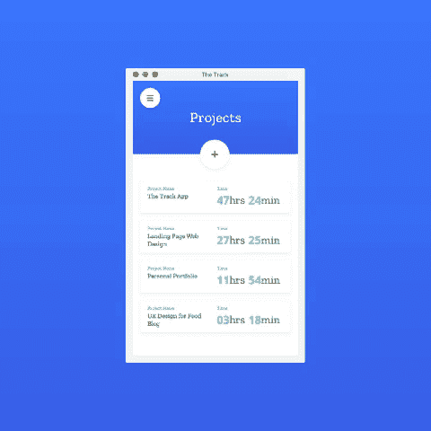

# 我自己设计编码了一个跨平台的 app！

> 原文：<https://dev.to/jovan/i-designed-and-coded-a-cross-platform-app-by-myself-1m35>

### 好久不见！

#### 自从我在 dev.to 上开了一个账户以来，已经有 2 年零几天了。

我将会发表帖子来庆祝我最近的副业项目两周年。

前段时间，我的一些项目需要一个时间跟踪应用程序。好在有很多时间追踪 app！但是，当然，如果我对其中的一些感到满意，我就不会把这篇文章写在:D

我想要一个真正简单的应用程序，只是为了跟踪我的项目，如果可能的话，以某种方式提醒我什么时候开始和停止。哦，如果有一个应用程序可以在我停止工作时自动停止跟踪。

在使用 Toggle 一段时间后，我决定尝试设计一个适合我需求的应用程序。

这个设计很好，我想，我甚至知道前端，但我不想要另一个网络时间跟踪器。我不想打开另一个标签页或窗口，我想要简单易用的东西。

#### 所以我决定辞职

但是今年，我开始尝试一种叫做 Electron.js 的东西，它令人兴奋不已。我简直不敢相信我能用一个代码库编写 HTML、CSS、JS，并为 macOS、Windows 和 Linux 创建一个应用程序。太神奇了！

#### 于是我又开始研究它

我在 GitHub 上找到了 Angular-electronic starter kit，慢慢开始一屏一屏的切片设计。

这是一次奇妙的经历。有太多的事情比我想象的要难，也有太多容易做的事情比我想象的要难。

我终于出版了 1.0.0 版的:D

我在 [Product Hunt](https://www.producthunt.com/posts/the-track) 上发表了一篇帖子，如果你对此感到好奇，可以访问[赛道网站](https://thetrack.app/)。

#### 随意留下苛刻的反馈。

我计划推出更多产品，获得真实的反馈将防止我再次犯同样的错误。

音轨 GIF:

