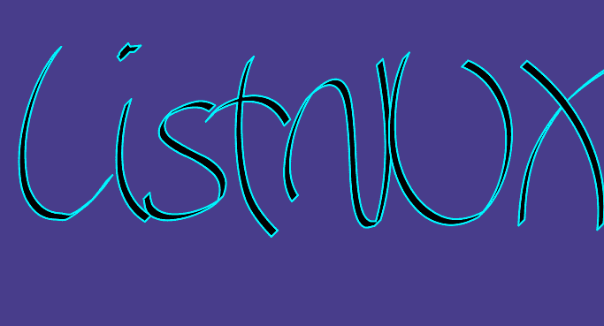
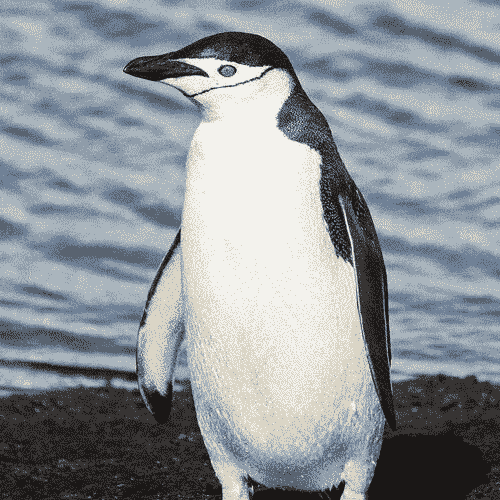
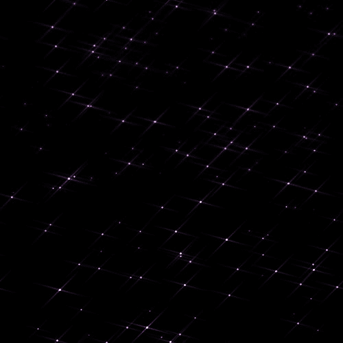

# 使用 ImageMagick 的乐趣

> 原文：<https://dev.to/listnux/fun-with-imagemagick-57d1>

ImageMagick 是一个令人惊叹的软件套件，带有显示图像、编辑、从一种格式转换为另一种格式的工具，它可以处理位图(光栅)图像和矢量图像。它可以[读取 100 多种主要文件格式](https://imagemagick.org/script/formats.php#supported)，包括各种相机型号的原始文件、AVI 或 MPEG 等视频文件等等。

作为命令行工具，并且无处不在，使它成为与其他需要图像编辑的软件捆绑的理想工具。它可以被脚本化——有些人已经创造了一些令人惊叹的脚本集，如[弗雷德](http://www.fmwconcepts.com/imagemagick/index.php)和[斯尼布戈](http://im.snibgo.com/)。

这篇文章是我的一些随机笔记和来自 [ImageMagick 用法页面](http://www.imagemagick.org/Usage/)的各种例子的汇编。我对各种工具和选项不做解释，官方网站(尤其是[使用页面](http://www.imagemagick.org/Usage/))和手册页解释得比我好得多。

* * *

## ImageMagick 命令行工具。

这里是所有 [ImageMagick 命令行工具](https://imagemagick.org/script/command-line-tools.php)的完整列表。一些常用工具有:

*   转换:图像编辑。
*   mogrify:图像编辑，多用于批量编辑。
*   导入:屏幕截图实用程序。
*   显示:ImageMagick GUI。
*   animate:在 GUI 窗口上制作图像动画。

## 1。创建文本徽标:

检查可用字体:

```
convert -list font 
```

然后:

```
convert -background DarkSlateBlue -strokewidth 2 -stroke turquoise1 -font Aka-AcidGR-LivingSword -pointsize 256 -density 90 label:ListNUX test.png 
```

*   [颜色名称列表](https://www.imagemagick.org/script/color.php#color_names)。

结果:
[](https://res.cloudinary.com/practicaldev/image/fetch/s--eEiFqr_a--/c_limit%2Cf_auto%2Cfl_progressive%2Cq_auto%2Cw_880/https://thepracticaldev.s3.amazonaws.com/i/rzeezj86n1753s5iff94.png)

## 2。调整图像大小:

让我们从维基百科 :
下载一些[企鹅图片](https://en.wikipedia.org/wiki/Penguin)

```
mkdir -p penguins && cd "$_"
cat>"url_list.txt"<<EOF https://upload.wikimedia.org/wikipedia/commons/0/08/South_Shetland-2016-Deception_Island%E2%80%93Chinstrap_penguin_%28Pygoscelis_antarctica%29_04.jpg
https://upload.wikimedia.org/wikipedia/commons/1/1d/Penguin_in_Antarctica_jumping_out_of_the_water.jpg
https://upload.wikimedia.org/wikipedia/commons/f/fd/Antarctic_adelie_penguins_%28js%29_21.jpg
https://upload.wikimedia.org/wikipedia/commons/4/49/Pygoscelis_antarcticus_-Cooper_Bay%2C_South_Georgia%2C_British_Overseas_Territories%2C_UK-8.jpg
https://upload.wikimedia.org/wikipedia/commons/9/9e/Penguins_walking_-Moltke_Harbour%2C_South_Georgia%2C_British_overseas_territory%2C_UK-8.jpg
https://upload.wikimedia.org/wikipedia/commons/4/4f/Yellow-eyed_Penguin_MC.jpg EOF wget -i url_list.txt 
```

首先，让我们调整所有照片的大小，使最大尺寸(高或宽，以最大者为准)最大为 800 像素。对于较小的文件，我们还会将质量降低到 90%。

```
for i in *.jpg; do convert $i -resize "800x800>" -strip -quality 90 _${i};
  rm ${i};
done 
```

## 3。从中心裁剪图像:

让我们把它们都裁剪成 500×500 像素的正方形:

```
for i in *.jpg; do convert ${i} -gravity center -crop 500x500+0+0 +repage _${i};
  rm ${i};
done 
```

现在，让我们把它们都重新命名为**企鹅 01** 、**企鹅 02** 等等。

```
num=1
for i in *.jpg; do new=$(printf "pengu%02d.jpg" "$num");
  mv -- "$i" "$new"
  let num=num+1
done 
```

## 5。将多个图像合并成一个 gif:

现在，动画时间到了！

```
# pop-up a window with all the images with 90sec delay
animate -delay 90 *.jpg
# write the previous animation to a gif image
convert -delay 90 *.jpg test.gif 
```

[](https://res.cloudinary.com/practicaldev/image/fetch/s--fbu50Tum--/c_limit%2Cf_auto%2Cfl_progressive%2Cq_66%2Cw_880/https://thepracticaldev.s3.amazonaws.com/i/cgesr1xcfxs8rnsq1bzy.gif)

## 6。创建渐变:

```
# simple linear gradient, two colours
convert -size 600x400 gradient:blue-red linear_gradient.png
# simple radiant gradient, two colours
convert -size 600x400 radial-gradient:blue-red radial_gradient.png
# a more complex, multi-colour gradient with bicubic interpolation
convert \( -size 600x400 gradient: -interpolate Bicubic -rotate 180 \
  \( +size xc:firebrick4 xc:crimson xc:MediumPurple xc:DarkSlateBlue -append \) \
  -clut \) \
  gradient.png 
```

[](https://res.cloudinary.com/practicaldev/image/fetch/s--YgPOJLg8--/c_limit%2Cf_auto%2Cfl_progressive%2Cq_auto%2Cw_880/https://thepracticaldev.s3.amazonaws.com/i/qo1r7nu5btov1jzivdqp.png)

## 7。创建具有 3D 效果的文本徽标:

```
convert gradient.png -background purple -alpha shape \
  -font Aka-AcidGR-ScrachThis -pointsize 192 -fill firebrick2 \
  -stroke black -gravity Center \
  -annotate 0 "ListNUX" logo_simple.png 
```

覆盖文字:

```
convert logo_simple.png -alpha extract -blur 0x6 -shade 580x80 -normalize \
  logo_simple.png -compose Overlay -composite \
  logo_simple.png -alpha on -compose Dst_In -composite \
  logo_v1.png 
```

...然后添加一些阴影

```
convert logo_v1.png \
  \( +clone -background CornflowerBlue -shadow 80x4+20+20 \) \
  +swap -background MidnightBlue -layers merge +repage \
  logo.png 
```

[](https://res.cloudinary.com/practicaldev/image/fetch/s--4waJVJeG--/c_limit%2Cf_auto%2Cfl_progressive%2Cq_auto%2Cw_880/https://thepracticaldev.s3.amazonaws.com/i/d2vjw6o0xitzrbnpx1hd.png)

## 8。星星:

让我们用星星创造一个形象。我们将创建背景噪声，然后删除并模糊多余的噪声，并使用运动模糊来创建 starbrusts。

```
convert -size 500x500 xc: +noise Random -channel R -threshold 0.07% \
  -negate -channel RGB -separate plasma:DarkOrchid1 \
  +channel \( +clone \) -compose multiply -flatten \
  -virtual-pixel tile  -blur 0x.5 \
  \( -clone 0  -motion-blur 0x20+15 -motion-blur 0x20+195 \) \
  \( -clone 0  -motion-blur 0x20-45  -motion-blur 0x20+135 \) \
  -compose screen -background black -flatten \
  -normalize stars.png 
```

[](https://res.cloudinary.com/practicaldev/image/fetch/s--vVF8kRSi--/c_limit%2Cf_auto%2Cfl_progressive%2Cq_auto%2Cw_880/https://thepracticaldev.s3.amazonaws.com/i/f1zh5av0igada6698kp3.png)

* * *

*学分*

*   <small>*ImageMagick 标志[维基共享](https://en.wikipedia.org/wiki/File:ImageMagick_logo.svg)下 [ImageMagick 许可](http://www.imagemagick.org/script/license.php)*</small>
*   <small>*[ImageMagick 用法示例](https://www.imagemagick.org/Usage/)*</small>
*   <small>*所用字体:[又名-酸](http://aka-acid.com/)字体，具体来说:*</small>
    *   <small>*[活剑](http://aka-acid.com/livingsword.html)字体*</small>
    *   <small>*[刮本](http://aka-acid.com/scratchthis.html)字体*</small>